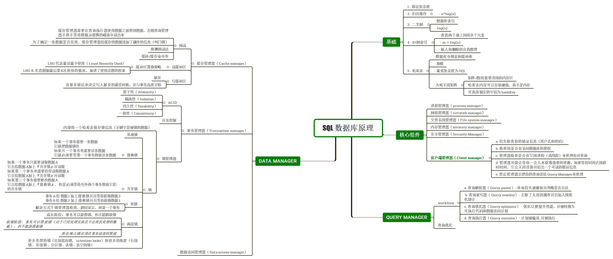

# MySQL SQL 语法内核、在线 DDL 演进与 5.7/8.0 特性对比指南



---

## 1. SQL 语言体系与高阶分类

SQL（Structured Query Language）是关系型数据库的标准交互语言。在生产级数据库架构中，SQL 不仅承担 CRUD 数据流转，更是优化器（Optimizer）解析语义、生成执行计划并驱动底层存储引擎（InnoDB）进行数据页检索与事务锁控制的核心媒介。

### 1.1 SQL 核心语言分类与生产关注点

```
SQL 语言分类全景
├── DDL (Data Definition Language) ──► 库/表/索引定义 (关注 Online DDL 算法、MDL 锁、元数据变更)
├── DML (Data Manipulation Language) ► 数据增删改 (关注 行锁/间隙锁持有、Undo 版本链、Buffer Pool 脏页)
├── DQL (Data Query Language) ──────► 数据检索 (关注 CBO 执行计划、索引覆盖、ICP 下推、临时表溢出)
├── DCL (Data Control Language) ────► 账号与权限 (关注 动态权限、RBAC 角色、双密码轮换)
└── TCL (Transaction Control Language)► 事务控制 (关注 2PC 两阶段提交、隔离级别、锁退化机制)
```

| 语言类别 | 核心指令 | 生产 DBA / 高级研发核心关注点 |
| :--- | :--- | :--- |
| **DDL** | `CREATE`, `DROP`, `ALTER`, `TRUNCATE` | 在线 DDL 算法 (`INSTANT / INPLACE / COPY`)、MDL 锁排障、主从复制延迟、数据字典原子性 |
| **DML** | `INSERT`, `UPDATE`, `DELETE`, `REPLACE` | 锁持有范围（Record / Gap / Next-Key）、死锁规避、Redo/Undo 刷盘压力、大事务拆分 |
| **DQL** | `SELECT` | 优化器代价模型（CBO）、覆盖索引、窗口函数、CTE 优化、深分页与 Sort Buffer 溢出 |
| **DCL** | `GRANT`, `REVOKE`, `CREATE/ALTER USER` | 最小权限矩阵、8.0+ 动态权限、RBAC 角色、密码生命周期组件机制 |
| **TCL** | `START TRANSACTION`, `COMMIT`, `ROLLBACK` | 事务边界控制、长事务监控、ACID 物理保障、两阶段提交崩溃一致性 |

---

## 2. MySQL 5.7 vs 8.0 语法与核心特性全景对比矩阵

| 对比维度 | MySQL 5.7 | MySQL 8.0+ | 生产影响与收益 |
| :--- | :--- | :--- | :--- |
| **在线 DDL 算法** | 支持 `COPY` 和 `INPLACE`（加列需重建整表数据，产生大量 I/O） | 引入 **`INSTANT` 算法**（8.0.12+ 支持表尾加列；8.0.29+ 支持任意位置加/删列） | 大表（亿级数据）加列从**数十分钟/数小时降至秒级**，且完全不阻塞 DML 读写 |
| **窗口函数 (Window Functions)** | 原生不支持，需通过会话变量 `@rownum` 复杂模拟 | **原生完整支持** (`ROW_NUMBER`, `RANK`, `DENSE_RANK`, `LAG`, `LEAD` 等) | 极大简化报表统计、Top-N 筛选与同环比计算，执行性能大幅提升 |
| **通用表表达式 (CTE)** | 原生不支持，复杂查询必须多层嵌套派生表或临时表 | **支持标准 CTE 与递归 CTE** (`WITH RECURSIVE`) | 彻底解决组织树、分类树等层级递归查询痛点，提升复杂 SQL 可读性与优化器下推效率 |
| **不可见索引 (Invisible Indexes)** | 不支持（测试索引效果必须直接 `DROP`，若有误需耗时重建） | **原生支持** (`ALTER TABLE ... ALTER INDEX ... INVISIBLE`) | 软删除索引验证性能，若慢 SQL 增多可秒级恢复为 `VISIBLE`，保障线上稳定性 |
| **降序索引 (Descending Indexes)** | 语法支持 `DESC` 但底层 B+Tree **物理依然按升序存储** | **底层 B+Tree 真正按倒序组织**，支持真正的降序检索 | 消除多列混合排序（如 `ORDER BY a ASC, b DESC`）时的低效 `Using filesort` 临时排序 |
| **函数索引 / 表达式索引** | 不支持直接建函数索引，必须手工创建虚拟生成列（Virtual Column）再加索引 | **原生支持表达式索引** (`CREATE INDEX ... ON t ((JSON_EXTRACT(...)))`) | 优化 JSON 字段提取及对字符串特定函数处理后的检索效率 |
| **索引跳跃扫描 (Index Skip Scan)** | 不支持，联合索引未命中前导列直接走全表扫描或全索引扫描 | **支持 Index Skip Scan**（当联合索引前导列基数很低时自动跳跃匹配） | 提升联合索引缺失前导列查询时的检索性能 |
| **默认字符集与排序规则** | 默认 `latin1`，中文常用 `utf8` (`utf8mb3`) 或 `utf8mb4_general_ci` | 默认 **`utf8mb4` + `utf8mb4_0900_ai_ci`** | 原生完整支持 Emoji 与国际多语言，基于 Unicode 9.0 排序更准且性能提升 |
| **`VALUES()` 函数在 UPSERT 中** | 使用 `VALUES(col)` 引用待插入值 | 8.0.20+ 废弃 `VALUES()`，改用 **新别名语法 `AS new_row(col)`** | 语法规范化，避免歧义 |
| **JSON 支持与 `JSON_TABLE`** | 基础 JSON 读写函数 | 新增 **`JSON_TABLE`**、多值索引（Multi-Value Index）、JSON 聚合与操作增强 | 支持将非关系型 JSON 结构无缝投影为关系型行数据参与 JOIN |

---

## 3. DDL 数据定义语言与在线 Schema 变更原理

### 3.1 字符集与 Collation 架构选型深度解析

```sql
-- 查询当前全局与会话字符集
SELECT @@character_set_database, @@collation_database, @@character_set_server, @@collation_server;

-- 创建生产级数据库：强制指定 utf8mb4 及 Unicode 9.0+ 排序规则
CREATE DATABASE IF NOT EXISTS prod_trade_db 
  CHARACTER SET utf8mb4 
  COLLATE utf8mb4_0900_ai_ci;
```

#### 字符集与排序规则对比表
* **`utf8` (即 `utf8mb3`)**：MySQL 历史遗留命名，单个字符最多占用 3 字节，无法存储 4 字节的 Emoji 表情或生僻汉字，插入会直接抛出 `ERROR 1366 (HY000)`。**生产严禁使用**（MySQL 8.0 已将其标记为废弃）。
* **`utf8mb4`**：标准 UTF-8 编码，单字符占用 $1 \sim 4$ 字节。
* **Collation（排序规则）核心选型**：
  * **`utf8mb4_0900_ai_ci`**（MySQL 8.0+ 默认）：基于 Unicode 9.0 规范，`ai`（Accent Insensitive 音符不敏感），`ci`（Case Insensitive 大小写不敏感）。性能大幅优于旧版，排序语言覆盖更全。
  * **`utf8mb4_bin`**：二进制严格比对（区分大小写与音符），适合密码哈希、密钥字符串、严格区分大小写的业务编码。
  * **`utf8mb4_general_ci`**（MySQL 5.7 常用）：快速简化的比较算法，但对特殊德语、法语等多语言音符支持不完善。

---

### 3.2 在线 DDL (Online DDL) 内核机制与三大算法

MySQL DDL 执行包含三种核心算法：`INSTANT`、`INPLACE` 和 `COPY`。

```
Online DDL 算法执行路径与开销
┌────────────────────────────────────────────────────────┐
│ 1. INSTANT (MySQL 8.0 推荐)                            │
│    仅修改 InnoDB 数据字典元数据 (修改 .frm / DD)，       │
│    在物理页头记录默认值，耗时 < 1 秒，无锁无 IO 压力。 │
└────────────────────────────────────────────────────────┘
                            │ (若操作不支持 INSTANT)
                            ▼
┌────────────────────────────────────────────────────────┐
│ 2. INPLACE (InnoDB 内部引擎处理)                       │
│    在引擎内重建索引或聚簇表，DML 写入 row_log 缓冲日志，│
│    仅在开始/结束阶段短暂持有 MDL 排他锁 (X 锁)。        │
└────────────────────────────────────────────────────────┘
                            │ (若涉及列类型物理转换)
                            ▼
┌────────────────────────────────────────────────────────┐
│ 3. COPY (Server 层全量拷贝 - 极危)                     │
│    在 Server 层创建新临时表，逐行全量拷贝，全程持有    │
│    读锁 (S 锁)，阻塞一切业务 DML 写入操作。            │
└────────────────────────────────────────────────────────┘
```

#### DDL 三大算法横向对比

| 算法模式 | 核心物理执行原理 | 并发 DML 支持 | 经典应用场景 (8.0 vs 5.7) |
| :--- | :--- | :---: | :--- |
| **`ALGORITHM=INSTANT`** | 仅修改数据字典元数据，在物理行头预留默认值标记，**不重构底层 B+Tree 页**。 | **完全无锁 (读写并发)** | 8.0+ 表末尾/任意位置加列、删列、修改列默认值、重命名列/表。 |
| **`ALGORITHM=INPLACE`** | 在 Engine 内部完成，并发 DML 变更写入 `innodb_online_alter_log_max_size` 缓冲区并在尾部重放。 | **支持并发读写 (仅短暂持有 MDL 锁)** | 添加/删除二级索引、扩容 VARCHAR（长度小于 255 变长标识未跨字节）、`OPTIMIZE TABLE` 重建表。 |
| **`ALGORITHM=COPY`** | 在 Server 层创建临时表，将源表全量逐行导出并重新插入临时表。 | **阻塞一切 DML 写操作** | 修改列类型（如 `INT` 改 `BIGINT`）、转换字符集、删除主键等。 |

```sql
-- 生产表结构标准定义范例
CREATE TABLE `t_trade_order` (
    `id` BIGINT UNSIGNED NOT NULL AUTO_INCREMENT COMMENT '自增主键ID',
    `order_no` VARCHAR(64) NOT NULL COMMENT '业务全局唯一订单号',
    `buyer_id` BIGINT UNSIGNED NOT NULL COMMENT '买家UID',
    `seller_id` BIGINT UNSIGNED NOT NULL COMMENT '卖家UID',
    `total_amount` DECIMAL(12,2) NOT NULL DEFAULT '0.00' COMMENT '订单总金额',
    `order_status` TINYINT UNSIGNED NOT NULL DEFAULT '0' COMMENT '状态: 0-待付, 1-已付, 2-已发, 3-已完, 4-已取消',
    `ext_properties` JSON DEFAULT NULL COMMENT '业务扩展JSON属性',
    `created_at` DATETIME NOT NULL DEFAULT CURRENT_TIMESTAMP COMMENT '下单时间',
    `updated_at` DATETIME NOT NULL DEFAULT CURRENT_TIMESTAMP ON UPDATE CURRENT_TIMESTAMP COMMENT '更新时间',
    PRIMARY KEY (`id`),
    UNIQUE KEY `uk_order_no` (`order_no`),
    KEY `idx_buyer_status` (`buyer_id`, `order_status`, `created_at`),
    KEY `idx_seller_created` (`seller_id`, `created_at`)
) ENGINE=InnoDB DEFAULT CHARSET=utf8mb4 COLLATE=utf8mb4_0900_ai_ci COMMENT='核心交易订单表';

-- 1. MySQL 8.0 Instant DDL 秒级加列 (亿级数据无感)
ALTER TABLE `t_trade_order` 
    ADD COLUMN `pay_vendor` TINYINT UNSIGNED NOT NULL DEFAULT '1' COMMENT '支付渠道: 1-微信, 2-支付宝, 3-银联' 
    AFTER `total_amount`, 
    ALGORITHM=INSTANT;

-- 2. 在线创建二级索引 (INPLACE 模式，安全无锁)
ALTER TABLE `t_trade_order` 
    ADD KEY `idx_created_at` (`created_at`), 
    ALGORITHM=INPLACE, LOCK=NONE;
```

---

### 3.3 元数据锁 (Metadata Lock, MDL) 生产排障与规避

在执行 DDL 操作时，Server 层会申请表级 **MDL 写锁（MDL Exclusive Lock）**。

```
MDL 锁阻塞雪崩时序图
会话 1 (长事务查询):   BEGIN; SELECT * FROM t_trade_order WHERE id = 1; (持有 MDL 共享读锁 S)
                               │
会话 2 (DBA 执行 DDL): ALTER TABLE t_trade_order ADD COLUMN ... (申请 MDL 排他写锁 X -> 被阻塞等待)
                               │
会话 3, 4... (后续业务): SELECT / INSERT / UPDATE ... (所有新 DML 申请 MDL 读锁全部被挂起排队!)
                               │
结果: 数据库连接池瞬间打满 (Too many connections)，系统业务发生大面积雪崩！
```

#### 生产安全变更 DDL 规范：
1. **设置 DDL 锁等待超时**：执行 DDL 前必须设置 `SET lock_wait_timeout = 5;`（默认 31536000 秒即 1 年），若 5 秒拿不到 MDL 锁立即超时失败退出，防止阻塞后续业务连接。
2. **长事务排查**：在变更前执行 `SELECT * FROM information_schema.innodb_trx;`，确认无运行超过 10 秒的长事务。
3. **结合第三方无锁工具**：对于 MySQL 5.7 或 8.0 不支持 Instant 的大表 DDL（如修改列类型），使用 `gh-ost` 或 `pt-online-schema-change`。

---

## 4. DML 数据操作与高并发并发控制

### 4.1 高效批量写入与 UPSERT 语法演进

```sql
-- 1. 高并发批量插入 (减少网络 RTT 往返与 Redo Log 组提交频次)
INSERT INTO `t_trade_order` (`order_no`, `buyer_id`, `seller_id`, `total_amount`, `order_status`) 
VALUES 
  ('ORD_2026_001', 10001, 20001, 99.00, 1),
  ('ORD_2026_002', 10002, 20002, 199.00, 0);

-- 2. MySQL 5.7 语法：使用 VALUES(col) 进行幂等插入更新
INSERT INTO `t_trade_order` (`order_no`, `buyer_id`, `seller_id`, `total_amount`, `order_status`) 
VALUES ('ORD_2026_001', 10001, 20001, 105.00, 1)
ON DUPLICATE KEY UPDATE 
    `total_amount` = VALUES(`total_amount`),
    `updated_at` = NOW();

-- 3. MySQL 8.0.20+ 标准新语法：使用表别名与列别名 (推荐生产使用)
INSERT INTO `t_trade_order` AS o (`order_no`, `buyer_id`, `seller_id`, `total_amount`, `order_status`) 
VALUES ('ORD_2026_001', 10001, 20001, 105.00, 1) AS new_val
ON DUPLICATE KEY UPDATE 
    `total_amount` = new_val.`total_amount`,
    `updated_at` = NOW();
```

> [!WARNING] 生产并发避坑：`REPLACE INTO` vs `INSERT ... ON DUPLICATE KEY UPDATE`
> * **`REPLACE INTO` 的底层机制**：若发现主键或唯一索引冲突，InnoDB 会**先物理删除旧记录（`DELETE`），再插入新记录（`INSERT`）**。这会导致自增 ID 跳号增加、触发主键更新级联、且从库由于产生两笔 Binlog 事件加剧复制延迟。
> * **`ON DUPLICATE KEY UPDATE`**：直接在原记录上执行 `UPDATE`，不触发物理删除。高并发场景下优先使用 `ON DUPLICATE KEY UPDATE`。

---

## 5. DQL 数据高级查询与现代 SQL 特性实战

### 5.1 窗口函数 (Window Functions - MySQL 8.0+)

窗口函数在保留原表每一行明细数据的同时，在当前分区窗口内执行聚合、排名与偏移动态计算。

```sql
-- 生产业务场景：计算买家的消费排名、累计消费总额及上一笔订单间隔
SELECT 
    `id`,
    `buyer_id`,
    `total_amount`,
    `created_at`,
    -- 1. 窗口排名: 按买家分组，按金额倒序连续排名
    DENSE_RANK() OVER(PARTITION BY `buyer_id` ORDER BY `total_amount` DESC) AS `amount_rank`,
    
    -- 2. 累积聚合: 计算该买家自第一笔订单截至当前行的累计消费流水
    SUM(`total_amount`) OVER(
        PARTITION BY `buyer_id` 
        ORDER BY `created_at` ASC 
        ROWS BETWEEN UNBOUNDED PRECEDING AND CURRENT ROW
    ) AS `running_total`,
    
    -- 3. 跨行偏移: 提取该买家上一笔订单的下单时间
    LAG(`created_at`, 1) OVER(
        PARTITION BY `buyer_id` 
        ORDER BY `created_at` ASC
    ) AS `prev_order_time`
FROM `t_trade_order`;
```

#### 窗口函数与 5.7 变量模拟方案对比
* **MySQL 5.7 兼容模拟**：在 5.7 中由于缺乏窗口函数，开发者被迫使用 `@rownum := @rownum + 1` 会话用户变量进行 Hack，但在复杂关联与并发场景下容易产生未定义行为且无法被优化器有效并行优化。
* **MySQL 8.0 原生架构**：由优化器内核直接支持 Window Functions 执行节点，内存占用小且支持流式窗口计算。

---

### 5.2 通用表表达式 (CTE & Recursive CTE)

```sql
-- 生产场景：递归查询组织架构/类目层级树 (查询类目 ID 为 10 的所有子孙类目)
WITH RECURSIVE `CategoryHierarchy` AS (
    -- 锚点成员 (Anchor Member): 起始顶级节点
    SELECT `id`, `category_name`, `parent_id`, 1 AS `depth`
    FROM `t_category`
    WHERE `id` = 10
    
    UNION ALL
    
    -- 递归成员 (Recursive Member): 关联下一级子节点
    SELECT c.`id`, c.`category_name`, c.`parent_id`, ch.`depth` + 1
    FROM `t_category` c
    INNER JOIN `CategoryHierarchy` ch ON c.`parent_id` = ch.`id`
)
SELECT * FROM `CategoryHierarchy` ORDER BY `depth` ASC;
```

---

### 5.3 现代索引增强：不可见索引、降序索引与表达式索引

#### 1. 不可见索引 (Invisible Indexes - MySQL 8.0+)
在生产环境优化慢查询或清理冗余索引时，直接 `DROP INDEX` 存在极高风险（若业务仍有低频定时任务依赖，删索引会导致全表扫描压垮数据库）：

```sql
-- 1. 将疑似冗余的索引设为不可见 (优化器不再使用该索引，但 InnoDB 依然维护其 B+Tree 写入)
ALTER TABLE `t_trade_order` ALTER INDEX `idx_seller_created` INVISIBLE;

-- 2. 观察 1~2 周生产监控指标。若出现慢 SQL 异常，一秒切回可见：
ALTER TABLE `t_trade_order` ALTER INDEX `idx_seller_created` VISIBLE;

-- 3. 若确认无任何依赖，安全执行物理删除：
ALTER TABLE `t_trade_order` DROP INDEX `idx_seller_created`;
```

#### 2. 降序索引 (Descending Indexes - 5.7 vs 8.0 内核区别)
在多列混合排序场景下（如 `WHERE buyer_id = 100 ORDER BY total_amount DESC, created_at ASC`）：
* **MySQL 5.7**：虽然语法允许定义 `KEY idx(a, b DESC)`，但引擎层底层物理上仍然按升序组织。执行混合排序时只能在内存中执行开销巨大的 **`Using filesort`**。
* **MySQL 8.0**：底层 B+Tree 节点真实按倒序链接，执行计划直接利用索引有序性完成扫描（**`Using index` / 零 filesort**）。

```sql
-- 8.0 降序索引定义
CREATE INDEX `idx_amount_desc_time_asc` ON `t_trade_order` (`total_amount` DESC, `created_at` ASC);
```

#### 3. JSON 表达式索引 (Functional Indexes)
```sql
-- 针对 JSON 扩展字段中的特定属性直接创建 B+Tree 索引
CREATE INDEX `idx_json_device` ON `t_trade_order` ((CAST(`ext_properties`->>'$.device_type' AS CHAR(32))));

-- 查询时直接命中索引：
SELECT * FROM `t_trade_order` WHERE CAST(`ext_properties`->>'$.device_type' AS CHAR(32)) = 'iOS';
```

---

## 6. 关联导航与架构闭环

- MySQL 逻辑架构与执行生命周期：[02-MySQL架构设计.md](02-MySQL架构设计.md)
- B+Tree 物理原理与索引优化：[../02-进阶特性/02-索引原理与优化.md](../02-进阶特性/02-索引原理与优化.md)
- 事务 ACID、MVCC 与行锁分析：[../02-进阶特性/03-事务与锁机制.md](../02-进阶特性/03-事务与锁机制.md)
- 慢查询分析与 EXPLAIN ANALYZE 深度调优：[../02-进阶特性/04-性能分析与优化.md](../02-进阶特性/04-性能分析与优化.md)
- 用户与权限管理及安全基线：[../03-运维与管理/05-用户与权限管理.md](../03-运维与管理/05-用户与权限管理.md)

---

> [!TIP] 💡 关联技术与延伸阅读
>
> * [MySQL 逻辑架构、优化器内核与系统数据库深度剖析](./02-MySQL架构设计.md)
> * [MySQL B+Tree 索引物理原理、高级特性与调优实战](../02-进阶特性/02-索引原理与优化.md)
> * [MySQL 锁机制、MVCC 与死锁排查](../02-进阶特性/03-事务与锁机制.md)
> * [MySQL 5.7 vs 8.0 权限全景对比与生产安全基线](../03-运维与管理/05-用户与权限管理.md)
