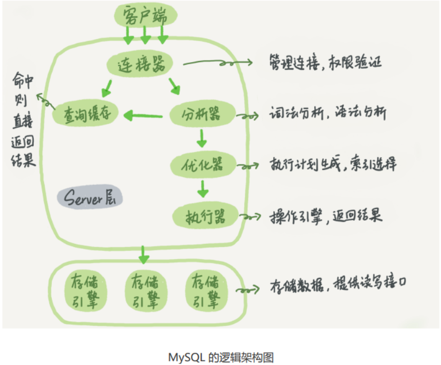
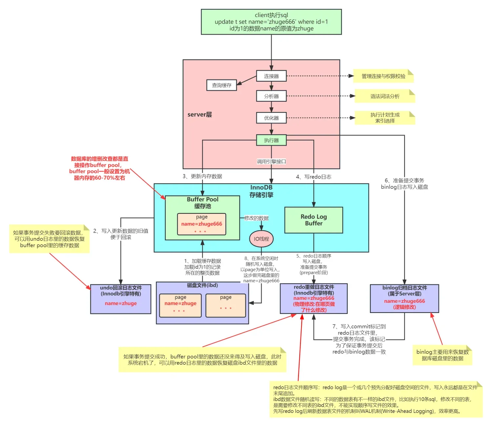

# MySQL 逻辑架构、优化器内核演进与系统元数据深度剖析






---

## 1. MySQL 分层插件式逻辑架构深度解析

MySQL 采用高度解耦的**分层插件式存储引擎架构 (Pluggable Storage Engine Architecture)**。这种架构将**前端连接处理、安全鉴权、SQL 语义解析、代价优化计算**（Server 层）与**底层数据物理存储、B+Tree 索引检索、事务并发锁控制**（Engine 层）彻底分离。

```
MySQL 经典分层逻辑架构
+-------------------------------------------------------------------+
|                        客户端 (Client Layer)                      |
|           (JDBC / ODBC / C-API / Python / Go / PHP Drivers)       |
+-------------------------------------------------------------------+
                                  │
                                  ▼
+-------------------------------------------------------------------+
|                        连接层 (Connection Layer)                  |
|  - 认证授权 (Authentication)   - 线程池 (Thread Pool)              |
|  - TLS/SSL 加密握手            - 连接配额与超时 (Processlist)      |
+-------------------------------------------------------------------+
                                  │
                                  ▼
+-------------------------------------------------------------------+
|                         服务层 (Server Layer)                     |
|  - SQL 接口 (SQL Interface)     - 预处理器 (Preprocessor)          |
|  - 词法/语法解析 (Parser/AST)   - 代价优化器 (Cost-Based Optimizer) |
|  - 事务与锁协调器               - 内部临时表 (TempTable Engine)     |
|  - 跨引擎功能 (视图、触发器、存储过程、窗口函数、CTE、系统函数)    |
|  - 事务数据字典 (Transactional Data Dictionary - MySQL 8.0+)      |
+-------------------------------------------------------------------+
                                  │ (Handler API: ha_innobase)
                                  ▼
+-------------------------------------------------------------------+
|                        引擎层 (Pluggable Storage Engine)          |
|   InnoDB (默认)  |   MyISAM   |   Memory   |   RocksDB / CSV      |
+-------------------------------------------------------------------+
                                  │
                                  ▼
+-------------------------------------------------------------------+
|                        物理存储层 (File System / OS NVMe)         |
|   (Data Files .ibd, Redo Logs, Binlogs, Undo Tablespaces, OS Page)|
+-------------------------------------------------------------------+
```

---

## 2. MySQL 5.7 vs MySQL 8.0 架构演进全景对比矩阵

| 架构对比维度 | MySQL 5.7 | MySQL 8.0+ | 生产收益与内核演进 |
| :--- | :--- | :--- | :--- |
| **查询缓存 (Query Cache)** | 存在（默认建议关闭，高并发写操作会导致全局缓存失效锁争用） | **彻底移除 Query Cache 模块** | 消除查询解析阶段的全局缓存锁争用，代码体积减少数万行，提高 Server 层纯净度 |
| **元数据与数据字典** | 基于分散的文件（`.frm`, `.par`, `.TRG`）与 MyISAM 系统表 | **统一集成至基于 InnoDB 的事务型数据字典 (Data Dictionary)** | 支持 **Atomic DDL（原子元数据变更）**，杜绝 DDL 中途崩溃导致的元数据损坏与脏状态 |
| **Information Schema 性能** | 查询元数据时需临时扫描读取磁盘 `.frm` 文件并创建磁盘临时表，慢且耗 I/O | **基于内存数据字典视图直接查询** | 查询 `information_schema` 性能**提升 10~100 倍**，极大减轻监控采集与 DBA 巡检压力 |
| **优化器连接算法** | 仅支持 Block Nested-Loop (BNL) 块嵌套循环连接 | 引入 **Hash Join**（8.0.18+ 彻底替代 BNL） | 无索引等值 JOIN 查询性能**呈数量级提升**，大幅降低 CPU 与 Buffer Pool 污染 |
| **统计信息与倾斜优化** | 仅依赖 B+Tree 索引采样统计（`n_diff`），对数据倾斜无法感知 | 引入 **直方图 (Histograms)**，支持等宽与等频直方图 | 无索引非过滤列也能精准预估选择度（Selectivity），避免错误选错执行计划 |
| **内部临时表存储引擎** | 内存中使用 `MEMORY` 引擎，超限后转磁盘 `MyISAM` 或 `InnoDB` | 默认采用 **`TempTable` 内存引擎**，支持高效内存分配与 mmap 溢出 | 显著提升复杂聚合、`GROUP BY`、`UNION` 场景下的内存处理性能与并发度 |
| **自增 ID 持久化** | 自增计数器存放在内存中，重启实例重新执行 `SELECT MAX(id)+1` | **自增计数器变更实时写入 Redo Log**，重启直接从重做日志恢复 | 彻底根除 5.7 实例重启导致的自增 ID 复用历史 Bug |
| **SQL 执行计划分析** | 仅支持静态预估的 `EXPLAIN` | 支持 **`EXPLAIN ANALYZE`** 真实执行树耗时打印 | 生产调优能够直观看到每一算子的真实耗时、迭代循环次数与实际过滤行数 |

---

## 3. 连接层 (Connection Layer) 与并发连接架构

### 3.1 连接生命周期与状态机

1. **三次握手与安全认证**：
   - 客户端建立 TCP 连接，握手阶段协商协议版本（Classic Protocol 3306 或 X Protocol 33060）。
   - 进行用户名、密码（`caching_sha2_password` / `mysql_native_password`）及 SSL 证书安全握手。
2. **连接会话上下文载入**：
   - 鉴权通过后，连接器从系统表全量载入该用户的全局权限、库表权限至当前会话的 `THD`（Thread Handler）内存结构中。
3. **连接重置与内存回收（`mysql_reset_connection`）**：
   - 长连接在长时间执行复杂查询后，会话内存（如 `sort_buffer_size`, `join_buffer_size`, 用户自定义变量）会不断堆积。
   - 客户端连接池可通过调用 `mysql_reset_connection()` API，在不重新建立 TCP 握手与鉴权的情况下，一键清空会话临时表与内存状态，防止连接池内存泄漏。

### 3.2 Thread-Per-Connection vs Thread Pool (线程池)

```
并发连接模型对比
┌────────────────────────────────────────────────────────┐
│ 1. 传统模式: Thread-Per-Connection (一连接一线程)       │
│    - 5000 连接 = 5000 个 OS 线程                       │
│    - 缺陷: CPU 线程剧烈上下文切换 (Context Switch)，    │
│      Thread Stack 吃满内存，高并发吞吐骤降。           │
└────────────────────────────────────────────────────────┘
                            │
                            ▼ 优化
┌────────────────────────────────────────────────────────┐
│ 2. 企业级/开源线程池模式: Thread Pool Plugin            │
│    - 连接与工作线程解耦: N 个 Client 连接由 M 个 Worker │
│      线程复用处理 (Thread Group + epoll 事件驱动)       │
│    - 收益: 限制活跃并发线程数，CPU Cache 命中率极高。   │
└────────────────────────────────────────────────────────┘
```

---

## 4. 服务层 (Server Layer) 与优化器 (CBO) 内核

### 4.1 SQL 执行全生命周期流水线

```
SQL 语句执行全流程
Client Request
      │
      ▼
┌──────────────┐
│  Parser 词法/ │ ──► Lexer 分词 (Token) + Yacc 语法树校验 ──► 生成 AST 抽象语法树
│  语法解析器  │
└──────┬───────┘
       ▼
┌──────────────┐
│ Preprocessor │ ──► 校验表名/列名是否存在、展开 * 通配符、校验字段类型与基础权限
│   预处理器   │
└──────┬───────┘
       ▼
┌──────────────┐
│ Cost-Based   │ ──► 计算候选计划 Cost (IO Cost + CPU Cost)
│  Optimizer   │ ──► 索引选择、JOIN 顺序重排、谓词下推 (ICP)、下推子查询
└──────┬───────┘
       ▼
┌──────────────┐
│  Executor    │ ──► 遍历执行树算子，调用 Handler API (ha_innobase) 读取/写入数据页
│   执行器     │
└──────────────┘
```

### 4.2 基于成本的代价模型 (Cost-Based Optimizer, CBO)

优化器通过评估不同执行路径的代价选择最优计划：

$$\text{Total Cost} = \text{IO Cost} + \text{CPU Cost}$$

* **IO 代价**：从磁盘或 Buffer Pool 读取数据页的开销（默认每个 Block 1.0）。
* **CPU 代价**：行记录比对、条件过滤、排序与函数计算的开销（默认每处理一行 0.2）。

```sql
-- 生产查看优化器代价模型参数 (动态调优)
SELECT cost_name, cost_value, default_value FROM mysql.server_cost;
SELECT cost_name, cost_value, default_value FROM mysql.engine_cost;
```

### 4.3 直方图 (Histograms - MySQL 8.0+)
在没有索引的列上，优化器只能通过全局平均值进行粗略估算。如果数据分布存在严重倾斜（如 `status=1` 占 99%，`status=2` 占 1%），容易选错全表扫描或错误索引：

```sql
-- 为状态列创建 100 个桶的等宽直方图
ANALYZE TABLE `t_trade_order` UPDATE HISTOGRAM ON `order_status` WITH 100 BUCKETS;

-- 查看已生成的直方图元数据
SELECT schema_name, table_name, column_name, json_data 
FROM information_schema.column_statistics;
```

---

## 5. 引擎层 (Engine Layer) 与 Handler API 交互

服务层不直接与底层文件系统交互，而是通过统一规范的 **`Handler API`** 与存储引擎（如 `ha_innobase`）进行虚函数调用：

```
Server 层与 InnoDB 引擎 Handler API 交互流转
Server Executor                                    InnoDB Engine (ha_innobase)
      │                                                         │
      ├────────────── 1. ha_index_init(idx_buyer_status) ───────►│ (打开索引 B+Tree)
      │                                                         │
      ├────────────── 2. index_read_map(key_value) ─────────────►│ (定位首条匹配叶子节点页)
      │                                                         │
      │◄───────────── 3. 返回第 1 条行记录 (uchar *buf) ─────────┤
      │                                                         │
      ├────────────── 4. index_next() ──────────────────────────►│ (沿叶子节点双向链表向后扫)
      │                                                         │
      │◄───────────── 5. 返回下一条记录 ─────────────────────────┤
      │                                                         │
      └────────────── 6. ha_index_end() ────────────────────────►│ (关闭索引上下文)
```

---

## 6. 四大系统数据库与生产性能诊断 SQL 资产库

```
MySQL 四大系统数据库
├── mysql               --> 存放系统权限字典、动态权限、主从复制元数据、InnoDB 统计信息
├── information_schema  --> ANSI SQL 标准虚拟元数据视图 (MySQL 8.0 全量内存视图加速)
├── performance_schema  --> 低损耗 Instrumentation 运行时性能与硬件事件监控
└── sys                 --> 基于 Performance Schema 封装的开箱即用 DBA 诊断视图
```

### 生产必用 sys 诊断 SQL 资产库

```sql
-- 1. 查询集群总耗时最长的前 10 大慢 SQL (按总耗时倒序)
SELECT 
    `query`,
    `exec_count`,
    `total_latency`,
    `max_latency`,
    `avg_latency`,
    `rows_examined_avg`
FROM `sys`.`statement_analysis`
ORDER BY `total_latency` DESC
LIMIT 10;

-- 2. 查询 Buffer Pool 内存占用最高的数据表与索引分布
SELECT 
    `table_name`,
    `index_name`,
    `allocated` AS `total_memory`,
    `data` AS `valid_data_memory`,
    `pages` AS `page_count`
FROM `sys`.`innodb_buffer_stats_by_table`
WHERE `object_schema` NOT IN ('mysql', 'performance_schema', 'sys')
ORDER BY `allocated` DESC
LIMIT 10;

-- 3. 探测生产从未被使用过的冗余索引 (安全减负)
SELECT 
    `object_schema`,
    `object_name` AS `table_name`,
    `index_name`
FROM `sys`.`schema_unused_indexes`
WHERE `object_schema` NOT IN ('mysql', 'performance_schema', 'sys');
```

---

## 7. 关联导航与架构闭环

- SQL 语法内核与在线 DDL：[01-SQL基础与语法.md](01-SQL基础与语法.md)
- InnoDB 物理存储与内存内核：[../02-进阶特性/01-存储引擎与InnoDB.md](../02-进阶特性/01-存储引擎与InnoDB.md)
- 索引原理与 B+Tree 结构：[../02-进阶特性/02-索引原理与优化.md](../02-进阶特性/02-索引原理与优化.md)
- 事务并发与锁机制剖析：[../02-进阶特性/03-事务与锁机制.md](../02-进阶特性/03-事务与锁机制.md)
- 物理日志与两阶段提交：[../03-运维与管理/01-日志管理.md](../03-运维与管理/01-日志管理.md)

---

> [!TIP] 💡 关联技术与延伸阅读
>
> * [SQL 语法内核、在线 DDL 演进与 5.7/8.0 特性对比指南](./01-SQL基础与语法.md)
> * [InnoDB 存储引擎物理架构、内存池与内核机制深度解析](../02-进阶特性/01-存储引擎与InnoDB.md)
> * [MySQL 物理/逻辑日志系统、两阶段提交与组提交内核](../03-运维与管理/01-日志管理.md)
> * [MySQL 性能分析、执行计划与 EXPLAIN ANALYZE 深度调优](../02-进阶特性/04-性能分析与优化.md)
