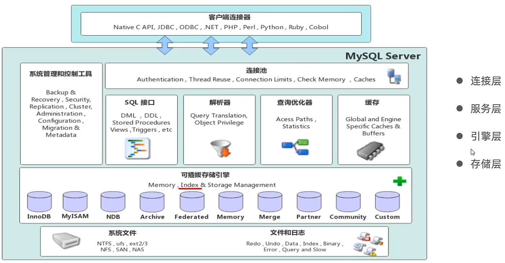
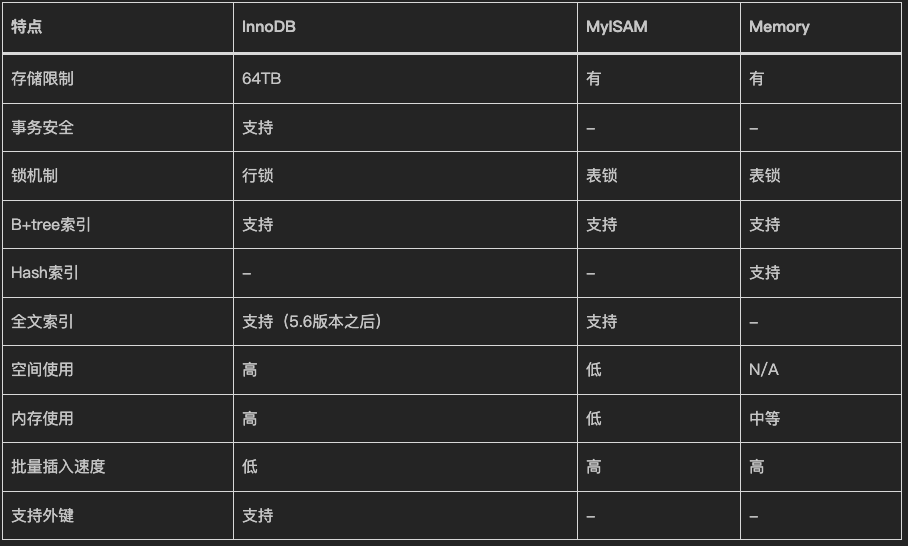
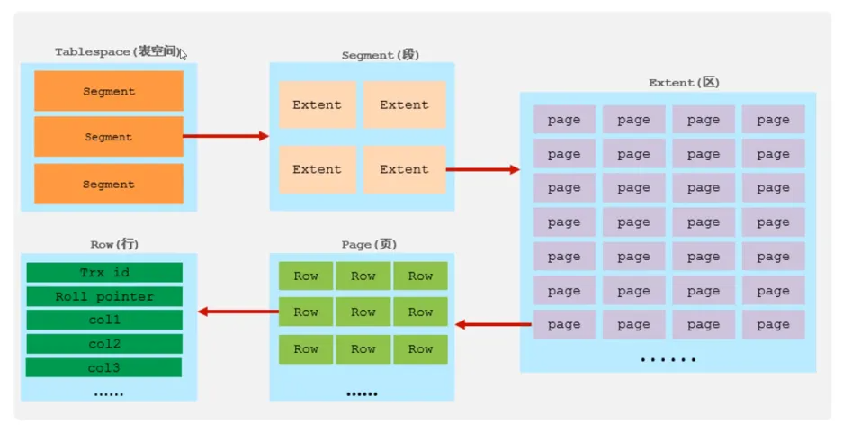
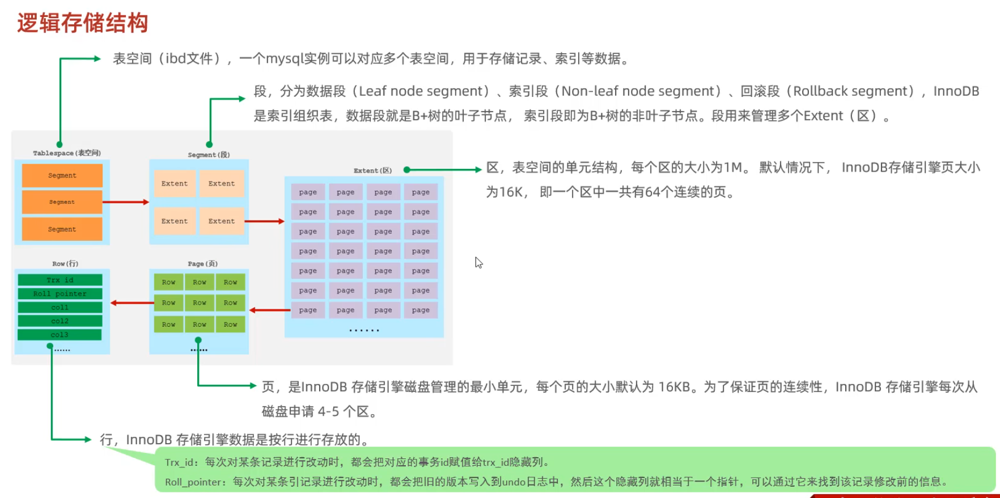
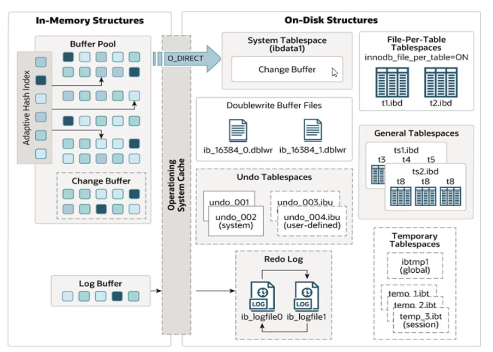
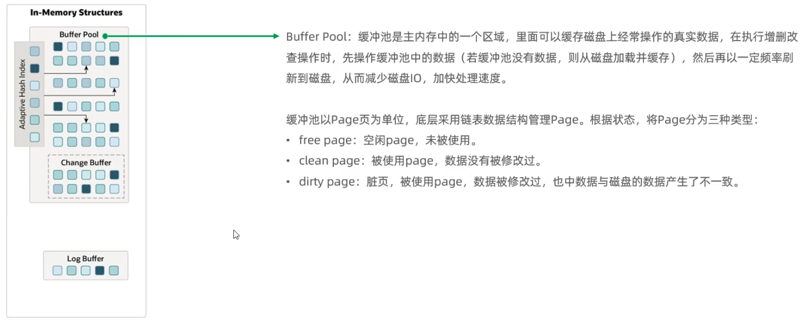

# InnoDB 存储引擎物理架构、内存池与内核机制深度解析



---

## 1. 存储引擎架构与 5.7 vs 8.0 内核演进

MySQL 采用插件式存储引擎架构，使得底层物理存储层与上层 SQL 解析、优化器完全解耦。

### 1.1 三大通用存储引擎特性对比



| 维度对比 | InnoDB (生产默认) | MyISAM | Memory |
| :--- | :--- | :--- | :--- |
| **事务支持** | **支持 (ACID 物理与逻辑保障)** | 不支持 | 不支持 |
| **锁粒度** | **行级锁 (Row Lock) + 间隙锁 (Gap Lock)** | 表级锁 (Table Lock) | 表级锁 (Table Lock) |
| **外键约束** | **支持 (FOREIGN KEY 级联物理约束)** | 不支持 | 不支持 |
| **崩溃恢复 (Crash Recovery)** | **完全支持 (Redo Log + Doublewrite)** | 不支持 (容易损坏 `.MYI`) | 掉电数据丢失 |
| **索引与数据关系** | **聚簇索引 (索引与数据物理同存)** | 非聚簇索引 (数据与索引独立 `.MYD/.MYI`) | 内存 Hash / B-Tree 索引 |
| **高并发读写场景** | **极高 (适合高 QPS 读写、金融/电商核心)** | 极低 (写锁阻塞所有读写) | 高 (仅适合临时缓存计算) |

---

### 1.2 MySQL 5.7 vs 8.0 InnoDB 内核特性全景对比

| 对比维度 | MySQL 5.7 | MySQL 8.0+ | 生产收益与演进价值 |
| :--- | :--- | :--- | :--- |
| **Redo Log 容量调整** | 需停机重启，修改 `innodb_log_file_size` 和 `innodb_log_files_in_group` | **8.0.30+ 支持 `innodb_redo_log_capacity` 在线动态调整** | 彻底实现 Redo Log **在线动态扩容/缩容**，无需停机 |
| **Doublewrite Buffer 物理存储** | 存放在系统表空间 `ibdata1` 中，容易产生表空间膨胀与 I/O 争用 | **独立为专用的 `ib_doublewrite` 文件**，支持动态配置页数与文件数 | 消除系统表空间碎片，提供更灵活的 I/O 调优与云原生支持 |
| **Undo 表空间管理** | 默认集成在系统表空间 `ibdata1`，开启独立需在实例初始化阶段指定 | **默认启用 2 个独立 Undo 表空间 (`undo_001`, `undo_002`)** | 原生支持 **Undo 在线动态自动收缩 (Automatic Truncate)**，防止历史版本大事务撑爆磁盘 |
| **内部临时表引擎** | 使用 `MEMORY` 引擎，溢出后转为 `MyISAM`/`InnoDB` 磁盘临时表 | **引入专用的 `TempTable` 内存引擎**，支持高效内存分配与 mmap 映射 | 复杂分组、排序与 UNION 查询内存处理性能提升数倍 |
| **自增 ID 持久化** | 仅保存在内存中，实例重启后执行 `SELECT MAX(id)+1` 重新初始化 | **自增计数器变更实时写入 Redo Log**，重启直接从重做日志重放 | 彻底解决 5.7 重启后自增 ID 复用的历史灾难 Bug |
| **系统元数据存储** | 散落在磁盘 `.frm` 文件与 MyISAM 系统表中 | **全量集成至 InnoDB 事务型数据字典 (Data Dictionary)** | 实现原子性 DDL (Atomic DDL)，崩溃恢复元数据绝不损坏 |

---

## 2. InnoDB 逻辑存储物理体系 (五层结构)

InnoDB 表空间由 **Tablespace $\rightarrow$ Segment $\rightarrow$ Extent $\rightarrow$ Page $\rightarrow$ Row** 级联层级构成。





### 2.1 五层结构物理拆解

1. **表空间 (Tablespace)**：
   - **独立表空间 (`.ibd`)**：单表独立文件（由 `innodb_file_per_table=ON` 控制），存放数据 B+Tree 叶子页、二级索引页及 SDI 元数据。
   - **通用表空间 (General Tablespace)**：多个表共享的表空间文件，便于多租户统一管理。
   - **系统表空间 (`ibdata1`)**：包含 Change Buffer 物理页等。
   - **Undo 表空间 (`undo_001`, `undo_002`)**：存放事务回滚日志与 MVCC 历史版本，8.0 默认物理独立并支持自动收缩。
2. **段 (Segment)**：
   - 逻辑管理单位，常见的有**数据段**（B+Tree 叶子节点区集合）、**索引段**（B+Tree 非叶子节点区集合）和**回滚段**（Rollback Segment）。
3. **区 (Extent)**：
   - **物理连续分配的 1MB 空间**。在默认 16KB 页大小下，1 个 Extent 包含 **64 个连续物理页**。
   - *生产价值*：按 Extent 连续分配避免了 B+Tree 叶子节点在磁盘上的物理离散分布，将范围扫描（Range Scan）从低效的**随机磁盘 I/O** 转变为高效的**顺序磁盘 I/O**。
4. **页 (Page)**：
   - **InnoDB 内存与磁盘交互的最小基本物理单位**（默认 **16KB**，可通过 `innodb_page_size` 设为 4K/8K/32K/64K）。
5. **行 (Row)**：
   - 数据的物理存放粒度。支持 `Compact`, `Dynamic`, `Redundant`, `Compressed` 行格式（生产默认且推荐 `Dynamic`）。

---

## 3. Data Page (数据页) 物理结构与页内二分查找

InnoDB 16KB 数据页内部被严格划分为 7 个物理区域：

```
InnoDB 16KB 数据页物理布局
+-------------------------------------------------------------+
| File Header (38 Bytes)   : 页头(包含 FIL_PAGE_OFFSET, LSN等)  |
+-------------------------------------------------------------+
| Page Header (56 Bytes)   : 数据页专有状态(记录数, Slot数等)    |
+-------------------------------------------------------------+
| Infimum + Supremum Records: 虚拟伪记录(页面物理上下边界)      |
+-------------------------------------------------------------+
| User Records             : 用户数据记录区 (单链表物理组织)   |
+-------------------------------------------------------------+
| Free Space               : 页内未分配空白连续空间            |
+-------------------------------------------------------------+
| Page Directory           : 页目录 (Slot 槽数组，二分查找稀疏索引) |
+-------------------------------------------------------------+
| File Trailer (8 Bytes)   : 页尾 (Checksum 校验和 + LSN 校验)   |
+-------------------------------------------------------------+
```

### 3.1 页内高效查找算法与 Page Directory

* **页内单链表与分组**：User Records 区域的记录按主键升序组成单向链表。InnoDB 将这些记录划分为若干个组，每组包含 $4 \sim 8$ 条记录。
* **Slot 槽与二分定位**：每个分组的最大记录偏移量存放在 **Page Directory** 中的一个 **Slot** 槽位中。
* **两阶段极速检索**：
  1. 阶段 1：在 **Page Directory** 的 Slot 数组中进行**二分查找 (Binary Search)**，纳秒级定位到目标 Key 所在的分组 Slot。
  2. 阶段 2：通过该 Slot 对应的前驱记录指针，在单向链表中**顺序遍历 $1 \sim 8$ 条记录**，精准命中目标行。

---

## 4. InnoDB 动态内存池 (Buffer Pool) 内核机制

Buffer Pool 是 InnoDB 的性能核心，通过将磁盘数据页缓存到内存中，尽量实现**“在内存中读、在内存中改”**。



### 4.1 三大内存链表协作模型

```
Buffer Pool 三大链表流转
┌────────────────────────────────────────────────────────┐
│ 1. Free List (空闲链表)                                │
│    管理尚未装载数据的空白内存 Buffer Frame              │
└───────────────────────────┬────────────────────────────┘
                            │ (从磁盘加载数据页)
                            ▼
┌────────────────────────────────────────────────────────┐
│ 2. LRU List (淘汰链表)                                 │
│    管理所有已装载数据页，按热度动态淘汰淘汰冷页          │
└───────────────────────────┬────────────────────────────┘
                            │ (发生 DML 修改变为脏页)
                            ▼
┌────────────────────────────────────────────────────────┐
│ 3. Flush List (脏页链表)                               │
│    管理所有被修改但尚未落盘的脏页，按 oldest_modification_lsn  │
│    升序排列，驱动后台 Checkpoint 刷盘                  │
└────────────────────────────────────────────────────────┘
```

---

### 4.2 改进型冷热分离 LRU 算法 (抗全表扫描污染)

如果使用传统 LRU 算法，偶发的大表扫描会瞬间将热点缓存全部挤出内存。InnoDB 采用**冷热分段 LRU 算法**：

```
改进型 LRU List 结构
          +-------------------------+-------------------------+
LRU List: |  Young 区域 (热数据 58%) |   Old 区域 (冷数据 42%)  |
          +-------------------------+-------------------------+
          ^                         ^                         ^
         Head                   Midpoint                     Tail
```

* **分段比例**：默认约 58% 为 Young 热区，42% 为 Old 冷区（由 `innodb_old_blocks_pct` 控制）。
* **冷页孵化时间沉淀机制 (`innodb_old_blocks_time`)**：
  1. 新从磁盘读取的数据页**默认只插入 Old 区域头部**。
  2. 只有当该数据页在 Old 区域停留的时间**超过 `innodb_old_blocks_time`（默认 1000ms）** 且再次被业务读取时，才会被晋升到 **Young 区域头部**。
  3. **生产价值**：全表扫描在 1 秒内迅速读取完数据页后不再访问，这些页会停留在 Old 区快速老化淘汰，彻底杜绝了生产热点缓存被全表扫描打崩。

---

## 5. InnoDB 核心辅助缓存与崩溃恢复三大机制

### 5.1 Change Buffer (写缓冲)

* **应用场景**：针对**非唯一二级索引 (Non-Unique Secondary Index)** 页的 DML 修改。
* **工作机制**：当插入/修改数据时，若目标二级索引页**不在 Buffer Pool 内存中**，InnoDB 不会立即发起慢速的磁盘随机 I/O 去加载该页，而是将变更暂存到内存的 **Change Buffer** 中。
* **Merge 触发时机**：
  1. 后续业务查询该二级索引页，物理页被读入 Buffer Pool 时触发 Merge 合并。
  2. 后台 Master / Purge 线程异步定期合并。
  3. 数据库正常关闭（Shutdown）时。

> [!NOTE]
> 为什么唯一索引不能使用 Change Buffer？
> 因为唯一索引在插入/更新时必须立即进行**唯一性冲突校验**，这强制要求将索引页加载到内存中比对，因此无法延迟。

---

### 5.2 Doublewrite Buffer (双写缓冲区) 抗页断裂机制

* **解决的核心痛点：部分页写入失效 (Partial Page Write / Page Tear)**
  * 操作系统与底层文件系统的物理写入单位通常为 **4KB**，而 InnoDB 数据页为 **16KB**。
  * 当内存脏页刷盘时，如果刷到第 8KB 时服务器突然**断电崩溃**，导致磁盘物理页损坏（前 8KB 为新数据，后 8KB 为旧数据）。此时页校验和（Checksum）失败，且由于物理结构断裂，**Redo Log 无法在损坏的页上进行物理重做！**



#### 生产双写保护流程与 8.0 独立架构：
1. 脏页刷盘前，先将 16KB 页数据拷贝到内存中的 Doublewrite Buffer。
2. 优先**顺序写入 (Sequential Write)** 到磁盘的独立双写文件（MySQL 8.0 为 `ib_doublewrite`），并立即执行 `fsync()`。
3. 双写落盘完成后，再将脏页**随机写入 (Random Write)** 到各自业务表的 `.ibd` 数据文件中。
4. **崩溃恢复**：若某页 Checksum 校验损坏，直接从 `ib_doublewrite` 提取完整镜像页恢复底层结构，再重放 Redo Log。

---

### 5.3 Adaptive Hash Index (AHI 自适应哈希索引)

* **机制**：InnoDB 实时监控 B+Tree 索引页的访问模式。若发现某模式连续频繁访问，InnoDB 自动在内存建立 Hash 表，将 Hash Key 直接映射为 B+Tree 叶子节点的物理内存地址。
* **开销与调优**：将 B+Tree 的 $O(\log N)$ 树高检索降为 $O(1)$。但在高并发极强写入场景下，AHI 内部锁（`btr_search_latch`）可能产生严重竞争。若监控发现 AHI 锁等待过高，可动态关闭：`SET GLOBAL innodb_adaptive_hash_index = OFF;`。

---

## 6. 关联导航与架构闭环

- SQL 语法内核与在线 DDL：[../01-基础和原理/01-SQL基础与语法.md](../01-基础和原理/01-SQL基础与语法.md)
- B+Tree 索引物理检索与优化：[02-索引原理与优化.md](02-索引原理与优化.md)
- 事务并发、MVCC 与锁机制：[03-事务与锁机制.md](03-事务与锁机制.md)
- 日志系统与两阶段提交：[../03-运维与管理/01-日志管理.md](../03-运维与管理/01-日志管理.md)
- 参数调优与 Buffer Pool 最佳实践：[../03-运维与管理/06-参数调优与配置.md](../03-运维与管理/06-参数调优与配置.md)

---

> [!TIP] 💡 关联技术与延伸阅读
>
> * [MySQL B+Tree 索引物理原理、高级特性与调优实战](./02-索引原理与优化.md)
> * [InnoDB 事务 ACID、MVCC 与锁机制深度剖析](./03-事务与锁机制.md)
> * [MySQL 物理/逻辑日志系统、两阶段提交与组提交内核](../03-运维与管理/01-日志管理.md)
> * [MySQL 核心参数调优、OS 内核优化与生产配置模板](../03-运维与管理/06-参数调优与配置.md)
