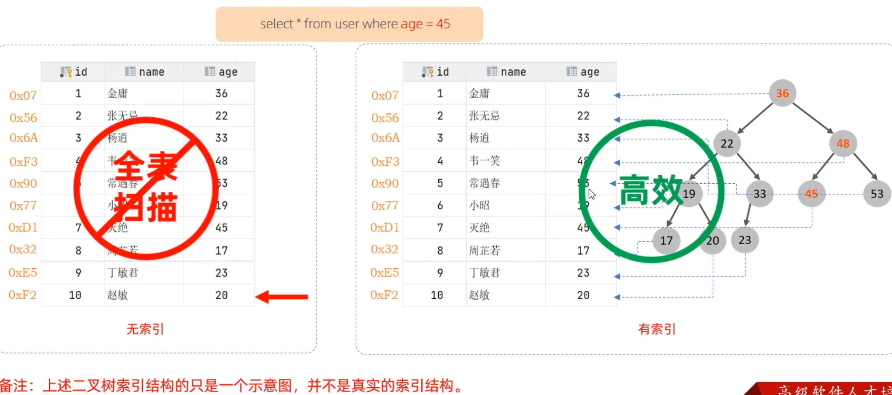
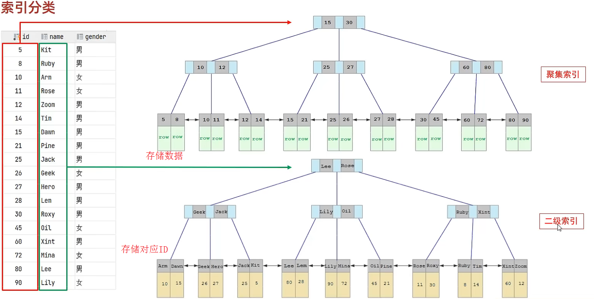
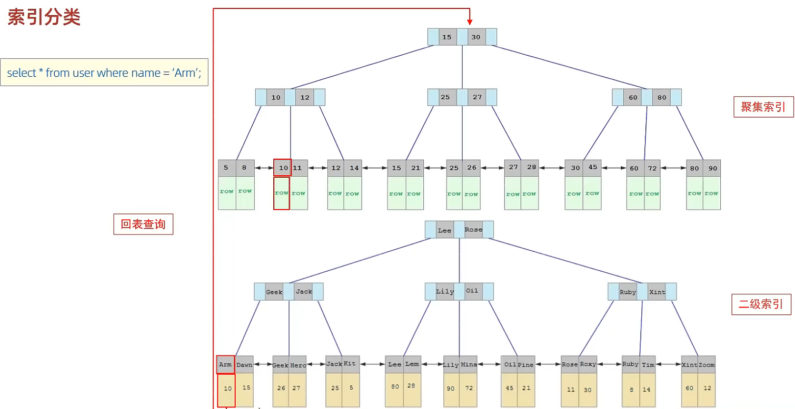
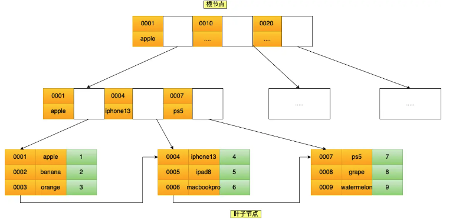

# MySQL B+Tree 索引物理原理、高级特性与优化调优实战



---

## 1. 索引底层物理组织与 B+Tree 算法选型

索引是存储引擎层用于帮助数据库快速检索数据的**排好序的数据结构**。

### 1.1 数据结构横向选型推演

```
经典数据结构对比推演
1. 传统二叉搜索树 / 红黑树 (BST / Red-Black Tree)
   - 树高过大 (O(log2 N))。上亿记录树高超过 30 层，查找单行需 30+ 次磁盘随机 I/O，不可接受。

2. Hash 表 (Hash Index)
   - 等值查询 O(1)，但不支持范围扫描 (>、<、BETWEEN)、无法做前缀匹配或 ORDER BY 排序。

3. B-Tree (多路平衡搜索树)
   - 每个节点既存放 Key+指针，也存放整行物理数据 (Data)。
   - 缺陷: 非叶子节点包含 Data 导致单个 16KB 物理页能存放的 Key 数量锐减（扇出数小），树层级变深，I/O 剧增。

4. B+Tree (MySQL InnoDB 核心选型)
   - 非叶子节点仅存放 Key + 指针 (无 Data)，单页可容纳成千上万个 Key，扇出数极高；
   - 所有 Data 集中存放在叶子节点，叶子节点之间通过双向链表相连，极度适合范围扫描与分页。
```

---

### 1.2 B+Tree 物理树高与容量数学推导 (Senior DBA 必备)

假设 InnoDB 数据页大小为 **16KB**（16384 字节），主键为 `BIGINT`（占用 **8 字节**），指针大小为 **6 字节**：

1. **非叶子节点页容量 (扇出数 Fan-out)**：
   $$\text{Fan-out} = \frac{16384 \text{ Bytes}}{8 \text{ Bytes (Key)} + 6 \text{ Bytes (Pointer)}} \approx 1170 \text{ 个分支指针}$$
2. **叶子节点页容量**：假设单条记录平均大小为 **1KB**（1000 字节），则单个叶子物理页可容纳：
   $$\text{Page Row Capacity} = \frac{16384 \text{ Bytes}}{1000 \text{ Bytes}} \approx 16 \text{ 条记录}$$
3. **树高与支撑数据容量对应关系**：
   * **2 层 B+Tree**：$1170 \times 16 = 18,720$ 条记录。
   * **3 层 B+Tree**：$1170 \times 1170 \times 16 \approx 21,902,400$ 条（**约 2200 万条记录**）。
   * **4 层 B+Tree**：$1170 \times 1170 \times 1170 \times 16 \approx 256$ 亿条记录。

> [!NOTE] 生产结论
> 在 3 层 B+Tree 架构下，支撑 **2200 万数据量** 的表中查找任意一条记录，**仅需 3 次磁盘 I/O**；且由于根节点和二级非叶子节点高频常驻 Buffer Pool 内存，**实际仅需 1 次磁盘物理 I/O**！

---

## 2. MySQL 5.7 vs MySQL 8.0 索引特性全景对比

| 索引特性维度 | MySQL 5.7 | MySQL 8.0+ | 生产收益与优化场景 |
| :--- | :--- | :--- | :--- |
| **降序索引 (Descending Indexes)** | 语法支持 `DESC` 但底层 B+Tree 物理依然按升序存储 | **底层 B+Tree 真正按倒序组织物理存储** | 彻底消除多列混合排序（如 `ORDER BY a ASC, b DESC`）下的 `Using filesort` 内存排序 |
| **不可见索引 (Invisible Indexes)** | 不支持（删除前无法评估影响） | **原生支持 `INVISIBLE` 状态** | 软删除索引在线验证性能，若出现异常可在 1 秒内改回 `VISIBLE`，保障核心业务平稳 |
| **函数索引 / 表达式索引** | 仅支持通过 Virtual Column（虚拟生成列）间接建索引 | **原生支持表达式索引** (`CREATE INDEX idx ON t ((func(col)))`) | 优化大小写忽略、字符串日期格式化、JSON 属性提取等场景的查询性能 |
| **索引跳跃扫描 (Index Skip Scan)** | 不支持（缺失联合索引前导列直接走全表扫描） | **原生支持 Index Skip Scan** | 当联合索引前导列基数很小（如性别、状态位）时，自动跳过前导列复用联合索引 |
| **多值索引 (Multi-Value Indexes)** | 不支持 | **支持针对 JSON 数组建立 Multi-Value 索引** (`MEMBER OF()`) | 允许在 JSON 数组元素上建立二级索引，大幅提升多标签、多属性检索效率 |

---

## 3. 聚簇索引与二级索引回表机制





### 3.1 回表 (Bookmark Lookup) 与覆盖索引 (Covering Index)

* **聚簇索引 (Clustered Index)**：B+Tree 叶子节点直接存放**完整的整行物理数据**。每张 InnoDB 表有且仅有一个聚簇索引（优先主键，其次第一个非空唯一索引，最后为 6 字节隐藏 RowID）。
* **二级索引 (Secondary Index)**：叶子节点仅存放 **“索引列值 + 主键 ID”**。
* **回表代价**：如果通过二级索引检索，查询的列未全部包含在该二级索引中，InnoDB 必须拿着取出的主键 ID，再去聚簇索引 B+Tree 树上做第二次检索（回表）。
* **覆盖索引 (Covering Index)**：二级索引的键值已包含查询所需的所有字段（`SELECT id, user_id FROM t WHERE user_id = 100`），**直接在二级索引树返回结果，无需回表**，执行计划显示 `Using index`。

---

## 4. 联合索引最左匹配与底层页分裂/合并

### 4.1 联合索引最左前缀法则



联合索引 `idx_a_b_c (a, b, c)` 的 B+Tree 排序逻辑：
1. 严格按第一列 `a` 升序排列；
2. 仅在 `a` 相等时，按第二列 `b` 排序；
3. 仅在 `a` 和 `b` 均相等时，按第三列 `c` 排序。

> [!IMPORTANT] 失效根因
> 若查询跳过 `a`（如 `WHERE b=1 AND c=2`），全表范围内的 `b` 和 `c` 整体完全无序，B+Tree 无法进行二分折半，只能退化为全表扫描或全索引扫描。

### 4.2 节点页分裂 (Page Split) 与页合并 (Page Merge)

* **页分裂**：连续插入无序随机主键（如 UUID）时，物理页已满，InnoDB 必须将原页中 50% 的记录移动到新物理页，并调整上层父节点指针。这会导致大量**物理碎片与 I/O 抖动**。生产必须采用**顺序递增主键**。
* **页合并**：当删除记录导致物理页利用率低于合并阈值（默认 `MERGE_THRESHOLD = 50%`）时，InnoDB 会自动尝试将其与相邻页合并以释放空间。

---

## 5. 高级索引下推 (ICP) 与多范围读取 (MRR)

### 5.1 索引条件下推 (Index Condition Pushdown, ICP)

```
ICP 机制对比
无 ICP (传统流程):
[Engine 层: 扫描二级索引页] ──► 匹配首个索引条件 ──► 回表读取整行数据 ──► [Server 层: 逐行过滤剩余条件]

开启 ICP (MySQL 5.6+ 默认):
[Engine 层: 扫描二级索引页] ──► 在索引树内直接过滤其余索引列 ──► 仅对完全满足条件的记录回表! (回表量减少 90%+)
```

```sql
-- 包含联合索引 idx_name_age(name, age)
SELECT * FROM `t_user` WHERE `name` LIKE '张%' AND `age` = 25;
-- ICP 会在 Engine 层遍历 idx_name_age 索引树时直接判断 age=25，大幅减少无效回表！
```

### 5.2 多范围读取 (Multi-Range Read, MRR)

当二级索引范围扫描产生大量无序的主键 ID 时，MRR 会在内存中开辟 **`read_rnd_buffer`**，将这些主键 **按磁盘物理地址升序排序** 后，再批量对聚簇索引发起扫描。
* **收益**：将离散的**随机磁盘 I/O 转换为连续的顺序 I/O**。

---

## 6. 超大表深度分页优化生产实战

在千万级大表中，执行 `LIMIT 10000000, 20` 耗时极长，因为优化器需要扫描前 10000020 行数据并在 Server 层丢弃前 1000 万行，产生海量无效回表。

```sql
-- 方案 1: 延迟关联 / 子查询覆盖索引优化 (推荐)
-- 先在二级索引树上利用覆盖索引极速完成分页定位，再与原表聚簇索引进行 JOIN 回表
SELECT t.* 
FROM `t_trade_order` t
INNER JOIN (
    SELECT `id` FROM `t_trade_order` 
    WHERE `buyer_id` = 10086 
    ORDER BY `created_at` DESC 
    LIMIT 1000000, 20
) AS lim ON t.`id` = lim.`id`;

-- 方案 2: 游标寻址法 (Seek Method - 针对连续自增或排序列)
-- 记录上一页最后一条记录的 ID，直接走索引范围查找
SELECT * FROM `t_trade_order` 
WHERE `buyer_id` = 10086 AND `id` < 98765432 
ORDER BY `id` DESC 
LIMIT 20;
```

---

## 7. 经典索引失效场景汇总与排查 Checklist

1. **违反最左匹配原则**（跳过联合索引前导列）。
2. **对索引列使用函数或算术运算**（如 `WHERE DATE(created_at) = '2026-08-01'` 或 `WHERE id + 1 = 10`）。
3. **隐式类型转换**（字符串列传入整数字面量，如 `VARCHAR` 列 `phone` 传入 `WHERE phone = 13800000000`，触发内部隐式 `CAST`）。
4. **隐式字符集不匹配**（两表关联字段字符集分别为 `utf8mb4` 和 `utf8`，触发字符集转码函数）。
5. **模糊查询左通配符**（`WHERE name LIKE '%李'` 无法走索引；`WHERE name LIKE '李%'` 可走索引）。
6. **`OR` 条件包含未索引字段**（`WHERE indexed_col = 1 OR non_indexed_col = 2`）。
7. **数据倾斜与全表扫描代价更小**（若优化器估算过滤出的数据占比超过 $20\% \sim 30\%$，CBO 会判定全表顺序扫描代价低于频繁二级索引回表）。

---

## 8. 关联导航与架构闭环

- 存储引擎与数据页结构：[01-存储引擎与InnoDB.md](01-存储引擎与InnoDB.md)
- 事务并发、Next-Key Lock 与死锁排查：[03-事务与锁机制.md](03-事务与锁机制.md)
- EXPLAIN ANALYZE 执行计划调优：[04-性能分析与优化.md](04-性能分析与优化.md)
- 巡检规范与冗余索引检测：[../03-运维与管理/07-巡检报告与规范.md](../03-运维与管理/07-巡检报告与规范.md)

---

> [!TIP] 💡 关联技术与延伸阅读
>
> * [InnoDB 存储引擎物理架构、内存池与内核机制深度解析](./01-存储引擎与InnoDB.md)
> * [InnoDB 事务 ACID、MVCC 与锁相容矩阵深度剖析](./03-事务与锁机制.md)
> * [MySQL 性能分析、执行计划与 EXPLAIN ANALYZE 深度调优](./04-性能分析与优化.md)
> * [数据库日常健康巡检报告与自动化 Shell 脚本规范](../03-运维与管理/07-巡检报告与规范.md)
