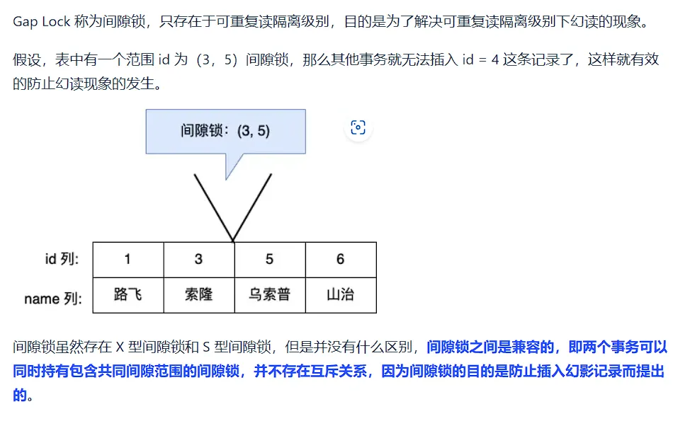
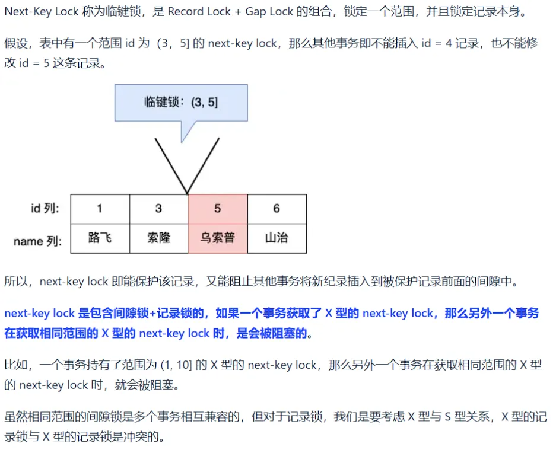

# InnoDB 事务 ACID 原理、MVCC 内核与锁相容矩阵深度剖析

---

## 1. 事务 ACID 特性物理实现与并发问题

事务是一组 SQL 操作构成的不可分割的逻辑执行单元。InnoDB 引擎通过存储底层的日志与锁体系完整保障了 ACID 特性：

```
ACID 特性与底层引擎实现
├── A (Atomicity 原子性)       ──► Undo Log (回滚日志: 物理逆向重放与事务撤销)
├── C (Consistency 一致性)    ──► 由 A + I + D 及应用层业务约束共同维系
├── I (Isolation 隔离性)      ──► MVCC (多版本并发控制) + Lock (行级锁/间隙锁/MDL 锁)
└── D (Durability 持久性)      ──► Redo Log (WAL 预写日志) + Doublewrite (双写缓冲区)
```

### 1.1 并发事务四大异常与隔离级别矩阵

| 隔离级别 | 脏写 (Dirty Write) | 脏读 (Dirty Read) | 不可重复读 (Non-Repeatable Read) | 幻读 (Phantom Read) | 生产推荐与适用场景 |
| :--- | :---: | :---: | :---: | :---: | :--- |
| **Read Uncommitted (读未提交)** | 杜绝 | 存在 | 存在 | 存在 | 生产严禁使用 |
| **Read Committed (RC 读已提交)** | 杜绝 | **已解决** | 存在 | 存在 | **互联网/高并发大厂首选**（无 Gap Lock，死锁概率极低，主从复制需搭配 Row 格式） |
| **Repeatable Read (RR 可重复读)**| 杜绝 | **已解决** | **已解决** | **已解决 (MVCC+Next-Key Lock)** | **MySQL 默认隔离级别**（适合对一致性要求极高、单机事务隔离严苛的金融场景） |
| **Serializable (串行化)** | 杜绝 | **已解决** | **已解决** | **已解决** | 所有读操作强制加读锁 (S 锁)，并发吞吐极差 |

---

## 2. MySQL 5.7 vs MySQL 8.0 事务与锁特性全景对比

| 特性维度 | MySQL 5.7 | MySQL 8.0+ | 生产收益与高并发优化 |
| :--- | :--- | :--- | :--- |
| **行锁等待非阻塞模式** | 不支持（`SELECT ... FOR UPDATE` 遇到锁必须等待直到超时报错） | 引入 **`NOWAIT`** 与 **`SKIP LOCKED`** 语法 | **秒杀/任务抢占/队列消费场景**并发吞吐提升 10 倍以上，彻底消除热点行锁排队堆积 |
| **锁监控系统表** | 位于 `information_schema.innodb_locks` 和 `innodb_lock_waits` | **重构为 `performance_schema.data_locks` 与 `data_lock_waits`** | 监控开销大幅降低，支持更精细的行锁模式（`REC_NOT_GAP`, `GAP`, `LOCK_ORDINARY`）展示 |
| **死锁检测控制** | 强制开启死锁检测（高并发热点行争用时 CPU 被死锁检测算法吃满） | 支持 **`innodb_deadlock_detect = OFF`** 动态关闭 | 极大提升已知无循环依赖的高并发批量写入与秒杀写入吞吐 |
| **自增锁默认模式** | `innodb_autoinc_lock_mode = 1`（连续模式，特定批量插入需持表级 AUTO-INC 锁） | **默认 `innodb_autoinc_lock_mode = 2`（交错模式 Interleaved）** | 批量插入（如 `INSERT INTO ... SELECT`）彻底消除表级自增锁竞争，与 Binlog Row 格式完美配合 |
| **自增 ID 持久化** | 内存存储，实例重启通过 `MAX(id)+1` 重新计算 | **自增计数器变更实时写入 Redo Log** | 彻底消除 5.7 实例重启导致自增 ID 复用的历史 Bug |

---

## 3. MVCC (多版本并发控制) 内核机制

MVCC (Multi-Version Concurrency Control) 通过在每行记录上维护版本历史链，实现**非阻塞的快照读（Snapshot Read）**，大幅提升高并发读写吞吐。

### 3.1 行记录隐藏字段与 Undo Log 版本链

InnoDB 在每一行聚簇物理记录中内置了三个系统隐藏列：

```
InnoDB 物理行记录隐藏列
+-----------------------------------------------------------------------------------+
| User Columns | DB_TRX_ID (6 Bytes) | DB_ROLL_PTR (7 Bytes) | DB_ROW_ID (6 Bytes) |
+-----------------------------------------------------------------------------------+
```

* **`DB_TRX_ID`**：最近一次对该行执行 `INSERT` 或 `UPDATE` 的事务 ID。
* **`DB_ROLL_PTR`**：回滚指针，指向该行上一个历史版本的 **Undo Log** 物理存放地址。
* **`DB_ROW_ID`**：隐式自增主键（仅在表没有显式主键且无非空唯一索引时生成）。

```
Undo Log 单向版本链形成
[当前最新行 (内存/磁盘)] DB_TRX_ID=300, DB_ROLL_PTR ──► [Undo Version 2] DB_TRX_ID=200, DB_ROLL_PTR ──► [Undo Version 1] DB_TRX_ID=100
```

---

### 3.2 ReadView 动态快照与可见性判定算法

在执行快照读（`SELECT`）时，InnoDB 会生成一个名为 **`ReadView`** 的内存快照结构，包含 4 个核心属性：

1. **`m_ids`**：生成 ReadView 瞬间，系统内**所有活跃（未提交）的事务 ID 数组**。
2. **`min_trx_id`**：`m_ids` 列表中的最小值。
3. **`max_trx_id`**：系统即将分配给下一个新事务的递增 ID（即当前全局最大事务 ID + 1）。
4. **`m_creator_trx_id`**：创建当前 ReadView 的事务本身的 ID。

```
ReadView 可见性判定算法流程图
              待判定版本的 DB_TRX_ID
                         │
                         ▼
        ┌──────────────────────────────────┐
        │ DB_TRX_ID == m_creator_trx_id ? │ ───[YES]──► 【可见】(当前事务自己修改)
        └────────────────┬─────────────────┘
                         │ [NO]
                         ▼
        ┌──────────────────────────────────┐
        │    DB_TRX_ID < min_trx_id ?      │ ───[YES]──► 【可见】(生成快照前已提交)
        └────────────────┬─────────────────┘
                         │ [NO]
                         ▼
        ┌──────────────────────────────────┐
        │    DB_TRX_ID >= max_trx_id ?     │ ───[YES]──► 【不可见】(生成快照后才开启)
        └────────────────┬─────────────────┘
                         │ [NO]
                         ▼
        ┌──────────────────────────────────┐
        │      DB_TRX_ID IN m_ids ?        │ ───[YES]──► 【不可见】(生成快照时仍活跃未提交)
        └────────────────┬─────────────────┘
                         │ [NO]
                         ▼
                     【可见】(生成快照前已完成提交)
```

> [!IMPORTANT] RC 与 RR 隔离级别的物理差异
> * **Read Committed (RC)**：**每一次执行 `SELECT` 都会生成一个全新的 ReadView**，因此能看到其他事务最新提交的变更（产生不可重复读）。
> * **Repeatable Read (RR)**：**仅在第一次执行 `SELECT` 时生成 ReadView**，后续所有 `SELECT` 均复用首个 ReadView，实现整个事务生命周期内快照的一致性。

---

## 4. 锁机制与锁相容矩阵

### 4.1 Latch (闩锁) 与 Lock (事务锁) 对比

| 维度对比 | Latch (内核闩锁) | Lock (业务事务锁) |
| :--- | :--- | :--- |
| **保护对象** | 内存核心数据结构（Buffer Pool 页、LRU 链表、Hash 桶） | 数据库磁盘数据与逻辑记录（表、行、间隙、Next-Key） |
| **持有时长** | 极短（微秒/纳秒级，执行完底层指针操作即释放） | 整个事务生命周期（直至 `COMMIT` 或 `ROLLBACK`） |
| **死锁机制** | 无死锁检测（依靠内核代码层加锁顺序保障） | 采用等待图（Wait-for Graph）死锁检测机制 |

---

### 4.2 行级锁、间隙锁与 Next-Key Lock 退化矩阵 (RR 级别)





#### 锁相容矩阵

| 锁模式 | S (共享读锁) | X (排他写锁) | IS (意向共享) | IX (意向排他) |
| :--- | :---: | :---: | :---: | :---: |
| **S (共享读锁)** | **兼容** | 冲突 | **兼容** | 冲突 |
| **X (排他写锁)** | 冲突 | 冲突 | 冲突 | 冲突 |
| **IS (意向共享)**| **兼容** | 冲突 | **兼容** | **兼容** |
| **IX (意向排他)**| 冲突 | 冲突 | **兼容** | **兼容** |

#### Next-Key Lock 锁退化四大黄金规则：
1. **规则 1（唯一索引等值查询，记录存在）**：Next-Key Lock 退化为 **【记录锁 (Record Lock)】**，仅锁中当前行，不加间隙锁。
2. **规则 2（唯一索引等值查询，记录不存在）**：Next-Key Lock 退化为 **【间隙锁 (Gap Lock)】**，锁定目标值两侧的开区间。
3. **规则 3（非唯一普通索引等值查询）**：
   - 锁定命中行及左侧的 Next-Key Lock $(a, b]$；
   - 沿索引树向右扫描到第一个不匹配的节点，该右侧区间退化为 **【间隙锁 (Gap Lock)】** $(b, c)$；
   - 最终锁定范围为开区间 $(a, c)$。
4. **规则 4（范围查询）**：唯一索引或普通索引的范围查询（`>`, `<`, `BETWEEN`），所有扫描遍历到的区间均加 **Next-Key Lock**，不发生退化。

---

## 5. MySQL 8.0 `NOWAIT` 与 `SKIP LOCKED` 高并发实战

在电商秒杀、工单派发与高并发任务队列中，传统的 `SELECT ... FOR UPDATE` 会让所有工作线程排队阻塞在同一行记录上，极易耗尽连接池。

```sql
-- 场景: 并发任务分发 Worker (每次提取 1 条待处理工单)

-- 1. 传统阻塞模式: 若任务已被其他 Worker 锁定，当前 Worker 阻塞等待
SELECT * FROM `t_job_queue` WHERE `status` = 'PENDING' LIMIT 1 FOR UPDATE;

-- 2. MySQL 8.0 NOWAIT: 遇锁立即报错退出，不阻塞等待
SELECT * FROM `t_job_queue` WHERE `status` = 'PENDING' LIMIT 1 FOR UPDATE NOWAIT;

-- 3. MySQL 8.0 SKIP LOCKED: 遇锁自动跳过，直接提取下一个未锁定的行 (推荐生产任务队列)
SELECT * FROM `t_job_queue` WHERE `status` = 'PENDING' LIMIT 1 FOR UPDATE SKIP LOCKED;
```

---

## 6. 死锁日志深度解读与生产防范

### 6.1 死锁日志解析 (`SHOW ENGINE INNODB STATUS`)

```
------------------------
LATEST DETECTED DEADLOCK
------------------------
*** (1) TRANSACTION:
TRANSACTION 10081, ACTIVE 2 SEC starting index read
UPDATE t_trade_order SET order_status = 2 WHERE id = 10;
*** (1) WAITING FOR THIS LOCK TO BE GRANTED:
RECORD LOCKS space id 25 page no 4 index PRIMARY of table `t_trade_order` trx id 10081 lock_mode X locks rec but not gap waiting

*** (2) TRANSACTION:
TRANSACTION 10082, ACTIVE 3 SEC starting index read
UPDATE t_trade_order SET order_status = 2 WHERE id = 20;
*** (2) HOLDS THE LOCK(S):
RECORD LOCKS space id 25 page no 4 index PRIMARY of table `t_trade_order` trx id 10082 lock_mode X locks rec but not gap
*** (2) WAITING FOR THIS LOCK TO BE GRANTED:
RECORD LOCKS space id 25 page no 4 index PRIMARY of table `t_trade_order` trx id 10082 lock_mode X locks rec but not gap waiting

*** WE ROLL BACK TRANSACTION (1)
```

#### 解读与排查 SOP：
1. **分析持锁与等待**：事务 1 持有 id=20 的 X 锁并等待 id=10 的 X 锁；事务 2 持有 id=10 的 X 锁并等待 id=20 的 X 锁，构成循环等待图（Cycle in Wait-for Graph）。
2. **代价仲裁**：InnoDB 评估发现事务 1 生成的 Undo 日志较少（回滚代价更低），主动选择 `WE ROLL BACK TRANSACTION (1)`。

### 6.2 生产死锁预防四大军规

1. **固定加锁顺序**：涉及批量更新/删除多行数据时，业务端必须显式对主键/唯一索引列表进行排序（`sort()` 升序），杜绝交叉加锁。
2. **缩短事务与锁持有时间**：将耗时的 RPC 调用、第三方支付请求及大查询移至事务外部；将 `UPDATE/DELETE` 加锁 SQL 放置在事务末尾临近 `COMMIT` 处。
3. **隔离级别降级至 RC**：在绝大多数互联网 OLTP 系统中，将隔离级别从 RR 降至 `READ COMMITTED`，消除间隙锁（Gap Lock），可消灭 90% 以上的无意图死锁。
4. **合理创建索引**：若 `UPDATE/DELETE` 语句未命中索引，InnoDB 会退化为扫描全表聚簇索引并对全表每一行加 X 锁，引发大面积死锁与性能雪崩。

---

## 7. 关联导航与架构闭环

- InnoDB 存储引擎与 Buffer Pool：[01-存储引擎与InnoDB.md](01-存储引擎与InnoDB.md)
- B+Tree 索引物理检索与优化：[02-索引原理与优化.md](02-索引原理与优化.md)
- 慢 SQL 优化与 EXPLAIN 执行计划：[04-性能分析与优化.md](04-性能分析与优化.md)
- 物理日志系统与 2PC 两阶段提交：[../03-运维与管理/01-日志管理.md](../03-运维与管理/01-日志管理.md)
- 常见死锁故障与 CPU 100% 应急止血：[../03-运维与管理/08-常见问题与故障排查.md](../03-运维与管理/08-常见问题与故障排查.md)

---

> [!TIP] 💡 关联技术与延伸阅读
>
> * [InnoDB 存储引擎物理架构、内存池与内核机制深度解析](./01-存储引擎与InnoDB.md)
> * [MySQL 物理/逻辑日志系统、两阶段提交与组提交内核](../03-运维与管理/01-日志管理.md)
> * [常见锁等待、死锁故障排查与 CPU 100% 应急止血 SOP](../03-运维与管理/08-常见问题与故障排查.md)
> * [MySQL 核心参数调优、OS 内核优化与生产配置模板](../03-运维与管理/06-参数调优与配置.md)
