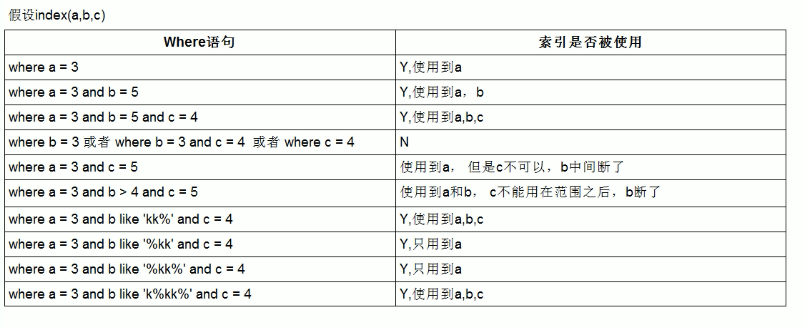

# MySQL 慢查询诊断、EXPLAIN ANALYZE 执行树与性能优化调优实战

---

## 1. 慢 SQL 发现与链路诊断体系

优化慢查询的第一步是建立从指标发现、日志采集、指纹归类到精准定位的完整诊断链路。

### 1.1 慢查询日志 (Slow Query Log) 生产配置

```ini
# my.cnf 生产级慢日志标准化配置
[mysqld]
slow_query_log = 1
slow_query_log_file = /var/log/mysql/mysql-slow.log
long_query_time = 0.2                     # 慢查询阈值: 超过 200 毫秒即记录
log_queries_not_using_indexes = 0         # 生产建议设为 0，防止小表频繁扫描撑爆磁盘
log_throttle_queries_not_using_indexes = 10
log_slow_admin_statements = 1             # 记录 DDL 慢指令 (如 ALTER TABLE, OPTIMIZE TABLE)
```

#### `pt-query-digest` 慢日志指纹分析
生产严禁人工直接翻阅数 GB 的文本日志，应使用 Percona 工具箱进行模板聚合分析：

```bash
# 汇总分析耗时最长的前 10 类慢 SQL 指纹报告
pt-query-digest /var/log/mysql/mysql-slow.log > /tmp/slow_report_$(date +%F).txt
```

---

## 2. MySQL 5.7 vs MySQL 8.0 性能分析与优化器全景对比

| 优化特性维度 | MySQL 5.7 | MySQL 8.0+ | 生产收益与调优演进 |
| :--- | :--- | :--- | :--- |
| **真实执行计划分析** | 仅支持静态预估的 `EXPLAIN` | **原生支持 `EXPLAIN ANALYZE`** | 真正执行并输出树状结构各算子的**真实耗时、循环次数与实际过滤行数** |
| **多表无索引连接算法** | 采用低效的 **Block Nested-Loop (BNL)** 块嵌套循环 | **引入 Hash Join**（8.0.18+ 彻底替代 BNL） | 大表等值 JOIN 速度**提升数倍至数十倍**，大幅减少 Buffer Pool 内存污染 |
| **动态参数声明优化器提示** | 仅支持有限的索引提示 (`FORCE/USE INDEX`) | **全面引入 Optimizer Hints** (如 `SET_VAR`, `RESOURCE_GROUP`) | 无需重启或修改全局参数，即可对单条慢 SQL 动态加大 `sort_buffer_size` 或绑定 CPU 核心 |
| **执行耗时跟踪 (Profiling)** | 使用 `SHOW PROFILE / PROFILES`（已过时废弃） | **基于 `performance_schema` 阶段监控** | 纳秒级追踪 SQL 各阶段（Parser, Init, Optimizing, Executing）耗时，无锁开销 |
| **数据分布统计** | 仅依赖 B+Tree 索引采样统计 | **支持直方图 (Histograms)** | 无索引列也能精准感知数据倾斜，杜绝因统计失真选错执行计划 |

---

## 3. EXPLAIN 与 EXPLAIN ANALYZE 深度解读



### 3.1 EXPLAIN 核心指标判定矩阵

#### 1. `type` 访问类型（按性能由优到劣排序）：

$$\text{system} > \text{const} > \text{eq\_ref} > \text{ref} > \text{range} > \text{index} > \text{ALL}$$

| `type` 级别 | 物理检索机制 | 生产合格评估 |
| :--- | :--- | :--- |
| **`system` / `const`** | 主键或唯一索引**等值查询**（`WHERE id=1`），仅读 1 行记录。 | **极佳 (微秒级)** |
| **`eq_ref`** | 多表 JOIN 时，从表关联列为主键或唯一索引，每行精准匹配 1 条。 | **极佳** |
| **`ref`** | 使用**非唯一普通二级索引等值匹配**（`WHERE buyer_id=10`）。 | **优秀** |
| **`range`** | **索引范围扫描**（使用 `>`, `<`, `BETWEEN`, `IN`, `LIKE 'A%'`）。 | **良好 (生产底线)** |
| **`index`** | **Full Index Scan**。虽然走了索引，但扫描了整个二级索引树叶子节点。 | **较差 (需重点关注)** |
| **`ALL`** | **Full Table Scan**。全表扫描聚簇索引所有数据页。 | **极差 (高危，必须治理)** |

---

#### 2. `Extra` 关键状态深度诊断

* **`Using index`**：**覆盖索引 (Covering Index)**。所需列直接从二级索引树获取，**无需回表**，性能极佳。
* **`Using index condition`**：使用了 **ICP (索引条件下推)**，在存储引擎层先过滤了部分索引列条件，大幅减少回表次数。
* **`Using where`**：Server 层收到引擎层返回的数据后，使用 `WHERE` 剩余条件再次过滤。
* **`Using filesort`**：无法利用索引完成排序，必须在内存（`sort_buffer`）或磁盘临时文件中进行额外排序（极度消耗 CPU）。
* **`Using temporary`**：使用内部临时表保存中间结果（常见于 `GROUP BY`, `DISTINCT`, `UNION`），严重拖慢查询。
* **`Using join buffer (hash join)`**：MySQL 8.0 采用基于内存的 Hash Join 处理无索引等值关联。

---

### 3.2 MySQL 8.0 `EXPLAIN ANALYZE` 真实执行树剖析

`EXPLAIN ANALYZE` 真正执行 SQL 并输出可视化的执行树：

```sql
EXPLAIN ANALYZE 
SELECT o.`id`, o.`total_amount` 
FROM `t_trade_order` o 
WHERE o.`buyer_id` = 10001 AND o.`total_amount` > 100.00;
```

#### 执行树样例输出与解读：

```text
-> Filter: (o.total_amount > 100.00)  (cost=1.10 rows=2) (actual time=0.042..0.055 rows=2 loops=1)
    -> Index lookup on o using idx_buyer_status (buyer_id=10001)  (cost=1.10 rows=2) (actual time=0.038..0.048 rows=2 loops=1)
```

* `actual time=0.038..0.048`：`0.038ms` 获取第 1 行匹配记录，`0.048ms` 获取所有满足条件的行。
* `rows=2`：该执行算子实际返回了 2 行。
* `loops=1`：该算子总共循环迭代了 1 次（若在 JOIN 嵌套中，loops 会显示实际迭代循环的总次数）。

---

## 4. MySQL 8.0 现代 Optimizer Hints 声明式调优实战

当优化器评估失真或需要针对特定批量 SQL 临时提升资源时，可使用 8.0 强大的 Optimizer Hints：

```sql
-- 1. 单查询动态临时调大 Sort Buffer，避免大排序落盘产生磁盘 I/O
SELECT /*+ SET_VAR(sort_buffer_size = 32M) */ * 
FROM `t_trade_order` 
ORDER BY `created_at` DESC;

-- 2. 强制多表关联采用 Hash Join 算法
SELECT /*+ HASH_JOIN(u, o) */ u.`name`, o.`order_no` 
FROM `t_user` u 
JOIN `t_trade_order` o ON u.`id` = o.`buyer_id`;

-- 3. 控制单条 SQL 最大执行超时时间 (毫秒)，防止异常大查询拖垮数据库
SELECT /*+ MAX_EXECUTION_TIME(2000) */ * 
FROM `t_trade_order` 
WHERE `ext_properties` LIKE '%coupon%';

-- 4. 强制指定索引与禁用特定索引
SELECT /*+ INDEX(o idx_buyer_status) NO_INDEX(o idx_seller_created) */ * 
FROM `t_trade_order` o 
WHERE `buyer_id` = 10001;
```

---

## 5. 高频生产慢 SQL 场景优化排障实战

### 5.1 超大表深分页极致优化 (`LIMIT 1000000, 20`)

```sql
-- 原始慢 SQL (引擎需扫描 1000020 行并回表，产生上百万次离散 I/O)
SELECT * FROM `t_trade_order` WHERE `order_status` = 1 ORDER BY `created_at` DESC LIMIT 1000000, 20;

-- 优化方案 1: 延迟关联 (先在二级索引上覆盖扫描主键，再与原表聚簇索引 JOIN)
SELECT o.* 
FROM `t_trade_order` o
INNER JOIN (
    SELECT `id` FROM `t_trade_order` 
    WHERE `order_status` = 1 
    ORDER BY `created_at` DESC 
    LIMIT 1000000, 20
) AS lim ON o.`id` = lim.`id`;

-- 优化方案 2: 游标寻址 (Seek Method - 记录上一页末尾记录的 ID)
SELECT * FROM `t_trade_order` 
WHERE `order_status` = 1 AND `id` < 89765432 
ORDER BY `id` DESC 
LIMIT 20;
```

---

### 5.2 `COUNT(*)` 性能深度剖析

1. **`COUNT(*)` vs `COUNT(1)` vs `COUNT(col)` 性能真相**：
   - 在 InnoDB 存储引擎中，`COUNT(*)` 与 `COUNT(1)` 底层执行路径**完全一致**。优化器会自动遍历最小的二级索引树来统计总行数，性能完全相同。
   - `COUNT(col)` 需要逐行提取字段并校验是否为 `NULL`，性能略逊于 `COUNT(*)`。
2. **大表全表 COUNT 优化**：
   - 生产若需秒级展示大表总数，推荐使用 Redis 维护计数器，或从 `information_schema.tables` 的 `TABLE_ROWS` 获取预估统计。

---

## 6. 关联导航与架构闭环

- B+Tree 索引底层与覆盖索引：[02-索引原理与优化.md](02-索引原理与优化.md)
- 锁机制、MVCC 与死锁排查：[03-事务与锁机制.md](03-事务与锁机制.md)
- 核心参数配置与 Buffer Pool 调优：[../03-运维与管理/06-参数调优与配置.md](../03-运维与管理/06-参数调优与配置.md)
- 线上 CPU 100% 应急止血 SOP：[../03-运维与管理/08-常见问题与故障排查.md](../03-运维与管理/08-常见问题与故障排查.md)

---

> [!TIP] 💡 关联技术与延伸阅读
>
> * [MySQL B+Tree 索引物理原理、高级特性与调优实战](./02-索引原理与优化.md)
> * [InnoDB 事务 ACID、MVCC 与锁相容矩阵深度剖析](./03-事务与锁机制.md)
> * [常见锁等待、慢查询故障排查与 CPU 100% 应急止血 SOP](../03-运维与管理/08-常见问题与故障排查.md)
> * [日常数据库健康巡检报告与自动化 Shell 脚本规范](../03-运维与管理/07-巡检报告与规范.md)
