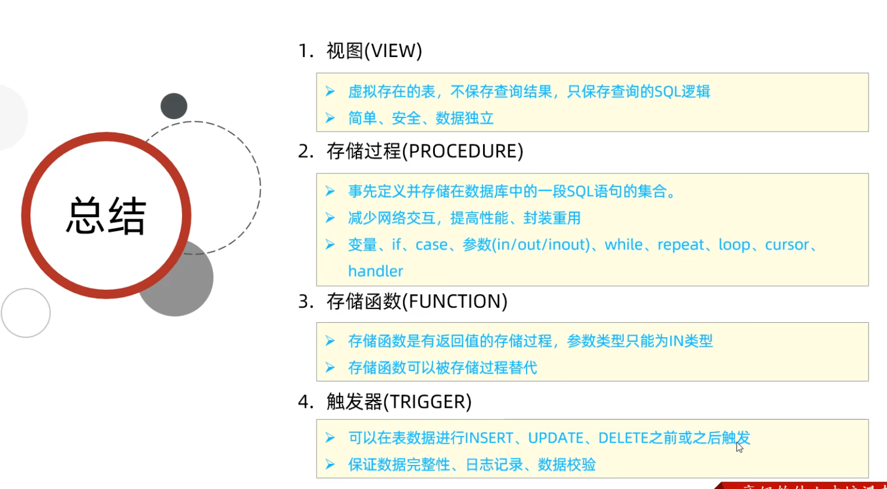

# MySQL 视图、存储过程、触发器与现代 JavaScript (9.0+) 扩展指南



---

## 1. 视图 (View) 架构与全生命周期运维

视图是基于 `SELECT` 语句动态生成的虚拟表（Virtual Table），本身不存储任何行数据（物化视图除外，MySQL 原生暂不支持标准物理物化视图）。在 MySQL 内部，优化器依据视图定义将其转化为对底层基表（Base Tables）的查询。

---

### 1.1 视图标准创建语法 (`CREATE [OR REPLACE] VIEW`)

#### 1. 完整语法树声明
```sql
CREATE [OR REPLACE]
    [ALGORITHM = {UNDEFINED | MERGE | TEMPTABLE}]
    [DEFINER = user]
    [SQL SECURITY { DEFINER | INVOKER }]
    VIEW view_name [(column_list)]
    AS select_statement
    [WITH [CASCADED | LOCAL] CHECK OPTION];
```

#### 2. 生产环境创建案例

* **场景 A：敏感字段脱敏与行级数据隔离视图**
```sql
-- 显式指定重命名字段列表，屏蔽底层明细密码、盐值等敏感信息
CREATE OR REPLACE 
ALGORITHM = MERGE
SQL SECURITY INVOKER
VIEW `v_user_profile` (`user_id`, `masked_phone`, `register_date`) AS
SELECT 
    `id`,
    CONCAT(LEFT(`phone`, 3), '****', RIGHT(`phone`, 4)),
    `created_at`
FROM `t_user`
WHERE `is_deleted` = 0;
```

* **场景 B：多表关联（JOIN）聚合统计视图**
```sql
-- 电商商家月度交易聚合看板视图
CREATE OR REPLACE 
ALGORITHM = TEMPTABLE
SQL SECURITY INVOKER
VIEW `v_seller_monthly_stat` AS
SELECT 
    s.`id` AS `seller_id`,
    s.`seller_name`,
    DATE_FORMAT(o.`created_at`, '%Y-%m') AS `stat_month`,
    COUNT(o.`id`) AS `total_orders`,
    IFNULL(SUM(o.`pay_amount`), 0.00) AS `total_revenue`
FROM `t_seller` s
LEFT JOIN `t_trade_order` o ON s.`id` = o.`seller_id` AND o.`order_status` = 3
GROUP BY s.`id`, s.`seller_name`, DATE_FORMAT(o.`created_at`, '%Y-%m');
```

---

### 1.2 视图三大算法内核 (`ALGORITHM = MERGE | TEMPTABLE | UNDEFINED`)

MySQL 优化器在编译解析视图时，根据指定的算法采取不同的物理执行策略：

```sql
-- 显式指定 MERGE 算法提升吞吐
CREATE ALGORITHM=MERGE VIEW `v_paid_order` AS 
SELECT `id`, `buyer_id`, `total_amount`, `created_at` 
FROM `t_trade_order` 
WHERE `order_status` = 1
WITH CHECK OPTION;
```

#### 视图算法横向对比

| 算法模式 | 物理执行机制 | 索引利用与性能 | 限制与触发条件 |
| :--- | :--- | :--- | :--- |
| **`MERGE`** | 优化器将视图定义与外部查询 SQL **直接在 AST 语法树层面进行文本/逻辑合并**，直接下推到底层源表执行。 | **极佳**（可直接利用源表聚簇/二级索引、MRR 及 ICP 索引下推）。 | 视图若包含 `GROUP BY`, `DISTINCT`, `LIMIT`, 窗口函数, 聚合函数或 `UNION` 时**无法使用**。 |
| **`TEMPTABLE`** | 先执行视图内部 SQL，将中间结果**物化（Materialize）到内存或磁盘临时表中**，再在临时表上执行外部过滤。 | **较差**（丢失源表索引，产生内存临时表分配与磁盘 I/O 开销）。 | 视图包含聚合计算、分组、去重时优化器自动降级采用。 |
| **`UNDEFINED`** (默认) | 让优化器根据 SQL 语义自主决定采用 `MERGE` 还是 `TEMPTABLE`。 | 自动优化 | 官方默认推荐值，优先尝试 `MERGE`。 |

> [!TIP] 💡 执行计划验证
> 使用 `EXPLAIN SELECT * FROM v_paid_order WHERE buyer_id = 10086;` 查看执行计划：
> * 若 `select_type` 显示为 **`SIMPLE`**，说明 `MERGE` 成功生效，基表索引下推正常；
> * 若 `select_type` 显示为 **`DERIVED`**，说明触发了 `TEMPTABLE` 派生表物化。

---

### 1.3 `WITH CHECK OPTION` 约束防线

当视图允许通过 DML（INSERT/UPDATE）修改底层基表数据时，`WITH CHECK OPTION` 强制要求所有写入或更新的数据必须满足视图自身的 `WHERE` 过滤条件，防止产生“插入成功但在该视图中却查不到”的数据幻象：

* **`CASCADED`（级联检查，默认值）**：
  不仅当前视图的 `WHERE` 条件必须满足，当前视图所依赖的所有底层视图的 `WHERE` 条件也**必须逐级全部通过**（哪怕底层视图未显式声明 CHECK OPTION）。
* **`LOCAL`（本地检查）**：
  只严格检查当前视图定义的 `WHERE` 条件；对于其依赖的底层视图，仅在底层视图自身也显式声明了 CHECK OPTION 时才进行检查。

```sql
-- 案例演示：基于状态过滤的受保护视图
CREATE OR REPLACE VIEW `v_vip_active_user` AS
SELECT `id`, `username`, `vip_level`, `status`
FROM `t_user`
WHERE `vip_level` >= 5 AND `status` = 'ACTIVE'
WITH CASCADED CHECK OPTION;

-- 尝试更新 status 会被直接拦截报错：
-- ERROR 1369 (HY000): CHECK OPTION failed 'prod_db.v_vip_active_user'
UPDATE `v_vip_active_user` SET `status` = 'BANNED' WHERE `id` = 101;
```

---

### 1.4 视图修改与热替换 (`ALTER VIEW` vs `CREATE OR REPLACE VIEW`)

当业务需求变更需要调整视图字段或查询逻辑时，MySQL 提供两种主流修改机制：

#### 1. 语法与用法对照
* **方式 A：`ALTER VIEW`**（必须要求视图已存在）
```sql
ALTER ALGORITHM = MERGE
SQL SECURITY INVOKER
VIEW `v_user_profile` (`user_id`, `masked_phone`, `register_date`, `user_status`) AS
SELECT `id`, CONCAT(LEFT(`phone`, 3), '****', RIGHT(`phone`, 4)), `created_at`, `status`
FROM `t_user`
WHERE `is_deleted` = 0;
```

* **方式 B：`CREATE OR REPLACE VIEW`**（幂等发布，存在则替换，不存在则新建，推荐 CI/CD 迁移采用）
```sql
CREATE OR REPLACE VIEW `v_user_profile` AS
SELECT `id` AS `user_id`, `nickname`, `created_at` AS `register_date`
FROM `t_user`
WHERE `is_deleted` = 0;
```

> [!WARNING] 生产环境元数据锁 (MDL) 阻塞风险
> 无论是 `ALTER VIEW` 还是 `CREATE OR REPLACE VIEW`，本质上都属于 DDL 操作：
> 1. 执行时必须获取视图本身以及**所有底层基表的元数据排他锁（`MDL Exclusive Lock`）**；
> 2. 如果基表当前有长事务慢查询（如导出未提交报表），修改视图的 DDL 会陷入 `Waiting for table metadata lock`，并进而引发后续所有读写基表业务线程全部堆积挂死！
> 3. **生产规程**：严禁在业务高峰期修改视图；必须配置会话级 `SET lock_wait_timeout = 5;` 实施快速失败保护。

---

### 1.5 视图元数据检查与逆向工程

在数据库维护中，常用以下方式检视视图的定义与属性：

```sql
-- 1. 查看视图创建 DDL 原始语句
SHOW CREATE VIEW `v_user_profile`\G

-- 2. 查看视图字段结构（与普通表行为完全一致）
DESCRIBE `v_user_profile`;
SHOW COLUMNS FROM `v_user_profile`;

-- 3. 查询系统字典，检索所有视图及其安全与可更新属性
SELECT 
    TABLE_SCHEMA,
    TABLE_NAME,
    VIEW_DEFINITION,
    CHECK_OPTION,
    IS_UPDATABLE,        -- YES: 可进行 DML 更新; NO: 只读视图
    DEFINER,
    SECURITY_TYPE        -- DEFINER 或 INVOKER
FROM information_schema.VIEWS
WHERE TABLE_SCHEMA = DATABASE() AND TABLE_NAME = 'v_user_profile';
```

---

### 1.6 视图删除与“悬空失效视图”排查治理

#### 1. 视图删除语法 (`DROP VIEW`)
```sql
-- 支持一次删除单个或多个视图，IF EXISTS 避免抛错中断自动化执行流
DROP VIEW IF EXISTS `v_temp_order_stat`, `v_paid_order`;
```

#### 2. 悬空失效视图（Dangling / Invalid Views）隐患与排查
* **产生原因**：MySQL 允许使用 `ALTER TABLE DROP COLUMN` 删除基表的某个字段，甚至直接 `DROP TABLE` 删除基表，而**不会主动校验下游依赖该表的视图**。此时，视图在数据字典中仍然残留，但一旦业务系统调用该视图，就会抛出致命错误：
  `ERROR 1356 (HY000): View 'xxx' references invalid table(s) or column(s) or function(s) or definer/invoker of view lack rights to use them`
* **DBA 自动化全库失效视图巡检方法**：
```sql
-- 检查指定视图是否损坏
CHECK TABLE `v_paid_order`;
-- 正常返回 Msg_type: status, Msg_text: OK
-- 损坏返回 Msg_type: Error, Msg_text: View '...' references invalid table...
```

---

### 1.7 可更新视图 (Updatable Views) 的 DML 判定边界

视图不仅能作为查询载体，在满足特定严苛条件下，还能作为 `INSERT`、`UPDATE`、`DELETE` 的写入通道：

#### 1. 允许进行 DML 更新的硬性限制矩阵

视图要想成为**可更新视图（Updatable View）**，视图的 `SELECT` 语句必须与底层基表的行存在**严格的 1 对 1 映射关系**。凡包含以下任一构造的视图，**全部绝对禁止 DML 更新**：

1. **聚合与统计函数**：`SUM()`, `MIN()`, `MAX()`, `COUNT()`, `AVG()` 等；
2. **去重与分组**：`DISTINCT`, `GROUP BY`, `HAVING`；
3. **集合操作**：`UNION`, `UNION ALL`；
4. **物化算法**：明确指定 `ALGORITHM = TEMPTABLE` 的视图；
5. **子查询限制**：`SELECT` 投影列表中包含子查询；
6. **窗口函数**：`ROW_NUMBER()`, `RANK()`, `DENSE_RANK()` 等；
7. **不可更新的底层视图**：`FROM` 引用了另一个不可更新的派生视图。

#### 2. 多表连接视图（JOIN Views）的更新红线
如果视图由多表 `JOIN` 构成，MySQL 允许在非常受限的情况下执行部分更新，但必须严格遵守以下法则：
* **只允许修改单一物理基表**：单条 `UPDATE` 语句中的所有 `SET` 列必须全部来自同一个物理底层表，**严禁跨表更新**。
* **绝对禁止 DELETE**：多表连接视图直接执行 `DELETE FROM view_name` 会直接报错，因为数据库无法确定应删除哪张关联表的记录。
* **INSERT 限制**：只能向单一基表插入，且未在视图中投影的基表字段必须具备默认值（DEFAULT）或允许为 NULL。

```sql
-- 验证视图是否允许更新（查询系统字典）
SELECT TABLE_NAME, IS_UPDATABLE 
FROM information_schema.VIEWS 
WHERE TABLE_NAME = 'v_user_profile';
-- 输出 YES 代表满足条件，可放心下发 UPDATE
```

---

### 1.8 视图权限管理与生产数据脱敏授权规程

在生产环境与企业级数据资产管理中，视图最核心的业务价值之一是**作为只读敏感数据脱敏的物理防线**。通过“仅对外部系统开放脱敏视图，彻底封锁底层物理表”实现数据最小化暴露：

#### 1. 视图特权级别与最小权限矩阵

针对视图的权限划分比基表更为精细，分为以下核心特权：

| 权限关键字 | 授权目标级别 | 业务操作能力 | 生产典型适用对象 |
| :--- | :--- | :--- | :--- |
| **`SELECT`** | `db.view_name` | 允许查询视图数据（最基础核心权限） | 大数据平台、只读报表分析、第三方调用账号 |
| **`SHOW VIEW`** | `db.view_name` | 允许执行 `SHOW CREATE VIEW` 查看视图结构与元数据 | 数据同步工具（如 Canal/Flink CDC）、ETL 调度账号 |
| **`CREATE VIEW`**| `db.*` / 全局 | 允许创建新视图（创建者需对基表具备特定权限） | 业务 DDL 部署账号、DBA 管理员 |
| **`DROP`** | `db.view_name` | 允许删除视图 | 业务架构迭代账号、DBA |
| **`INSERT / UPDATE`** | `db.view_name` | 允许向可更新视图写入/修改数据 | 具备受控写权限的特定接口账号 |

---

#### 2. 生产实战：第三方/大数据分析账号（以 `bigdata` 为例）精准赋权 SOP

以生产环境常见的需求“仅允许大数据用户 `bigdata` 查询业务结算明细脱敏视图 `emr.setl_detail_info`”为例，标准执行流程如下：

* **步骤 1：确认目标用户的 Host 主机范围**
  在赋权前，必须先核查目标用户在 `mysql.user` 中的实际主机模式（是 `%` 还是特定堡垒机/数据中心网段）：
  ```sql
  SELECT `user`, `host` FROM mysql.user WHERE `user` = 'bigdata';
  ```

* **步骤 2：针对单视图精准下发只读与元数据权限**
  ```sql
  -- 授予查询与查看视图定义权限（标准生产最佳实践）
  GRANT SELECT, SHOW VIEW ON `emr`.`setl_detail_info` TO 'bigdata'@'%';

  -- 刷新权限内存缓存（防止分布式连接节点权限延迟）
  FLUSH PRIVILEGES;
  ```

* **步骤 3：验证权限绑定结果**
  ```sql
  SHOW GRANTS FOR 'bigdata'@'%';
  -- 期望输出包含：
  -- GRANT SELECT, SHOW VIEW ON `emr`.`setl_detail_info` TO 'bigdata'@'%'
  ```

* **步骤 4：权限回收（生命周期结束或权限缩减）**
  ```sql
  REVOKE SELECT, SHOW VIEW ON `emr`.`setl_detail_info` FROM 'bigdata'@'%';
  FLUSH PRIVILEGES;
  ```

---

#### 3. `DEFINER` 机制在数据脱敏授权中的物理隔离防线

在为第三方平台授权视图时，理解 `DEFINER` 模式与权限继承是保障底层数据库安全的核心关键：

```
+------------------------------------+          +--------------------------------------+
| 大数据/分析用户 (如 'bigdata'@'%') |          | 视图: emr.setl_detail_info           |
| (仅分配: SELECT ON setl_detail_info| ───────► | DEFINER = 'dba_admin'@'localhost'    |
|  无底层物理表任何权限!              | 查询数据 | SQL SECURITY DEFINER (默认模式)      |
+------------------------------------+          +--------------------------------------+
                                                                   │
                                                                   │ 自动借用 DEFINER 凭证执行底层查询
                                                                   ▼
                                                +--------------------------------------+
                                                | 底层敏感物理基表 (emr.t_patient_info)|
                                                | (原始身份证、手机号、诊断敏感字段)   |
                                                | 外部分析用户无法直接 SELECT 绕过!    |
                                                +--------------------------------------+
```

* **`SQL SECURITY DEFINER`（推荐的脱敏隔离模式）**：
  * **优势**：用户 `bigdata` **只需要该视图的 `SELECT` 权限**，**绝对不需要底层物理基表的任何权限**！
  * **安全屏障**：由于 `bigdata` 账号没有底层基表的访问权，哪怕外部平台发生 SQL 注入或账号泄漏，攻击者也**无法直接查询底层物理基表**，成功阻断了全量拖库与明文隐私泄漏的风险。
* **`SQL SECURITY INVOKER`（调用者权限穿透模式）**：
  * 若视图定义为 `INVOKER`，则 `bigdata` 在查询该视图时，MySQL 会检查 `bigdata` 是否同时具备底层所有关联基表的 `SELECT` 权限；若无，则直接报错 `ERROR 1142 (42000): SELECT command denied`。因此在做跨部门数据脱敏视图交付时，通常采用专属管理账号作为 `DEFINER` 来实现权限解耦与封装。

---

## 2. MySQL 5.7 vs 8.0/9.0 视图与例程演进矩阵

| 特性维度 | MySQL 5.7 | MySQL 8.0 / 9.0+ | 生产收益与技术突破 |
| :--- | :--- | :--- | :--- |
| **多触发器执行顺序** | 不支持显式指定同一事件（如 `AFTER INSERT`）多个触发器的先后顺序 | 引入 **`PRECEDES` 与 `FOLLOWS`** 关键字 | 允许精准编排同一表上多个业务触发器的链式执行次序 |
| **元数据存储原子性** | 存储在 `.TRG` 和 MyISAM 系统表中，易发生元数据损坏 | **统一存入 InnoDB 数据字典**，变更具备事务原子性 | 彻底消除 `DROP/CREATE PROCEDURE` 中途断电引发的元数据脏状态 |
| **安全准入控制** | 依赖 `SUPER` 权限创建定义者为其他用户的对象 | 引入细粒度的 **`SET_USER_ID` 动态权限** | 剥离超级管理员权限，严防低权用户通过 `DEFINER` 进行垂直越权 |
| **现代语言存储过程** | 仅支持老旧的 SQL/PSM 过程化语言 | **MySQL 9.0+ 原生支持 JavaScript (MLE) 存储过程** | 允许使用标准 JS 语法与丰富生态处理复杂 JSON 解析与正则匹配 |

---

## 3. 存储过程 (Stored Procedure) 架构辩证与生产规范

### 3.1 存储过程语法与游标控制模板

```sql
DELIMITER //

CREATE PROCEDURE `proc_settle_monthly_bills`(
    IN `in_seller_id` BIGINT UNSIGNED,
    OUT `out_total_amount` DECIMAL(14,2)
)
SQL SECURITY INVOKER
BEGIN
    DECLARE `v_done` INT DEFAULT FALSE;
    DECLARE `v_amount` DECIMAL(12,2);
    
    -- 声明游标 (Cursor)
    DECLARE `cur_order` CURSOR FOR 
        SELECT `total_amount` 
        FROM `t_trade_order` 
        WHERE `seller_id` = `in_seller_id` AND `order_status` = 3;
    
    -- 声明异常捕获句柄 (Handler)
    DECLARE CONTINUE HANDLER FOR NOT FOUND SET `v_done` = TRUE;

    SET `out_total_amount` = 0.00;
    OPEN `cur_order`;

    settle_loop: LOOP
        FETCH `cur_order` INTO `v_amount`;
        IF `v_done` THEN
            LEAVE settle_loop;
        END IF;
        SET `out_total_amount` = `out_total_amount` + `v_amount`;
    END LOOP settle_loop;

    CLOSE `cur_order`;
END //

DELIMITER ;
```

---

### 3.2 现代互联网架构下的存储过程选型争论

> [!WARNING] 生产级核心架构准则
> 在大型互联网微服务与分布式云原生架构中，**原则上禁止在主库中编写复杂的业务存储过程与触发器**：
> 1. **算力扩容不对称**：应用服务节点（Java/Go/Node.js）可通过 Kubernetes 进行轻量化弹性秒级水平扩容；而数据库主库 CPU 是整个系统中最昂贵、最难水平分片的单点瓶颈。将业务逻辑放在 DB 会导致主库 CPU 瞬间被吃满。
> 2. **代码可观测性与 CI/CD 割裂**：存储过程隐藏在数据库黑盒中，难以进行版本控制、代码审查（Code Review）、自动化单元测试与线上灰度回滚。
> 3. **适用白名单场景**：仅推荐用于 DBA 内部离线运维巡检、历史冷数据分批归档与夜间自动化清理等纯管理脚本。

---

## 4. 触发器 (Trigger) 风险防范与执行次序编排 (8.0+)

### 4.1 触发器多事件顺序编排 (`PRECEDES` / `FOLLOWS`)

MySQL 8.0 允许在单张表上定义多个针对同一动作的触发器，并控制其执行先后：

```sql
-- 定义首个审计触发器
CREATE TRIGGER `trg_order_audit_first`
AFTER UPDATE ON `t_trade_order`
FOR EACH ROW
BEGIN
    -- 记录操作日志
    INSERT INTO `t_audit_log`(`table_name`, `action`, `row_id`) VALUES ('t_trade_order', 'UPDATE', NEW.id);
END;

-- 定义次级通知触发器：显式声明在 audit_first 之后执行 (FOLLOWS)
CREATE TRIGGER `trg_order_notify_second`
AFTER UPDATE ON `t_trade_order`
FOR EACH ROW
FOLLOWS `trg_order_audit_first`
BEGIN
    -- 执行后续逻辑
    INSERT INTO `t_notify_queue`(`order_no`) VALUES (NEW.order_no);
END;
```

---

## 5. MySQL 9.0 JavaScript (MLE) 动态语言存储过程

在 MySQL 9.0 (Multilingual Engine, MLE) 中，支持使用内置 JavaScript 引擎编写高性能存储例程：

```sql
-- MySQL 9.0+ JavaScript 存储例程
CREATE PROCEDURE proc_js_verify_order(IN json_payload VARCHAR(2000), OUT is_valid BOOLEAN)
AS LANGUAGE JAVASCRIPT AS $$
  try {
    const payload = JSON.parse(json_payload);
    is_valid = payload.hasOwnProperty("order_no") && Number(payload.amount) > 0;
  } catch (e) {
    is_valid = false;
  }
$$;
```

---

## 6. `DEFINER` vs `INVOKER` 权限提升漏洞与安全规避

* **`SQL SECURITY DEFINER`**：以创建者（通常为 DBA/root）的权限执行该例程。低权限用户调用时会发生**垂直提权**，存在高危越权访问敏感底表的风险。
* **`SQL SECURITY INVOKER`**：以当前调用者自身的权限执行该例程，符合最小权限原则。
* **生产防范规程**：业务视图与存储过程必须显式声明为 `SQL SECURITY INVOKER`，严禁绑定 `root` 作为生产对象的 `DEFINER`。

---

## 7. 关联导航与架构闭环

- SQL 语法内核与 DDL 算法：[../01-基础和原理/01-SQL基础与语法.md](../01-基础和原理/01-SQL基础与语法.md)
- 事务并发与行锁扩散分析：[03-事务与锁机制.md](03-事务与锁机制.md)
- 用户与权限管理及 DEFINER 提权防御：[../03-运维与管理/05-用户与权限管理.md](../03-运维与管理/05-用户与权限管理.md)

---

> [!TIP] 💡 关联技术与延伸阅读
>
> * [SQL 语法内核、在线 DDL 演进与 5.7/8.0 特性对比指南](../01-基础和原理/01-SQL基础与语法.md)
> * [InnoDB 事务 ACID、MVCC 与锁相容矩阵深度剖析](./03-事务与锁机制.md)
> * [MySQL 用户认证、动态权限、双密码与安全审计架构](../03-运维与管理/05-用户与权限管理.md)
> * [MySQL 慢查询诊断、EXPLAIN ANALYZE 执行树与性能优化](./04-性能分析与优化.md)
