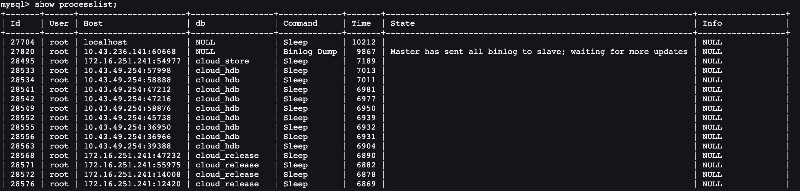
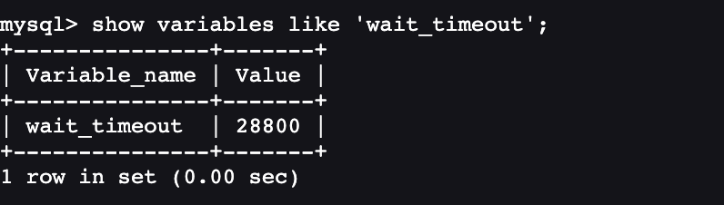
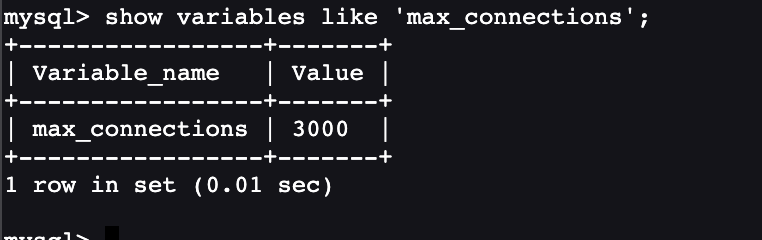

# MySQL 日常运维工具链、大表无锁 DDL 与故障应急实战







---

## 1. MySQL 5.7 vs MySQL 8.0 运维体系与工具全景对比

| 运维特性维度 | MySQL 5.7 | MySQL 8.0+ | 生产收益与运维提效 |
| :--- | :--- | :--- | :--- |
| **大表加列/删列 DDL** | 依赖第三方工具（`gh-ost` / `pt-osc`）或耗时巨大的 Inplace 重建 | **引入 Instant DDL（秒级完成，仅改元数据）** | 80% 以上的加列、删列与默认值变更不再需要复杂的第三方工具即可秒级搞定 |
| **集群从库初始化搭建** | 依赖 `mysqldump` 逻辑拉取或 `XtraBackup` 物理拷贝解压配置 | **内置 Clone Plugin (克隆插件)** | 在 SQL 层面单指令完成物理数据页快照拉取与新节点秒级初始化 |
| **实例在线安全重启** | 必须登录 Linux 宿主机通过 `systemctl restart mysqld` 外部重启 | **原生支持 SQL 语法 `RESTART;`** | 配合外部守护进程（systemd/mysqld_safe）实现纯 SQL 接口的安全重启 |
| **连接数打满紧急救援** | 仅依赖全局预留的 1 个 `SUPER` 连接名额（易被监控占用） | **引入独立管理端口 `admin_port` 与独立监听线程池** | 生产连接池被打爆时，DBA 依然能通过 33062 专用端口秒级登入排障 |
| **性能事件监控开销** | Performance Schema 内存占用与锁开销相对较高 | **经过内核重构优化，开销极低且默认全量开启** | 生产环境可安全长期开启，免除以往因担心性能损耗而关闭监控的顾虑 |

---

## 2. 连接数爆满 (`Too Many Connections`) 应急排障 SOP

当客户端抛出 `ERROR 1040 (HY000): Too many connections` 时，说明当前活跃+空闲连接已达 `max_connections` 上限。

### 2.1 应急登入与止血流程

```ini
# my.cnf 建议提前配置专用管理端口 (MySQL 8.0.14+)
[mysqld]
admin_address = '127.0.0.1'
admin_port = 33062
create_admin_listener_thread = ON
```

```bash
# 1. 使用专职 DBA 账号通过管理端口免排队登入
mysql -h 127.0.0.1 -P 33062 -u dba_admin -p
```

```sql
-- 2. 紧急临时调大最大连接数上限 (为后续业务恢复留出缓冲)
SET GLOBAL max_connections = 3000;

-- 3. 批量生成清理空闲超过 5 分钟的 Sleeping 连接脚本
SELECT CONCAT('KILL ', id, ';') 
FROM information_schema.processlist 
WHERE command = 'Sleep' AND time > 300 AND info IS NULL;

-- 4. 重点排查占用锁资源导致堆积的源头线程
SELECT * FROM sys.innodb_lock_waits;
-- 杀掉源头阻塞线程: KILL <blocking_trx_mysql_thread_id>;
```

---

## 3. 百 G 级大表无锁 DDL：`gh-ost` vs `pt-online-schema-change`

在百 G 级甚至 TB 级大表上执行 DDL 时，若无法使用 Instant DDL（如修改列类型、字符集转换等），必须借助专业在线 DDL 工具：

```
gh-ost 无触发器工作流
  [原业务表 t_trade_order] ──────────────────────► [幽灵表 _t_trade_order_gho]
            │                                                 ▲
            │ (生产并发 DML 写入)                              │ (模拟从库异步读取重放)
            ▼                                                 │
  [主库/从库 Binlog Stream] ───► [gh-ost 伪装 Replica 抓取] ───┘
```

### 3.1 `gh-ost` vs `pt-online-schema-change` 选型对比

| 核心维度 | `pt-online-schema-change` (Percona) | `gh-ost` (GitHub 开源) |
| :--- | :--- | :--- |
| **数据同步机制** | **基于 Triggers 触发器** (`AFTER INSERT/UPDATE/DELETE`) | **基于 Binlog Stream 监听流** (完全无触发器) |
| **对业务的影响** | 触发器在高并发写入下会加剧行锁争用，极易诱发**死锁与锁等待雪崩** | **对原表零触发器开销**，仅有轻量级只读/行迁移压力 |
| **流控与暂停能力** | 无法动态暂停（若需终止必须删除触发器手工回滚） | **支持动态 Throttle 暂停与恢复 (`echo throttle > /tmp/gh-ost.socket`)** |
| **主从延迟感知** | 依赖固定轮询检测从库延迟 | **实时监听从库延迟并自动降速**，杜绝拖垮从库复制 |

#### `gh-ost` 生产标准执行指令：

```bash
gh-ost \
  --user="dba_admin" \
  --password="Secure#Password_2026" \
  --host="192.168.10.101" \
  --database="prod_trade_db" \
  --table="t_trade_order" \
  --alter="ADD COLUMN ext_status TINYINT NOT NULL DEFAULT '0'" \
  --chunk-size=2000 \
  --max-lag-millis=1500 \
  --cut-over=default \
  --allow-on-master \
  --execute
```

---

## 4. MySQL 8.0 Clone Plugin (秒级物理从库搭建)

Clone Plugin 允许直接在 SQL 层面从远程节点拉取 InnoDB 物理数据页快照，实现秒级/分钟级从库克隆：

```sql
-- 1. 在捐赠节点 (Donor) 与接收节点 (Recipient) 分别安装插件
INSTALL PLUGIN clone SONAME 'ha_clone.so';

-- 2. 在接收节点发起一键克隆 (从 192.168.10.101 捐赠节点全量克隆)
CLONE INSTANCE FROM 'clone_user'@'192.168.10.101':3306 
IDENTIFIED BY 'ClonePass#2026_Secure';
```

> [!NOTE] 克隆内部流程
> 执行 `CLONE INSTANCE` 后，接收端会自动清空本地旧表空间，建立流式数据页传输通道，拉取 Redo Log 与当前精确 GTID 位点并重启实例，自动化完成全套物理初始化。

---

## 5. 多线程高效备份恢复：`mydumper` & `myloader`

针对单表几十 G 的场景，单线程的 `mysqldump` 极其缓慢，生产推荐基于 C 语言多线程的 `mydumper`：

```bash
# 1. 多线程并发导出 (指定 8 线程，每 10 万行分块切片，开启 gzip 压缩)
mydumper \
  -u dba_admin -p "Secure#Password_2026" -h 127.0.0.1 -P 3306 \
  -B prod_trade_db -T t_trade_order \
  -o /data/backup/mydumper_trade_$(date +%F) \
  -t 8 -r 100000 -c --less-locking

# 2. 多线程并发极速恢复导入 (8 线程并发注入)
myloader \
  -u dba_admin -p "Secure#Password_2026" -h 127.0.0.1 -P 3306 \
  -B prod_trade_db \
  -d /data/backup/mydumper_trade_$(date +%F) \
  -t 8 -o
```

---

## 6. 关联导航与架构闭环

- 慢 SQL 优化与 EXPLAIN 分析：[../02-进阶特性/04-性能分析与优化.md](../02-进阶特性/04-性能分析与优化.md)
- 主从高可用与 Orchestrator 集群：[02-主从复制与高可用.md](02-主从复制与高可用.md)
- XtraBackup 物理备份与恢复：[04-数据备份与恢复.md](04-数据备份与恢复.md)
- 自动化巡检与指标阈值：[07-巡检报告与规范.md](07-巡检报告与规范.md)

---

> [!TIP] 💡 关联技术与延伸阅读
>
> * [Percona XtraBackup 物理热备与基于 Binlog 的精准恢复 (PITR)](./04-数据备份与恢复.md)
> * [常见死锁排查、慢 SQL 定位与 CPU 100% 应急止血 SOP](./08-常见问题与故障排查.md)
> * [日常数据库健康巡检报告与自动化 Shell 脚本规范](./07-巡检报告与规范.md)
> * [MySQL 核心参数调优、OS 内核优化与生产配置模板](./06-参数调优与配置.md)
