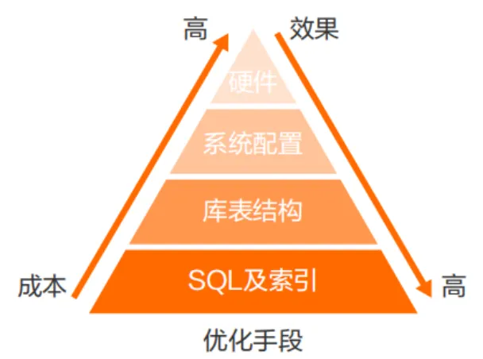

# MySQL 核心参数调优、OS 内核优化与生产配置模板指南



---

## 1. MySQL 5.7 vs MySQL 8.0 参数体系全景对比矩阵

| 参数对比维度 | MySQL 5.7 默认值 / 机制 | MySQL 8.0+ 默认值 / 机制 | 生产配置建议与迁移注意 |
| :--- | :--- | :--- | :--- |
| **参数在线持久化** | 仅支持 `SET GLOBAL`（重启丢失，必须手工修改 `my.cnf`） | **原生支持 `SET PERSIST`**（持久化写入 `data/mysqld-auto.cnf`） | 生产推荐使用 `SET PERSIST` 管理动态配置变更，消除漏改配置文件的隐患 |
| **默认字符集与 Collation** | `latin1` / `latin1_swedish_ci` | **`utf8mb4` / `utf8mb4_0900_ai_ci`** | 统一国际化标准，无需再手动指定 `character-set-server` |
| **默认认证插件** | `mysql_native_password` | **`caching_sha2_password`** | 安全性大幅提升，老旧客户端连接需确保驱动版本兼容 |
| **查询缓存 (Query Cache)** | 支持 `query_cache_type` 与 `query_cache_size` | **参数被彻底移除 (Removed)** | 8.0 配置文件中若仍保留 `query_cache_*` 参数会导致实例启动报错 |
| **文件格式参数** | `innodb_file_format = Barracuda` | **参数被废弃并移除** | 8.0 统一采用 Barracuda 规范，移除冗余配置 |
| **Binlog 过期清理** | `expire_logs_days`（单位：天，默认 0 不清理） | **`binlog_expire_logs_seconds`**（单位：秒，默认 2592000 即 30 天） | 生产建议设为 `604800`（7 天）以节约磁盘 |
| **自增锁默认模式** | `innodb_autoinc_lock_mode = 1` (Consecutive) | **`innodb_autoinc_lock_mode = 2` (Interleaved)** | 与 Binlog Row 格式天然兼容，大幅消除批量插入时的表级自增锁竞争 |
| **Redo Log 容量参数** | `innodb_log_file_size` 与 `innodb_log_files_in_group` | **8.0.30+ 引入 `innodb_redo_log_capacity`** | 支持在线动态调整 Redo 日志总容量，无需停机 |

---

## 2. 核心参数分类深度解析

### 2.1 连接与超时相关参数 (Connection & Timeout)

* **`max_connections` (最大连接限制)**：
  - *生产建议*：建议设为 `1000 ~ 3000`。每个连接线程均占用 Stack 栈内存，结合物理内存精准规划，防止突发流量引发 OOM。
* **`max_user_connections` (单用户最大连接限制)**：
  - *生产建议*：建议设为 `max_connections` 的 80%~90%，为专职 DBA 管理账号留出紧急登录通道。
* **`wait_timeout` & `interactive_timeout` (连接空闲超时)**：
  - *生产建议*：默认 28800 秒（8 小时）过长，生产**强烈建议调低至 `1800 ~ 3600`（30 分钟 ~ 1 小时）**，防止业务端连接池泄漏积累大量 Sleep 僵尸连接。
* **`back_log` (TCP 连接溢出队列)**：
  - *生产建议*：高并发高吞吐系统建议设为 `1000 ~ 2000`。

---

### 2.2 InnoDB 内存与 I/O 核心参数

* **`innodb_buffer_pool_size` (缓冲池总大小)**：
  - *生产建议*：专职数据库物理服务器建议配置为**物理内存的 60% ~ 75%**（为 OS 内核与会话连接预留 25%）。
* **`innodb_buffer_pool_instances` (缓冲池分区实例数)**：
  - *生产建议*：当 Buffer Pool 大于 8GB 时，建议设为 `8` 或 `16`，将全局缓冲池分片管理，大幅减少并发读写时的 Mutex 锁竞争。
* **`innodb_io_capacity` & `innodb_io_capacity_max` (刷盘 IOPS 限制)**：
  - *生产建议*：根据磁盘介质配置：SATA SSD 设为 `2000 / 4000`；企业级 NVMe SSD 设为 `10000 / 20000`。
* **`innodb_max_dirty_pages_pct` (脏页占比刷盘上限)**：
  - *生产建议*：默认 `75%`，高写入系统可微调为 `65% ~ 75%`，防止 Checkpoint 延迟过大触发强制同步刷盘。

---

### 2.3 日志与刷盘安全参数 (双一安全基线)

* **`innodb_flush_log_at_trx_commit` (Redo Log 刷盘控制)**：
  - `1` (生产强制)：每次事务提交均触发 `fsync()` 刷盘，满足严格 ACID 物理持久性，零数据丢失。
* **`sync_binlog` (Binlog 刷盘控制)**：
  - `1` (生产强制)：每次事务提交强制将 Binlog 刷入磁盘，保障崩溃恢复与主从复制一致性。

---

## 3. MySQL 8.0 `SET PERSIST` 持久化参数实战

```sql
-- 1. 在线修改全局参数并持久化写入 mysqld-auto.cnf (重启依然生效)
SET PERSIST innodb_lock_wait_timeout = 15;
SET PERSIST max_connections = 2500;

-- 2. 仅持久化写入配置文件，不改变当前正在运行的内存值 (适合只读参数)
SET PERSIST_ONLY ft_min_word_len = 3;

-- 3. 查看当前已持久化保存的参数列表
SELECT * FROM performance_schema.persisted_variables;

-- 4. 清除特定参数的持久化状态 (还原为由 my.cnf 控制)
RESET PERSIST innodb_lock_wait_timeout;
```

---

## 4. Linux OS 宿主机内核级调优黄金参数

1. **关闭透明大页 (Transparent Huge Pages, THP)**：
   ```bash
   echo never > /sys/kernel/mm/transparent_hugepage/enabled
   echo never > /sys/kernel/mm/transparent_hugepage/defrag
   ```
2. **调低 SWAP 换页倾向 (`vm.swappiness`)**：
   ```sysctl
   # /etc/sysctl.conf
   vm.swappiness = 1
   vm.dirty_ratio = 10
   vm.dirty_background_ratio = 5
   ```
3. **NUMA 架构内存交叉绑定 (`numactl`)**：
   在 systemd 中配置 mysqld 启动参数：`ExecStart=/usr/bin/numactl --interleave=all /usr/sbin/mysqld ...`，杜绝单 Node 内存满引发 SWAP 抖动。
4. **文件描述符限制与挂载选项**：
   挂载 MySQL 数据盘时使用 `noatime,nodiratime` 选项；设置 `ulimit -n 655350`。

---

## 5. 生产环境 `my.cnf` 标准模板样例

### 5.1 4核 16G 标准生产实例配置模板

```ini
[mysqld]
# 基础目录与网络
user = mysql
port = 3306
datadir = /data/mysql/data
socket = /data/mysql/data/mysql.sock
character-set-server = utf8mb4
collation-server = utf8mb4_0900_ai_ci
skip-name-resolve = 1

# 专用管理端口 (8.0+)
admin_address = 127.0.0.1
admin_port = 33062
create_admin_listener_thread = ON

# 连接与并发
max_connections = 1500
max_user_connections = 1350
back_log = 1000
wait_timeout = 3600
interactive_timeout = 3600

# InnoDB 核心配置
innodb_buffer_pool_size = 11G
innodb_buffer_pool_instances = 8
innodb_thread_concurrency = 8
innodb_lock_wait_timeout = 15
innodb_io_capacity = 4000
innodb_io_capacity_max = 8000

# 双一强安全与日志
innodb_flush_log_at_trx_commit = 1
sync_binlog = 1
binlog_format = ROW
binlog_expire_logs_seconds = 604800
max_binlog_size = 1G

# 会话专属内存隔离
sort_buffer_size = 1M
join_buffer_size = 1M
read_buffer_size = 512K
read_rnd_buffer_size = 1M
tmp_table_size = 64M
max_heap_table_size = 64M
```

---

## 6. 关联导航与架构闭环

- 存储引擎与 Buffer Pool 内存：[../02-进阶特性/01-存储引擎与InnoDB.md](../02-进阶特性/01-存储引擎与InnoDB.md)
- 日志系统与双一刷盘原理：[01-日志管理.md](01-日志管理.md)
- 主从高可用与 MTS 配置：[02-主从复制与高可用.md](02-主从复制与高可用.md)
- 巡检规范与参数合规检查：[07-巡检报告与规范.md](07-巡检报告与规范.md)

---

> [!TIP] 💡 关联技术与延伸阅读
>
> * [InnoDB 存储引擎物理架构、内存池与内核机制深度解析](../02-进阶特性/01-存储引擎与InnoDB.md)
> * [MySQL 物理/逻辑日志系统、两阶段提交与组提交内核](./01-日志管理.md)
> * [日常数据库健康巡检报告与自动化 Shell 脚本规范](./07-巡检报告与规范.md)
> * [常见锁等待、慢查询故障排查与 CPU 100% 应急止血 SOP](./08-常见问题与故障排查.md)
