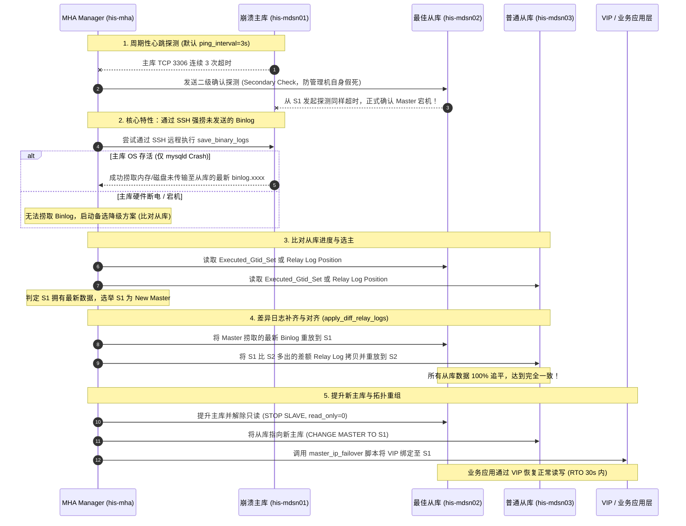

# MySQL MHA 高可用集群架构原理与生产落地实战指南

## 一、 核心定位与业务背景

**MHA（Master High Availability Manager and tools for MySQL）** 是由前 DeNA 日本工程师 Yoshinori Matsunobu 开发的高可用自动化切换工具集，曾是 MySQL 5.5 / 5.6 / 5.7 时代乃至如今大量企业级专有物理机基础设施中，**应用最为广泛、成熟稳定的 MySQL 主从高可用架构方案**。

在大型医疗信息化（HIS）、银行前置机、核心数据中心等严苛场景中，数据库往往以物理机集群的形式独立于容器云之外部署。MHA 能够在主库（Master）发生硬件损坏、内核死锁或网络断连时，**在 10~30 秒内自动完成主库探测、差异日志挽救、从库选举、数据对齐、VIP 漂移并通知报警**，最大限度保障业务 RTO（恢复时间目标）与 RPO（数据恢复点目标）。

---

## 二、 MHA 核心组件与拓扑架构

MHA 架构由管理端（Manager）与数据端（Node）两大组件构成，底层通过 Perl 脚本、MySQL 协议与 SSH 免密通信协同工作：

```text
                               ┌──────────────────────────────────────────────┐
                               │           MHA Manager 管理机 (Node)          │
                               │               (如 his-mha: 192.168.190.44)   │
                               │                                              │
                               │  - masterha_manager (守护进程)               │
                               │  - masterha_check_ssh (SSH 连通性探测)       │
                               │  - masterha_check_repl (主从复制链路探测)    │
                               │  - masterha_master_switch (故障/计划切换器)  │
                               └──────────────────────┬───────────────────────┘
                                                      │ SSH 免密隧道 + TCP 3306 探测
               ┌──────────────────────────────────────┼──────────────────────────────────────┐
               │                                      │                                      │
               ▼                                      ▼                                      ▼
┌─────────────────────────────┐        ┌─────────────────────────────┐        ┌─────────────────────────────┐
│ his-mdsn01 (192.168.190.41) │        │ his-mdsn02 (192.168.190.42) │        │ his-mdsn03 (192.168.190.43) │
│ 【当前主库 Master】          │        │ 【备选主库 Candidate Master】│        │ 【从库 Standby Slave】       │
│  - 挂载业务 VIP (192...200) │        │  - 开启 log-slave-updates   │        │  - 开启只读 read_only=1     │
│  - 安装 mha4mysql-node 工具  │        │  - 安装 mha4mysql-node 工具  │        │  - 安装 mha4mysql-node 工具  │
└─────────────────────────────┘        └─────────────────────────────┘        └─────────────────────────────┘
```

### 1. 组件职责矩阵

| 组件名称 | 部署位置 | 核心命令行与脚本 | 职责与技术定位 |
| :--- | :--- | :--- | :--- |
| **MHA Manager** | 独立仲裁机 / 监控机 | `masterha_manager`<br>`masterha_check_ssh`<br>`masterha_check_repl`<br>`masterha_master_switch`<br>`masterha_stop` | **集群大脑**。定期轮询 Master 存活状态；发生宕机时执行选主、日志补齐、调用外部 VIP 切换脚本及发出告警。 |
| **MHA Node** | 所有被纳管的 MySQL 实例宿主机（Master 与所有 Slaves） | `save_binary_logs`<br>`apply_diff_relay_logs`<br>`filter_mysqlbinlog`<br>`purge_relay_logs` | **底层执行手**。提供核心 Perl 模块，负责在本地执行差异日志提取、中继日志（Relay Log）分析与补齐，以及定时清理废弃 Relay Log。 |

---

## 三、 MHA 故障切换（Failover）状态机深度推演

MHA 之所以能够被称为**最大数据保护（Maximum Data Protection）**高可用方案，关键在于其独特的 **“强捞 Binlog”** 与 **“从库日志差额重放”** 机制。

### 1. 完整切换时序时空流转



### 2. 核心源码级工具机理解析

1. **`save_binary_logs`（强捞日志）**：
   - 当 Master 的 `mysqld` 进程崩溃，但操作系统网络依然可连时，从库可能还未接收到最后的几个事务。
   - Manager 此时通过 SSH 远程登录 Master，根据所有从库中最大的已接收位点（`Read_Master_Log_Pos`），读取 Master 物理磁盘上的 Binlog 文件，**精准截取从库尚未接收的这部分 Event**，存为临时文件传回 Manager。
2. **`apply_diff_relay_logs`（差额补齐）**：
   - 多个从库由于网络延迟，接收到的 Relay Log 往往长短不一。
   - MHA 不会简单粗暴地将最新从库提升，而是提取最快从库多出的 Relay Log，通过 `mysqlbinlog` 工具解析后，追加应用到较慢的从库中，**确保切换后集群内部零数据分叉**。

---

## 四、 MHA 生产环境标准化部署 SOP

以下以经典生产环境（三节点主从 + 一台管理机）为例进行全流程复盘：

### 1. 基础环境规划与软件版本

| 主机名 | IP 地址 | 角色 | 部署软件 |
| :--- | :--- | :--- | :--- |
| `his-mha` | `192.168.190.44` | MHA Manager / 仲裁机 | `mha4mysql-manager`, `mha4mysql-node`, node-exporter |
| `his-mdsn01` | `192.168.190.41` | MySQL Master (当前主库) | MySQL 5.7 / 8.0, `mha4mysql-node`, node-exporter |
| `his-mdsn02` | `192.168.190.42` | MySQL Slave (候选主库) | MySQL 5.7 / 8.0, `mha4mysql-node`, node-exporter |
| `his-mdsn03` | `192.168.190.43` | MySQL Slave (普通从库) | MySQL 5.7 / 8.0, `mha4mysql-node`, node-exporter |
| **VIP** | `192.168.190.200` | 业务读写虚拟 IP | 动态漂移挂载 |

### 2. 前置依赖与双向 SSH 免密配置

MHA 极度依赖 SSH 命令执行，**必须建立 Manager 到所有 Node、以及所有 Node 彼此之间的双向互信**：

```bash
# 1. 所有节点安装基础 Perl 依赖 (以 CentOS/RHEL 为例)
yum install -y perl-DBD-MySQL perl-Config-Tiny perl-Log-Dispatch perl-Parallel-ForkManager perl-Time-HiRes nc

# 2. 生成密钥并分发 (所有机器执行 ssh-keygen 并汇总到 authorized_keys)
ssh-keygen -t rsa -N "" -f ~/.ssh/id_rsa

# 3. 核心生产配置：关闭严格主机密钥检查 (防止首次登录弹窗确认挂死脚本)
cat << 'EOF' >> ~/.ssh/config
Host *
  StrictHostKeyChecking no
  UserKnownHostsFile /dev/null
EOF
chmod 600 ~/.ssh/config
```

### 3. MySQL 数据库权限配置

在主库创建专用管理账号与复制账号（会自动同步至从库）：

```sql
-- 1. 创建 MHA 专有探测与切换账号
CREATE USER 'mha'@'192.168.190.%' IDENTIFIED BY 'MhaPass#2026_Secure';
GRANT ALL PRIVILEGES ON *.* TO 'mha'@'192.168.190.%';

-- 2. 创建主从复制账号
CREATE USER 'repl'@'192.168.190.%' IDENTIFIED BY 'ReplPass#2026_Secure';
GRANT REPLICATION SLAVE ON *.* TO 'repl'@'192.168.190.%';

FLUSH PRIVILEGES;
```

### 4. 安装 MHA 软件包

```bash
# 在所有节点 (包含 Manager 与 Node) 安装 Node 包:
rpm -ivh mha4mysql-node-0.58-0.el7.noarch.rpm

# 仅在 Manager 管理机 (his-mha) 额外安装 Manager 包:
rpm -ivh mha4mysql-manager-0.58-0.el7.noarch.rpm
```

### 5. Manager 生产级配置文件 (`/etc/mha/app1.cnf`)

```ini
[server default]
user=mha
password=MhaPass#2026_Secure
ssh_user=root
repl_user=repl
repl_password=ReplPass#2026_Secure

# 生产工作目录与日志
manager_workdir=/var/log/masterha/app1
manager_log=/var/log/masterha/app1/manager.log
remote_workdir=/var/log/masterha/app1

# 关键故障切换脚本与报警脚本
master_ip_failover_script=/usr/local/bin/master_ip_failover
report_script=/usr/local/bin/send_report

# 故障检测与探测间隔
ping_interval=3
ping_type=SELECT
secondary_check_script=masterha_secondary_check -s 192.168.190.42 -s 192.168.190.43

# 优雅平滑切主支持
master_ip_online_change_script=/usr/local/bin/master_ip_failover

# ----------------- 数据库节点清单 -----------------
[server1]
hostname=192.168.190.41
port=3306
# 候选主库优先级权重 (越小越优先)
candidate_master=1

[server2]
hostname=192.168.190.42
port=3306
candidate_master=1

[server3]
hostname=192.168.190.43
port=3306
# 设置为 1 表示该节点仅作为从库读取，永远不提升为 Master
no_master=1
```

---

## 五、 核心生产切换脚本实现 (`master_ip_failover`)

VIP 漂移脚本是保障业务无感知切换的“最后一公里”。必须具备**释放旧主 VIP、绑定新主 VIP、发送免费 ARP（Gratuitous ARP）刷新机房交换机缓存**的能力：

```bash
#!/usr/bin/env bash
# 生产级 master_ip_failover 切换脚本 (/usr/local/bin/master_ip_failover)
set -e

VIP="192.168.190.200/24"
VIP_IP="192.168.190.200"
NET_DEV="eth0"

# MHA 会传递标准参数：--command=stop|start|status
for arg in "$@"; do
  case $arg in
    --command=*) COMMAND="${arg#*=}" ;;
    --orig_master_host=*) ORIG_MASTER_HOST="${arg#*=}" ;;
    --new_master_host=*) NEW_MASTER_HOST="${arg#*=}" ;;
  esac
done

case "$COMMAND" in
  stop|stopssh)
    # 步骤 1: 故障切换前，尽最大努力卸载旧主库上的 VIP (防止双主脑裂)
    echo "De-allocating VIP on old master ($ORIG_MASTER_HOST)..."
    ssh -o ConnectTimeout=3 -o StrictHostKeyChecking=no root@$ORIG_MASTER_HOST \
      "ip addr del $VIP dev $NET_DEV || true"
    exit 0
    ;;

  start)
    # 步骤 2: 将 VIP 绑定至选出的新主库
    echo "Allocating VIP to new master ($NEW_MASTER_HOST)..."
    ssh -o ConnectTimeout=5 -o StrictHostKeyChecking=no root@$NEW_MASTER_HOST \
      "ip addr add $VIP dev $NET_DEV && arping -q -c 3 -A -I $NET_DEV $VIP_IP"
    echo "VIP successfully migrated to $NEW_MASTER_HOST."
    exit 0
    ;;

  status)
    echo "Checking VIP status..."
    exit 0
    ;;

  *)
    echo "Usage: $0 --command=start|stop|stopssh|status"
    exit 1
    ;;
esac
```

---

## 六、 运维规程与日常管理 SOP

### 1. 预检命令（上线前与变更后必跑）

```bash
# 1. 校验全节点 SSH 免密连通性
masterha_check_ssh --conf=/etc/mha/app1.cnf
# 预期输出: [info] All SSH connection tests passed successfully.

# 2. 校验 MySQL 主从复制链路与参数合规性
masterha_check_repl --conf=/etc/mha/app1.cnf
# 预期输出: [info] MySQL Replication Health is OK.
```

### 2. 启动与停止 Manager

```bash
# 后台常驻启动 Manager 监控进程
nohup masterha_manager --conf=/etc/mha/app1.cnf --remove_dead_master_conf_file > /var/log/masterha/app1/manager_start.log 2>&1 &

# 查看当前监控状态
masterha_check_status --conf=/etc/mha/app1.cnf
# 正常状态输出: app1 (pid: 1234) is running(0:PING_OK), master: 192.168.190.41

# 安全停止 Manager
masterha_stop --conf=/etc/mha/app1.cnf
```

### 3. 计划内平滑维护切主（零业务中断滚动维护）

在计划升级数据库或维护物理机时，**严禁直接杀主库进程**，必须使用 MHA 的在线切换命令：

```bash
masterha_master_switch \
  --conf=/etc/mha/app1.cnf \
  --master_state=alive \
  --new_master_host=192.168.190.42 \
  --orig_master_is_new_slave
```
- MHA 会在旧主库上自动执行 `SET GLOBAL read_only=1;` 阻断写流量，等待从库回放追平，迁移 VIP，最后将旧主变为新主的从库，全程耗时通常小于 3 秒。

### 4. 故障后原主库修复重入集群 SOP

当原主库 `192.168.190.41` 修复好并开机后，**千万不能直接启动并对外提供服务**，必须降级为从库重新归队：

```bash
# 步骤 1: 确保只读保护开启
echo "read_only = 1" >> /etc/my.cnf
systemctl start mysqld

# 步骤 2: 将原主库指向当前运行的新主库 (192.168.190.42)
mysql -uroot -p -e "
CHANGE MASTER TO
  MASTER_HOST='192.168.190.42',
  MASTER_PORT=3306,
  MASTER_USER='repl',
  MASTER_PASSWORD='ReplPass#2026_Secure',
  MASTER_AUTO_POSITION=1;
START SLAVE;
SHOW SLAVE STATUS\G
"

# 步骤 3: 恢复 /etc/mha/app1.cnf 中已剔除的节点段，并重启 MHA Manager 进程
nohup masterha_manager --conf=/etc/mha/app1.cnf &
```

---

## 七、 生产避坑指南与高频极限排障

### 1. 脑裂（Split-Brain）与 VIP 双挂陷阱
- **现象**：旧主库发生瞬间网络抖动，Manager 触发 Failover 将 VIP 绑定至新主库；但旧主库并未真正死机且仍有客户端长连接直连物理 IP 写入，造成双写冲突。
- **治理红线**：
  1. 必须在 `master_ip_failover` 的 `stop` 阶段配置强行关机或通过 IPMI / 远程电源管理（PDU/STONITH）物理切断旧主供电；
  2. 生产数据库实例的 `my.cnf` 中必须加入自动重置只读脚本，或由应用层引入代理层校验。

### 2. 传统异步复制丢数据？最佳搭档：半同步复制 (Semi-Sync)
- 许多人误以为使用 MHA 就能 100% 不丢数据。实际上，**如果主库硬件彻底断电（连 SSH 都无法进入），且未开启半同步复制，最后未发送的 Binlog 就会彻底丢失！**
- **生产终极拍档**：**MHA + MySQL Lossless 半同步复制（`rpl_semi_sync_master_wait_point = AFTER_SYNC`）**。主库只有在收到至少一台从库写入 Relay Log 的 Ack 确认后才向业务提交事务，确保即便 Master 主机物理爆炸，从库中也必定有完整的数据！

### 3. Relay Log 被过度清理导致重放失败
- 默认情况下 MySQL 会自动删除回放完的 Relay Log。但在 MHA 切换过程中，较慢的从库需要从较快的从库上抓取已回放的 Relay Log。
- **生产配置**：在从库上必须设置 `relay_log_purge = 0`，并采用 MHA 附带的脚本在 crontab 中定期安全清理：
  ```bash
  # crontab 每日凌晨执行安全清理
  0 2 * * * /usr/bin/purge_relay_logs --user=mha --password=MhaPass#2026_Secure --workdir=/var/log/masterha/app1 >> /var/log/masterha/purge_relay.log 2>&1
  ```

---

## 八、 现代化高可用架构横评选型矩阵

| 架构选型 | MHA (传统之王) | MGR 组复制 (MySQL 8.0 官方) | Orchestrator (GitHub 方案) | Keepalived + 双主 (早期简易) |
| :--- | :--- | :--- | :--- | :--- |
| **一致性保障** | 强依赖 SSH 捞日志 + 半同步 | **原生分布式 Paxos 强一致** | 依赖半同步 / GTID | 极差（极易发生双主双写脑裂） |
| **依赖环境** | Perl 脚本 + SSH 免密互信 | **零外部依赖**，纯 MySQL 内核协议 | Go 独立服务 + HTTP API | VRRP 协议 + VIP 绑定 |
| **拓扑管理** | 1 主多从，切换后自动退出 | 自动多副本共识、自动容灾与选主 | **拓扑可视化**，支持大规模实例拓扑编排 | 仅支持 1 主 1 从简单双机 |
| **云原生友好** | 差（容器中配置 SSH 复杂度高） | **极优**（标准无状态/有状态 Pod） | 优（支持 Raft 集群与 K8s 部署） | 差（网络广播常受 CNI 限制） |
| **推荐适用场景**| **传统数据中心物理机、医疗/金融传统老系统、MySQL 5.7/8.0 稳健运行** | **MySQL 8.0+ 现代化数据中心、微服务云原生底座、追求零丢失金融场景** | **数千甚至数万实例的超大型互联网集群拓扑管控** | **严禁在企业级核心数据库生产中使用** |

---

> [!TIP] 💡 关联技术与延伸阅读
>
> * [MySQL 主从复制、GTID 与分布式高可用架构深度剖析](./02-主从复制与高可用.md)
> * [企业级实战：Rancher 体系下 MySQL 集群与外部节点监控全景落地指南](../../03-K8S/06-集群运维/02-监控告警/07-企业级实战-Rancher平台MySQL与外部节点监控全景落地指南.md)
> * [生产级 MySQL 8.0 MGR 高可用安装包与自动化脚本](../../../05-Install/mysql/mysql8.0.43_huazhuo_prod/README.md)
> * [外部数据库节点监控纳管清单 (YAML)](../../../05-Install/monitoring/10-external-database-nodes-servicemonitor.yaml)
