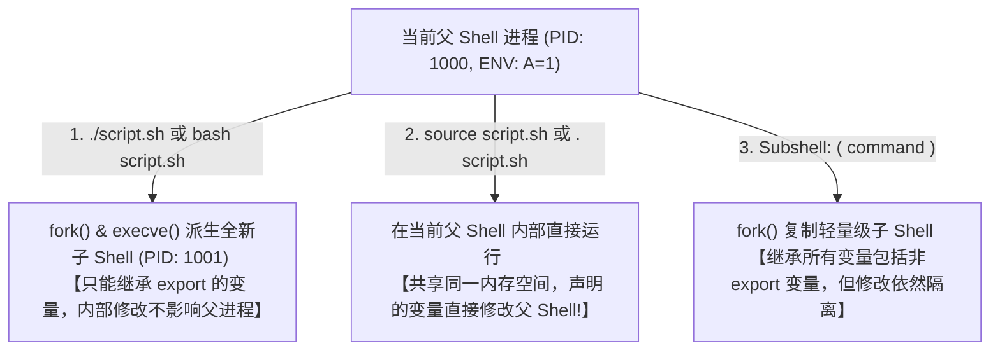
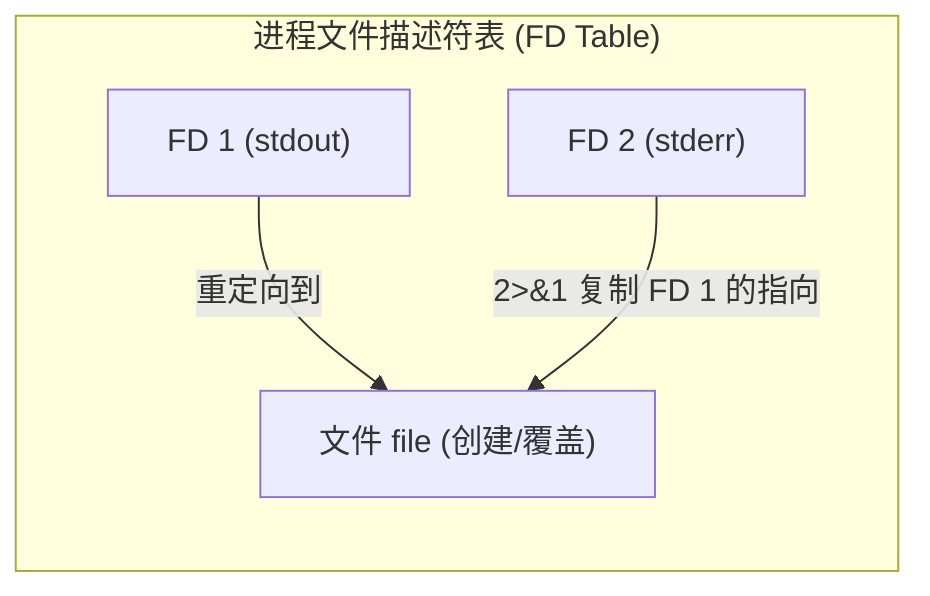

# Round 11: Linux Shell 脚本编程与自动化深度指南

Shell 脚本是 Linux 系统管理员与 SRE 实现自动化运维、数据采集与故障自愈的基石。然而在生产环境中，脆弱的 Shell 脚本常常因为未捕获的错误、变量未定义或缺乏并发控制，引发意外删库或服务中断。

本指南深入拆解 POSIX Shell 运行机制、高级参数扩展、重定向与进程替换内核原理、严谨的异常处理防护规则（Guardrails）以及基于 FIFO 命名管道的高性能 Shell 多线程并发框架。

---

## 一、 Shell 执行环境与变量作用域内核剖析

### 1. 脚本执行的三种方式与内存空间差异

在 Linux 中，执行一个 Shell 脚本主要有以下三种方式，其底层进程与环境变量作用域截然不同：



| 执行方式                                         | 是否创建子进程 (fork)                             | 变量作用域与影响                                                                  | 典型应用场景                                             |
| :----------------------------------------------- | :------------------------------------------------ | :-------------------------------------------------------------------------------- | :------------------------------------------------------- |
| **`./script.sh`**                        | **是**（通过 `fork()` + `execve()`）    | 只能继承父 Shell 中`export` 的环境变量；脚本内的修改**无法传回父 Shell**  | 独立的自动化任务、定时任务 Cron                          |
| **`source script.sh`** / **`.`** | **否**（在当前 Shell 内存中加载）           | 共享同一进程内存；脚本内定义的函数和变量**直接生效在当前 Shell 环境变量中** | 加载配置文件（如`~/.bashrc`）、初始化环境变量          |
| **`( commands )`** (Subshell)            | **是**（仅 `fork()` 不执行 `execve()`） | 继承父进程所有局部变量与全局变量；Subshell 内部变量修改**随退出而销毁**     | 临时切换目录`(cd /tmp && rm -rf *)` 避影响全局工作目录 |

---

### 2. 局部变量 `local` 与 `export` 作用域

```bash
#!/bin/bash

GLOBAL_VAR="I am global"
export ENV_VAR="I am exported"

my_function() {
    # 必须显式声明 local，否则变量默认是全局生效的！
    local local_var="I am local to function"
    GLOBAL_VAR="Modified in function"
    echo "Inside function: $local_var"
}

my_function
echo "Outside function: $GLOBAL_VAR"
# echo "$local_var"  # 此处为空，local_var 已被销毁
```

---

## 二、 变量高级参数扩展 (Parameter Expansion)

熟练掌握 Shell 参数扩展可以大幅减少对 `sed` / `awk` 外置命令的调用，性能提升数十倍。

### 1. 默认值处理与判空机制

| 扩展语法                                                                                                                                                                                      | 物理含义与行为描述           | 生产典型场景   |
| :-------------------------------------------------------------------------------------------------------------------------------------------------------------------------------------------- | :--------------------------- | :------------- |
| **`${var:-default}`** | 若 `var` 为空或未定义，**返回 `default`**；但 `var` 本身值**保持不变** | 变量判空安全兜底：`PORT=${HTTP_PORT:-8080}`                      |                              |                |
| **`${var:=default}`** | 若 `var` 为空或未定义，**将 `var` 赋值为 `default`** 并返回 | 自动初始化配置变量：`LOG_DIR=${LOG_DIR:=/var/log/app}`                            |                              |                |
| **`${var:?error_msg}`**| 若 `var` 为空或未定义，**向 stderr 打印 `error_msg` 并立即终止脚本** | 强校验关键参数：`DIR=${1:?"Error: Directory path argument is required!"}` |                              |                |
| **`${#var}`**                                                                                                                                                                         | 返回字符串`var` 的字符长度 | 字符串长度校验 |

---

### 2. 字符串截取与正则替换（贪婪 vs 非贪婪）

* **前缀剪裁 (`#` / `##`)**：
  * **`${var#pattern}`**：从头开始匹配，剪掉**最短**符合 `pattern` 的部分（非贪婪）。
  * **`${var##pattern}`**：从头开始匹配，剪掉**最长**符合 `pattern` 的部分（贪婪）。
* **后缀剪裁 (`%` / `%%`)**：
  * **`${var%pattern}`**：从尾开始匹配，剪掉**最短**符合 `pattern` 的部分（非贪婪）。
  * **`${var%%pattern}`**：从尾开始匹配，剪掉**最长**符合 `pattern` 的部分（贪婪）。

#### 生产提取文件名与扩展名范例：

```bash
FILE_PATH="/var/log/nginx/access.log.tar.gz"

# 1. 提取文件名 (剪掉左边匹配 */ 的最长路径)
FILENAME="${FILE_PATH##*/}"         # 结果: access.log.tar.gz

# 2. 提取目录路径 (剪掉右边匹配 /* 的最短部分)
DIR_PATH="${FILE_PATH%/*}"           # 结果: /var/log/nginx

# 3. 提取主文件名 (剪掉右边匹配 .* 的最长扩展名)
BASE_NAME="${FILENAME%%.*}"         # 结果: access

# 4. 字符串全局替换 (将 log 替换为 txt)
NEW_PATH="${FILE_PATH//log/txt}"     # 结果: /var/txt/nginx/access.txt.tar.gz
```

---

## 三、 重定向原理与进程替换 (Process Substitution)

### 1. 文件描述符 (FD) 与 `2>&1` 内核映射解密

每个 Linux 进程默认开启三个文件描述符：

* **`0`**：标准输入 (stdin)
* **`1`**：标准输出 (stdout)
* **`2`**：标准错误 (stderr)

```bash
# 经典的错误写重定向：
cmd > file 2>&1
```



* **顺序至关重要！**：若写成 `cmd 2>&1 > file`，其含义是：FD 2 复制了当时 FD 1 的指向（屏幕终端），随后 FD 1 被重定向到文件。结果导致**标准错误依然打印在屏幕上**！

---

### 2. 进程替换 `<(command)` 内核机制

进程替换语法 **`<(command)`** 或 **`>(command)`** 在内核中会自动创建一个临时的匿名管道（或者命名为 `/dev/fd/63` 的虚拟文件），避免生成庞大的临时文件。

#### 生产场景：对比两个远程服务器上同名配置文件的差异

```bash
# 无需下载临时文件，直接将 curl 输出作为虚拟文件传递给 diff 命令
diff -u <(curl -s http://node1/nginx.conf) <(curl -s http://node2/nginx.conf)
```

---

## 四、 生产规范级脚本防护金律 (Guardrails)

任何企业级 Shell 脚本的首行，都必须包含严谨的标志位与捕获信号组。

### 1. `set -euo pipefail` 组合拳

```bash
#!/bin/bash
set -euo pipefail
```

1. **`set -e` (errexit)**：任何命令返回非 0 退出码（失败）时，脚本**立即终止退出**，防止错误级联扩散。
2. **`set -u` (nounset)**：使用未声明的变量时，报错并终止。**（彻底杜绝 `rm -rf $DIR/` 中因 `$DIR` 未定义而误删根目录 `/` 的悲剧！）**
3. **`set -o pipefail`**：管道中只要有任何一个子命令失败，整个管道表达式即返回失败（默认管道只看最后一个命令的返回值）。
4. **`set -x` (xtrace)**：打印执行的每一行命令及扩展后的参数（用于调试）。

---

### 2. `trap` 捕获信号安全清理临时文件

无论脚本是正常执行完毕，还是收到 `SIGINT` (Ctrl+C)、`SIGTERM` 强行终止，都必须确保临时文件被妥善清理：

```bash
#!/bin/bash
set -euo pipefail

# 创建临时工作目录
TMP_DIR=$(mktemp -d /tmp/my_script.XXXXXX)

# 注册 trap 捕获器：无论脚本触发 EXIT, INT, TERM 信号，均强行执行 cleanup 函数
cleanup() {
    local exit_code=$?
    echo "Cleaning up temporary directory $TMP_DIR..."
    rm -rf "$TMP_DIR"
    exit $exit_code
}
trap cleanup EXIT INT TERM

# 脚本核心业务代码
echo "Processing data in $TMP_DIR..."
# 假装进行某些复杂计算...
```

---

## 五、 高性能多线程并发框架 (基于 FIFO 命名管道)

Shell 默认是单线程顺序执行的。当需要对 100 台服务器并发执行检查或备份时，单纯使用 `&` 放入后台会导致连接过多爆满；需使用 **FIFO 命名管道令牌桶** 控制最大并发并发数。

### 生产级多线程 Task 限制并发框架模板：

```bash
#!/bin/bash
set -euo pipefail

# 配置允许的最大并行并发线程数
MAX_THREADS=5
FIFO_FILE="/tmp/task_fifo_$$"

# 1. 创建 FIFO 命名管道并绑定到文件描述符 6
mkfifo "$FIFO_FILE"
exec 6<>"$FIFO_FILE"
rm -f "$FIFO_FILE" # 关联 FD 后删除路径文件，防止遗留

# 2. 向 FIFO 管道中写入 MAX_THREADS 个换行符 (即预先注入 5 个令牌)
for ((i=0; i<MAX_THREADS; i++)); do
    echo >&6
done

# 3. 待并发处理的任务清单 (例如 20 台主机 IP)
HOSTS=("192.168.1.1" "192.168.1.2" "192.168.1.3" "192.168.1.4" "192.168.1.5" \
       "192.168.1.6" "192.168.1.7" "192.168.1.8" "192.168.1.9" "192.168.1.10")

do_work() {
    local host=$1
    echo "[$(date +'%H:%M:%S')] Start processing $host..."
    sleep 2 # 模拟 SSH 操作
    echo "[$(date +'%H:%M:%S')] Finished $host."
}

# 4. 循环调度任务
for host in "${HOSTS[@]}"; do
    # 从管道读取一个令牌 (若管道为空则自动阻塞挂起)
    read -u 6

    {
        # 在子进程中执行实际任务
        do_work "$host"
      
        # 任务完成后归还令牌到管道
        echo >&6
    } &
done

# 5. 等待所有后台后台线程子进程全部结束
wait

# 6. 关闭 FD 6
exec 6>&-
echo "All tasks executed successfully."
```

---

## 六、 生产防并发踩踏：基于 `flock` 的脚本单例锁机制 (nixCraft / Unix StackExchange 精髓)

在生产定时任务（Cron）或触发式脚本中，如果前一次任务未执行完毕，下一次任务又被触发，可能引发数据损坏、IO 堵塞或资源耗尽。

### 1. `flock` 外挂式防护命令

```bash
# -n: 非阻塞（若已锁定则立即退出返回非 0）
# -E: 指定锁冲突时的自定义退出码
flock -n /var/lock/sync_data.lock -c "/usr/local/bin/sync_data.sh"
```

### 2. 脚本内部自锁代码范式 (嵌入式单例保护)

```bash
#!/bin/bash
set -euo pipefail

LOCK_FILE="/var/lock/my_service_task.lock"
exec 200>"$LOCK_FILE"

# 尝试获取排他锁 (FD 200)，若被占用则优雅退出
if ! flock -n 200; then
    echo "[$(date +'%Y-%m-%d %H:%M:%S')] [WARN] Another instance is already running. Exiting." >&2
    exit 0
fi

# 脚本正常退出或异常终止时，内核会自动释放文件锁
echo "Acquired lock successfully. Running critical job..."
# ... 业务逻辑 ...
```

---

## 七、 生产级 Shell 脚本工程化规范与脚手架

```bash
#!/bin/bash
# ==============================================================================
# Script Name : deploy_service.sh
# Description : Enterprise-grade deployment automation template
# Author      : SRE Team
# ==============================================================================
set -euo pipefail
IFS=$'\n\t'

# 彩色日志输出体系
readonly COLOR_RED='\033[0;31m'
readonly COLOR_GREEN='\033[0;32m'
readonly COLOR_YELLOW='\033[0;33m'
readonly COLOR_RESET='\033[0m'

log_info()  { echo -e "${COLOR_GREEN}[INFO]  [$(date +'%Y-%m-%d %H:%M:%S')] $*$COLOR_RESET"; }
log_warn()  { echo -e "${COLOR_YELLOW}[WARN]  [$(date +'%Y-%m-%d %H:%M:%S')] $*$COLOR_RESET" >&2; }
log_error() { echo -e "${COLOR_RED}[ERROR] [$(date +'%Y-%m-%d %H:%M:%S')] $*$COLOR_RESET" >&2; }

# 全局错误捕获与信号安全退出
trap 'log_error "Command failed at line $LINENO with exit code $?"' ERR
cleanup() {
    log_info "Cleaning up temporary files..."
    rm -rf "${TMP_DIR:-}"
}
trap cleanup EXIT INT TERM

# CLI 命令行选项解析范式 (getopts)
CONFIG_FILE=""
DRY_RUN=false

usage() {
    echo "Usage: $0 [-c <config_path>] [-d] [-h]"
    echo "  -c: Specify configuration file"
    echo "  -d: Dry run mode"
    echo "  -h: Show this help message"
    exit 1
}

while getopts ":c:dh" opt; do
    case "$opt" in
        c) CONFIG_FILE="$OPTARG" ;;
        d) DRY_RUN=true ;;
        h) usage ;;
        \?) log_error "Invalid option: -$OPTARG"; usage ;;
        :)  log_error "Option -$OPTARG requires an argument."; usage ;;
    esac
done
shift $((OPTIND - 1))

log_info "Initialization completed. Starting automation sequence..."
```

---

> [!TIP] 💡 关联技术与延伸阅读
> * [Linux 基础与核心命令行指南](./01-Linux基础与核心命令行指南.md) —— 基础系统架构、权限体系、文本处理与现代 CLI 工具链
> * [Linux 编译链接与动态库原理指南](./03-Linux编译链接与动态库原理指南.md) —— ELF 结构、静态/动态链接与 `LD_PRELOAD`
> * [高级运维生产高频故障排查手册](../07-高可用与生产排错/02-高级运维生产高频故障排查手册.md) —— 生产高频 CPU 假死、内存泄漏与紧急止损
