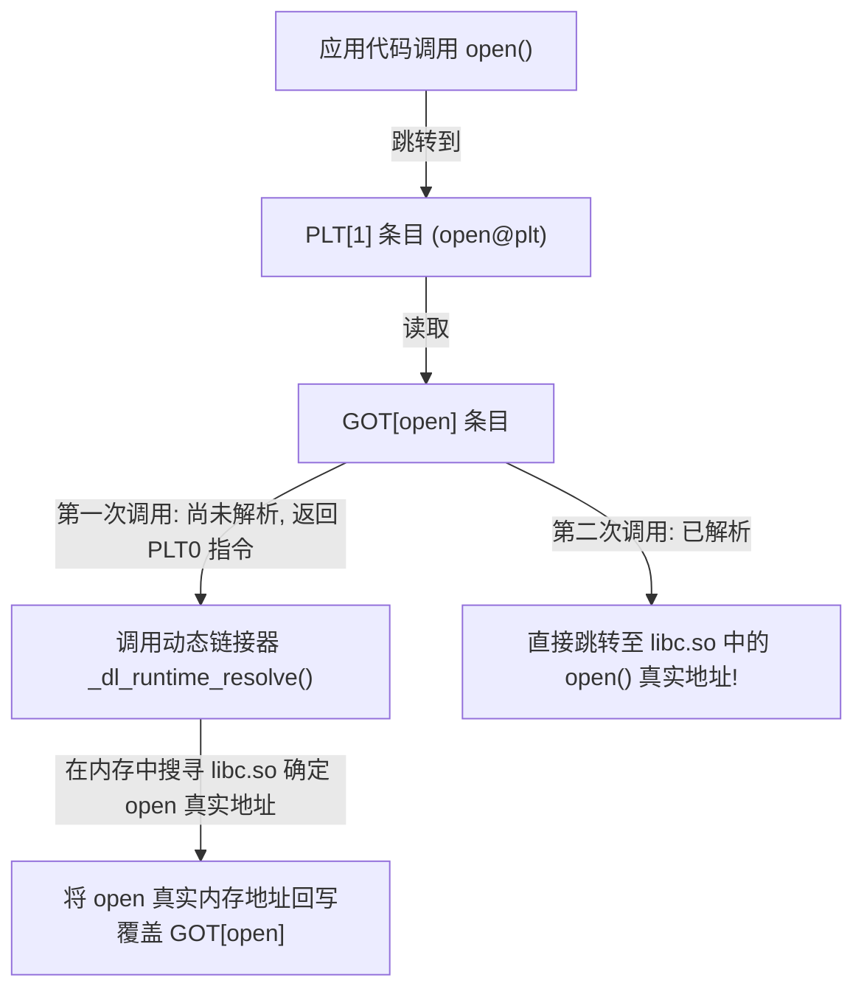
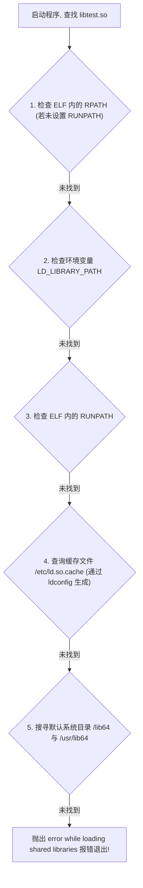

# Round 12: Linux 编译链接与动态库原理指南

在 Linux 环境下部署 C/C++、Go、Rust、Python 或 Java 原生 C-Extensions 时，经常遇到 `error while loading shared libraries: libxxx.so: cannot open shared object file` 或符号未定义（Undefined Symbol）错误。

本指南深入拆解 C/C++ 四阶段编译流水线、ELF (Executable and Linkable Format) 二进制文件结构、GOT/PLT 延迟绑定技术、动态链接器 (`ld-linux.so`) 搜寻算法、`ldd`/`readelf`/`nm` 诊断工具，以及 `LD_PRELOAD` 动态库劫持机制。

---

## 一、 C/C++ 编译四阶段流水线

```mermaid
graph LR
    A["源代码 main.c"] -->|1. 预处理 (cpp)| B["预处理文本 main.i (宏展开, 头文件插入)"]
    B -->|2. 编译 (cc1)| C["汇编代码 main.s (高级语言转汇编)"]
    C -->|3. 汇编 (as)| D["可重定向目标文件 main.o (ELF 格式, 机器码)"]
    D -->|4. 链接 (ld)| E["可执行文件 main (完整 ELF 二进制)"]
    Libs[".a 静态库 / .so 动态库"] --> E
```

---

## 二、 ELF (Executable and Linkable Format) 二进制结构与 GOT/PLT 延迟绑定

### 1. PLT (Procedure Linkage Table) 与 GOT (Global Offset Table) 延迟绑定原理

为了避免程序启动时一次性解析成千上万个未使用的动态库函数导致的启动缓慢，Linux 采用了 **延迟绑定 (Lazy Binding)** 机制。



#### 查看程序的 GOT 与 PLT 表：
```bash
# 查看 GOT (Global Offset Table) 动态重定位重定位项
readelf -r /bin/ls

# 查看 PLT 反汇编指令
objdump -d -j .plt /bin/ls
```

---

## 三、 静态链接 (`.a`) vs 动态链接 (`.so`)

### 1. 动态链接器 `ld.so` 运行时搜寻顺序 (Search Path)



```bash
# 1. 检查程序引用的动态库
ldd /opt/app/my_bin

# 2. 解决方案：刷新 ld.so.cache 缓存
echo "/usr/local/mysql/lib" > /etc/ld.so.conf.d/mysql.conf
ldconfig
```

---

## 四、 符号表分析与诊断工具链

```bash
# 1. 查看动态库 libmath.so 导出的全局函数符号 (T: 已定义代码段符号)
nm -D --defined-only libmath.so

# 2. 查看可执行程序引用的未定义外部符号 (U: Undefined)
nm -D -u /opt/app/my_bin
```

---

## 五、 黑客与调试神器：`LD_PRELOAD` 动态库劫持原理

### 1. 劫持 C 库 `open()` 函数的完整源码

```c
#define _GNU_SOURCE
#include <stdio.h>
#include <dlfcn.h>

typedef int (*orig_open_f_type)(const char *pathname, int flags);

int open(const char *pathname, int flags) {
    orig_open_f_type orig_open = (orig_open_f_type)dlsym(RTLD_NEXT, "open");
    printf("[LD_PRELOAD Audit] Intercepted open() call for file: %s\n", pathname);
    return orig_open(pathname, flags);
}
```

```bash
# 编译并注入运行
gcc -shared -fPIC hook_open.c -o libhook_open.so -ldl
LD_PRELOAD=./libhook_open.so cat /etc/hosts
```

---
