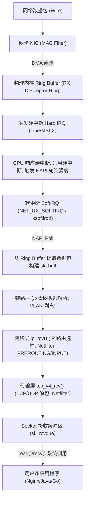
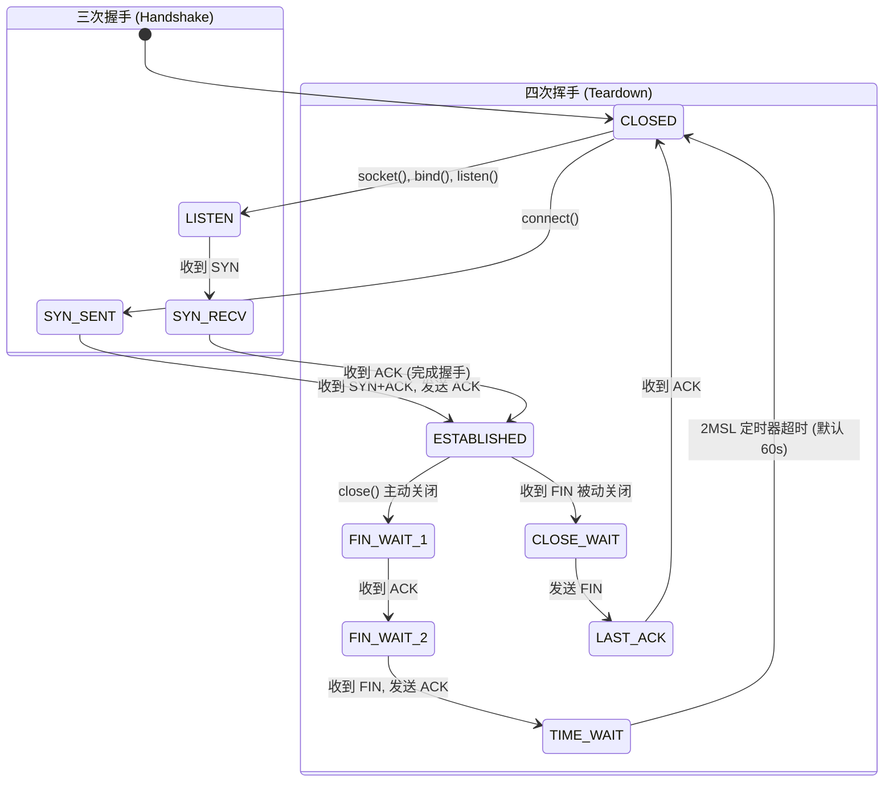
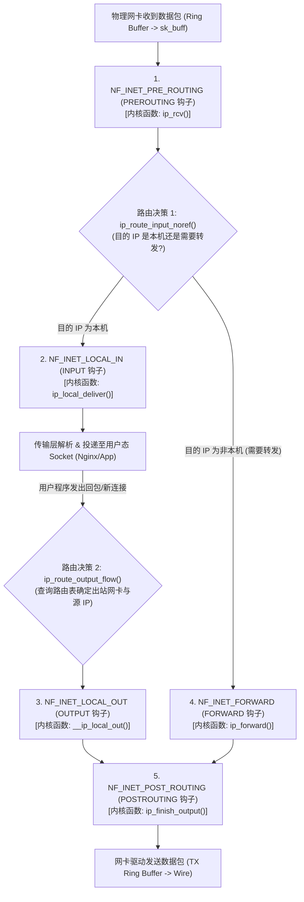
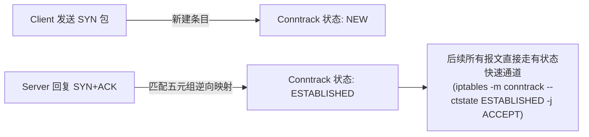
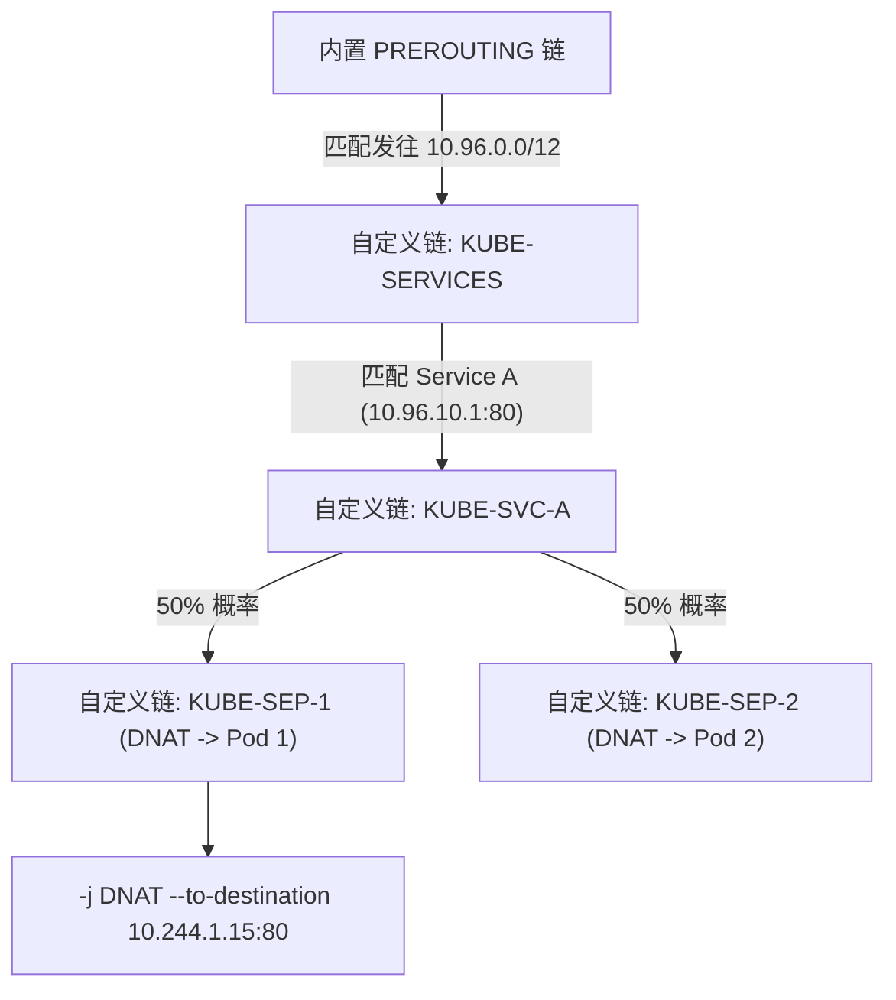

# Round 2: Linux 网络协议栈与网络故障排查指南

在分布式云原生与高性能 Web 架构中，网络问题通常是导致系统延迟暴涨、吞吐下降和连接中断的核心诱因。本指南深入解析 Linux 内核网络数据包收发全历程、TCP 状态机调优、生产抓包诊断工具链以及 iptables/DNS 内核级故障处理。

---

## 一、 Linux 内核网络协议栈架构与数据包链路

### 1. 网卡 DMA 描述符环与 NAPI 软中断收包全历程

当物理网卡收到电信号/光信号时，数据包从硬件网卡直达应用程序的传输全链路如下：



#### 关键数据结构与内核 C 函数节点：

1. **`ip_rcv()`**：IP 协议栈入口函数。触发 Netfilter 的 `NF_INET_PRE_ROUTING` 钩子。
2. **`ip_local_deliver()`**：目的地为本机的包，触发 Netfilter 的 `NF_INET_LOCAL_IN` 钩子，随后交给传输层。
3. **`tcp_v4_rcv()`**：TCP 传输层入口函数，负责检查 checksum、校验序列号 `seq` 与 ACK。

---

### 2. 硬中断与软中断 CPU 绑核 (IRQ Affinity) 调优

高并发下，若网卡所有中断均由 `CPU 0` 响应，会导致 `CPU 0` 的 `ksoftirqd/0` 达到 100%（软中断单核瓶颈），引发严重丢包。

#### 绑定网卡多队列中断至不同 CPU 核心：
```bash
# 1. 终止系统动态中断调节服务 (irqbalance)
systemctl stop irqbalance

# 2. 查看网卡 eth0 对应的中断号 (例如 IRQ 45, 46, 47, 48)
cat /proc/interrupts | grep eth0

# 3. 将 IRQ 45 绑定到 CPU 0 (十六进制掩码 0x1)
echo "1" > /proc/irq/45/smp_affinity

# 4. 将 IRQ 46 绑定到 CPU 1 (十六进制掩码 0x2)
echo "2" > /proc/irq/46/smp_affinity
```

---

## 二、 TCP/IP 状态机演变与 Socket 状态深刻剖析

### 1. TCP 三次握手与四次挥手状态全景



---

### 2. 生产高频异常 Socket 状态及根因分析

| Socket 状态 | 表现特征与现象 | 产生根因 (Root Cause) | 生产处置与调优方案 |
| :--- | :--- | :--- | :--- |
| **`SYN_RECV` 积压** | 半连接队列 (SYN Queue) 满了 | 遭受 **SYN Flood 攻击**，或应用程序处理握手太慢 | 开启 `net.ipv4.tcp_syncookies = 1`；增大 `net.ipv4.tcp_max_syn_backlog` |
| **`TIME_WAIT` 堆积** | 单机达到数万个 `TIME_WAIT` 连接，无法发起新连接 | 本端作为**主动关闭方**大量短连接请求（如 Nginx 未开启 upstream keepalive） | 开启 `net.ipv4.tcp_tw_reuse = 1`；调小 `net.ipv4.tcp_fin_timeout`；业务端改用 HTTP Keep-Alive / 连接池 |
| **`CLOSE_WAIT` 堆积** | `CLOSE_WAIT` 持续激增且不自动释放，句柄耗尽 | **应用程序 Bug**。对端已发送 FIN，但本端代码没有调用 `close()` 关闭 Socket | **联系开发修复代码**；紧急情况下使用 `gdb` 或 `kill` 重启泄露句柄的服务 |

---

## 三、 生产网络排错工具链全解

### 1. `ss` vs `netstat` Socket 状态统计

`ss` (Socket Statistics) 直接通过内核 `netlink` 接口读取 Socket 信息，性能远超扫描 `/proc/net/tcp` 的传统 `netstat`。

```bash
# 1. 统计当前各 TCP 状态连接数分布
ss -ant | awk '{print $1}' | sort | uniq -c | sort -nr

# 2. 找出所有处于 ESTABLISHED 状态且目标端口为 3306 的数据库连接
ss -ant dst :3306 state established
```

---

### 2. `tcpdump` 生产抓包命令精要

```bash
# 场景 1：抓取源或目标 IP 为 192.168.1.100，且端口为 80/443 的 TCP SYN 报文
tcpdump -i any -nn 'host 192.168.1.100 and (port 80 or port 443) and (tcp[tcpflags] & tcp-syn != 0)'

# 场景 2：抓取 HTTP 500 报错报文
tcpdump -i eth0 -nn -A 'tcp port 80 and (((ip[20:2] - ((ip[0]&0xf)<<2)) - ((tcp[12]&0xf0)>>2)) != 0)' | grep -B 2 -A 10 "HTTP/1.1 500"
```

---

### 3. `ethtool` 物理网卡与硬件加速排错

```bash
# 1. 查看网卡物理链路状态 (Speed, Duplex, Link detected)
ethtool eth0

# 2. 查看网卡 Ring Buffer 大小及丢包统计
ethtool -g eth0     # 查看配置与最大支持限制
ethtool -S eth0 | grep -E "drop|error|miss" # 查看丢包计数

# 3. 调整网卡接收 Ring Buffer 到最大值 (缓解 SoftIRQ 丢包)
ethtool -G eth0 rx 4096 tx 4096
```

---

## 四、 Linux Netfilter 与 iptables 深度原理剖析与实战

在 Linux 操作系统中，**Netfilter** 与 **iptables** 构成了整个网络防火墙、NAT 转换以及容器/K8S 网络转发的基石。两者的关系是：
* **Netfilter（内核态/数据面）**：嵌入在 Linux 内核网络协议栈中的框架与回调挂载点，负责真正的数据包过滤、状态跟踪与包头改写。
* **iptables（用户态/控制面）**：提供给管理员配置策略的命令行工具，将用户定义的规则写入内核中 Netfilter 的各个表中。

---

### 1. Netfilter 五大 Hook 点与内核 C 调用链路

Linux 内核协议栈在 IPv4 处理流程的 5 个关键物理位置设置了 Hook 探针：



#### 内核五个 Hook 回调返回值（Verdict）：
当注册在 Hook 点的规则链遍历执行时，每个规则会返回一个决议状态码：
1. **`NF_ACCEPT`**：允许该数据包继续穿透协议栈。
2. **`NF_DROP`**：直接丢弃该数据包，协议栈释放 `sk_buff` 内存，不向对端发送任何通知。
3. **`NF_STOLEN`**：挂钩模块接管了该数据包，停止协议栈后续处理（如 IPVS 模块分流）。
4. **`NF_QUEUE`**：将数据包排队推送到用户态空间（供 `libnetfilter_queue` 深度包检测）。
5. **`NF_REPEAT`**：重新进入当前 Hook 点再次执行规则。

---

### 2. iptables 5 表 5 链与规则执行优先级矩阵

为了分类管理各种网络策略，iptables 划分了 **5 个表（功能分类）**，并在每个 Hook 挂载点按固定优先级顺序执行各表的规则链：

```
Hook 关卡与表的执行优先级 (从高到低 / 从左到右)：

[PREROUTING]   :  raw  ➔  (connection tracking)  ➔  mangle  ➔  nat (DNAT)
                      │
                      ▼
[INPUT]        :  mangle  ➔  filter  ➔  security  ➔  nat (SNAT-Local)
                      │
[FORWARD]      :  mangle  ➔  filter  ➔  security
                      │
[OUTPUT]       :  raw  ➔  (connection tracking)  ➔  mangle  ➔  nat (DNAT)  ➔  filter  ➔  security
                      │
                      ▼
[POSTROUTING]  :  mangle  ➔  nat (SNAT/MASQUERADE)
```

#### 表的功能定位与设计目标：
| 表名 (Table) | 核心功能 | 常用 Target 动作 | 挂载链 (Chains) | 优先级 |
| :--- | :--- | :--- | :--- | :--- |
| **`raw`** | 决定是否跳过 Conntrack 连接跟踪 | `NOTRACK`, `ACCEPT` | PREROUTING, OUTPUT | **最高 (1)** |
| **`mangle`** | 修改 IP 报头字段 (TOS, TTL, Mark 打标) | `MARK`, `TOS`, `TTL` | 全部 5 条链 | **高 (2)** |
| **`nat`** | 网络地址与端口转换 (DNAT / SNAT) | `DNAT`, `SNAT`, `MASQUERADE`, `REDIRECT` | PREROUTING, INPUT, OUTPUT, POSTROUTING | **中 (3)** |
| **`filter`** | 核心防火墙包过滤 (放行/拒绝) | `ACCEPT`, `DROP`, `REJECT`, `LOG` | INPUT, FORWARD, OUTPUT | **普通 (4)** |
| **`security`**| SELinux 强制访问控制 (MAC 安全标记) | `SECMARK`, `CONNSECMARK` | INPUT, FORWARD, OUTPUT | **最低 (5)** |

---

### 3. Conntrack 连接跟踪子系统与四种状态机

**Conntrack (Connection Tracking)** 是 Netfilter 实现“有状态防火墙”与“NAT 逆向转换”的核心引擎。它为系统内流经的每一个通信流维护状态表项（保存在 `/proc/net/nf_conntrack` 或内存中的哈希表）。

#### Conntrack 四大核心状态：
* **`NEW`**：连接的第一个数据包（如 TCP SYN 握手包）。
* **`ESTABLISHED`**：连接已双向建立（收到对端的响应报文，如 TCP SYN-ACK 或 ACK）。
* **`RELATED`**：由现存连接衍生出的关联连接（典型如 FTP 被动模式的数据传输端口协商，或 ICMP 差错报文）。
* **`INVALID`**：无法归类的异常报文（如未握手直接发来的非法 FIN/RST、或校验和错误），**生产防火墙中首行应直接 DROP**。



> [!CAUTION]
> **生产高并发坑点：Conntrack 表满丢包**
> 高并发短连接下，若 `/proc/sys/net/netfilter/nf_conntrack_count` 达到 `nf_conntrack_max` 阈值，内核会直接抛弃所有新连接数据包并告警 `nf_conntrack: table full, dropping packet`。必须调大容量并缩短超时：
> ```bash
> sysctl -w net.netfilter.nf_conntrack_max=1048576
> sysctl -w net.netfilter.nf_conntrack_tcp_timeout_established=1200
> ```

---

### 4. DNAT、SNAT 与 MASQUERADE 底层转换全过程

#### (1) DNAT (Destination NAT, 目的地址转换)
* **发生位置**：`PREROUTING` 链（入站路由前）或 `OUTPUT` 链（本机发出）。
* **典型场景**：负载均衡、Docker 端口映射 (`-p 8080:80`)、K8S ClusterIP 转发。
* **过程**：外部客户端请求公网 IP，在到达路由前被修改目标 IP/Port 为内网 Pod/容器 IP。

#### (2) SNAT 与 MASQUERADE (源地址转换与动态伪装)
* **发生位置**：`POSTROUTING` 链（路由决策之后，数据包即将出网卡之前）。
* **典型场景**：私网集群节点/容器访问互联网。
* **过程**：
  * **静态 SNAT**：目标出口拥有固定公网 IP：
    ```bash
    iptables -t nat -A POSTROUTING -s 10.244.0.0/16 -o eth0 -j SNAT --to-source 192.168.1.100
    ```
  * **动态 MASQUERADE**：出口 IP 通过 DHCP 动态获取或经常变动时，内核会在发包瞬间动态探测 `eth0` 的当前 IP 并完成源地址替换（开销略高于静态 SNAT）。
    ```bash
    iptables -t nat -A POSTROUTING -s 10.244.0.0/16 -o eth0 -j MASQUERADE
    ```

---

### 5. iptables 自定义链（User-Defined Chains）机制

Docker 和 Kubernetes 并没有直接在内置的 `PREROUTING`/`FORWARD` 上堆叠成千上万条规则，而是通过**自定义规则链**实现模块化解耦：



* **跳转机制 (`-j CHAIN_NAME`)**：数据包进入自定义链按序匹配。
* **返回机制 (`-j RETURN`)**：如果自定义链未命中任何终结规则，遇到 `RETURN` 会回到父链的调用点继续向下执行。

---

### 6. 生产企业级 iptables 黄金防火墙模板与排错 SOP

#### (1) 企业生产级有状态安全防御脚本：
```bash
# 1. 清空原有所有规则与自定义链
iptables -F
iptables -X
iptables -t nat -F
iptables -t nat -X

# 2. 设置默认策略 (严格白名单模式: 默认全丢弃)
iptables -P INPUT DROP
iptables -P FORWARD DROP
iptables -P OUTPUT ACCEPT

# 3. 核心首行：放行所有已建立的连接与关联连接 (Stateful 高性能通道)
iptables -A INPUT -m conntrack --ctstate ESTABLISHED,RELATED -j ACCEPT

# 4. 核心第二行：彻底丢弃非法/畸形报文
iptables -A INPUT -m conntrack --ctstate INVALID -j DROP

# 5. 放行本地回环接口 (Loopback，本地微服务间通信必需)
iptables -A INPUT -i lo -j ACCEPT

# 6. 放行运维管理端口 (放行指定跳板机 192.168.1.50 访问 SSH 22 端口)
iptables -A INPUT -p tcp -s 192.168.1.50 --dport 22 -m conntrack --ctstate NEW -j ACCEPT

# 7. 防御 SYN Flood 攻击 (限制单 IP 每秒新建连接数)
iptables -A INPUT -p tcp --syn -m limit --limit 50/s --limit-burst 100 -j ACCEPT
iptables -A INPUT -p tcp --syn -j DROP

# 8. 允许内网服务器间相互 ping (放行 ICMP echo-request 并限速)
iptables -A INPUT -p icmp --icmp-type echo-request -m limit --limit 5/s -j ACCEPT
```

#### (2) iptables 生产排障与性能监控命令：
```bash
# 1. 详细列出 filter 表规则，显示行号、匹配到的数据包数 (pkts) 与字节数 (bytes)
iptables -nvL --line-numbers

# 2. 查看 nat 表规则及命中统计
iptables -t nat -nvL --line-numbers

# 3. 实时观测规则命中计数器增长 (排查流量到底卡在哪条规则)
watch -n 1 'iptables -nvL INPUT'

# 4. 备份与原子恢复 (避免逐条命令执行导致自身被锁在服务器外)
iptables-save > /etc/sysconfig/iptables.bak
iptables-restore < /etc/sysconfig/iptables.bak
```

---


## 五、 DNS 解析链路与高并发坑点排查

### 1. `/etc/resolv.conf` 核心参数调优

```ini
nameserver 1.1.1.1
nameserver 8.8.8.8
options timeout:1 attempts:2 single-request-reopen rotate
```

* **`single-request-reopen`**：**解决 A 和 AAAA 记录并发请求冲突**，关闭并重新打开 Socket 发送第二次查询，避免 5 秒超时卡顿。

---

## 六、 工业级超大规模网络栈调优与拥塞控制 (Cloudflare / Kernel.org 精髓)

### 1. TCP 半连接队列 (SYN Queue) 与全连接队列 (Accept Queue) 溢出精准定位

在生产高并发流量冲击下，TCP 握手队列极易被撑爆导致偶发连接超时或重置（RST）：

```bash
# 1. 检查监听套接字的全连接队列状态
ss -lnt '( sport = :80 or sport = :443 )'
# 输出示例：
# State      Recv-Q  Send-Q   Local Address:Port
# LISTEN     129     128      0.0.0.0:80
```
* **`Send-Q`**：全连接队列的最大允许上限（由应用 `listen(fd, backlog)` 与内核 `net.core.somaxconn` 取较小值决定）。
* **`Recv-Q`**：当前已完成三次握手但**尚未被应用程序调用 `accept()` 取走**的连接数。
* **溢出判据**：若 `Recv-Q > Send-Q`，说明应用程序处理能力不足，正在发生全连接队列溢出丢包！

```bash
# 2. 查询内核自启动以来的丢包溢出历史计数
netstat -s | grep -i "listen"
# 典型输出：
# 1024 times the listen queue of a socket overflowed (全连接队列溢出)
# 4096 SYNs to LISTEN sockets dropped (半连接/全连接丢弃)
```

---

### 2. NAPI 软中断多核均衡：RPS (Receive Packet Steering) & RFS

当物理网卡不支持多队列（Single-Queue NIC）或网卡多队列硬件中断集中在单一 CPU 核心（ksoftirqd/0 占用 100%）时，需开启内核层 RPS 软件分流：

```bash
# 将 eth0 网卡第 0 队列的软中断分流给 CPU 0~7 (十六进制 0xff)
echo "ff" > /sys/class/net/eth0/queues/rx-0/rps_cpus

# 提高单次软中断轮询周期的报文预算 (默认 300)
sysctl -w net.core.netdev_budget=600
sysctl -w net.core.netdev_max_backlog=10000
```

---

### 3. 生产级 TCP BBR 拥塞控制开启

相比传统的 CUBIC 依赖丢包触发窗口减半（在有丢包但非拥塞的弱网环境下吞吐暴跌），Google 提出的 **BBR (Bottleneck Bandwidth and RTT)** 基于最大带宽与最小往返时延建模：

```bash
# 检查当前内核模块支持
modprobe tcp_bbr

# 启用 Fair Queueing 调度器与 BBR 拥塞控制
sysctl -w net.core.default_qdisc=fq
sysctl -w net.ipv4.tcp_congestion_control=bbr

# 校验生效状态
sysctl net.ipv4.tcp_congestion_control
# 输出：net.ipv4.tcp_congestion_control = bbr
```

---

> [!TIP] 💡 关联技术与延伸阅读
>
> * [Linux 高级网络架构与流量控制(TC_BPF)指南](./02-Linux高级网络架构与流量控制(TC_BPF)指南.md) —— HTB 流量整形、LVS 三大模式与 XDP/TC-BPF 网络加速
> * [Linux 内核参数调优与 sysctl 实战指南](../03-系统性能与调优/04-Linux内核参数调优与sysctl实战指南.md) —— `/proc/sys/net/` 生产级网络内核参数模版
> * [高级运维生产复杂故障深度案例集](../07-高可用与生产排错/03-高级运维生产复杂故障深度案例集(Case_Study).md) —— 跨机房丢包、连接池句柄泄漏与内核锁死排错复盘

