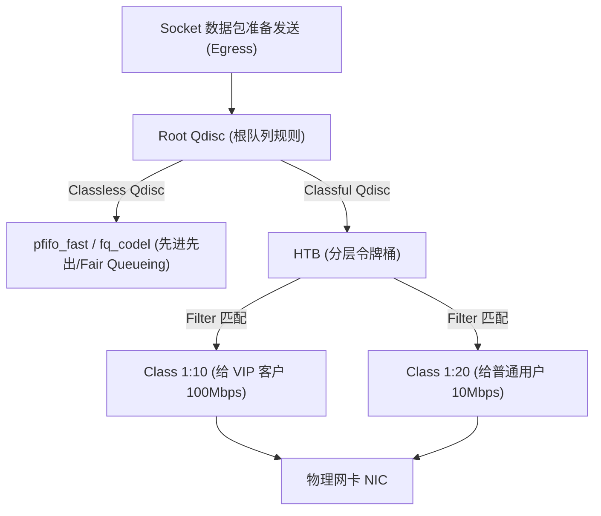

# Round 17: Linux 高级网络架构与流量控制 (TC/BPF) 指南

在构建高吞吐 Web 网关、多租户云数据中心或进行弱网混沌工程压测时，原生的 Linux 网络栈需要具备强大的流量整形（Traffic Shaping）、QoS 策略服务与四层高性能负载均衡能力。

本指南深入拆解 Linux TC (Traffic Control) 流量控制架构、HTB/Netem 限速与弱网模拟、LVS/IPVS 内核四层负载均衡三大模式、网卡链路聚合 (Bonding) 以及基于 eBPF 的 TC 数据包加速。

---

## 一、 Linux 流量控制 (Traffic Control, TC) 架构

Linux 内核在数据包离开网卡出站（Egress）或进入网卡入站（Ingress）时，提供了强大的 **TC (Traffic Control)** 流量控制子系统。



### TC 体系三大核心构件：

1. **`Qdisc` (Queueing Discipline, 队列规则)**：改变数据包排队发送顺序与速度的算法。
   * **无类队列 (Classless Qdisc)**：对所有流量一视同仁（如 `pfifo_fast`, `fq_codel`, `netem`）。
   * **分类队列 (Classful Qdisc)**：允许将流量划分为多个等级分类（如 `HTB`, `CBQ`）。
2. **`Class` (类别)**：分类队列下的子通道，拥有独立的带宽上限（`rate`, `ceil`）。
3. **`Filter` (过滤器)**：匹配数据包特征（如源 IP、目的端口），将数据包路由到指定的 `Class` 中。

---

## 二、 TC 限速整形与弱网模拟 (`netem`) 实战

### 1. 模拟弱网环境 (混沌工程测试)

通过 `tc` 的 `netem` (Network Emulator) 模块，可以在开发测试环境中无侵入地模拟网络丢包、延迟与乱序：

```bash
# 1. 给 eth0 网卡增加 100ms 的固定网络延迟
tc qdisc add dev eth0 root netem delay 100ms

# 2. 模拟真实 Internet 抖动：延迟 100ms ± 10ms (随机波动), 随机 1% 丢包率
tc qdisc change dev eth0 root netem delay 100ms 10ms loss 1%

# 3. 模拟数据包乱序 (25% 的包提前到达)
tc qdisc change dev eth0 root netem delay 50ms reorder 25%

# 4. 删除 eth0 上的所有 TC 模拟规则 (恢复正常网络)
tc qdisc del dev eth0 root
```

---

### 2. 基于 HTB (分层令牌桶) 实现精细化带宽限制

假设生产服务器网卡为 1Gbps，需对出口流量限制：默认最大 100Mbps，但允许突发流量达到 200Mbps：

```bash
# 1. 创建根 HTB 队列规则 (Qdisc handle 1:)
tc qdisc add dev eth0 root handle 1: htb default 12

# 2. 创建主类 (Class 1:1)，总带宽 1Gbps
tc class add dev eth0 parent 1: classid 1:1 htb rate 1gbit

# 3. 创建子类 (Class 1:10)，限制保底带宽 100Mbps，最大突发上限 200Mbps
tc class add dev eth0 parent 1:1 classid 1:10 htb rate 100mbit ceil 200mbit

# 4. 创建 Filter 匹配规则：将源 IP 为 192.168.1.50 的流量引导至 Class 1:10 限速通道
tc filter add dev eth0 protocol ip parent 1:0 prio 1 u32 match ip src 192.168.1.50 flowid 1:10
```

---

## 三、 LVS / IPVS 内核四层负载均衡三大模式

在 Kubernetes (Kube-Proxy IPVS 模式) 与高性能网关中，**IPVS (IP Virtual Server)** 是运行在内核 Netfilter 机制上的高性能 L4 负载均衡器。

```mermaid
graph TD
    Client["外部客户端 (Client IP)"] -->|请求 VIP| Director["LVS Director 负载均衡器 (VIP)"]
    Director -->|模式 1: DR (直接路由)| RS1["Real Server 1 (直接改写 MAC 地址, 响应直接回给 Client!)"]
    Director -->|模式 2: NAT (网络地址转换)| RS2["Real Server 2 (改写 IP 与端口, 响应需经 Director 返回)"]
    Director -->|模式 3: TUN (IP 隧道模式)| RS3["Real Server 3 (二次封装 IP 报头, 支持跨网段/跨机房)"]
```

### IPVS 三大模式核心差异对比：

| 模式 | 协议名 | 数据包改写机制 | 响应包返回路径 | 性能吞吐 | 部署约束 |
| :--- | :--- | :--- | :--- | :--- | :--- |
| **DR** (Direct Routing) | 直接路由 | **只改写目标 MAC 地址**为 Real Server MAC，保持 IP 报头不变 | **Real Server 直接返回给 Client！**（绕过 Director） | **最高**（Director 无出站瓶颈） | 必须在**同一二层局域网**内；RS 必须配置 lo 绑定 VIP |
| **NAT** (Network Address Translation)| 网络地址转换 | **改写目标 IP 与端口** (DNAT) | **响应包必须原路返回经过 Director** (SNAT) | 一般 | Director 易成为出站带宽瓶颈 |
| **TUN** (IP Tunneling) | IP 隧道 | 在原 IP 报头外**再封装一层 IP 报头** (IP-in-IP) | **Real Server 直接返回给 Client！** | 极高 | 跨网段、跨 DC 部署；RS 网卡必须支持 IP Tunnel 解包 |

#### `ipvsadm` 生产配置示例 (DR 模式)：
```bash
# 1. 增加虚拟服务 VIP 192.168.1.100:80 (调度算法: rr 轮询)
ipvsadm -A -t 192.168.1.100:80 -s rr

# 2. 向该虚拟服务添加两台真实后端 Real Server ( -g 指定为 DR 模式)
ipvsadm -a -t 192.168.1.100:80 -r 192.168.1.10:80 -g
ipvsadm -a -t 192.168.1.100:80 -r 192.168.1.11:80 -g

# 3. 查看当前 IPVS 连接跟踪与转发统计
ipvsadm -ln --stats
```

---

## 四、 网卡 Bonding (链路聚合) 选型与冗余

在服务器上将两块物理网卡（`eth0`, `eth1`）绑定为逻辑网卡 `bond0`，提供高可用与带宽叠加。

### 核心 Bonding 模式对比：
* **`Mode 0` (balance-rr)**：轮询策略。带宽叠加，但**需要交换机支持与配置**，易产生数据包乱序。
* **`Mode 1` (active-backup)**：**主备模式（生产推荐）**。同一时刻仅一块网卡工作；主卡故障时毫秒级自动切换到备卡。**对交换机无任何特殊要求**！
* **`Mode 4` (802.3ad LACP)**：动态链路聚合。**生产最推荐的兼顾带宽叠加与冗余模式**。需交换机端配置 LACP 聚合组。

```ini
# /etc/sysconfig/network-scripts/ifcfg-bond0 (Mode 4 生产配置)
DEVICE=bond0
TYPE=Bond
BONDING_MASTER=yes
BOOTPROTO=none
IPADDR=192.168.1.50
NETMASK=255.255.255.0
BONDING_OPTS="mode=4 miimon=100 lacp_rate=fast"
```

---

## 五、 基于 eBPF 的 TC 高性能数据包加速 (tc-bpf)

在现代云原生 CNI（如 Cilium）中，放弃了传统的 `iptables` 与 `nat` 机制，改用 **eBPF 直接挂载到 TC 的 Ingress 钩子**，在数据包刚进入网卡时立刻拦截并重定向到目标容器的 `veth` 接口！

```bash
# 使用 tc 命令直接将编译好的 eBPF 字节码 (bpf_filter.o) 挂载到 eth0 的 Ingress 钩子
tc qdisc add dev eth0 clsact
tc filter add dev eth0 ingress bpf da obj bpf_filter.o sec classifier
```
*性能收益：比传统的 `iptables` 规则匹配提升 300% 以上的包转发吞吐量，实现真正的 eBPF 零拷贝转发。*

---
