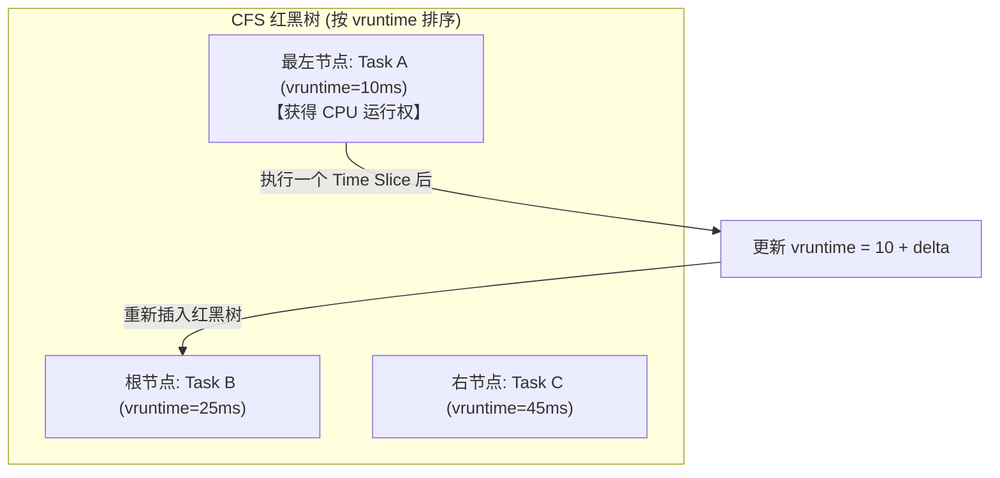

# Round 3: Linux 进程管理、线程与 CPU 性能调优指南

在云计算与密集型计算服务中，CPU 是最核心的计算资源。当系统出现 CPU 使用率 100%、响应延迟剧增或 Load Average 异常飙升时，系统管理员与 SRE 需迅速定位是计算密集（User CPU）、系统调用密集的内核开销（System CPU）、还是 I/O 阻塞（iowait）导致的性能劣化。

本指南深入拆解 Linux 内核调度算法、Load Average 本质、上下文切换开销、CPU 缓存 MESI 协议、Cgroups 隔离以及 CPU 火焰图 (FlameGraph) 诊断。

---

## 一、 Linux 进程/线程模型与 CFS 调度器数学推导

### 1. 内核视角的进程与线程 (`task_struct`)

在 Linux 内核内部，并不区分“进程”与“线程”。无论通过 `fork()` 创建进程还是通过 `pthread_create()` 创建线程，内核底层统一使用 `cloned` 的 **`task_struct`** 结构体表示：
* **进程 (Process)**：拥有独立的虚拟地址空间 (Page Table)、文件描述符表、信号处理函数。
* **线程 (Thread/LWP)**：与其他同一进程组的线程**共享**虚拟地址空间 (Memory Map) 和文件描述符表。

---

### 2. CFS (Completely Fair Scheduler) 完全公平调度器公式推导

现代 Linux 默认使用 CFS 调度算法。其核心精髓是让每个进程按权重“完全公平”地分享 CPU 时间：

#### 核心推导公式：
1. **调度周期 `sysctl_sched_latency` ($L$)**：在此时间窗口内，所有可运行任务至少执行一次。
2. **进程物理时间片分配 ($T_{\text{slice\_i}}$)**：
   $$T_{\text{slice\_i}} = L \times \frac{W_i}{\sum_{j=1}^{N} W_j}$$
   *其中 $W_i$ 为进程根据 Nice 值查表（`prio_to_weight` 数组）得出的权重。*

3. **虚拟运行时间 `vruntime` 增量公式**：
   $$\Delta \text{vruntime\_i} = \Delta \text{real\_time\_i} \times \frac{\text{NICE\_0\_LOAD} (1024)}{W_i}$$



---

## 二、 CPU L1/L2/L3 Cache、MESI 协议与伪共享 (False Sharing)

CPU 访问不同层级存储的延迟差异极大：L1 Cache (~1ns) $\rightarrow$ L2 Cache (~3ns) $\rightarrow$ L3 Cache (~12ns) $\rightarrow$ 主存 RAM (~60ns)。

### 1. MESI 缓存一致性协议四种状态

多核 CPU 中，为了保证各核心 L1/L2 Cache 里的数据一致，硬件采用 MESI 协议：
* **`M` (Modified)**：独占且已修改（与主存不一致）。
* **`E` (Exclusive)**：独占且未修改（与主存一致）。
* **`S` (Shared)**：共享且未修改（多个 CPU Cache 均包含此副本）。
* **`I` (Invalid)**：已失效（其他 CPU 修改了该 Cache Line，本 Cache Line 数据作退化处理）。

---

### 2. 伪共享 (False Sharing) 性能杀手与 C 语言结构体对齐

CPU Cache 交换的最小单位是 **Cache Line (通常为 64 字节)**。若变量 A (CPU 0 访问) 与 变量 B (CPU 1 访问) 恰好位于同一个 64 字节 Cache Line 内：

```
Cache Line (64 Bytes)
[ Variable A (CPU 0) ] [ Variable B (CPU 1) ]
```
* **灾难效果**：当 CPU 0 修改变量 A 时，整条 64 字节 Cache Line 被标记为 `M`；导致 CPU 1 内存中的 Cache Line 瞬间变为 `I` (Invalid) 失效！**两颗 CPU 发生严重的 Cache Line 乒乓拉锯 (Cache Line Bouncing)，吞吐暴跌数十倍！**

#### C 语言代码防护：64 字节显式填充对齐
```c
struct alignas(64) thread_counter {
    uint64_t count;
    // 强制充填 56 字节，防止与下一个线程的变量落入同一个 Cache Line!
    uint8_t padding[56];
};
```

---

## 三、 Load Average (系统平均负载) 深刻剖析

### 1. Load Average 的真实物理含义

在 Linux 中，**系统负载等于在指定时间窗口内，处于以下两种状态的平均任务数之和**：
$$\text{Load Average} = \text{Count}(\text{R: TASK\_RUNNING}) + \text{Count}(\text{D: TASK\_UNINTERRUPTIBLE})$$

1. **`R` 状态 (Running / Runnable)**：正在 CPU 上运行或等待 CPU 调度分配的进程/线程。
2. **`D` 状态 (Uninterruptible Sleep)**：由于等待磁盘 I/O、网卡 I/O 或内核锁而不可中断休眠的进程/线程。

---

## 四、 上下文切换 (Context Switch) 诊断与调优

```bash
# 1. 毎 1 秒刷新一次全局上下文切换 (cs) 与 CPU 中断 (in)
vmstat 1

# 2. 定位是哪一个进程在频繁发生上下文切换 (cswch: 自愿; nvcswch: 非自愿)
pidstat -w 1 5
```

---

## 五、 CPU 绑定与 Cgroups 容器化 CPU 调优

### 1. 绑核 `taskset` 亲和性

```bash
# 绑定进程 4591 到 2 号和 3 号 CPU 核心运行
taskset -pc 2,3 4591
```

---

### 2. Cgroups CPU Throttling 限频判定

```bash
# 查看容器 Cgroup 下 CPU 是否触发了 Throttling
cat /sys/fs/cgroup/cpu/docker/<container_id>/cpu.stat
```
*排查建议：若 `nr_throttled` 占比过高，需调整 `cpu.cfs_quota_us` 或开启 K8s CPU Manager 静态绑核策略。*

---

## 六、 性能诊断方法论与火焰图 (Brendan Gregg 性能工程精髓)

### 1. USE 性能分析方法论 (Utilization, Saturation, Errors)

Brendan Gregg 提出的 **USE 方法论**是系统级性能分析的黄金准则。针对服务器的所有硬件资源（CPU、内存、存储控制器、网卡），依次检查以下三项指标：

* **使用率 (Utilization)**：资源处于繁忙工作状态的时间百分比（例如：CPU %util）。
* **饱和度 (Saturation)**：资源超负荷运转、请求排队等待的程度（例如：Load Average、CPU runqueue 长度、内存 Swap 换出、网卡 backlog 丢弃）。
* **错误 (Errors)**：硬件或驱动层上报的错误计数（例如：网卡 CRC 校验错、磁盘 Bad Block 扇区重映射）。

---

### 2. 现代内核演进：从 CFS 到 EEVDF 调度器 (Linux 6.6+)

Linux 6.6 内核正式以 **EEVDF (Earliest Eligible Virtual Deadline First)** 替代了经典的 CFS 调度器：
* **CFS 的局限**：CFS 保证长期吞吐量公平，但对延迟敏感任务（Audio、高频交易、实时网络处理）响应延迟波动较大。
* **EEVDF 的核心机制**：
  1. **Eligible Time ($e_i$)**：评估任务是否有资格运行（虚拟时间 lag $\ge 0$）。
  2. **Virtual Deadline ($d_i$)**：根据请求的时间片与权重计算截止时间。
  3. **调度选择**：在所有 Eligible（有资格）的任务中，优先选择 **Virtual Deadline 最早** 的任务执行，从而在维持长期公平的同时，将短期响应延迟缩减至极致。

---

### 3. CPU PMU 硬件事件与 IPC 诊断 (`perf stat`)

```bash
# 1. 采集进程的 CPU 核心指标：周期数、指令数、IPC、分支预测错误与 L1 Cache 缺失
perf stat -e cycles,instructions,cache-misses,branch-misses -p <PID> -- sleep 5

# 物理诊断指标：
# - IPC (Instructions Per Cycle) < 1.0: 说明 CPU 大量时间卡在 Memory Stall（等待内存总线或 Cache 缺失），属于内存/IO 瓶颈型
# - IPC > 2.0: 说明指令流水线高度饱和，属于纯计算密集型
```

---

### 4. CPU 火焰图 (On-CPU & Off-CPU FlameGraph)

```bash
# 1. On-CPU 火焰图 (定位 CPU 占用高的代码函数路径)
perf record -F 99 -p <PID> -g -- sleep 30
perf script | ./FlameGraph/stackcollapse-perf.pl | ./FlameGraph/flamegraph.pl > cpu_on_flamegraph.svg

# 2. Off-CPU 火焰图 (定位因锁竞争、磁盘 IO 等待导致进程阻塞的调用栈)
# 基于 eBPF 工具 offcputime-bpfcc
offcputime-bpfcc -df -p <PID> 30 > out.stacks
./FlameGraph/flamegraph.pl --color=io --title="Off-CPU Time Flame Graph" out.stacks > cpu_off_flamegraph.svg
```

---

> [!TIP] 💡 关联技术与延伸阅读
>
> * [Linux 基础与核心命令行指南](../01-基础与自动化/01-Linux基础与核心命令行指南.md) —— 系统资源监控命令 `top/htop/btop` 与 `/proc` 探针
> * [Linux 内存管理与 OOM 故障诊断指南](./02-Linux内存管理与OOM故障诊断指南.md) —— Page Cache、Swap 机制与 PSI 压力分析
> * [eBPF 与现代 Linux 系统可观测性指南](../06-虚拟化与内核底座/04-eBPF与现代Linux系统可观测性指南.md) —— 无侵入内核跟踪与动态性能剖析

