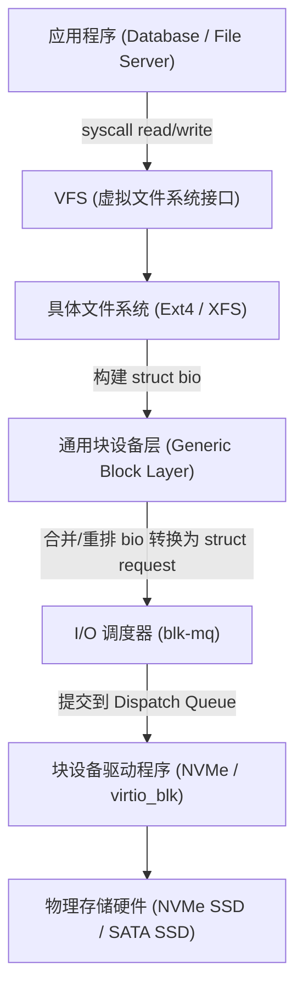

# Round 5: Linux I/O 子系统与存储性能调优指南

在高性能数据库（MySQL, PostgreSQL）、日志存储（Kafka, Elasticsearch）以及大容量文件存储系统中，磁盘 I/O 往往是整个架构中最容易遭遇瓶颈的物理组件。

本指南深入拆解 Linux 块设备层 `bio` 与 `request` 数据结构、NVMe 双队列 Doorbell 硬件寄存器机制、多队列 I/O 调度器选型、RAID/LVM 高级存储设计、`iostat` 黄金瓶颈指标诊断以及 `fio` 压测实战。

---

## 一、 Linux 块设备 (Block Layer) I/O 架构与 `bio`/`request` 数据结构

当应用程序发起 `write()` 或 `read()` 磁盘操作时，请求流经的内核各层路径如下：



### 内核核心 C 数据结构：
1. **`struct bio`**：代表上层（文件系统）发起的**原始 I/O 请求**。描述了物理内存页 (`bio_vec`) 与磁盘逻辑扇区 (`bi_sector`) 的映射。
2. **`struct request`**：由 I/O 调度层将多个物理相邻的 `bio` **合并 (Merge)** 后生成的大块请求，直接提交给底层硬件驱动。

---

## 二、 NVMe 控制器硬件 Doorbell 寄存器与 SQ/CQ 机制

现代 NVMe PCIe SSD 摒弃了传统的 AHCI/SATA 单队列模型，引入了 **SQ (Submission Queue, 提交队列)** 与 **CQ (Completion Queue, 完成队列)**：

```
+-------------------------------------------------------------------------+
| Host CPU (内存中分配的 SQ / CQ 环形队列)                                   |
|  1. 在 SQ 写入新 I/O 命令条目                                            |
|  4. 处理 CQ 完成通知                                                    |
+-------------------------------------------------------------------------+
       | (2. 写 Doorbell 寄存器)                     ^ (3. 硬件中断/DMA 完成)
       v                                            |
+-------------------------------------------------------------------------+
| NVMe PCIe SSD 控制器 (Physical Device Controller)                        |
|  - 拥有高达 64,000 个并行 SQ/CQ 队列                                     |
|  - 每个队列深度可达 64,000 个 Commands                                    |
+-------------------------------------------------------------------------+
```

### 物理工作历程：
1. **写入 SQ**：驱动在 Host 内存的 SQ 中填充一个 NVMe Command。
2. **响铃 (Write Doorbell)**：驱动向 NVMe 控制器的 **SQ Tail Doorbell 物理寄存器** 写入新尾部指针，通知硬件。
3. **硬件 DMA 提取与处理**：NVMe 芯片通过 PCIe DMA 直接提取 SQ 中的命令并执行。
4. **写入 CQ 并触发 Interrupt**：完成物理读写后，硬件将结果写入 CQ，并向 CPU 发送 MSI-X 中断。

---

## 三、 多队列 I/O 调度器 (`blk-mq`) 选型与调优

```bash
# 查看指定块设备 nvme0n1 当前支持与选用的 I/O 调度算法
cat /sys/block/nvme0n1/queue/scheduler
```

| 调度器名称 | 算法特点 | 最佳适用硬件与生产场景 |
| :--- | :--- | :--- |
| **`none`** | 完全不做任何 I/O 重排与合并，交由 NVMe 硬件控制器处理 | **NVMe PCIe SSD / 高性能云盘**（延迟最低，CPU 开销最小） |
| **`mq-deadline`** | 保证读写请求在截止时间内完成，读优先级高于写 | **SATA SSD / 企业级 HDD 数据库** |
| **`bfq`** | 按预算公平分配 I/O 频宽，防止大文件传输卡死其他应用 | 桌面系统、多租户交互式服务器 |
| **`kyber`** | 动态监控读写延迟，根据目标 Latency 自动限流 | 极度敏感的低延迟 NVMe 存储 |

---

## 四、 高性能存储 RAID 阵列与 LVM 薄供应快照

```bash
# 1. 创建 100G 薄池并分配 500G 薄卷
lvcreate -L 100G -T vg_data/thin_pool
lvcreate -V 500G -T vg_data/thin_pool -n lv_mysql_data

# 2. 对运行中的数据库卷创建秒级在线只读快照
lvcreate -s --name mysql_snap_20260804 /dev/vg_data/lv_mysql_data
```

---

## 五、 磁盘 I/O 性能诊断黄金指标 (`iostat`)

```bash
iostat -xz 1 5
```

| 指标列 | 物理含义 | 生产异常判定与排查建议 |
| :--- | :--- | :--- |
| **`r/s` & `w/s`** | 每秒完成的读/写 IOPS | 结合硬件规格评估（HDD 物理极限 150~200 IOPS，NVMe 数十万 IOPS） |
| **`r_await`** | 读请求在内核中的平均等待+处理时间 (ms) | **核心指标！** 若读等待超过 **10ms** (SSD)，应用查询将严重延迟 |
| **`w_await`** | 写请求在内核中的平均等待+处理时间 (ms) | **核心指标！** 若写等待过高，检查是否有频繁的 `fsync()` 导致队列积压 |
| **`aqu-sz`** | 平均 I/O 请求队列长度 | 若长期远大于磁盘并行度，说明存在严重 I/O 拥堵 |
| **`%util`** | 磁盘处于工作状态的时间百分比 | 注意：针对多队列 NVMe SSD，%util 达到 100% 并不代表性能顶格 |

---

## 六、 存储性能基准测试与压测利器 `fio`

```bash
# 测试 NVMe 随机 4K 写 IOPS (Direct I/O 绕过 Page Cache)
fio --name=randwrite_4k \
    --filename=/data/test.fio \
    --ioengine=libaio \
    --direct=1 \
    --rw=randwrite \
    --bs=4k \
    --size=5G \
    --numjobs=4 \
    --iodepth=64 \
    --runtime=60 \
    --time_based \
    --group_reporting
```

---
