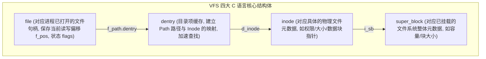

# Round 16: Linux 文件系统 VFS 与 Ext4/XFS 底层剖析指南

文件系统是 Linux 管理持久化存储的核心逻辑层。为什么对于大文件顺序读写推荐 XFS，而对于常规小文件推荐 Ext4？当应用程序写入数据时，VFS 抽象层是如何跨越不同物理文件系统完成元数据与数据块映射的？

本指南深入拆解内核 VFS 四大核心对象、Ext4 三大 Journaling 日志模式与 Extents 架构、XFS Allocation Groups 并行设计以及文件系统碎片整理与扩容实战。

---

## 一、 内核 VFS (Virtual File System) 抽象层四大核心对象

Linux VFS 是一层极其精妙的面向对象抽象接口，使得上层应用程序可以使用统一的 `open()`, `read()`, `write()` 调用处理 Ext4, XFS, Btrfs, NFS 甚至 `/proc` 伪文件系统。



### VFS 结构体职责详解：

1. **`struct super_block`**：代表一个完整装载的文件系统。保存挂载点、文件系统类型、块总数、未分配块数等全局信息。
2. **`struct inode`**：代表文件系统中的一个实体对象（普通文件、目录、设备文件）。**保存文件的真实元数据（所有者、权限、修改时间、文件字节数），但绝不保存文件名！**
3. **`struct dentry` (Directory Entry)**：目录项。内存中连接文件名与 Inode 的桥梁（例如 `/var/log/app.log` 对应 3 个 dentry 节点）。内核通过 dcache (dentry cache) 缓存极大地加速了路径解析。
4. **`struct file`**：代表进程打开的一个**打开上下文**。同一个文件被多个进程同时打开时，内存中会创建多个 `file` 结构体，但它们指向同一个 `inode`。

---

## 二、 Ext4 文件系统架构与 Extents 机制

Ext4 (Fourth Extended Filesystem) 是 Linux 社区最成熟、使用最广泛的日志文件系统。

### 1. Ext4 三大 Journaling (日志) 模式对比

Ext4 通过 JBD2 (Journaling Block Device) 模块实现数据一致性防断电损坏。

| 日志模式 | `mount` 挂载选项 | 物理运作机制 | 性能与数据安全权衡 |
| :--- | :--- | :--- | :--- |
| **`journal`** | `data=journal` | **所有数据页与元数据**在写入物理盘之前，必须先完整写入 Journal 日志区 | **安全最高，性能最差**（所有写操作 double-write，吞吐减半） |
| **`ordered`** (默认) | `data=ordered` | 仅将**元数据**写入 Journal 区；但内核**保证在元数据提交前，数据页已写入物理盘** | **最佳平衡点**（防止断电后元数据指向垃圾旧数据） |
| **`writeback`** | `data=writeback` | 仅将**元数据**写入 Journal 区；**不对数据页与元数据的落盘顺序做任何保证** | **性能最高，数据安全最差**（崩溃重启后可能出现旧数据覆盖新文件） |

#### 挂载配置示例：
```bash
# 在 /etc/fstab 中为高性能吞吐场景配置 writeback 模式
UUID=a1b2c3d4-xxx /data ext4 defaults,noatime,data=writeback,barrier=0 0 0
```

---

### 2. Extents 块区映射架构 (取代老旧间接块)

在旧的 Ext3 系统中，大文件依靠单重、双重、三重“间接块指针”索引数据块，在大文件随机 Seek 时产生多次磁盘 I/O。

Ext4 引入了 **Extents (连续块区)** 概念：使用一个简单元组 `(起始逻辑块, 物理块数量, 起始物理块)` 替代成千上万个连续块地址。

$$\text{Extent} = \{ \text{ee\_block} = 0, \text{ee\_len} = 1000, \text{ee\_start} = 524288 \}$$
*效果：只需 1 个 Extent 记录即可一次性映射 1000 个连续块（约 4MB），极大降低了 Inode 元数据尺寸与 B-Tree 检索深度！*

---

## 三、 XFS 文件系统高性能架构

XFS 是 Red Hat/CentOS 7/8/9 默认的企业级文件系统，专为超大容量存储与高并发并行 I/O 打造。

### 1. Allocation Groups (AG, 分配组) 并行 I/O 机制

XFS 在格式化时，会自动将整块大磁盘物理切分为多个等长的 **Allocation Groups (AG)**（通常为 8 到 64 个）。

```
+-------------------------------------------------------------------------+
|                              物理磁盘 (XFS)                              |
+------------------+------------------+------------------+----------------+
| Allocation Group | Allocation Group | Allocation Group | Allocation Group|
|       AG 0       |       AG 1       |       AG 2       |       AG 3     |
+------------------+------------------+------------------+----------------+
  |                  |                  |                  |
  v                  v                  v                  v
[独立 Inode 树]     [独立空闲空间 B+树]  [独立 AG 锁]       [多 CPU 并发写入]
```

* **并行优势**：每个 AG 拥有自己独立的 Inode 树、空闲空间 B+ 树与互斥锁。在多 CPU 内核中，**多个线程可以同时向不同的 AG 组发起并发写入，完全消除了全局文件系统锁竞争！**

---

### 2. XFS 双 B+ 树空间管理

每个 AG 使用两棵独立的 B+ 树管理空闲数据块：
1. **`bnobt` (By Block Number)**：按物理块号排序的 B+ 树，用于快速查找特定位置的空闲块（优化碎片重组）。
2. **`cntbt` (By Block Count)**：按连续长度排序的 B+ 树，用于快速分配符合指定尺寸的大块连续空间（优化大文件顺序写）。

---

## 四、 文件系统碎片整理、空间预分配与在线扩容

### 1. 延迟分配 (Delayed Allocation) 与空间预分配 (`fallocate`)

为了防止写文件时频繁触发磁盘块分配导致的碎片化：

* **延迟分配 (`delalloc`)**：当应用调用 `write()` 时，内核只在内存中标记 Page Cache，**暂不分配物理磁盘块**；直到 Flush 线程刷盘时，才一次性分配一块连续的物理 Extent。
* **预分配 (`fallocate`)**：在创建数据库数据文件或镜像时，使用 `fallocate` 在磁盘上直接锁定连续的空间，绕过零填充（Zero-fill）。

```bash
# 秒级预分配一个 50GB 绝对连续的物理文件 (极大减少文件碎片!)
fallocate -l 50G /data/mysql/ibdata1
```

---

### 2. 文件系统碎片整理实战

```bash
# 1. 评估 Ext4 分区的碎片化程度
e4defrag -c /dev/sda1

# 2. 对 Ext4 分区或指定目录在线进行碎片整理
e4defrag /data/

# 3. 对 XFS 文件系统进行碎片整理
xfs_fsr /dev/sdb1
```

---

### 3. 在线扩容文件系统 (Online Grow)

当底层 LVM 卷成功扩容后，需将文件系统逻辑边界扩展到新容量：

```bash
# 1. 针对 Ext4 文件系统在线扩容 (支持挂载状态扩容)
resize2fs /dev/vg_data/lv_data

# 2. 针对 XFS 文件系统在线扩容 (注意: XFS 扩容目标参数必须为挂载点目录而非设备路径!)
xfs_growfs /data
```

---
