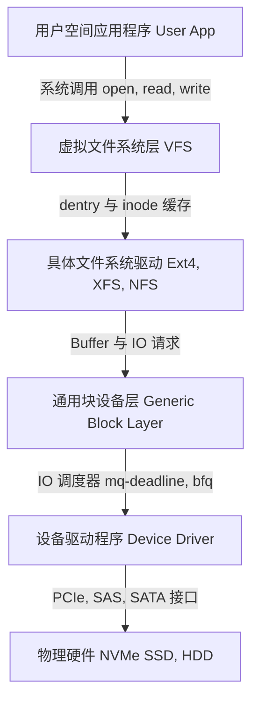

# Linux 文件系统底层原理与高阶调优深度指南

文件系统是 Linux 内核中用于组织、存储和管理数据块的最核心子系统。在生产环境的高并发、低延迟、海量小文件或超大文件等复杂场景下，仅仅掌握基础的挂载操作是远远不够的。

本指南将从 **虚拟文件系统 (VFS) 架构**、**两大经典文件系统 (Ext4/XFS) 底层设计**、**页缓存与 I/O 刷盘机制**、**高阶性能调优** 以及 **疑难故障深度排查** 五个维度，全面且深度地拆解 Linux 文件系统。

---

## 目录
- [一、 虚拟文件系统 (VFS) 底层架构](#一-虚拟文件系统-vfs-底层架构)
- [二、 常见文件系统磁盘布局与核心设计 (Ext4 vs XFS)](#二-常见文件系统磁盘布局与核心设计-ext4-vs-xfs)
- [三、 页缓存 (Page Cache) 与 I/O 栈物理路径](#三-页缓存-page-cache-与-io-栈物理路径)
- [四、 生产环境高性能挂载与系统调优参数](#四-生产环境高性能挂载与系统调优参数)
- [五、 文件系统高阶运维与黑客级排障指南](#五-文件系统高阶运维与黑客级排障指南)

---

## 一、 虚拟文件系统 (VFS) 底层架构

Linux 采用“一切皆文件”的设计哲学。为了向下兼容各种不同的物理文件系统（Ext4, XFS, NFS 等），向上为用户空间提供一致的系统调用接口（`open`, `read`, `write`），内核设计了 **虚拟文件系统 (VFS, Virtual File System)** 中间层。



### VFS 的四大核心数据结构

VFS 内部定义了四个关键的 C 语言结构体，它们串联起了整个文件系统的运作：

1.  **超级块对象 (`superblock`)**：
    *   代表一个**已安装的具体文件系统**。
    *   存储文件系统的控制信息（如块大小、挂载标志、文件系统类型、以及指向 `super_operations` 结构体的指针，该结构体包含操作具体超级块的函数表）。
2.  **索引节点对象 (`inode`)**：
    *   代表一个**具体的文件或目录**（在内核眼里，目录也是文件）。
    *   存储文件的元数据（大小、所有者、权限、修改时间以及指向物理磁盘块的映射指针）。
    *   只要文件存在，无论是否被打开，其 `inode` 都会在内存中保留或在需要时被调入。
3.  **目录项对象 (`dentry`)**：
    *   代表**路径中的一个分量**（如 `/data/mysql/data` 中的 `/`、`data`、`mysql`、`data` 都是 `dentry`）。
    *   **核心作用**：缓存文件名与 `inode` 编号的映射关系（即 `dentry cache`），避免每次读取文件时都要去扫描磁盘目录表，极大提升路径解析速度。
    *   `dentry` 是纯内存结构，不需要写回磁盘。
4.  **文件对象 (`file`)**：
    *   代表一个**进程已打开的文件**。
    *   存储进程与文件交互的动态状态（如文件打开模式 `O_RDWR`、当前读写偏移量 `f_pos`、文件操作函数表 `file_operations` 等）。
    *   同一个文件被不同进程（或同一个进程多次）打开时，会有多个 `file` 对象，但它们都指向同一个 `dentry` 和 `inode`。

---

## 二、 常见文件系统磁盘布局与核心设计 (Ext4 vs XFS)

### 1. Ext4 底层磁盘布局 (Disk Layout)

Ext4 沿用了传统的 **块组 (Block Group)** 机制，将连续的磁盘空间划分为若干个逻辑块组，以此来增强数据局部性（减少磁头寻道延迟）。

##### ① 分区级物理布局 (横向表示磁盘物理顺序)：


##### ② 单个块组内部结构 (以 Block Group 0 为例)：


*   **引导块 (Boot Block)**：占用分区最前 1KB 空间，用于存储引导装载程序（如 GRUB）。
*   **超级块 (Superblock)**：块组 0 中包含主超级块，其他部分块组包含其冗余备份。
*   **组描述符表 (Group Descriptors)**：记录所有块组的元数据信息（如本块组内空闲块数、空闲 Inode 数等）。
*   **块位图 (Block Bitmap)**：用二进制位（0/1）标记本块组内哪些 Data Block 已被占用。
*   **Inode 位图 (Inode Bitmap)**：用二进制位标记本块组内哪些 Inode 节点已被分配。
*   **Inode 表 (Inode Table)**：连续的磁盘空间，存放实际的 Inode 结构体。
*   **数据块 (Data Blocks)**：存放文件内容的实际区域。

#### Ext4 的核心改进：区段 (Extents)
在 Ext3 中，文件采用直接/间接块指针机制，当大文件很大时，需要多级指针索引，元数据开销巨大且容易产生碎片。
Ext4 引入了 **Extents 机制**：
*   一个 Extent 代表一段**连续的数据块**，用一个三元组表示：`(起始逻辑块号, 连续块数, 起始物理块号)`。
*   例如，一个 100MB 的文件如果物理上连续，在 Ext4 中只需要一个 Extent 记录即可（最多可覆盖 128MB 连续空间），大大减小了 `inode` 的体积 and 索引开销。

---

### 2. XFS 高并发架构与 B+ 树设计

XFS 是为了应对高性能、高并发和超大容量设计的企业级文件系统。它彻底摒弃了块组的设计，改用 **分配组 (Allocation Groups, AG)** 和 **B+ 树 (B+ Tree)** 结构。

##### ① 分区级物理布局 (横向表示磁盘物理顺序)：


##### ② 单个分配组 (AG 0) 内部详细结构：


#### 关键设计点：
*   **分配组 (AG)**：
    *   分区在格式化时会被分成 4 到 1024 个独立的 AG。
    *   每个 AG 相当于一个独立的文件系统，拥有自己独立的自由空间管理、Inode 分配和互斥锁。
    *   **高并发优势**：多个 CPU 核心或多线程并发写入时，内核可以将写入请求分发到不同的 AG 中并发执行，消除了传统文件系统单锁引发的写入瓶颈。
*   **无处不在的 B+ 树**：
    *   **空间管理**：XFS 在每个 AG 中维护两棵 B+ 树来管理空闲块。一棵树按空闲块的**物理地址**排序（快速合并相邻空闲块），另一棵按空闲块的**大小长度**排序（快速定位适合写入尺寸的空闲空间）。
    *   **Inode 管理**：Inode 是动态分配的，其物理位置和空闲状态通过专属 B+ 树跟踪，解决了 Inode 耗尽问题。

---

## 三、 页缓存 (Page Cache) 与 I/O 栈物理路径

### 1. 页缓存 (Page Cache) 机制

在 Linux 中，除显式指定直接 I/O (`O_DIRECT`) 外，所有的文件读写都会经过内核管理的 **页缓存 (Page Cache)**。页缓存利用物理内存来缓冲磁盘数据，极大缓解了磁盘与内存之间的速度差异。

*   **读过程 (Read Path)**：
    1. 进程发起 `read` 系统调用。
    2. 内核检查所需数据是否在页缓存中。
    3. **Hit**：直接拷贝内存数据到用户空间（无需磁盘 I/O，微秒级）。
    4. **Miss**：触发缺页中断或 I/O 请求，将磁盘块读入页缓存，然后再拷贝到用户空间。同时，内核通常会进行**预读 (Readahead)**。
*   **写过程 (Write Path)**：
    1. 进程发起 `write` 系统调用。
    2. 内核将数据从用户空间拷贝到页缓存对应的物理页中，该页被标记为 **脏页 (Dirty Page)**。
    3. 写入操作立即返回成功。具体何时将脏页写回磁盘（刷盘）由内核后台线程或进程显式同步决定。

### 2. 脏页刷盘内核参数与控制

控制脏页何时写回物理介质，是优化高吞吐写入系统的核心。常用内核参数位于 `/proc/sys/vm/`：

| 内核参数 | 默认值 | 作用说明 | 数据库场景调优建议 |
| :--- | :--- | :--- | :--- |
| `dirty_background_ratio` | 10 (%) | 当脏页占系统可用内存的比例达到该值时，内核**后台线程 (pdflush/flush)** 开始异步将脏页写入磁盘。 | 5 (降低延迟，避免一次性突发刷盘卡顿) |
| `dirty_background_bytes` | 0 (未启用) | 与 `dirty_background_ratio` 互斥。直接通过字节数触发异步刷盘。 | 针对大内存服务器（如 256G+），建议设置为 `1048576000` (1GB) |
| `dirty_ratio` | 20 (%) | 当脏页占系统总内存比例达到此临界点时，**所有的写系统调用会被阻塞 (Throttle)**，进程被迫同步参与刷盘。 | 10 - 15 (防止脏页堆积过多，造成 I/O 突发性占满) |
| `dirty_bytes` | 0 (未启用) | 与 `dirty_ratio` 互斥。限制进程同步刷盘的最大脏页字节数。 | 视应用写入流量而定 |
| `dirty_writeback_centisecs`| 500 (5s) | 内核后台刷盘线程定时唤醒的时间间隔（单位：厘秒，1/100秒）。 | 100 - 200 (更频繁地唤醒，平滑 I/O 曲线) |
| `dirty_expire_centisecs` | 3000 (30s)| 脏页在页缓存中允许驻留的最长时间（单位：厘秒）。超过此时间的脏页在下次唤醒时被强制写回。 | 1000 - 1500 (缩短生存期，防止突发断电丢失过多数据) |

#### 动态调优范例：
```bash
# 针对 128GB 内存的高并发数据库服务器调优
sysctl -w vm.dirty_background_bytes=1073741824  # 1GB 脏页就启动后台刷盘
sysctl -w vm.dirty_bytes=2147483648             # 2GB 脏页时阻塞应用写，强制刷盘
sysctl -w vm.dirty_writeback_centisecs=100      # 每 1 秒唤醒一次刷盘线程
sysctl -w vm.dirty_expire_centisecs=1000        # 脏页最长只能存在 10 秒
```

### 3. 同步操作：fsync vs fdatasync

应用若需要保证数据绝对安全落盘（例如 MySQL Redo Log 或 WAL），必须显式调用刷盘接口：
*   `sync`：将系统内所有页缓存的脏页排队写回，不保证完全落盘后才返回。
*   `fsync(fd)`：将指定文件的所有数据块以及 **元数据 (Metadata，如修改时间、大小等)** 强行写回磁盘，并阻塞等待磁盘控制器报告写入成功。
*   `fdatasync(fd)`：**性能更好**。只强行写回文件的 **数据块** 以及影响数据后续读取的必要元数据（如文件大小变化），而不强制写回非必要元数据（如文件的访问/修改时间戳）。

---

## 四、 生产环境高性能挂载与系统调优参数

挂载文件系统时，通过 `/etc/fstab` 传入合理的挂载参数，可以带来巨大的吞吐和延迟收益。

### 1. 通用高性能挂载参数推荐

```text
UUID=xxxx-xxxx /data xfs defaults,noatime,nodiratime,nobarrier,allocsize=64M,nofail 0 2
```

*   `noatime,nodiratime`：
    *   **原理**：默认情况下，每次读取文件或目录，内核都会写入磁盘更新文件的最后访问时间 (Access Time)。在大文件读取或小文件检索极其密集的场景下，这会产生高达 30%~50% 的额外写入压力。
    *   **作用**：完全禁用访问时间更新，只在写文件时更新 `mtime`。
*   `nobarrier`（针对带有电池/超级电容保护的硬件 RAID 卡或企业级 NVMe SSD）：
    *   **原理**：文件系统默认会启用写入屏障 (Write Barriers)，强制磁盘缓存按特定顺序写入以保证安全性。
    *   **作用**：如果底层物理硬件拥有可靠的断电保护缓存（如 RAID 卡带 BBU 电池，或 enterprise-grade PLP SSD），可以通过 `nobarrier`（Ext4）或 `barrier=0`（XFS）关闭屏障，能瞬间提升 20%~40% 的随机写性能。
    *   > [!CAUTION]
    *   > **严禁在无断电保护的普通消费级 SSD 或 HDD 上使用此选项，否则断电极易造成文件系统严重损坏！**

### 2. Ext4 专属优化参数

*   `commit=N`：
    *   **原理**：控制 Ext4 元数据和数据同步回物理磁盘的周期，默认为 5 秒。
    *   **调优**：在允许丢失少量秒级数据的应用场景下，将其设置为 `commit=60`（1分钟），可将零碎的 I/O 合并为大块顺序 I/O 写出，大幅降低磁盘负载。
*   `data=writeback`：
    *   **原理**：仅记录元数据日志，允许数据在元数据修改前或修改后落盘。
    *   **调优**：极力榨取写入性能时配置（需配合 `tune2fs -o journal_data_writeback` 固化参数）。

### 3. XFS 专属优化参数

*   `allocsize=size`：
    *   **原理**：当文件以追加写入时，XFS 会默认预分配一定的物理磁盘空间以避免物理块碎片。
    *   **调优**：对于频繁追加写入的超大文件（如数据库数据文件、大型日志文件），建议设置 `allocsize=64M` 或 `128M`，可以生成更加连续的磁盘布局。
*   `logbufs=8,logbsize=256k`：
    *   **作用**：增大内存中缓冲 XFS 文件系统元数据日志的缓冲区大小（默认日志缓冲可能仅有 32k）。在高并发小文件创建/删除场景下，能显著降低日志锁定冲突。

---

## 五、 文件系统高阶运维与黑客级排障指南

### 1. “空间蒸发”之谜：df 与 du 结果不一致

#### 现象：
磁盘报警，运行 `df -h` 显示磁盘空间占用 100%，然而运行 `du -sh /data` 发现文件总大小加起来才 20GB，还有几百 GB 空间不翼而飞。

#### 根源：
*   当一个进程正在向文件 `app.log` 写入数据时，另一个管理员运行了 `rm app.log` 删除了该文件。
*   在 Linux 中，删除文件时如果其**引用计数（Link Count）降为 0**，且**没有进程打开它**，其空间才会被真正释放。
*   但如果有进程依然维持着打开的句柄（File Descriptor），内核仅会将该文件从目录树中“隐形”，并**不释放物理磁盘块**，导致 `du` 统计不到，而 `df` 显示被占用。

#### 排查与解决步骤：
1.  **定位被删除但仍被进程占用的文件**：
    ```bash
    # 使用 lsof 寻找状态为 deleted 的文件句柄
    lsof +L1
    # 或者
    lsof | grep -i deleted
    ```
    *输出示例：*
    ```text
    COMMAND   PID USER   FD   TYPE DEVICE SIZE/OFF NLINK NODE NAME
    java    18902 root    4w   REG  253,1 429496729600     0 234125 /var/log/app.log (deleted)
    ```
    *可见，PID 18902 的 Java 进程持有着已被删除的 `app.log`，占用了 400GB 空间。*
2.  **不重启服务的安全释放手段**：
    绝对不能随意 kill 生产环境的业务进程。可以直接通过向该进程的文件描述符（File Descriptor）写入空数据来**截断（Truncate）**文件：
    ```bash
    # 路径格式为 /proc/[PID]/fd/[FD_NUM]
    true > /proc/18902/fd/4
    ```
    *执行该命令后，文件大小瞬间变为 0，磁盘空间会被立即释放，且不会损坏正在运行的进程。*

---

### 2. 深入解决 inode 耗尽问题

#### 现象：
运行写入命令或创建文件时报错 `No space left on device`，但 `df -h` 依然显示有充足的 GB 剩余空间。

#### 排查：
运行 `df -i` 检查系统的 Inode 使用情况：
```bash
$ df -i
Filesystem     Inodes  IUsed  IFree IUse% Mounted on
/dev/vdb1     6553600 6553600      0  100% /data
```
*`IUse%` 达 100%，表明 Inode 位图已被完全分光。*

#### 解决方案：
1.  **快速定位小文件最多的目录**：
    编写高效的单行 Shell 脚本，避免直接使用 `find` 耗费巨量内存卡死系统：
    ```bash
    # 统计 /data 下各子目录所包含的文件数量并排序
    find /data -xdev -type d -exec sh -c 'echo "$(find "$1" -type f | wc -l) $1"' _ {} \; | sort -nr | head -20
    ```
2.  **清理与规避**：
    *   通常原因为：海量缓存文件未自动清理、定时任务 Crontab 产生的未发送邮件小文件（位于 `/var/spool/postfix/maildrop/`）堆积。
    *   删除海量小文件时，切记**不要**使用 `rm -rf *`（会导致参数列表过长 `Argument list too long` 报错），应当使用 `rsync` 快速清空：
        ```bash
        mkdir -p /tmp/empty/
        rsync --delete-before -a -H -v --progress /tmp/empty/ /data/bad_dir/
        ```
    *   对于天然必须存储海量小文件的分区（如邮件服务器、头像存储），在格式化时必须显式指定较小的 `-i` 比例（例如 `mkfs.ext4 -i 2048`）来生成更多的 Inode。

---

### 3. 文件系统碎片检测与整理

尽管 Ext4 和 XFS 内部有强大的块分配策略来防范文件碎片，但随着时间的推移和频繁的写/删，依然会产生外部碎片，导致连续读取性能下降。

#### 1) Ext4 碎片整理

*   **检测碎片率**：
    ```bash
    # e4defrag -c 检测指定目录或文件的碎片情况
    e4defrag -c /data/
    ```
    *如果输出中 Fragmentation score（碎片评分）大于 30-40，则建议进行整理。*
*   **在线整理碎片**（安全，支持在线运行）：
    ```bash
    e4defrag /data/
    ```

#### 2) XFS 碎片整理

*   **检测碎片率**：
    ```bash
    # xfs_db 用以查询 XFS 内部结构状态
    xfs_db -c frag -r /dev/vdb1
    ```
*   **在线整理碎片**：
    使用 `xfs_fsr` (File System Reorganizer) 工具：
    ```bash
    xfs_fsr /dev/vdb1
    ```
    *`xfs_fsr` 会在后台以低优先级重组数据块布局，保证数据连续，且不影响前台业务的正常读写。*
