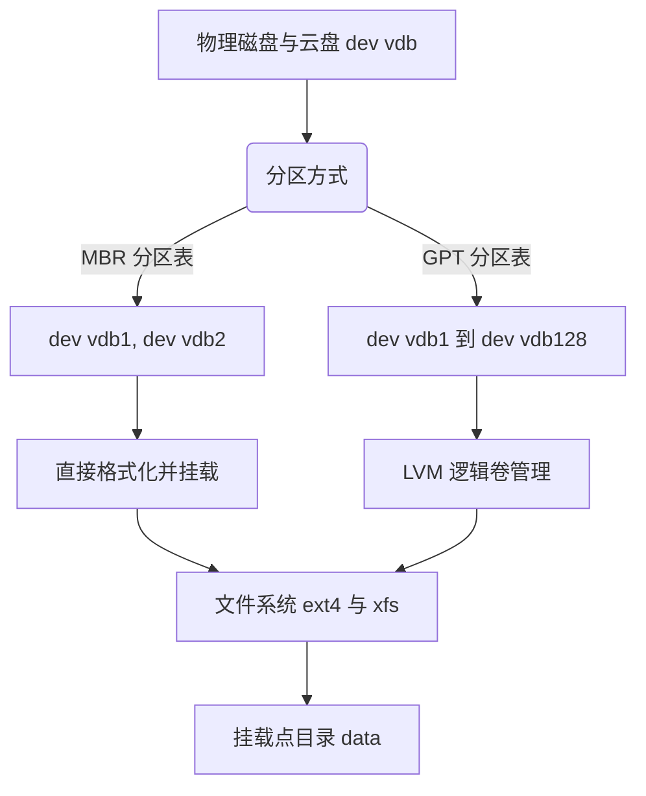

# Linux 数据盘挂载与存储管理技术指南

在 Linux 系统（尤其是服务器及云环境）中，新增的物理硬盘或云盘默认是无法直接读取的。必须经过**识别磁盘、磁盘分区、格式化文件系统、挂载、以及配置开机自动挂载**这五个基本步骤。而在企业级生产环境中，更推荐使用 **LVM（逻辑卷管理）** 方式来方便后续的在线扩容。

本指南将深入拆解 Linux 数据盘挂载的整个技术生命周期，包括传统分区挂载、LVM 动态存储管理、性能调优以及常见故障的恢复方法。

---

## 一、 核心概念与存储工作流

在进行任何磁盘操作之前，需明确 Linux 下的存储层次关系：



*   **物理设备（Device）**：如 `/dev/sda`、`/dev/vdb` 或 NVMe 协议的 `/dev/nvme0n1`。
*   **磁盘分区（Partition）**：物理磁盘上的逻辑划分。
*   **逻辑卷（LVM）**：屏蔽物理硬盘层，将多个物理硬盘聚合成“卷组”，实现动态扩容。
*   **文件系统（File System）**：管理数据读写的组织格式，如 `ext4`、`xfs`。
*   **挂载点（Mount Point）**：Linux 文件树上的普通目录，作为访问文件系统的入口。

---

## 二、 步骤一：识别与检查磁盘设备

新接入磁盘后，首先需要确认内核是否成功加载了设备。

### 1. 核心检测命令
*   `lsblk`：**首选命令**。以树状图展示块设备结构、挂载点及容量。
*   `fdisk -l`：列出所有磁盘的分区表信息（针对 MBR 分区和小于 2TB 的磁盘）。
*   `parted -l`：列出磁盘的分区格式（GPT/MBR）及详细容量。
*   `df -hT`：查看当前已挂载的文件系统，**用于核对哪些磁盘已被使用，避免误格式化**。

### 2. 实践范例
运行 `lsblk` 命令：
```bash
$ lsblk
NAME    MAJ:MIN RM  SIZE RO TYPE MOUNTPOINT
vda     253:0    0   40G  0 disk 
└─vda1  253:1    0   40G  0 part /
vdb     253:16   0  100G  0 disk 
```
*如上所示，`/dev/vda1` 是系统盘，已挂载到根目录 `/`；而 `/dev/vdb` 是一块 100G 的全新数据盘，目前尚未分区和挂载。*

---

## 三、 步骤二：磁盘分区（MBR vs GPT）

根据磁盘容量和引导方式，选择合适的分区表格式：

| 特性 | MBR (Master Boot Record) | GPT (GUID Partition Table) |
| :--- | :--- | :--- |
| **最大支持容量** | 2.2 TB (以 512 字节扇区计算) | 9.4 ZB ($9.4 \times 10^9$ TB) |
| **分区限制** | 最大 4 个主分区（或 3 主分区 + 1 扩展分区） | 默认最大 128 个分区 |
| **冗余性** | 无备份，扇区 0 损坏后分区表丢失 | 磁盘头部和尾部均有备份，支持 CRC 校验 |
| **适用场景** | 传统老旧系统、磁盘容量 < 2TB | 现代 UEFI 系统、磁盘容量 $\ge$ 2TB（推荐） |

---

### 方法 A：使用 `fdisk` 进行 MBR 分区（适用于 < 2TB 磁盘）

`fdisk` 是一种交互式的命令行工具。

1. 进入交互界面：
   ```bash
   fdisk /dev/vdb
   ```
2. 交互常用快捷键：
   *   `p`：查看当前分区表。
   *   `n`：创建新分区（会提示选择 `p` 主分区 或 `e` 扩展分区）。
   *   `d`：删除分区。
   *   `w`：**保存并写入分区表（此时操作才会真正生效）**。
   *   `q`：不保存退出。
3. **操作流程**：输入 `n` $\rightarrow$ 选择 `p`（主分区） $\rightarrow$ 输入分区号 `1` $\rightarrow$ 起始扇区默认（直接回车） $\rightarrow$ 结束扇区默认（直接回车，即分配全部空间） $\rightarrow$ 输入 `w` 保存写入。

---

### 方法 B：使用 `parted` 进行 GPT 分区（适用于 $\ge$ 2TB 磁盘）

`parted` 既支持交互，也支持单行脚本非交互式运行。

#### 1. 非交互式快速分区（脚本化首选）：
```bash
# 1. 将分区表格式化为 GPT
parted /dev/vdb mklabel gpt

# 2. 将整块盘划分为一个主分区，类型为 ext4（也可以是 xfs），空间为 0% 到 100%
parted /dev/vdb mkpart primary ext4 0% 100%
```

#### 2. 交互式分区：
```bash
$ parted /dev/vdb
(parted) mklabel gpt                  # 设为 GPT 分区表
(parted) mkpart primary xfs 0% 100%   # 创建分区
(parted) print                        # 打印查看分区状态
(parted) quit                         # 退出
```

> [!NOTE]
> 分区完成后，Linux 内核可能不会立即刷新分区表。建议运行 `partprobe /dev/vdb` 或 `udevadm settle` 强制内核重新读取分区表，以防后续格式化报错找不到设备。

---

## 四、 步骤三：格式化与文件系统深度解析

分区完成后，使用 `lsblk` 会发现多出了 `/dev/vdb1`。接下来需要格式化并创建文件系统。选择何种文件系统以及如何针对特定场景进行调优，对系统后续的 I/O 性能和稳定性至关重要。

### 1. 常见文件系统特性深度对比

在 Linux 生态中，常用的主流文件系统包括 Ext4、XFS、Btrfs 以及近年来在 Linux 上应用广泛的 OpenZFS。

| 特性 | Ext4 | XFS | Btrfs (B-tree FS) | OpenZFS |
| :--- | :--- | :--- | :--- | :--- |
| **设计核心** | 稳定、向后兼容、单机通用 | 高并发、超大型文件与大容量存储 | 写时复制 (CoW)、高容错、系统快照 | 文件系统与卷管理合一、极致数据安全与缓存 |
| **最大文件大小** | 16 TB | 8 EB (约 800万 TB) | 16 EB | 16 EB |
| **最大文件系统容量**| 1 EB | 8 EB | 16 EB | 256 ZiB |
| **元数据与目录结构**| Htree (常数时间哈希树) | B+ 树 (高度优化大目录) | B 树 (全对象管理) | Merkle Tree (自愈校验树) |
| **扩容与缩容** | 支持在线扩容 / 支持离线缩容 | 支持在线扩容 / **不支持缩容** | 支持在线扩容 / 支持在线缩容 | 支持在线扩容 / **不支持缩容** (部分RAIDZ配置限制) |
| **写时复制 (CoW)** | 否 (直接覆写) | 否 (直接覆写，新内核支持reflink) | 是 (Copy-on-Write) | 是 (Copy-on-Write) |
| **原生快照/克隆** | 否 | 否 | 是 (秒级可读写快照) | 是 (秒级只读/可写克隆) |
| **内置 RAID/卷管理**| 否 (需配合 mdadm/LVM) | 否 (需配合 LVM) | 是 (支持 RAID 0/1/5/6/10) | 是 (内置 Storage Pool, RAIDZ1/2/3) |
| **数据校验与自愈** | 仅元数据校验 | 仅元数据校验 (v5 格式) | 数据与元数据 CRC32c 校验自愈 | 端到端校验，结合镜像/RAIDZ自动修复 |
| **适用场景** | 传统单机、Linux 系统盘、小型数据库 | 大型企业级存储、高性能大文件、CentOS/RHEL默认 | 容器后端存储 (Docker/Podman)、备份服务器、开发机 | 企业存储服务器、高容错 NAS、虚拟化存储后端 |

---

### 2. 文件系统底层核心概念

理解文件系统的内部结构有助于进行更深层次的性能调优和故障排查：

*   **超级块 (Superblock)**：
    *   存储整个文件系统的全局元数据（如块大小、总块数、空闲块数、Inode 总数、挂载时间等）。
    *   超级块是文件系统的命脉，如果损坏将导致无法挂载。格式化时会在不同位置自动写入多个**备份超级块**（Backup Superblocks），可用于故障恢复。
*   **索引节点 (Inode)**：
    *   每个文件或目录在文件系统中都有一个唯一的 Inode 编号。
    *   Inode 存储文件的元数据（权限、所有者、大小、修改时间、数据块指针等），但**不存储文件名**。文件名与 Inode 的映射关系存储在该文件所在目录的 Data Block 中。
    *   **Ext4 的 Inode 数量在格式化时固定**，一旦耗尽，即使磁盘有剩余空间也无法创建新文件；**XFS 的 Inode 是动态分配的**，不容易被耗尽。
*   **块组 (Block Group) / 分配组 (Allocation Group)**：
    *   为了减少磁盘磁头寻道延迟，文件系统将连续的空间划分为块组（Ext4）或分配组（XFS，简称 AG）。
    *   每个组内都包含独立的 Inode 位图、块位图、Inode 表和数据块。
    *   **XFS 的 Allocation Group (AG) 是多线程并发写入的关键**。多个 AG 允许不同的核心/线程并发地在其对应的组内分配和释放块，避免了全局锁竞争。
*   **日志区 (Journal / Write-Ahead Log)**：
    *   在将数据和元数据真正写入磁盘前，先将其修改记录写入一段连续的、循环的日志区域。
    *   当发生异常断电时，系统只需扫描并重放（Replay）日志区的未完成事务，即可在几秒钟内恢复文件系统的一致性，省去了全面扫描磁盘（fsck）的漫长时间。

---

### 3. 格式化高级参数与调优

在创建文件系统（格式化）时，针对特定负载（如小文件、数据库、大文件等）配置参数，能大幅提升性能和空间利用率。

#### 1) Ext4 格式化调优

*   **自定义块大小 (Block Size)**：
    *   默认是 4KB (`4096` 字节)。
    *   `mkfs.ext4 -b 1024 /dev/vdb1`：对于存放大海量极小文件（如小图片、网页缓存，大小 < 1KB）的磁盘，1KB 块大小能节省大量空间。
    *   `mkfs.ext4 -b 4096 /dev/vdb1`：对于大文件或数据库，应使用默认的 4KB。
*   **调整 Inode 密度/比例 (`-i`) 或 数量 (`-N`)**：
    *   `-i <bytes-per-inode>`：指每多少字节的磁盘空间分配一个 Inode。数值越小，生成的 Inode 总数越多，适合小文件存储。
    *   `mkfs.ext4 -i 4096 /dev/vdb1`：每 4KB 分配一个 Inode（默认通常是 16KB）。
*   **调整保留空间比例 (`-m`)**：
    *   默认情况下，Ext4 会保留 **5%** 的磁盘空间给系统管理员（`root` 账户），用于防止系统盘被写满后核心进程崩溃，或用于减少文件碎片。
    *   **对于非系统盘的数据盘**，5% 相当于在 10TB 的盘上浪费了 500GB 空间。可通过 `-m` 将其调整为 1% 或 0%：
        ```bash
        mkfs.ext4 -m 1 /dev/vdb1   # 保留比例降至 1%
        ```
*   **选择日志模式 (Journal Mode)**：
    *   `data=journal`：最安全。数据和元数据都写入日志，写入性能最差。
    *   `data=ordered`（默认）：先将数据写入文件，再将元数据写入日志。兼顾安全与性能。
    *   `data=writeback`：最高性能。不保证数据先于元数据落盘，可能在断电时导致文件出现脏数据，但并发写入速度极快。

#### 2) XFS 格式化调优

*   **调整 Allocation Groups (分配组) 数量 (`agcount`)**：
    *   在高并发写入、高 CPU 核心数服务器上，默认的分配组数量（通常是 4）可能成为瓶颈。
    *   可以根据 CPU 线程数调整 `agcount`：
        ```bash
        # 强制格式化，指定分配组数量为 16
        mkfs.xfs -f -d agcount=16 /dev/vdb1
        ```
*   **调整 Inode 大小 (`-i size`)**：
    *   默认 Inode 大小是 512 字节。如果在文件系统中使用大量的扩展属性（Extended Attributes，例如 Ceph OSD 磁盘、GlusterFS 存储等），可以增加 Inode 尺寸：
        ```bash
        mkfs.xfs -f -i size=2048 /dev/vdb1
        ```
*   **块大小控制 (`-b size`)**：
    *   与 Ext4 类似，但 XFS 仅支持系统内存页面大小以下（如 4KB）的块。
        ```bash
        mkfs.xfs -f -b size=4096 /dev/vdb1
        ```

---

### 4. 文件系统状态查询与在线调优工具

格式化并运行后，可以使用专门的系统工具查看底层细节或动态调整参数。

#### 1) Ext4 调优工具

*   **查看详细的超级块信息**：
    ```bash
    dumpe2fs -h /dev/vdb1
    # 或者使用更精炼的工具
    tune2fs -l /dev/vdb1
    ```
    *在输出中可以查看到 `Block size`, `Reserved block count`, `Filesystem features`, `Default mount options` 等。*
*   **在线修改保留块比例**（无需卸载文件系统）：
    ```bash
    tune2fs -m 0.5 /dev/vdb1   # 在线将保留块比例降为 0.5%
    ```
*   **设置默认挂载选项**（使其在不需要修改 `/etc/fstab` 的情况下，只要挂载就自动生效）：
    ```bash
    tune2fs -o noatime,journal_data_writeback /dev/vdb1
    ```

#### 2) XFS 调优工具

*   **查看几何构造与运行信息**（必须在文件系统已挂载状态下运行，指定挂载点路径）：
    ```bash
    xfs_info /data
    ```
    *会输出 `sectsz` (扇区大小)、`bsize` (块大小)、`blocks`、`agcount` 等。*
*   **修改文件系统标签（Label）或 UUID**（需要在未挂载状态下）：
    ```bash
    # 修改 Label 为 DATA_DISK
    xfs_admin -L "DATA_DISK" /dev/vdb1
    # 重新生成随机 UUID
    xfs_admin -U generate /dev/vdb1
    ```

---

### 5. 一致性检查与修复 (Fsck & Repair)

当遭遇非正常断电、系统崩溃或硬件坏道时，文件系统可能发生元数据损坏，必须在**完全卸载挂载 (Unmount)** 状态下运行修复工具。

> [!CAUTION]
> **绝对禁止在挂载（Mount）状态下运行 `fsck` 或 `xfs_repair`！**
> 否则会导致极其严重的二次损坏，使得数据彻底丢失。

#### 1) Ext4 检查与修复

*   检查文件系统：
    ```bash
    # -f 强制检查，-n 仅以只读模式检测不作修改
    e2fsck -fn /dev/vdb1
    ```
*   修复文件系统：
    ```bash
    # -y 自动对所有修复提示回答 "yes"
    e2fsck -fy /dev/vdb1
    ```

#### 2) XFS 检查与修复

*   检查文件系统：
    ```bash
    # -n 只读检测，不写入修改
    xfs_repair -n /dev/vdb1
    ```
*   修复文件系统：
    ```bash
    xfs_repair /dev/vdb1
    ```
*   **如果日志文件系统损坏（Dirty Log）导致修复失败**：
    通常发生在异常断电后，日志内还有未落盘事务，而 `xfs_repair` 默认会提示你先挂载重放日志。如果无法挂载，可以使用 `-L` 参数强制清除日志区（可能会丢失断电瞬间的部分事务/未落盘数据）：
    ```bash
    xfs_repair -L /dev/vdb1
    ```
*   *注：Linux 系统中的 `fsck.xfs` 实际上是一个空壳脚本，只会直接返回 0。这是因为 XFS 的一致性保证依赖其挂载时的自动重放机制，手动修复必须使用 `xfs_repair`。*

---

## 五、 步骤四：手动挂载测试

文件系统创建好后，即可挂载到指定目录。

1. **创建挂载点**：
   ```bash
   mkdir -p /data
   ```
2. **临时挂载**：
   ```bash
   mount /dev/vdb1 /data
   ```
3. **验证挂载**：
   ```bash
   df -hT | grep /data
   ```
   *输出示例：*
   ```text
   /dev/vdb1      xfs        100G  33M  100G   1% /data
   ```

---

## 六、 步骤五：配置永久挂载（修改 `/etc/fstab`）

手动挂载在系统重启后会失效，必须写入 `/etc/fstab` 配置文件。

> [!WARNING]
> **绝对不要直接使用设备名（如 `/dev/vdb1`）配置自动挂载！**
> Linux 系统的盘符在重启、添加新硬件或虚拟机迁移时可能会发生飘移（例如 `/dev/vdb` 变成 `/dev/vdc`），导致系统挂载错误，甚至导致数据被覆盖覆盖或无法开机。**必须使用 UUID 挂载。**

### 1. 获取磁盘的 UUID
运行 `blkid` 命令获取分区的 UUID：
```bash
$ blkid /dev/vdb1
/dev/vdb1: UUID="9e8a7c6b-5d4c-3b2a-1a0f-e9d8c7b6a5f4" TYPE="xfs" PARTLABEL="primary" PARTUUID="..."
```

### 2. `/etc/fstab` 详解与配置
`/etc/fstab` 每一行包含 6 个字段，以空格或 Tab 分隔：

```text
[设备标识符(UUID)]  [挂载路径]  [文件系统类型]  [挂载参数]  [是否备份(dump)]  [自检顺序(fsck)]
```

| 字段 | 示例值 | 说明 |
| :--- | :--- | :--- |
| **1. 设备标识符** | `UUID=9e8a7c6b-...` | 指定分区的全局唯一标识符。 |
| **2. 挂载路径** | `/data` | 必须是已经创建好的绝对路径目录。 |
| **3. 文件系统** | `xfs` | 须与格式化时一致（ext4 / xfs / nfs 等）。 |
| **4. 挂载参数** | `defaults,noatime,nofail` | 控制文件系统挂载行为的参数组合（见下文分析）。 |
| **5. 是否备份** | `0` | 0 表示不进行 dump 备份，1 表示每日备份。通常设为 `0`。 |
| **6. 自检顺序** | `2` | 0 表示不自检；1 表示根目录首检（仅根分区设为 1）；2 表示其他数据盘。 |

#### 挂载参数推荐：
*   `defaults`：默认值，包含 `rw, suid, dev, exec, auto, nouser, async`。
*   `noatime`：**性能优化推荐**。不更新文件的访问时间（Access Time），可大幅减少磁盘写操作（特别是对高并发数据库或 SSD）。
*   `nofail`：**生产环境必加参数**。如果磁盘由于硬件故障或网络云盘未就绪无法挂载，**系统仍能正常开机**，不会卡死在应急 Shell（Emergency Mode）。

### 3. 修改步骤
编辑 `/etc/fstab`，在文件末尾追加：
```text
UUID=9e8a7c6b-5d4c-3b2a-1a0f-e9d8c7b6a5f4 /data xfs defaults,noatime,nofail 0 2
```

### 4. 关键验证：测试挂载（极其重要！）
在修改完 `/etc/fstab` 后，**千万不要直接重启！** 必须运行以下命令进行压力测试：
```bash
mount -a
```
*   `mount -a` 会尝试挂载 `/etc/fstab` 中配置的所有未挂载项。
*   如果执行命令后**无任何输出**，说明配置完全正确。
*   如果有任何报错（如语法错误、UUID 错误等），必须立即修正，否则重启将面临无法开机。

---

## 七、 进阶：基于 LVM (逻辑卷管理) 挂载与动态扩容

传统的磁盘挂载（直接挂载 `/dev/vdb1`）在空间不足时，无法实现无缝的在线扩容。而在生产环境中，通常推荐采用 **LVM** 方案。

### LVM 架构关系：
`物理磁盘 (PV) ──> 卷组池 (VG) ──> 划分逻辑卷 (LV) ──> 格式化文件系统 ──> 挂载点`

### 1. LVM 创建与挂载流程

假设我们要将新磁盘 `/dev/vdb` 全部用于 LVM 并挂载到 `/data`：

```bash
# 步骤 1: 创建物理卷 (PV - Physical Volume)
pvcreate /dev/vdb

# 步骤 2: 创建卷组 (VG - Volume Group)，命名为 vg_data
vgcreate vg_data /dev/vdb

# 步骤 3: 从 vg_data 中划分逻辑卷 (LV - Logical Volume)，使用全部空间，命名为 lv_data
lvcreate -l 100%FREE -n lv_data vg_data

# 步骤 4: 格式化逻辑卷（LVM 路径格式为 /dev/卷组名/逻辑卷名）
mkfs.xfs -f /dev/vg_data/lv_data

# 步骤 5: 创建挂载点并临时挂载
mkdir -p /data
mount /dev/vg_data/lv_data /data
```

### 2. 写入 `/etc/fstab` 自动挂载
LVM 也可以用它的设备路径（其路径在设备映射器中是固定的，重启不会变）或 UUID 挂载：
```text
/dev/vg_data/lv_data /data xfs defaults,noatime,nofail 0 2
```
同样，编辑后务必执行 `mount -a` 检验。

---

### 3. LVM 的核心优势：在线动态扩容

当服务器又新增了一块 100G 的磁盘 `/dev/vdc`，且 `/data` 空间快满了，可以通过以下步骤**在不卸载挂载、不停机的情况下**完成在线扩容：

```bash
# 步骤 1: 将新磁盘 /dev/vdc 初始化为物理卷 (PV)
pvcreate /dev/vdc

# 步骤 2: 将新物理卷扩容到现有的卷组 vg_data
vgextend vg_data /dev/vdc

# 步骤 3: 扩容逻辑卷 lv_data。-l +100%FREE 表示将卷组中所有新增的闲置空间都分给此 LV
lvextend -l +100%FREE /dev/vg_data/lv_data

# 步骤 4: 在线刷新文件系统（不影响数据读写）
# 如果是 ext4 文件系统:
resize2fs /dev/vg_data/lv_data

# 如果是 xfs 文件系统（注意：xfs_growfs 后面接的是挂载点路径，而不是设备路径）:
xfs_growfs /data
```
运行 `df -h` 验证，挂载点 `/data` 空间已无缝增大到 200G。

---

## 八、 常见故障排查与恢复指南

### 1. 重启后系统卡在 Emergency Mode (紧急救援模式)
*   **病因**：`/etc/fstab` 文件中有语法错误、UUID 抄写错误，或者挂载的分区损坏，且挂载参数中**没有配置 `nofail`**。
*   **诊断与恢复**：
    1. 在救援终端输入 `root` 账户密码登录。
    2. 尝试执行 `mount -o remount,rw /`，将只读的根分区重新挂载为**可读写**状态，否则无法保存对 `/etc/fstab` 的修改。
    3. 编辑 `/etc/fstab`：
       *   如果是临时外接磁盘丢失，使用 `#` 注释掉出错的挂载行。
       *   如果配置错误，修正 UUID 或参数。
    4. 执行 `mount -a` 确保无报错。
    5. 输入 `reboot` 重启系统。

### 2. 卸载磁盘时报错 `device is busy`
*   **病因**：有进程正在访问挂载目录（例如当前 Shell 处于该目录下，或有应用正在向该目录读写数据）。
*   **解决方法**：
    1. 使用 `lsof` 或 `fuser` 定位占用进程：
       ```bash
       lsof +D /data
       # 或者
       fuser -v -m /data
       ```
    2. 结束占用磁盘的进程：
       ```bash
       fuser -k -9 -m /data
       ```
    3. 如果依然无法卸载，可以使用**延迟卸载 (Lazy Unmount)**。它会立即将该文件系统从系统目录树中脱钩，等所有占用该磁盘的进程结束后再彻底释放设备：
       ```bash
       umount -l /data
       ```

### 3. 磁盘 inode 耗尽，导致无法写入数据
*   **病因**：磁盘虽然还有很多 GB 的剩余空间，但是系统内小文件数量过多（例如海量缓存、日志小文件），导致 inode 节点被分光。
*   **诊断**：
   ```bash
   df -i
   ```
   *若发现 IUse% 达到 100%，则无法再创建任何新文件，即使 `df -h` 显示剩余容量充足。*
*   **解决方案**：
    1. 找出包含小文件最多的目录：
       ```bash
       find /data -xdev -type d -exec sh -c 'echo "$(find "$1" -type f | wc -l) $1"' _ {} \; | sort -nr | head -30
       ```
    2. 删除不需要的临时小文件、缓存文件或历史小日志。
