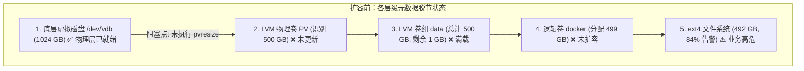
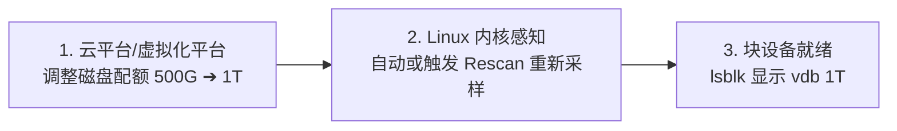
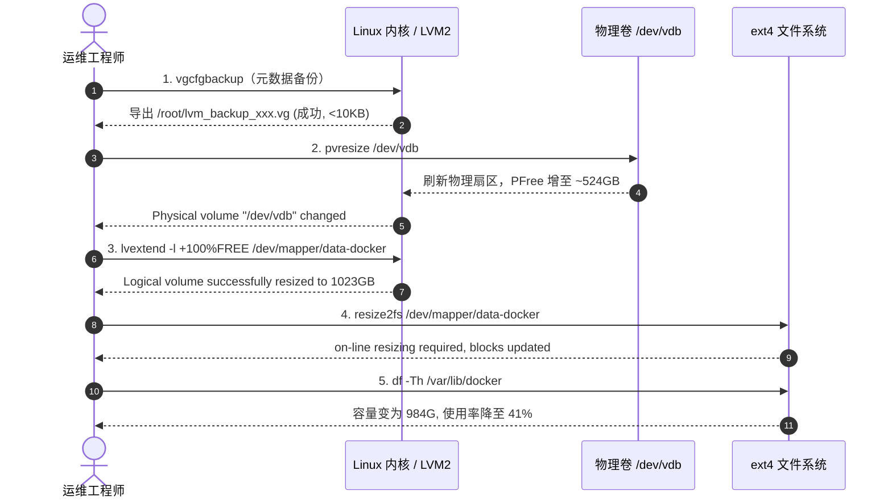

# 生产环境 LVM 在线无损扩容标准操作规程 (SOP)

> [!IMPORTANT]
> **操作级别**：【紧急 / 常规生产变更】
> **变更影响**：**零停机（Zero-Downtime）**、无业务中断、文件系统在线平滑扩容、数据 100% 原位保留。
> **前置要求**：具备生产服务器 `root` 或 `sudo` 权限，底层虚拟磁盘/物理磁盘已在云平台或宿主机完成容量扩容。

---

## 1. 业务背景与架构诊断 (Case Study)

### 1.1 典型生产故障场景
在生产环境的容器节点（如 Kubernetes Node、EFK 日志收集节点）中，Docker 容器镜像层、可写层及持久化日志频繁写入，极易触发磁盘高水位告警（如使用率超 80%）。

**典型案例场景**：
* **节点角色**：EFK 日志收集与容器计算节点 (`efk`)
* **告警指标**：`/var/lib/docker` 磁盘使用率达到 **84%**（已用 389G，仅剩 78G，逼近 85% 业务熔断水位）
* **存储拓扑**：底层虚拟磁盘 `vdb` 已由云控制台从 500G 调整至 1TB，但操作系统内文件系统仍停留在 492G



### 1.2 根因分析 (RCA)
在虚拟化与云原生存储体系中，磁盘扩容是分层生效的。底层物理/虚拟磁盘扩容后，**Linux 内核虽感知到了块设备大小变化，但 LVM 的物理卷（PV）描述符与卷组（VG）元数据仍记录着旧扇区数**。必须自底向上依次完成：**PV 刷新 -> VG 空间同步 -> LV 扩展 -> 文件系统块组注册**。

---

## 2. 阶段一：底层基础设施磁盘扩容实战 (500G -> 1T)

在操作系统内执行 LVM 扩容之前，必须先在**公有云控制台、私有云平台或虚拟化宿主机**上将底层块设备从 `500GB` 扩展至 `1024GB (1TB)`。

### 2.1 主流公有云在线扩容操作



* **阿里云 (Alibaba Cloud ECS)**：
  1. 登录 ECS 控制台，进入 **存储与快照 -> 云盘**；
  2. 找到挂载在 `efk` 节点的 `vdb` 数据盘，选择 **扩容 -> 在线扩容**；
  3. 目标容量填写 **`1024` GiB**，勾选确认后支付/提交生效；
  4. *CLI 方式*：`aliyun ecs ResizeDisk --DiskId <disk-id> --NewSize 1024`
* **AWS (Amazon EC2 EBS)**：
  1. 进入 EC2 控制台 -> **Elastic Block Store -> Volumes**；
  2. 选中目标数据盘，点击 **Actions -> Modify Volume**；
  3. 在 **Size** 字段输入 **`1024` GiB**，点击 **Modify**（EBS Elastic Volumes 支持在线无锁扩展）；
  4. *CLI 方式*：`aws ec2 modify-volume --volume-id vol-0123456789abcdef0 --size 1024`
* **腾讯云 (Tencent Cloud CVM) / 华为云 (Huawei Cloud)**：
  * 在云硬盘控制台选择目标盘，点击 **扩容** -> 选择 **在线扩容** 并将大小调整为 **1024 GB**。

---

### 2.2 主流私有云与虚拟化宿主机扩容操作

* **VMware vSphere / vCenter / ESXi**：
  1. 在 vSphere Client 中找到虚拟机 `efk`；
  2. 右键虚拟机选择 **编辑设置 (Edit Settings)**；
  3. 展开 **硬盘 2 (Hard disk 2)**，将配置大小从 `500 GB` 修改为 **`1024 GB`**（确保虚拟机选项中已启用内存与磁盘热添加，或当前处于在线兼容模式）；
  4. 点击 **确定** 保存。
* **Proxmox VE (PVE)**：
  1. 选中 `efk` 虚拟机 -> **Hardware (硬件)** -> 选中目标磁盘（如 `virtio1` 或 `scsi1`）；
  2. 点击顶部 **Disk Action -> Resize**；
  3. 输入增量大小（如 `+524G`）或设置目标容量为 `1024G`。
* **KVM / QEMU 宿主机命令行 (在线热扩容)**：
  ```bash
  # 在 KVM 物理宿主机上执行（无需重启虚机）
  virsh blockresize <虚拟机名称_efk> /dev/vdb 1024G
  # 或者针对 qcow2 镜像文件
  qemu-img resize /var/lib/libvirt/images/efk-vdb.qcow2 1024G
  virsh blockresize <虚拟机名称_efk> /var/lib/libvirt/images/efk-vdb.qcow2 1024G
  ```
* **OpenStack Cinder**：
  ```bash
  openstack volume set --size 1024 <VOLUME_UUID>
  ```

---

### 2.3 关键步骤：Linux 操作系统在线刷新识别 (Rescan，免重启)

> [!NOTE]
> 大多数公有云（AWS/阿里云）与现代内核（Linux 4.x/5.x+）在底层扩容后能通过 ACPI 热插拔机制自动感知容量变化。
> 如果在底层完成扩容后，运行 `lsblk` 发现 `vdb` 仍显示 `500G`，**绝对不要重启服务器**，通过向内核总线发送重扫描指令即可在线强制刷新：

```bash
# -------------------------------------------------------------
# 场景 1：VirtIO 虚拟磁盘（设备名为 /dev/vdb, /dev/vdc 等）
# -------------------------------------------------------------
# 触发设备在线重扫描
echo 1 > /sys/class/block/vdb/device/rescan 2>/dev/null || echo 1 > /sys/block/vdb/device/rescan 2>/dev/null

# -------------------------------------------------------------
# 场景 2：SCSI / SATA / VMware 虚拟磁盘（设备名为 /dev/sdb, /dev/sdc 等）
# -------------------------------------------------------------
# 触发目标 SCSI 设备重扫描
echo 1 > /sys/class/block/sdb/device/rescan

# 或者批量触发所有 SCSI 总线重新采样
for disk in /sys/class/scsi_disk/*/device/rescan; do
    echo 1 > "$disk"
done

# -------------------------------------------------------------
# 验证操作系统是否成功捕获 1TB 容量
# -------------------------------------------------------------
# 1. 检查内核日志
dmesg -T | grep -E "vdb|capacity" | tail -n 10
# 正常应输出类似: [vdb] 2147483648 512-byte logical blocks: (1.09 TB/1.00 TiB) / [vdb] detected capacity change

# 2. 检查块设备容量（确认 SIZE 列变为 1T）
lsblk /dev/vdb
```

---

## 3. 阶段二：扩容执行前检查与准备工作 (Pre-flight Checklist)

在底层物理磁盘已确认为 `1T` 后，进入操作系统层面的只读检查与安全准备：

### 3.1 检查清单与诊断命令

```bash
# -------------------------------------------------------------
# 1. 检查块设备物理拓扑与分区类型
# -------------------------------------------------------------
lsblk -f

# -------------------------------------------------------------
# 2. 检查当前文件系统挂载点、类型与使用率
# -------------------------------------------------------------
df -Th /var/lib/docker

# -------------------------------------------------------------
# 3. 检查 LVM 物理卷(PV)、卷组(VG)、逻辑卷(LV)状态
# -------------------------------------------------------------
pvs && vgs && lvs

# -------------------------------------------------------------
# 4. 检查内核是否已正确识别底层磁盘容量
# -------------------------------------------------------------
dmesg -T | grep -i vdb
```

### 3.2 真实生产检查现象与输出解析

#### 现象 ①：`lsblk` 检查结果
```text
[root@efk ~]# lsblk 
NAME            MAJ:MIN RM  SIZE RO TYPE MOUNTPOINT
sr0              11:0    1 1024M  0 rom  
vda             252:0    0  200G  0 disk 
├─vda1          252:1    0    4G  0 part /boot
└─vda2          252:2    0  196G  0 part 
  ├─centos-root 253:0    0  180G  0 lvm  /
  └─centos-swap 253:1    0   16G  0 lvm  [SWAP]
vdb             252:16   0    1T  0 disk 
└─data-docker   253:2    0  499G  0 lvm  /var/lib/docker
```
> 🔍 **现象诊断**：`vdb` 显示 `1T`，且没有子分区（如 `vdb1`），说明是整盘直接作为 PV；但下属的 `data-docker` 只有 `499G`，证明底层有约 525G 空间尚未被 LVM 纳入。

#### 现象 ②：`df -Th` 检查结果
```text
[root@efk ~]# df -Th /var/lib/docker/
Filesystem              Type  Size  Used Avail Use% Mounted on
/dev/mapper/data-docker ext4  492G  389G   78G  84% /var/lib/docker
```
> 🔍 **现象诊断**：
> 1. 文件系统类型为 **`ext4`**（后续扩容工具必须使用 `resize2fs`，若为 `xfs` 则需使用 `xfs_growfs`）；
> 2. 当前使用率 **84%**，已进入生产运维告警红线。

#### 现象 ③：`pvs` / `vgs` / `lvs` 检查结果
```text
[root@efk ~]# pvs
  PV         VG     Fmt  Attr PSize    PFree   
  /dev/vda2  centos lvm2 a--  <196.00g       0 
  /dev/vdb   data   lvm2 a--  <500.00g 1020.00m

[root@efk ~]# vgs
  VG     #PV #LV #SN Attr   VSize    VFree   
  centos   1   2   0 wz--n- <196.00g       0 
  data     1   1   0 wz--n- <500.00g 1020.00m

[root@efk ~]# lvs
  LV     VG     Attr       LSize    Pool Origin Data%  Meta%  Move Log Cpy%Sync Convert
  root   centos -wi-ao---- <180.00g                                                    
  swap   centos -wi-ao----   16.00g                                                    
  docker data   -wi-ao----  499.00g  
```
> 🔍 **现象诊断**：`/dev/vdb` 的 `PSize` 依然是 `<500.00g`，`VFree` 仅剩 `1020.00m`，确认当前瓶颈在 **PV 尚未感知底层磁盘扩容**。

---

## 4. 阶段三：LVM 与文件系统在线扩容标准步骤与执行现象 (Step-by-Step SOP)



---

### 步骤 1：只读元数据备份（生产安全防线）

#### 执行命令：
```bash
vgcfgbackup -f /root/lvm_backup_$(date +%F_%H%M%S).vg
```

#### 真实执行现象与输出：
```text
[root@efk ~]# vgcfgbackup -f /root/lvm_backup_$(date +%F_%H%M%S).vg
  Volume group "centos" successfully backed up.
  Volume group "data" successfully backed up.

[root@efk ~]# ls -lh /root/lvm_backup_*.vg
-rw-r--r-- 1 root root 4.8K Sep  2 10:00 /root/lvm_backup_2026-09-02_100000.vg
```

> [!NOTE]
> **影响与保留说明**：
> * **对业务影响**：0 负载、0 锁等待、耗时 <0.1 秒，纯只读导出。
> * **后续处理**：**无需删除**，文件仅 4.8KB，永久保留在 `/root/` 作为灾难恢复基线。

---

### 步骤 2：在线重置物理卷 (PV)

#### 执行命令：
```bash
pvresize /dev/vdb
```

#### 真实执行现象与输出：
```text
[root@efk ~]# pvresize /dev/vdb
  Physical volume "/dev/vdb" changed
  1 physical volume(s) resized or updated / 0 physical volume(s) not resized
```

#### 验证执行结果（检查 `PSize` 与 `VFree` 是否增加）：
```text
[root@efk ~]# pvs
  PV         VG     Fmt  Attr PSize    PFree   
  /dev/vda2  centos lvm2 a--  <196.00g       0 
  /dev/vdb   data   lvm2 a--  <1024.00g <525.00g

[root@efk ~]# vgs
  VG     #PV #LV #SN Attr   VSize     VFree   
  centos   1   2   0 wz--n-  <196.00g       0 
  data     1   1   0 wz--n- <1024.00g <525.00g
```
> 💡 **现象分析**：卷组 `data` 的 `VFree` 从原先的 `1020MB` 瞬间扩充到 `<525.00g`。

---

### 步骤 3：在线扩展逻辑卷 (LV)

#### 执行命令：
```bash
lvextend -l +100%FREE /dev/mapper/data-docker
```

#### 真实执行现象与输出：
```text
[root@efk ~]# lvextend -l +100%FREE /dev/mapper/data-docker
  Size of logical volume data/docker changed from 499.00 GiB (127744 extents) to <1023.00 GiB (261888 extents).
  Logical volume data/docker successfully resized.
```

#### 验证执行结果：
```text
[root@efk ~]# lvs data/docker
  LV     VG   Attr       LSize     Pool Origin Data% Meta% Move Log Cpy%Sync Convert
  docker data -wi-ao---- <1023.00g                                                  
```
> 💡 **现象分析**：逻辑卷 `docker` 已经成功纳管了底层全部 1TB 存储池空间。

---

### 步骤 4：在线扩展文件系统（核心生效）

根据步骤 2 确认的文件系统类型选择执行：

#### 场景 A：`ext4` 文件系统（当前生产环境）
```bash
resize2fs /dev/mapper/data-docker
```

**真实执行现象与输出**：
```text
[root@efk ~]# resize2fs /dev/mapper/data-docker
resize2fs 1.42.9 (28-Dec-2013)
Filesystem at /dev/mapper/data-docker is mounted on /var/lib/docker; on-line resizing required
old_desc_blocks = 32, new_desc_blocks = 64
The filesystem on /dev/mapper/data-docker is now 268173312 blocks long.
```
> 💡 **现象分析**：提示 `on-line resizing required`（在线扩容模式），内核动态分配并挂载新的块描述符（desc blocks），容器无任何闪断。

#### 场景 B：`xfs` 文件系统（备用参考）
```bash
xfs_growfs /var/lib/docker
```

**执行现象与输出**：
```text
meta-data=/dev/mapper/data-docker isize=512    agcount=4, agsize=32702464 blks
         =                       sectsz=512   attr=2, projid32bit=1
data     =                       bsize=4096   blocks=130809856, imaxpct=25
         =                       sunit=0      swidth=0 blks
data blocks changed from 130809856 to 268173312
```

---

### 步骤 5：状态验收与核验

#### 最终容量检查：
```bash
df -Th /var/lib/docker
```

**执行现象与输出**：
```text
[root@efk ~]# df -Th /var/lib/docker
Filesystem              Type  Size  Used Avail Use% Mounted on
/dev/mapper/data-docker ext4  984G  389G  550G  41% /var/lib/docker
```

#### 内核健康检查：
```bash
dmesg -T | tail -n 20
```
> 确认输出中无 `I/O error`、`EXT4-fs error` 或 `journal aborted` 等异常信息。

---

## 5. 扩容前后指标对照 (Before vs After)

| 监控指标 / 存储维度 | 扩容前 (Before) | 扩容后 (After) | 变更效果与收益 |
| :--- | :--- | :--- | :--- |
| **底层磁盘识别 (vdb)** | `1T` (已扩容) | `1T` | 保持一致 |
| **物理卷容量 (PV PSize)** | `<500.00g` | `<1024.00g` | **+524 GB** (成功识别全量硬件) |
| **卷组空闲空间 (VG VFree)** | `1020.00m` | `0` (已全部分配) | 空间全部合理划拨 |
| **逻辑卷容量 (LV LSize)** | `499.00g` | `<1023.00g` | **+524 GB** |
| **文件系统总容量 (Size)** | `492G` | `984G` | 容量翻倍 |
| **剩余可用空间 (Avail)** | `78G` ⚠️ | **`550G`** ✅ | **可用空间提升 7 倍** |
| **磁盘使用率 (Use%)** | **`84%`** 🔴 | **`41%`** 🟢 | **彻底消除告警与宕机隐患** |
| **业务停机时间 (Downtime)** | - | **0 秒 (Zero)** | 业务读写无感知 |

---

## 6. 架构方案对比：扩容单卷 vs 拆分独立卷

在生产环境规划初期，需根据业务类型选择最佳存储拓扑：

| 维度 | 方案 A：在线扩容 `/var/lib/docker` (当前执行方案) | 方案 B：新建独立逻辑卷挂载 `/data` (生产隔离方案) |
| :--- | :--- | :--- |
| **实施成本** | 极低（1 分钟内完成，0 应用配置变更） | 中等（需新建 LV、格式化、配置 ES 数据目录与 fstab） |
| **适用场景** | 存储池统一管理、容器本地轻量化持久化 | 有状态核心中间件（Elasticsearch、MySQL、Kafka）专用盘 |
| **隔离性** | 镜像/日志与应用数据共享 IOPS 和存储空间 | 物理与逻辑隔离，容器日志暴满不会导致数据库只读挂死 |
| **推荐建议** | **应急保障优先**：快速扩容消除业务宕机隐患 | **架构演进推荐**：生产大型集群建议独立挂载 `/data` |

---

## 7. 生产安全红线与常见避坑指南

1. **绝对禁止在线缩容（Shrink）**：
   * `xfs` 文件系统在设计上**仅支持增大（Grow），完全不支持缩容**。
   * `ext4` 虽理论支持缩容，但必须先解挂（Umount）并在离线状态下执行 `e2fsck`，生产极易导致元数据错乱和数据丢失。
2. **命令参数路径差异（新手高频误区）**：
   * `resize2fs` 接收的是**设备路径**（如 `/dev/mapper/data-docker`）；
   * `xfs_growfs` 接收的是**挂载点目录**（如 `/var/lib/docker`）。
3. **开机自启防漂移**：
   * 若涉及新建分区并修改 `/etc/fstab`，必须使用 `UUID`（通过 `blkid` 获取），严禁直接使用 `/dev/vdb` 等不稳定设备名。
   * 修改 `/etc/fstab` 后必须立即执行 `mount -a` 验证语法，确保返回值为 0。

---

## 8. 应急回滚预案 (Rollback Plan)

> [!CAUTION]
> LVM 与文件系统在线扩容为单向平滑操作，正常情况下无需回滚。若底层发生非预期的元数据异常，可通过前置步骤备份的 `.vg` 文件执行元数据还原。

```bash
# 仅在 LVM 元数据异常时执行恢复
vgcfgrestore -f /root/lvm_backup_YYYY-MM-DD_HHMMSS.vg data
```

---

> [!TIP] 💡 关联技术与延伸阅读
>
> * [Linux 数据盘挂载与存储管理技术指南](./03-Linux数据盘挂载技术指南.md)
> * [Linux 文件系统 VFS 与 Ext4/XFS 底层剖析指南](./01-Linux文件系统VFS与Ext4_XFS底层剖析指南.md)
> * [Linux 文件系统深度技术指南（权限、配额与软硬链接）](./02-Linux文件系统深度技术指南.md)
