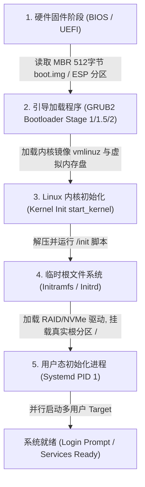

# Round 7: Linux 启动引导、Systemd 与服务管理深度指南

当服务器陷入无法正常开机、引导挂起或服务无故崩溃时，理解 Linux 系统的启动链条与 PID 1 管理器 Systemd 的调度逻辑，是拯救生产环境故障的核心技能。

本指南深入拆解 GRUB2 汇编阶段、Linux 5 阶段启动全历程、Systemd D-Bus 内部通信、`journald` 高性能日志轮转以及单用户/紧急模式下的灾难救援 SOP。

---

## 一、 Linux 完整的启动引导全历程

从物理电源按下到显示登录提示符，Linux 经历如下 5 个核心阶段：



### 关键阶段机制解密：

1. **GRUB2 阶段汇编演进**：
   * **Stage 1 (`boot.img`)**：写入 MBR 的前 446 字节，纯实模式 (Real Mode) 16 位汇编代码，唯一作用是加载 Stage 1.5。
   * **Stage 1.5 (`core.img`)**：包含简单文件系统驱动，使 CPU 切换到 32 位保护模式 (Protected Mode)，读取 `/boot/grub2/` 目录。
   * **Stage 2**：读取 `grub.cfg` 菜单，加载 `vmlinuz` 镜像与 `initramfs.img` 入内存。

2. **Initramfs (Initial RAM Filesystem)**：
   * 包含极简的临时根文件系统与必须的内核模块（NVMe、RAID、EXT4/XFS 驱动）。执行 `pivot_root` 切换到真实磁盘上的根目录 `/`。

---

## 二、 Systemd 架构与 D-Bus IPC 消息总线

Systemd 是运行在 PID 1 的并发初始化管理器，其内部组件间通信高度依赖 **D-Bus (Desktop Bus)** IPC 消息总线。

```
systemctl CLI 客户端 ---> [D-Bus 系统总线 org.freedesktop.systemd1] ---> Systemd PID 1 守护进程
```

### 1. 生产级 Unit 服务文件结构规范

在 `/etc/systemd/system/my-api-server.service` 创建配置：

```ini
[Unit]
Description=Production API Microservice Server
Documentation=https://docs.mycompany.com/api
After=network.target network-online.target mysqld.service
Wants=network-online.target

[Service]
Type=simple
User=appuser
Group=appgroup
WorkingDirectory=/opt/my-api-server
Environment="APP_ENV=production" "PORT=8080"
EnvironmentFile=/etc/default/my-api-server

ExecStart=/opt/my-api-server/bin/api-server --config=/etc/my-api-server/config.yaml
ExecReload=/bin/kill -HUP $MAINPID
ExecStop=/bin/kill -SIGTERM $MAINPID

Restart=always
RestartSec=5s
StartLimitIntervalSec=60s
StartLimitBurst=3

LimitNOFILE=1048576
LimitNPROC=524288
MemoryLimit=4G
CPUQuota=200%

[Install]
WantedBy=multi-user.target
```

---

## 三、 `systemd-journald` 日志管理与持久化轮转

```bash
# 1. 实时跟踪 nginx.service 的日志 (-f: follow, -u: unit)
journalctl -u nginx.service -f

# 2. 过滤今天产生的所有 ERR (Error) 及以上级别的系统报错
journalctl -p err..emerg --since today

# 3. 查看本次系统开机以来的所有引导日志
journalctl -b 0
```

### 配置文件 `/etc/systemd/journald.conf`：
```ini
[Journal]
Storage=persistent
SystemMaxUse=4G
SystemMaxFileSize=250M
MaxRetentionSec=1month
SyncIntervalSec=5s
```

---

## 四、 生产灾难救援：密码重置与 Boot 挂起修复

### 场景一：忘掉 Root 密码救援 SOP

1. 重启服务器，在 GRUB2 界面按 **`e`**。
2. 在 `linux` 末尾添加 `rd.break`，按 **`Ctrl + x`** 启动。
3. 执行恢复：
   ```bash
   mount -o remount,rw /sysroot
   chroot /sysroot
   passwd root
   touch /.autorelabel
   exit
   exit
   ```

---

### 场景二：`/etc/fstab` 配置错误导致无法开机救援

1. 紧急维护模式 Shell 下，重新挂载根目录：
   ```bash
   mount -o remount,rw /
   ```
2. 编辑 `/etc/fstab` 修正错误行。
3. *防范金律*：以后修改 `/etc/fstab` 后，重启前必须执行 **`mount -a`** 验证！

---
