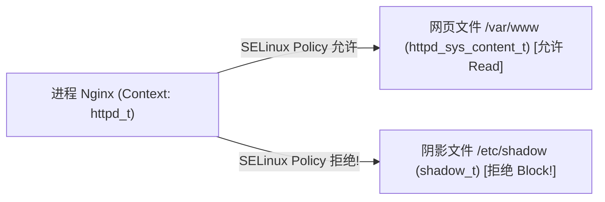

# Round 9: Linux 安全加固、权限控制与 SELinux/AppArmor 实战指南

在企业生产环境中，Linux 服务器常年面临爆破攻击、提权漏洞、WebShell 入侵与合规审计挑战。单纯依靠强密码无法防御零日漏洞与内部越权。

本指南深入拆解 Linux 企业级 SSH 安全加固、PAM 防爆破机制、SELinux 核心上下文与自定义策略编写、Auditd 系统审计以及 Linux Capabilities 微细化提权隔离。

---

## 一、 SSH 服务加固与 PAM 防爆破最佳实践

### 1. 规范级 `/etc/ssh/sshd_config` 安全加固清单

```ini
# 1. 更改默认 22 端口，降低扫描器干扰
Port 2222

# 2. 禁用 root 用户直接登录
PermitRootLogin no

# 3. 彻底禁用密码认证，强行使用 SSH 密钥认证
PasswordAuthentication no
PubkeyAuthentication yes
AuthorizedKeysFile .ssh/authorized_keys

# 4. 空闲超时自动断开 (300秒无操作断开)
ClientAliveInterval 300
ClientAliveCountMax 0

# 5. 禁用 X11 转发与端口转发，防止隧道越权
X11Forwarding no
AllowTcpForwarding no

# 6. 设置白名单仅允许特定运维用户/组登录
AllowUsers devops_admin sec_auditor
# 或 AllowGroups sysadmin
```

---

### 2. PAM (`pam_faillock`) 防连续密码爆破锁定策略

在允许密码登录的跳板机或特定服务器上，需配置 `pam_faillock` 模块：当用户连续输错密码 5 次时，自动锁定账号 15 分钟。

编辑 `/etc/pam.d/system-auth` 与 `/etc/pam.d/password-auth`：

```ini
# 在 auth 阶段加入以下行
auth        required      pam_faillock.so preauth silent audit deny=5 unlock_time=900
auth        sufficient    pam_unix.so nullok try_first_pass
auth        [default=die] pam_faillock.so authfail audit deny=5 unlock_time=900
```

#### 管理员排查与解锁命令：
```bash
# 1. 查看用户 admin 的失败登录尝试记录
faillock --user admin

# 2. 手动解锁被封锁的用户 admin
faillock --user admin --reset
```

---

## 二、 SELinux 内核安全子系统深度实战

SELinux (Security-Enhanced Linux) 是基于 MAC (Mandatory Access Control, 强制访问控制) 的内核安全机制。即使攻击者拿到了 root 权限，只要未获得 SELinux Type 授权，仍无法读取敏感文件。

### 1. SELinux 三种运行模式与切换

* **`Enforcing`**：强制模式（拦截违规操作并记录日志）。
* **`Permissive`**：宽容模式（**不拦截任何操作，仅记录违规日志**，用于调试）。
* **`Disabled`**：彻底禁用（需重启生效）。

```bash
# 1. 在线切换模式 (无需重启，立即可测试调试)
setenforce 0    # 切换为 Permissive 宽容模式
setenforce 1    # 切换为 Enforcing 强制模式

# 2. 查看当前生效状态
sestatus
```

---

### 2. SELinux 安全上下文 (Context) 机制

SELinux 的所有决策基于**上下文标签**，格式为 `user:role:type:level`：
* 文件上下文：`system_u:object_r:httpd_sys_content_t:s0`
* 进程上下文：`system_u:system_r:httpd_t:s0`

**规则核心**：只有当进程的 Type (`httpd_t`) 拥有对文件的 Type (`httpd_sys_content_t`) 的访问许可时，内核才允许读取！



#### 实际场景：自定义 Nginx 网页目录打标签
若将 Nginx 网站根目录改到了 `/data/html/`，Nginx 启动后会抛出 403 Forbidden 错误。

```bash
# 1. 查看 /data/html/ 的默认 SELinux 标签 (通常为 default_t 或 usr_t)
ls -Z /data/html/

# 2. 递归将 /data/html/ 目录及其子文件的上下文修正为 Web 内容标签
semanage fcontext -a -t httpd_sys_content_t "/data/html(/.*)?"

# 3. 强制刷入配置使标签生效
restorecon -Rv /data/html/
```

---

### 3. SELinux 布尔值 (Booleans) 快速开关

SELinux 内置了数百个功能开关。例如：允许 Nginx 作为反向代理发起网络连接。

```bash
# 1. 查询 Nginx 相关的 SELinux 开关
getsebool -a | grep httpd_can_network_connect

# 2. 永久开启 HTTP 跨网络代理功能 (-P: Persistent)
setsebool -P httpd_can_network_connect on
```

---

### 4. SELinux 拒绝日志诊断与自动生成策略

当出现未知拦截时，切忌直接禁用 SELinux！应使用分析工具生成自定义策略：

```bash
# 1. 在 /var/log/audit/audit.log 中检索被 AVC 拒绝的日志
grep "type=AVC" /var/log/audit/audit.log | tail -n 10

# 2. 使用 audit2allow 将拒绝日志自动转化为可读的解释
grep "type=AVC" /var/log/audit/audit.log | audit2allow -w

# 3. 自动生成并加载自定义安全模块 (MyPolicy.pp) 解决特定软件报错
grep "type=AVC" /var/log/audit/audit.log | audit2allow -M my_custom_app
semodule -i my_custom_app.pp
```

---

## 三、 Auditd 系统审计服务实战

在通过等保 2.0 / ISO 27001 认证时，系统必须记录所有管理员的高危命令与文件篡改行为。

### 1. 配置规则 `/etc/audit/rules.d/audit.rules`

```ini
# 1. 监控敏感账号文件 /etc/passwd 与 /etc/shadow 的修改
-w /etc/passwd -p wa -k identity_changes
-w /etc/shadow -p wa -k identity_changes

# 2. 监控 /etc/sysctl.conf 内核参数的修改
-w /etc/sysctl.conf -p wa -k sysctl_changes

# 3. 记录所有普通用户调用 execve 系统调用执行命令的行为 (64位系统)
-a always,exit -F arch=b64 -S execve -F auid>=1000 -F auid!=4294967295 -k user_commands
```

```bash
# 重新加载审计规则
augenrules --load
```

---

### 2. 检索审计日志 `ausearch` 与 `aureport`

```bash
# 1. 检索所有标识为 identity_changes (密码文件修改) 的审计事件
ausearch -k identity_changes -i

# 2. 生成系统审计事件汇总报表
aureport --summary
```

---

## 四、 Linux Capabilities 细粒度权限微整

在传统 Linux 中，进程要么是普通用户 (UID!=0) 受到严格限制，要么是 root (UID=0) 拥有全知全能的超级权限。这给自带 SUID 权限的可执行程序（如二进制文件漏洞）留下了极大的提权隐患。

**Linux Capabilities** 将 root 的所有特权拆分为 40 多个微细化的独立权能（如 `CAP_NET_BIND_SERVICE`, `CAP_NET_RAW`, `CAP_SYS_ADMIN`）。

### 1. 典型生产应用：允许普通用户程序监听 80 端口（无需 root/sudo）

默认情况下，只有 root 权限才能绑定小于 1024 的特权端口。

```bash
# 为自定义的 Go 编译产物 /opt/app/mygoapp 赋予监听 80 端口的微特权
setcap 'cap_net_bind_service=+ep' /opt/app/mygoapp

# 查看二进制文件拥有的 Capabilities 特权
getcap /opt/app/mygoapp
```
*效果：该二进制文件只需由普通的 `appuser` 用户启动，即可监听 80/443 端口，即便该应用存在代码注入漏洞，攻击者也绝对无法获得 root 权限！*

---
