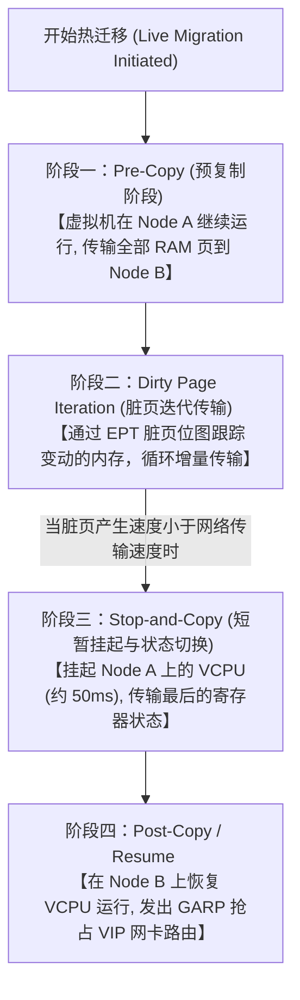

# Round 13: Linux 虚拟化与 KVM/QEMU 深度指南

在现代云计算（AWS, OpenStack, 阿里云）与私有云基础设施中，**KVM (Kernel-based Virtual Machine)** 是最主流的企业级 Open-Source Hypervisor。理解 KVM 的内核硬件辅助虚拟化机制、Virtio 驱动半虚拟化零拷贝架构以及虚拟机性能极限调优，是构建高密度云计算平台的核心能力。

本指南深入拆解 Intel VT-x 内核模式、`/dev/kvm` 交互原理、Virtio/Vhost-net 高性能 I/O、Libvirt 管理栈以及虚拟机在线热迁移（Live Migration）全过程。

---

## 一、 硬件辅助虚拟化架构与 Intel VT-x 原理

在传统纯软件模拟虚拟化中，CPU 指令拦截产生巨大的 VM-Exit 开销。现代 x86 架构通过 **Intel VT-x** 或 **AMD-V** 引入了硬件层面的双重运行模式：

```
+-------------------------------------------------------------------------+
|                          VMX Root Operation                             |
|  - 包含完整的 Ring 0 到 Ring 3 权限                                       |
|  - 宿主机内核 (Host OS / KVM Hypervisor) 运行在此模式                         |
+-------------------------------------------------------------------------+
                                   |  |
            VM-Entry (进入 Guest)  |  |  VM-Exit (陷入 Host, 如访问未授权硬件)
                                   v  |
+-------------------------------------------------------------------------+
|                        VMX Non-Root Operation                           |
|  - 包含 Guest 的 Ring 0 (Guest Kernel) 到 Ring 3 (Guest App)             |
|  - 绝大部分常规敏感指令由 CPU 硬件直接执行，无需 Hypervisor 介入拦截!          |
+-------------------------------------------------------------------------+
```

### 核心物理支持机制：
1. **VMCS (Virtual Machine Control Structure)**：CPU 内部的物理内存块，记录 Guest VCPU 的寄存器状态、控制位与 VM-Exit 触发条件。
2. **EPT (Extended Page Tables) / NPT**：**内存二次映射硬件化**。将 Guest 虚拟地址 (GVA) $\rightarrow$ Guest 物理地址 (GPA) $\rightarrow$ Host 物理地址 (HPA) 的两级翻译交由 CPU 硬件 MMU 自动完成，提升内存访问效率。

---

## 二、 KVM 与 QEMU 分工模型剖析

在 Linux 系统中，**KVM 并不是一个完整的虚拟机软件**，它只是一个内核模块，必须搭配用户态的 **QEMU** 协同工作。

```mermaid
graph TD
    subgraph "用户空间 (User Space)"
        QEMU["QEMU 用户态进程 (管理虚拟机内存、仿真设备控制器)"]
    end
    
    subgraph "内核空间 (Kernel Space)"
        KVM["KVM 内核模块 (kvm.ko, kvm-intel.ko)"] -->|/dev/kvm ioctl| CPU["CPU 硬件 (Intel VT-x VMX)"]
    end
    
    QEMU <-->|ioctl(vcpu_fd, KVM_RUN)| KVM
```

### 职责分工表：

| 模块组件 | 运行层级 | 核心职责 |
| :--- | :--- | :--- |
| **`kvm.ko`** | 内核态 (Kernel Space) | 将 Linux 内核改造为 Hypervisor；负责 VCPU 调度、内存 EPT 映射与硬件 VM-Exit 快速响应 |
| **QEMU** | 用户态 (User Space) | 提供虚拟机生命周期管理、模拟旧式复杂硬件设备（如 IDE 硬盘、网卡、PCI 总线）、解析命令行与镜像文件 |
| **VCPU 线程** | 用户态/内核态切换 | **在宿主机看来，每个虚拟机的 VCPU 只是宿主机上的一个普通 Linux 线程 (`task_struct`)** |

---

## 三、 Virtio 半虚拟化 (Paravirtualization) 架构

如果 QEMU 纯靠软件去模拟一块标准的 Intel e1000 物理网卡，Guest 每发送一个数据包都要触发数百次 VM-Exit，性能极差。

为了解决此瓶颈，引入了 **Virtio 半虚拟化框架**：Guest 操作系统安装 Virtio 驱动，感知自己运行在虚拟机中，通过内存共享队列直接与 Host 交换数据。

```
+-------------------------------------------------------------------------+
| Guest OS (Virtio-net / Virtio-blk 驱动)                                 |
+-------------------------------------------------------------------------+
        |                                                 ^
        | Write (数据指针)                                 | Interrupt (Vring Notification)
        v                                                 |
+-------------------------------------------------------------------------+
|               共享内存环形缓冲区 Vring (Shared Memory Queue)               |
+-------------------------------------------------------------------------+
        |                                                 ^
        v                                                 |
+-------------------------------------------------------------------------+
| Host Kernel / Vhost-net (内核态零拷贝直接注入网卡 Ring Buffer)              |
+-------------------------------------------------------------------------+
```

### 高性能 I/O 驱动模块分类：
* **`virtio-net` + `vhost-net`**：网络半虚拟化。`vhost-net` 将网络数据包交由宿主机内核态直接处理，彻底绕过 QEMU 用户态，吞吐接近物理网卡。
* **`virtio-blk` / `virtio-scsi`**：磁盘 I/O 半虚拟化，大幅降低写延迟。
* **`vhost-user`**：结合 DPDK 技术，在用户态直接进行网卡内存零拷贝。

---

## 四、 Libvirt 栈与 `virsh` 管理实战

**Libvirt** 是一套通用的开源虚拟化管理 API 与守护进程 (`libvirtd`)，屏蔽了底层 QEMU 繁琐的命令行参数。

### 生产常用 `virsh` 运维指令：

```bash
# 1. 查看宿主机上所有运行中的虚拟机及其 ID/状态
virsh list --all

# 2. 查看指定虚拟机 vm-web01 的配置 XML 定义
virsh dumpxml vm-web01 > vm-web01.xml

# 3. 动态热插拔给虚拟机挂载一块 100G 的磁盘
virsh attach-disk vm-web01 /var/lib/libvirt/images/data1.qcow2 vdb --subdriver qcow2 --config --live

# 4. 动态调整虚拟机物理内存为 8GB
virsh setmem vm-web01 8G --config --live

# 5. 进入虚拟机的 Serial 文本控制台 (按 Ctrl+] 退出)
virsh console vm-web01
```

---

## 五、 虚拟机性能极限调优与 NUMA 绑定

为了让 KVM 虚拟机跑出媲美物理机的极致性能，必须对 CPU、内存与 NUMA 进行静态绑核（Pinning）。

### 1. CPU 绑核 (`vcpupin`) 配置

避免虚拟机的 VCPU 线程在宿主机的不同 CPU 核心之间频繁调度引发 L1/L2 Cache 失效：

```xml
<!-- 编辑虚拟机的 XML 配置文件 virsh edit vm-web01 -->
<domain type='kvm'>
  <vcpu placement='static'>4</vcpu>
  <cputune>
    <!-- 将 Guest VCPU 0 绑定到 Host 物理 CPU 4 -->
    <vcpupin vcpu='0' cpuset='4'/>
    <!-- 将 Guest VCPU 1 绑定到 Host 物理 CPU 5 -->
    <vcpupin vcpu='1' cpuset='5'/>
    <vcpupin vcpu='2' cpuset='6'/>
    <vcpupin vcpu='3' cpuset='7'/>
  </cputune>
</domain>
```

---

### 2. HugePages (巨页内存) 分配

默认 Linux 内存页大小为 4KB。对于一个 64GB 内存的虚拟机，TLB 和页表将极其庞大。将其配置为 1GB 巨页：

```bash
# 1. 在宿主机挂载 1GB 巨页 (预留 32 个 1GB 页 = 32GB)
echo 32 > /sys/kernel/mm/hugepages/hugepages-1048576kB/nr_hugepages
```

```xml
<!-- 在虚拟机 XML 中启用 1GB 巨页内存 backing -->
<memoryBacking>
  <hugepages>
    <page size='1048576' unit='KiB' nodeset='0'/>
  </hugepages>
</memoryBacking>
```

---

## 六、 虚拟机热迁移 (Live Migration) 物理历程

在线热迁移允许在**不中断 Guest 业务（毫秒级停顿）**的前提下，将整台虚拟机从宿主机 Node A 缝迁移到 Node B。



---
