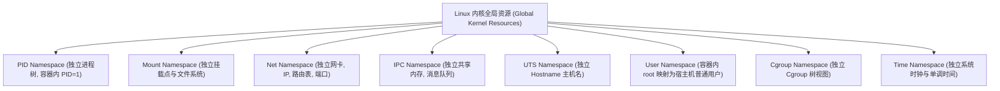
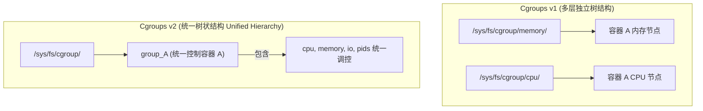
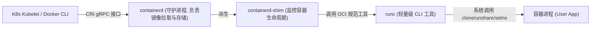

# Round 14: Linux 容器底层原理与 Namespace/Cgroups 指南

在云原生（Docker, Kubernetes）时代，“容器”已成为软件交付的标准载体。然而在 Linux 内核底层，**根本不存在名为“Container”的数据结构或数据对象**。

所谓的容器，本质上只是**一个被 Linux 内核 Namespace 隔离了视图、被 Cgroups 限制了资源上限、并使用了 OverlayFS 联合文件系统的普通 Linux 进程**。

本指南深入拆解 Linux 8 大 Namespace 隔离机制、User Namespace 权限映射表、OverlayFS 分层结构、Cgroups v1 vs v2 架构、以及从 `containerd` 到 `runc` 的容器调用链全历程。

---

## 一、 容器视图隔离：8 大 Linux Namespace 剖析



---

### 1. User Namespace 权限映射机制与 `/proc/PID/uid_map`

**User Namespace** 是容器安全隔离的核心基石：它允许一个进程在容器内部拥有 root (UID=0) 的完整特权，但在宿主机操作系统视角下，该进程只被分配了一个普通无特权用户 (如 UID=10001)。

#### 内核 UID 映射表数据结构 (`/proc/<PID>/uid_map`)：
映射语法格式为：`容器内起始UID  宿主机起始UID  连续映射长度`

```bash
# 查看指定容器进程 18921 的 UID 映射表
cat /proc/18921/uid_map
# 0    10001    65536
```
*原理解析：*
* 容器内部的 `UID 0` (root) 被映射为宿主机的 `UID 10001`。
* 容器内部的 `UID 1` 被映射为宿主机的 `UID 10002`。
* **安全效果**：即使攻击者逃逸出了容器的 Mount Namespace，在宿主机上也只是一个完全没有提权权限的普通用户 `10001`，无法读取 `/etc/shadow` 或破坏宿主机！

---

## 二、 文件系统隔离：OverlayFS 联合挂载原理

```
+-------------------------------------------------------------------------+
|  Merged 视图层 (/var/lib/docker/overlay2/merged) ---> 用户在容器内部看到的完整 /
+-------------------------------------------------------------------------+
|  Upperdir 读写层 (/var/lib/docker/overlay2/upper) ---> 容器运行时修改/新增的文件
+-------------------------------------------------------------------------+
|  Lowerdir 只读层 (/var/lib/docker/overlay2/lower) ---> 镜像基础层 (Alpine/Ubuntu)
+-------------------------------------------------------------------------+
```

```bash
# 挂载 OverlayFS 实操
mount -t overlay overlay -o lowerdir=/tmp/overlay/lower,upperdir=/tmp/overlay/upper,workdir=/tmp/overlay/work /tmp/overlay/merged
```

---

## 三、 Cgroups v1 vs Cgroups v2 架构演进



---

## 四、 云原生容器运行时链路拆解



---
