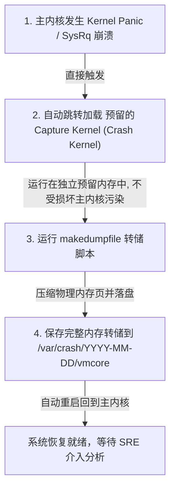

# Round 15: Linux 内核模块开发与 Kdump 崩溃诊断指南

当第三方硬件驱动出错、特定内核子系统死锁或系统遭遇死机（Kernel Panic / Soft Lockup）时，普通的应用程序调试工具（如 GDB）完全无能为力。系统工程师必须深入内核空间，掌握可加载内核模块（LKM）的运行机制与死机转储（Kdump/Crash）工具链。

本指南深入拆解 C 语言 LKM 内核模块开发流程、`printk` 日志打印控制、Kdump 捕获内核机制、以及使用 `crash` 工具解剖 `vmcore` 崩溃堆栈。

---

## 一、 可加载内核模块 (LKM) 基础架构

LKM (Loadable Kernel Module) 允许在系统运行过程中，**无需重新编译内核或重启机器**，即可向内核中动态添加或卸载代码（如驱动程序、自定义防火墙模块）。

### 1. 最小内核模块 C 源代码模板 (`my_module.c`)

```c
#include <linux/module.h>   // 包含所有内核模块必需的头文件
#include <linux/kernel.h>   // 包含 printk 等内核 API
#include <linux/init.h>     // 包含 __init 和 __exit 宏定义

MODULE_LICENSE("GPL");
MODULE_AUTHOR("Senior SRE Team");
MODULE_DESCRIPTION("Enterprise Minimal LKM Example");
MODULE_VERSION("1.0");

// 1. 模块加载入口函数
static int __init my_module_init(void) {
    printk(KERN_INFO "[MyModule] Kernel module loaded successfully!\n");
    return 0; // 返回 0 代表初始化成功；非 0 代表失败，模块拒绝加载
}

// 2. 模块卸载出口函数
static void __exit my_module_exit(void) {
    printk(KERN_INFO "[MyModule] Kernel module unloaded cleanly.\n");
}

// 注册加载与卸载钩子
module_init(my_module_init);
module_exit(my_module_exit);
```

---

### 2. Kbuild 编译 Makefile 标准结构

在内核编译体系中，不能直接使用普通的 `gcc main.c` 命令，必须调用 Kernel 的 Kbuild 体系：

```makefile
# 指定目标模块
obj-m += my_module.o

# 获取当前运行内核的源码/头文件路径
KDIR := /lib/modules/$(shell uname -r)/build
PWD := $(shell pwd)

all:
	$(MAKE) -C $(KDIR) M=$(PWD) modules

clean:
	$(MAKE) -C $(KDIR) M=$(PWD) clean
```

---

### 3. 内核模块管理指令全解

```bash
# 1. 编译模块，生成 my_module.ko (Kernel Object)
make

# 2. 强行插入内核模块 (必须拥有 root 权限)
insmod my_module.ko

# 3. 查看已被内核加载的模块列表与引用计数
lsmod | grep my_module

# 4. 查看内核模块的详细元信息 (作者、许可、参数列表)
modinfo my_module.ko

# 5. 卸载内核模块
rmmod my_module

# 6. 智能模块加载命令 modprobe (相比 insmod，modprobe 会自动解决依赖关系模块!)
modprobe drbd
```

---

## 二、 内核日志打印控制 (`printk`)

内核无法使用 C 标准库的 `printf()`。内核提供了 **`printk()`** API，并定义了 8 个日志级别（Log Level）：

| 级别代号 | 宏定义名称 | 物理含义与紧急程度 |
| :--- | :--- | :--- |
| `0` | `KERN_EMERG` | 紧急！系统不可用（如 Kernel Panic） |
| `1` | `KERN_ALERT` | 警报！必须立即采取措施 |
| `2` | `KERN_CRIT` | 临界条件！硬件或软件严重错误 |
| `3` | `KERN_ERR` | 错误条件！通常用于驱动程序报错 |
| `4` | `KERN_WARNING` | 警告条件 |
| `5` | `KERN_NOTICE` | 正常但重要的条件 |
| `6` | `KERN_INFO` | 提示性信息（默认推荐） |
| `7` | `KERN_DEBUG` | 调试级别信息 |

### 调整控制台日志输出门槛：
```bash
# 查看 /proc/sys/kernel/printk 的 4 个数字
cat /proc/sys/kernel/printk
# 4    4    1    7
# ^    ^    ^    ^
# |    |    |    └-- 编译时默认最高级别
# |    |    └------- 允许设置的最高 console 级别
# |    └------------ 默认 log 级别
# └----------------- 控制台当前只打印小于此级别的日志 (当前为 4, 即只打印 0-3 级)

# 将控制台日志级别提高到 8 (允许显示所有 debug 日志到终端)
echo "8 4 1 7" > /proc/sys/kernel/printk
```

---

## 三、 Kdump 崩溃转储机制与捕获

当内核发生不可恢复的致命错误（Kernel Panic）或 Spinlock 锁死时，系统会自动触发 **Kdump**，将当前时刻的全部内存镜像保存为 **`vmcore`** 文件。



### 1. 配置并开启 Kdump 服务

```bash
# 1. 安装 Kdump 与 Crash 调试工具链 (RHEL/CentOS)
yum install -y kexec-tools crash kernel-debuginfo

# 2. 在 GRUB2 引导参数中预留 256MB 内存给 Crash Kernel (grubby)
grubby --update-kernel=ALL --args="crashkernel=256M"
grub2-mkconfig -o /boot/grub2/grub.cfg

# 3. 启动 kdump 服务
systemctl enable --now kdump
```

---

### 2. 生产测试：手动触发内核 Panic (仅限测试环境!)

```bash
# 警告：此命令会使服务器瞬间崩溃并生成 vmcore！
echo c > /proc/sysrq-trigger
```

---

## 四、 使用 `crash` 工具解剖 `vmcore` 堆栈

当 `/var/log/messages` 中没有任何死机日志时，`vmcore` 是找出谁杀死了系统的唯一线索。

### 1. 启动 `crash` 分析调试器

启动需要两个核心文件：
1. **`vmlinux`**：带调试符号表（Debug Symbols）的未压缩内核镜像。
2. **`vmcore`**：崩溃时转储的物理内存镜像。

```bash
crash /usr/lib/debug/lib/modules/$(uname -r)/vmlinux /var/crash/2026-08-04-10:00/vmcore
```

---

### 2. `crash` 交互式诊断核心指令

```crash
# 1. 查看崩溃发生时的系统概览 (CPU, OS 版本, 触发 Panic 的进程与 PID)
crash> sys

# 2. 打印引发崩溃进程的完整内核 C 语言调用栈 (Backtrace)
crash> bt

# 3. 查看崩溃时刻物理 CPU 上的寄存器状态与错误指令
crash> bt -c 0

# 4. 查看崩溃时刻系统的所有进程列表及 STAT 状态
crash> ps | grep UN

# 5. 反汇编报错代码行附近的内核指令
crash> dis -l <rip_address> 10

# 6. 打印内核全局结构体或变量内容
crash> struct task_struct 0xffff8801a2b3c000
```

#### 经典崩溃案案解析（Null Pointer Dereference）：
运行 `bt` 后的核心输出：
```
PID: 18492  TASK: ffff880212345000  CPU: 2   COMMAND: "my_driver_worker"
 #0 [ffff880212345c20] crash_nmi_callback at ffffffff81048b20
 #1 [ffff880212345c30] nmi_handle at ffffffff8163f455
 #2 [ffff880212345cb0] do_nmi at ffffffff8163f68d
 #3 [ffff880212345cf0] end_repeat_nmi at ffffffff8163eb05
 #4 [ffff880212345da0] my_driver_read at ffffffffa0012054 [my_module]
    RIP: ffffffffa0012054  rsp: ffff880212345db0  RFLAGS: 00010246
    RAX: 0000000000000000  RBX: ffff880214567000  RCX: 0000000000000000
```
* **诊断结论**：
  * 发生崩溃的模块为自定义驱动 `my_module` 的 `my_driver_read` 函数。
  * `RAX: 0000000000000000` 说明代码解引用了一个空指针 `NULL`，触发了 Page Fault 内存段错误，致使内核直接 Panic！

---
