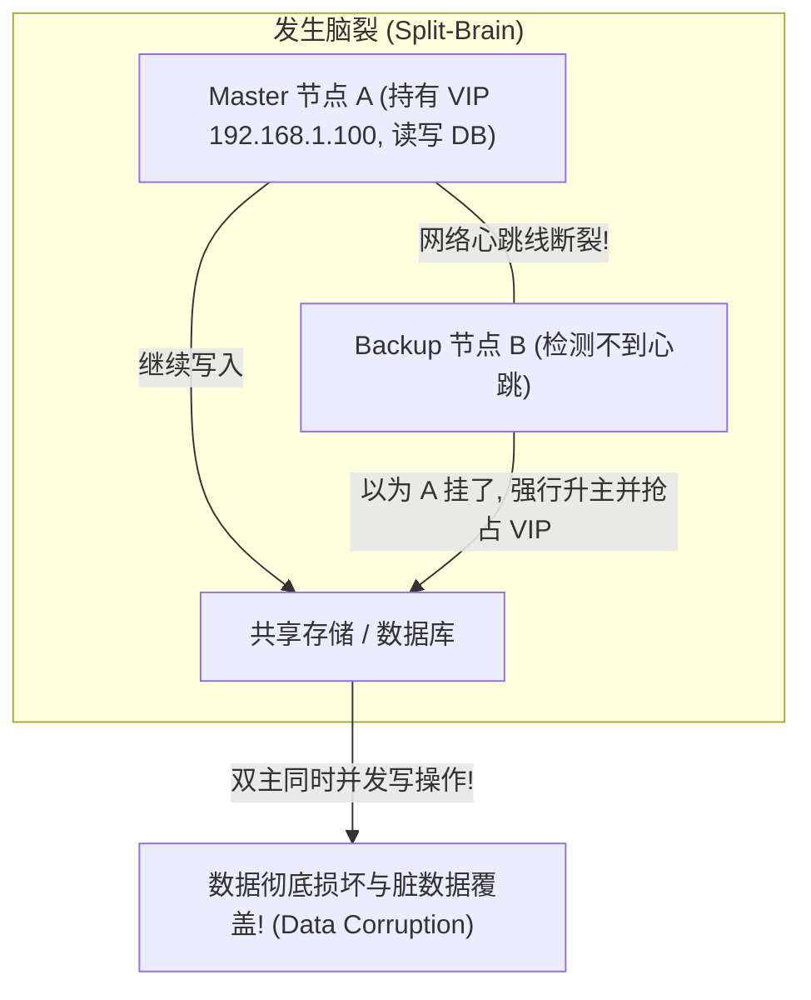

# Round 18: Linux 高级高可用集群与 Keepalived/Corosync 指南

在 99.99%（4个9）高可用企业级架构中，单点故障（SPOF）是绝对禁区。无论是 Nginx 网关、MySQL 数据库主从，还是 K8s 控制面 API-Server，均需要高可用集群技术实现故障秒级自动漂移。

本指南深入拆解高可用集群三大理论（脑裂、Quorum 法定人数、STONITH 硬件隔离）、Keepalived VRRP 协议内核原理、Corosync + Pacemaker 集群架构以及零中断运维 SOP。

---

## 一、 高可用集群理论基础：脑裂、Quorum 与 STONITH

在双机热备或多节点集群中，最危险的灾难是 **脑裂 (Split-Brain)**：



### 防范脑裂三大防护装甲：

1. **Quorum (法定人数机制)**：集群必须由奇数个节点组成（3, 5, 7）。当发生网络分区时，只有拥有超过半数投票权（$\text{Quorum} > N/2$）的分区才被允许继续提供服务，少数派分区自动挂起。
2. **多通道冗余心跳线**：配置至少两条独立的物理网络心跳通道（如物理网卡心跳 + 串行串口线心跳）。
3. **Fencing / STONITH (Shoot The Other Node In The Head)**：**最强力物理防护！** 当节点 B 发现节点 A 响应异常但无法确认死活时，节点 B 通过 IPMI 智能电源管理接口，**向节点 A 的物理服务器发送强制切断电源指令 (Power Off)**，确保节点 A 100% 彻底死亡后，才安全接管 VIP。

---

## 二、 Keepalived 与 VRRP 协议深度剖析

**Keepalived** 是基于 **VRRP (Virtual Router Redundancy Protocol)** 协议轻量级高可用解决方案。

### 1. VRRP 工作原理与状态机

```
虚拟路由器 (Virtual Router ID: 51, VIP: 192.168.1.100)
├── Master 节点 (Priority 100): 周期性发送 VRRP 组播/单播通告包 (Heartbeat)
└── Backup 节点 (Priority 90): 监听 VRRP 通告，若超过 3 个 Interval 未收到包，触发抢占 (Master)
```

---

### 2. 生产云环境单播 (Unicast) 配置规避组播封锁

在阿里云、腾讯云或 AWS 等云平台上，物理交换机默认**封锁了 VRRP 组播流量 (`224.0.0.18`)**，导致 Keepalived 部署即发生双主脑裂。

#### 生产解法：必须显式配置 `unicast_src_ip` 与 `unicast_peer` 单播点对点通信：

```ini
# /etc/keepalived/keepalived.conf (Master 节点配置)
global_defs {
    router_id node_master
    # 允许脚本执行
    enable_script_security
    script_user root
}

# 1. 定义健康检查脚本：检测 Nginx 进程存活
vrrp_script check_nginx {
    script "/etc/keepalived/check_nginx.sh"
    interval 2       # 每 2 秒执行一次
    weight -20       # 若脚本执行失败 (exit != 0)，Priority 动态减 20
    fall 2           # 连续失败 2 次判故障
    rise 2           # 连续成功 2 次判恢复
}

# 2. 定义 VRRP 实例
vrrp_instance VI_1 {
    state MASTER
    interface eth0
    virtual_router_id 51
    priority 100     # 初始优先级 100
    advert_int 1

    # 关键！云物理环境必须配置单播，禁用组播
    unicast_src_ip 192.168.1.10      # 本机物理 IP
    unicast_peer {
        192.168.1.11                  # 备节点物理 IP
    }

    authentication {
        auth_type PASS
        auth_pass SecK33pLiveD
    }

    # 绑定的虚拟 IP (VIP)
    virtual_ipaddress {
        192.168.1.100/24 dev eth0 label eth0:vip
    }

    # 挂载健康检查脚本
    track_script {
        check_nginx
    }
}
```

---

### 3. 探活脚本 `check_nginx.sh` 严谨编写

```bash
#!/bin/bash
# /etc/keepalived/check_nginx.sh
set -euo pipefail

# 检查 Nginx 80 端口或端口响应
if ! kill -0 $(cat /var/run/nginx.pid 2>/dev/null) 2>/dev/null; then
    # 尝试恢复一次
    systemctl restart nginx
    sleep 1
    if ! kill -0 $(cat /var/run/nginx.pid 2>/dev/null) 2>/dev/null; then
        # 恢复失败，返回 1，触发 Keepalived 降级降权
        exit 1
    fi
fi
exit 0
```

---

## 三、 企业级 Pacemaker + Corosync 集群栈

当高可用场景超越了简单的 VIP 漂移（例如：管理具有复杂的启动顺序、数据卷挂载、共享存储锁的数据库集群），需引入 **Pacemaker (资源管理器) + Corosync (集群通信与 Quorum)**。

```
+-------------------------------------------------------------------------+
|                  Pacemaker (CRM 资源决策引擎 / CIB 数据库)                 |
+-------------------------------------------------------------------------+
|                 Corosync (Totem 环形通信协议 / Quorum 投票机制)            |
+-------------------------------------------------------------------------+
|                      硬件隔离层 (IPMI STONITH Fencing)                   |
+-------------------------------------------------------------------------+
```

### Pacemaker 三大资源约束 (Constraints)：
1. **Location (位置约束)**：指定资源更倾向于运行在哪个物理节点（如 `node1` 分数 +100）。
2. **Colocation (排列约束)**：指定资源 A 与资源 B **必须运行在同一节点**（如 VIP 必须与 MySQL 服务同机）。
3. **Ordering (顺序约束)**：指定启动顺序（如 **必须先挂载 LVM 存储卷，才能启动 PostgreSQL**）。

```bash
# 使用 pcs 工具设置集群资源约束
pcs constraint colocation add Virtual_IP with PostgreSQL-Set INFINITY
pcs constraint order start Mount_DRBD then start PostgreSQL-Set
```

---

## 四、 零中断运维变更与故障演练 SOP

在对主节点进行维保升级（如重启服务器或升级内核）时，必须以**主动、平滑、零中断**的方式交接流量：

```bash
# 1. 在 Master 节点进入维护模式 (把 VIP 平滑让给 Backup)
systemctl stop keepalived

# 2. 或者在 Pacemaker 中将节点设置为 Standby 模式
pcs node standby node_master

# 3. 观察备节点，确认 VIP 已成功绑定且业务健康
ip addr show eth0
curl -I http://192.168.1.100/health

# 4. 主节点完成维保后，重新上线
systemctl start keepalived
```

---
