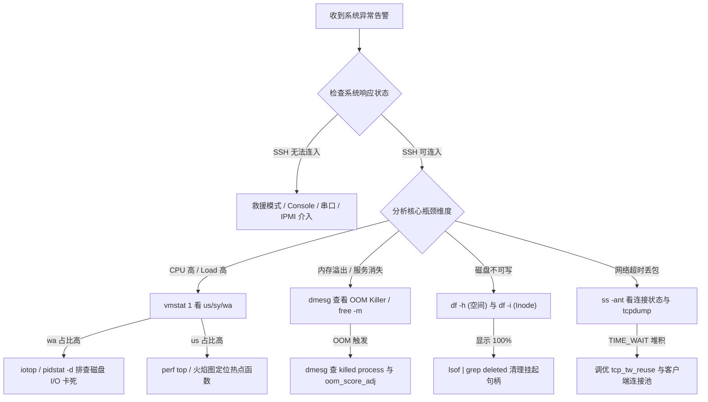

# Round 8: 高级 Linux 运维生产高频故障排查手册 (SOP Playbook)

本手册专为资深 Linux 系统管理员、DevOps 工程师与 SRE 架构师打造，整理了生产环境中最常面临的 **8 大核心灾难故障场景**，并提供包含“现象识别 $\rightarrow$ 紧急止血 $\rightarrow$ 根因排查 $\rightarrow$ 彻底修复 SOP”的完整处置闭环。

---

## 生产故障通用排查决策树



---

## 场景一：磁盘空间 100% 暴满（Inode 耗尽 / 删除文件句柄未释放）

### 1. 现象与警报
* 告警系统报磁盘 `/data` 或 `/` 报警使用率达到 100%。应用程序抛出 `No space left on device` 报错。

---

### 2. 紧急排查与处置 SOP

#### 被删除文件仍被进程持有（`deleted` 隐蔽坑）
* **根因**：`rm -f app.log` 删除了文件名，但进程仍在读写该句柄，内核未释放 Inode 数据块。

```bash
# 1. 定位持有已删除文件句柄的进程 PID 及文件描述符 FD
lsof -a +L1 /data
# 样例输出：java 18921 root 4u REG 253,0 53687091200 /var/log/app.log (deleted)

# 2. 紧急止血：通过 proc 虚拟接口在线截断该文件，瞬间释放空间（无需重启服务!）
echo > /proc/18921/fd/4
```

#### 查看描述符位图状态 (`/proc/PID/fdinfo/`)：
```bash
cat /proc/18921/fdinfo/4
# pos: 53687091200  (指针在 50GB 位置!)
# flags: 0100002    (O_RDWR)
```

---

## 场景二：CPU Load 飙升 & iowait 居高不下

```bash
# 1. 打印 D 状态进程的内核函数调用栈
cat /proc/<PID>/stack
```
*典型栈信息：*
```
[<0>] wait_on_page_writeback+0x6d/0xa0
[<0>] ext4_sync_file+0x118/0x330
[<0>] vfs_fsync_range+0x4b/0x80
```
*根因判定：进程频繁调用 `fsync()`，底层存储阵列写入瓶颈。*

---

## 场景三：内存剧增与 OOM Killer 事故复盘

```bash
# 检查 dmesg 内核日志，确认是否被 OOM Killer 杀掉
dmesg -T | grep -E -i "oom|killed process" -A 10
```

#### 彻底解决策略：
1. **针对 JVM**：设置 `-Xmx` 为容器 Memory Limit 的 70%~80%。
2. **针对 Slab 泄露**：运行 `sysctl -w vm.vfs_cache_pressure=200` 强行回收 `dentry` 缓存。

---

## 场景四：TCP `TIME_WAIT` 或 `CLOSE_WAIT` 连接数暴涨

```bash
# 统计当前所有 TCP 状态的数量
ss -ant | awk '{print $1}' | sort | uniq -c | sort -nr
```

#### `CLOSE_WAIT` 堆积使用 GDB 在线调试泄露线程：
```bash
# 在线附加到泄漏 Socket 的进程 18921 上提取 C 语言调用栈 (仅调试使用!)
gdb -p 18921 -ex "thread apply all bt" -ex "detach" -ex "quit"
```

---

## 场景五：僵尸进程 (Defunct) 死锁与 PID 资源耗尽

```bash
# 1. 查找所有的僵尸进程 (Z 状态) 及其父进程 (PPID)
ps -eo pid,ppid,state,cmd | grep " Z "

# 2. 向其父进程 (PPID) 发送 SIGCHLD 信号
kill -17 <PPID>

# 3. 若父进程无响应，强行杀死父进程！
kill -9 <PPID>
```

---

## 场景六：文件系统变为 Read-Only 只读损坏救援

```bash
# 1. 强行隔离并卸载文件系统
fuser -km /data
umount /data

# 2. 针对 Ext4 文件系统进行修复
fsck.ext4 -y /dev/sda1

# 3. 重新挂载
mount -a
```

---

## 场景七：高并发 DNS 解析超时与 conntrack 丢包

```bash
# 1. 检查 netfilter 连接跟踪表是否满溢
dmesg | grep -i "nf_conntrack: table full"

# 2. 调大 conntrack 表上限
sysctl -w net.netfilter.nf_conntrack_max=1048576

# 3. 配置 resolv.conf single-request-reopen 参数
echo "options timeout:1 attempts:2 single-request-reopen" >> /etc/resolv.conf
```

---

## 场景八：容器/Cgroups 环境下 CPU Throttling 导致的性能劣化

```bash
# 进入宿主机 Cgroups 目录查看限频统计
cat /sys/fs/cgroup/cpu/kubepods.slice/.../cpu.stat
```
*修复方案：设置 Pod 为 Guaranteed QoS 等级，开启 CPU Manager 静态绑核。*

---
