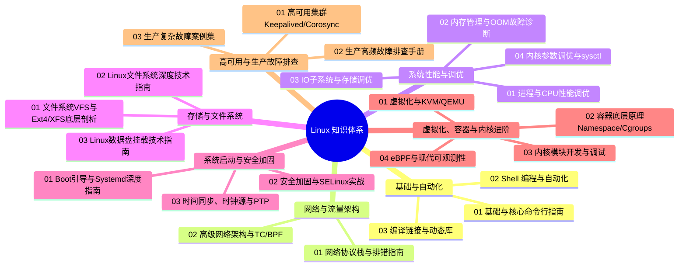
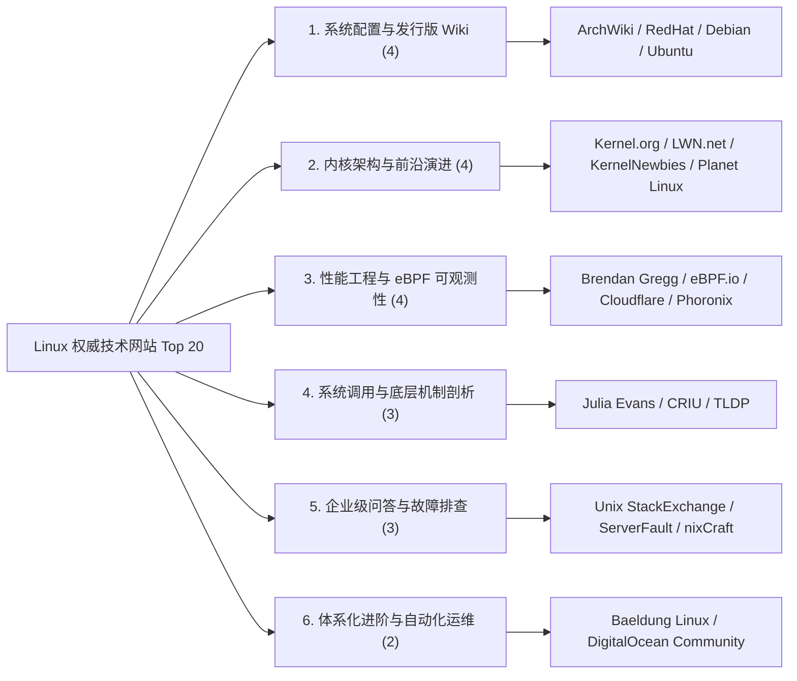

# 🐧 02-Linux 系统运维与底层内核技术实战知识库

## 目录说明
本目录全面系统地整理了从 Linux 基础命令、网络协议栈、进程与 CPU 调度、内存/OOM、存储与 IO 调优，到内核参数、安全加固、eBPF、底层虚拟化与容器隔离的全套生产级技术指南与排障实战手册，并精选收录了全球最权威的 Linux 技术与内核网站 Top 20 导航。

## 内容索引
| 名称 | 类型 | 说明 |
|------|------|------|
| [./01-基础与自动化/](./01-基础与自动化/) | 目录 | Linux 核心命令行基础、Bash Shell 脚本自动化编程、C/C++ 编译链接与动态库原理 |
| [./02-网络与流量架构/](./02-网络与流量架构/) | 目录 | NAPI 软中断收包、TCP 协议栈排错、Netfilter/iptables、TC 流量控制与 BPF 网络加速 |
| [./03-系统性能与调优/](./03-系统性能与调优/) | 目录 | CPU 调度与 CFS/EEVDF、内存管理/OOM/PSI、块层 IO 调度、sysctl 内核参数生产级调优 |
| [./04-存储与文件系统/](./04-存储与文件系统/) | 目录 | VFS 抽象层、Ext4/XFS 日志机制、FHS 规范、LVM 逻辑卷与数据盘规范挂载 |
| [./05-系统启动与安全加固/](./05-系统启动与安全加固/) | 目录 | BIOS/UEFI 与 Systemd 启动链、SELinux/Capabilities 安全加固、Chrony/PTP 时钟同步 |
| [./06-虚拟化与内核底座/](./06-虚拟化与内核底座/) | 目录 | KVM/QEMU 虚拟化、容器 Namespace/Cgroups 底座、LKM 内核模块开发与 eBPF 可观测性 |
| [./07-高可用与生产排错/](./07-高可用与生产排错/) | 目录 | Keepalived/Corosync 高可用集群、生产高频故障排查 SOP 与疑难死锁/丢包案例复盘 |

---

## 📂 模块分类知识大纲与思维导图

---

## 📚 知识库核心技术文档索引

### 一、 基础、脚本编程与工程构建
* [./01-基础与自动化/01-Linux基础与核心命令行指南.md](./01-基础与自动化/01-Linux基础与核心命令行指南.md) —— Linux 系统基础架构、高频核心工具链、权限体系与文本处理实战。
* [./01-基础与自动化/02-Linux_Shell脚本编程与自动化深度指南.md](./01-基础与自动化/02-Linux_Shell脚本编程与自动化深度指南.md) —— 高级 Bash 编程、流程控制、信号捕获、健壮性设计与自动化运维脚本。
* [./01-基础与自动化/03-Linux编译链接与动态库原理指南.md](./01-基础与自动化/03-Linux编译链接与动态库原理指南.md) —— ELF 文件格式、静态/动态链接、符号解析、`ld.so` 机制与 `LD_PRELOAD` 实战。

### 二、 网络协议栈与高级流量控制
* [./02-网络与流量架构/01-Linux网络协议栈与排错指南.md](./02-网络与流量架构/01-Linux网络协议栈与排错指南.md) —— 深入剖析 NAPI 软中断收包、TCP 状态机调优、Netfilter/iptables 四表五链与生产抓包排错 SOP。
* [./02-网络与流量架构/02-Linux高级网络架构与流量控制(TC_BPF)指南.md](./02-网络与流量架构/02-Linux高级网络架构与流量控制(TC_BPF)指南.md) —— Linux TC 流量整形与 QoS、HTB/Netem 弱网模拟、LVS/IPVS 负载均衡三大模式、网卡 Bonding 链路聚合及 tc-bpf 加速。

### 三、 系统核心资源与性能调优
* [./03-系统性能与调优/01-Linux进程与CPU性能调优指南.md](./03-系统性能与调优/01-Linux进程与CPU性能调优指南.md) —— CFS 完全公平调度器/EEVDF、CPU 上下文切换、USE 性能分析法、绑核与 FlameGraph 火焰图排查。
* [./03-系统性能与调优/02-Linux内存管理与OOM故障诊断指南.md](./03-系统性能与调优/02-Linux内存管理与OOM故障诊断指南.md) —— 虚拟内存空间、Page Cache 与 Buffer、匿名页、PSI 内存压力、Swap 机制与 OOM-Killer 评分救急。
* [./03-系统性能与调优/03-Linux_IO子系统与存储调优指南.md](./03-系统性能与调优/03-Linux_IO子系统与存储调优指南.md) —— 通用块层、`io_uring` 异步机制、IO 调度算法（mq-deadline/BFQ/Kyber）、`iostat` 性能指标与队列调优。
* [./03-系统性能与调优/04-Linux内核参数调优与sysctl实战指南.md](./03-系统性能与调优/04-Linux内核参数调优与sysctl实战指南.md) —— `/proc/sys` 映射机制、TCP 拥塞控制、连接队列溢出诊断、系统 limits 与生产场景 sysctl 模板。

### 四、 存储、挂载与文件系统底层
* [./04-存储与文件系统/01-Linux文件系统VFS与Ext4_XFS底层剖析指南.md](./04-存储与文件系统/01-Linux文件系统VFS与Ext4_XFS底层剖析指南.md) —— VFS 抽象层、Inode 与 Dentry 结构、Ext4/XFS 日志机制与文件系统元数据修复。
* [./04-存储与文件系统/02-Linux文件系统深度技术指南.md](./04-存储与文件系统/02-Linux文件系统深度技术指南.md) —— Linux 目录结构规范（FHS）、软硬链接机制、权限掩码（umask）与磁盘配额。
* [./04-存储与文件系统/03-Linux数据盘挂载技术指南.md](./04-存储与文件系统/03-Linux数据盘挂载技术指南.md) —— 物理磁盘分区（fdisk/parted）、LVM 逻辑卷管理、文件系统创建与 `/etc/fstab` 挂载参数规范。

### 五、 系统启动、时钟与安全加固
* [./05-系统启动与安全加固/01-Linux_Boot与Systemd深度指南.md](./05-系统启动与安全加固/01-Linux_Boot与Systemd深度指南.md) —— UEFI/BIOS 引导全历程、GRUB2、Initramfs、Systemd 单元管理与启动耗时分析。
* [./05-系统启动与安全加固/02-Linux安全加固与SELinux实战指南.md](./05-系统启动与安全加固/02-Linux安全加固与SELinux实战指南.md) —— SSH 加固、PAM 防爆破、SELinux MAC 强制访问控制、Auditd 审计与 Linux Capabilities 微特权分配。
* [./05-系统启动与安全加固/03-Linux时间同步、时钟源与PTP指南.md](./05-系统启动与安全加固/03-Linux时间同步、时钟源与PTP指南.md) —— TSC/HPET 时钟源机制、Chrony/NTP 高精度时间同步、硬件时钟与 PTP 纳秒级同步。

### 六、 虚拟化、容器底座与现代内核技术
* [./06-虚拟化与内核底座/01-Linux虚拟化与KVM_QEMU深度指南.md](./06-虚拟化与内核底座/01-Linux虚拟化与KVM_QEMU深度指南.md) —— CPU 硬件辅助虚拟化（Intel VT-x）、QEMU/KVM 架构、Virtio 半虚拟化驱动与 Libvirt 管理。
* [./06-虚拟化与内核底座/02-Linux容器底层原理与Namespace_Cgroups指南.md](./06-虚拟化与内核底座/02-Linux容器底层原理与Namespace_Cgroups指南.md) —— 容器底层 6 大 Linux Namespace 隔离、Cgroups v1/v2 资源限制与 Rootfs 挂载机制。
* [./06-虚拟化与内核底座/03-Linux内核模块开发与调试指南.md](./06-虚拟化与内核底座/03-Linux内核模块开发与调试指南.md) —— Linux 内核模块加载机制（LKM）、动态调试工具（ftrace/kdump/crash）与内核崩盘 Panic 定位。
* [./06-虚拟化与内核底座/04-eBPF与现代Linux系统可观测性指南.md](./06-虚拟化与内核底座/04-eBPF与现代Linux系统可观测性指南.md) —— eBPF 虚拟机原理、CO-RE/BTF 跨内核分发、BCC/bpftrace 工具链、Kprobe/Tracepoint 探针与无侵入观测。

### 七、 高可用架构与生产故障排查
* [./07-高可用与生产排错/01-Linux高可用集群与Keepalived_Corosync指南.md](./07-高可用与生产排错/01-Linux高可用集群与Keepalived_Corosync指南.md) —— VRRP 协议原理、Keepalived VIP 漂移与脑裂防护、Corosync/Pacemaker 高可用栈实战。
* [./07-高可用与生产排错/02-高级运维生产高频故障排查手册.md](./07-高可用与生产排错/02-高级运维生产高频故障排查手册.md) —— 生产环境高频出现的 CPU 假死、内存泄漏、句柄泄露、网络丢包与磁盘只读紧急止损手册。
* [./07-高可用与生产排错/03-高级运维生产复杂故障深度案例集(Case_Study).md](./07-高可用与生产排错/03-高级运维生产复杂故障深度案例集(Case_Study).md) —— 复杂疑难杂症实战复盘（死锁、跨机房丢包、内核态内存泄漏、D 状态进程堆积）。

---

## 🌐 全球权威 Linux 技术与内核网站 Top 20 精选与分类导航

以下整理了全球业界最权威、技术深度最高且在生产运维与内核开发中被广泛引用的 **Top 20 技术网站**。按 **6 大核心领域** 结构化分类，可作为技术进阶与生产排障的顶级参考书签：

### 1. 系统配置、企业级标准与发行版 Wiki

| 序号 | 网站名称 | 官方链接 | 定位属性与核心技术特色 | 推荐理由与应用场景 | 关联知识库模块 |
|:---:|---|---|---|---|---|
| **1** | **ArchWiki** | [https://wiki.archlinux.org/](https://wiki.archlinux.org/) | Linux 知识库“金标准” / 系统深度配置 | 虽然属于 Arch 发行版，但 **90%+ 内容通用**（GRUB、Systemd、网络驱动、桌面与硬件配置），条理清晰严谨，是公认的 Linux 文档天花板。 | [./01-基础与自动化/](./01-基础与自动化/) [./05-系统启动与安全加固/](./05-系统启动与安全加固/) |
| **2** | **Red Hat Documentation & Developer** | [https://access.redhat.com/documentation](https://access.redhat.com/documentation) [https://developers.redhat.com/](https://developers.redhat.com/) | 企业级 RHEL / CentOS / Rocky 生产规范 | 涵盖企业级内核参数、`tuned` 性能调优配置文件、SELinux 策略定制、LVM 存储与生产安全基线，代表企业级最高标准。 | [./03-系统性能与调优/](./03-系统性能与调优/) [./05-系统启动与安全加固/](./05-系统启动与安全加固/) |
| **3** | **Debian Documentation & Wiki** | [https://www.debian.org/doc/](https://www.debian.org/doc/) [https://wiki.debian.org/](https://wiki.debian.org/) | 自由软件通用基石 / dpkg 机制与稳定性工程 | 详尽阐述 Linux 软件包依赖解析、Debian Policy 规范、Systemd 服务编排与底层跨架构兼容性。 | [./01-基础与自动化/](./01-基础与自动化/) [./05-系统启动与安全加固/](./05-系统启动与安全加固/) |
| **4** | **Ubuntu Server Guide** | [https://ubuntu.com/server/docs](https://ubuntu.com/server/docs) | 现代云原生服务器底座 / Netplan 配置 | 涵盖 Netplan 声明式网络管理、AppArmor 安全限制、云主机初始化（cloud-init）与企业级运维指导。 | [./02-网络与流量架构/](./02-网络与流量架构/) [./05-系统启动与安全加固/](./05-系统启动与安全加固/) |

---

### 2. 内核架构、官方文档与底层演进

| 序号 | 网站名称 | 官方链接 | 定位属性与核心技术特色 | 推荐理由与应用场景 | 关联知识库模块 |
|:---:|---|---|---|---|---|
| **5** | **Linux Kernel Documentation (Kernel.org)** | [https://www.kernel.org/doc/html/latest/](https://www.kernel.org/doc/html/latest/) | Linux 内核官方权威文档档案库 | 内核各子系统（MM 内存管理、CFS/EEVDF 调度器、VFS 文件虚拟层、Netfilter 协议栈、驱动模型）的官方架构设计规范。 | [./03-系统性能与调优/](./03-系统性能与调优/) [./06-虚拟化与内核底座/](./06-虚拟化与内核底座/) |
| **6** | **LWN.net (Linux Weekly News)** | [https://lwn.net/](https://lwn.net/) | 内核社区最权威的技术与演进分析周刊 | 深入追踪 LKML 邮件列表核心争端、内核大版本演进（io_uring、eBPF 扩展、调度器演化）以及 CVE 漏洞机制的深度剖析。 | [./06-虚拟化与内核底座/](./06-虚拟化与内核底座/) [./03-系统性能与调优/](./03-系统性能与调优/) |
| **7** | **KernelNewbies** | [https://kernelnewbies.org/](https://kernelnewbies.org/) | 内核开发新手村 / 版本变更人话解析 | 详细介绍如何编译/调试自定义内核、补丁提交规范，提供每期面向开发者的 `LinuxChanges` 人话版内核版本更新解析。 | [./06-虚拟化与内核底座/03-Linux内核模块开发与调试指南.md](./06-虚拟化与内核底座/03-Linux内核模块开发与调试指南.md) |
| **8** | **Planet Linux Kernel & Greg K-H** | [https://planet.kernel.org/](https://planet.kernel.org/) [http://www.kroah.com/log/](http://www.kroah.com/log/) | Linux 核心维护者一手博客聚合 | 内核稳定版维护者 Greg Kroah-Hartman 等顶级核心贡献者的思考与见解，追踪驱动子系统、LTS 分支与内核安全防御。 | [./06-虚拟化与内核底座/](./06-虚拟化与内核底座/) |

---

### 3. 性能工程、底层可观测性与 eBPF

| 序号 | 网站名称 | 官方链接 | 定位属性与核心技术特色 | 推荐理由与应用场景 | 关联知识库模块 |
|:---:|---|---|---|---|---|
| **9** | **Brendan Gregg's Homepage & Systems Performance** | [https://www.brendangregg.com/](https://www.brendangregg.com/) | 性能工程与现代可观测性圣经 | **USE 方法论**发明人、火焰图 (FlameGraph) 与 eBPF/BCC/bpftrace 工具链先驱，深入 CPU、内存、存储与网络性能调优。 | [./03-系统性能与调优/](./03-系统性能与调优/) [./06-虚拟化与内核底座/04-eBPF与现代Linux系统可观测性指南.md](./06-虚拟化与内核底座/04-eBPF与现代Linux系统可观测性指南.md) |
| **10** | **eBPF.io (Official Portal)** | [https://ebpf.io/](https://ebpf.io/) | 现代 Linux 内核无侵入可观测与网络加速 | 官方技术门户，深入解析 eBPF 虚拟机机制、CO-RE/BTF 跨内核分发、XDP 高速包处理及 Cilium/Tetragon 等云原生基础设施。 | [./06-虚拟化与内核底座/04-eBPF与现代Linux系统可观测性指南.md](./06-虚拟化与内核底座/04-eBPF与现代Linux系统可观测性指南.md) [./02-网络与流量架构/02-Linux高级网络架构与流量控制(TC_BPF)指南.md](./02-网络与流量架构/02-Linux高级网络架构与流量控制(TC_BPF)指南.md) |
| **11** | **Cloudflare Technology Blog (Systems & Networking)** | [https://blog.cloudflare.com/tag/linux/](https://blog.cloudflare.com/tag/linux/) | 工业级超大规模 Linux 网络与性能优化 | 生产环境下 XDP 抵御 TB 级 DDoS、NAPI 软中断调优、TCP 拥塞控制算法（BBR）与 epoll/io_uring 极限性能调优实录。 | [./02-网络与流量架构/](./02-网络与流量架构/) [./07-高可用与生产排错/](./07-高可用与生产排错/) |
| **12** | **Phoronix** | [https://www.phoronix.com/](https://www.phoronix.com/) | 全球 Linux 硬件性能与基准测试天花板 | 每日更新的 CPU 架构/微码测试、文件系统（Ext4 vs XFS vs Btrfs）跑分对比、编译器调优与 Phoronix Test Suite 行业基准。 | [./03-系统性能与调优/](./03-系统性能与调优/) [./04-存储与文件系统/](./04-存储与文件系统/) |

---

### 4. 系统调用、底层机制与深度剖析

| 序号 | 网站名称 | 官方链接 | 定位属性与核心技术特色 | 推荐理由与应用场景 | 关联知识库模块 |
|:---:|---|---|---|---|---|
| **13** | **Julia Evans' Blog (Wizard Zines)** | [https://jvns.ca/](https://jvns.ca/) | 深入浅出的底层图解与系统调用实战 | 彻底讲透 strace、procfs 虚拟文件系统、Signals 信号量、网络包生命周期、DNS 抓包与文件描述符排错。 | [./01-基础与自动化/01-Linux基础与核心命令行指南.md](./01-基础与自动化/01-Linux基础与核心命令行指南.md) [./07-高可用与生产排错/](./07-高可用与生产排错/) |
| **14** | **CRIU (Checkpoint/Restore In Userspace)** | [https://criu.org/](https://criu.org/) | 进程冻结恢复、容器底层隔离机制 | 深入分析 Linux 6 大 Namespace、Cgroups、PTRACE、内存页追踪与进程无损迁移底层实现。 | [./06-虚拟化与内核底座/02-Linux容器底层原理与Namespace_Cgroups指南.md](./06-虚拟化与内核底座/02-Linux容器底层原理与Namespace_Cgroups指南.md) |
| **15** | **The Linux Documentation Project (TLDP)** | [https://tldp.org/](https://tldp.org/) | Linux 经典基础体系与网络管理奠基之作 | Linux Network Administrator's Guide (NAG)、HOWTO 故障排查手册、标准 POSIX 规范与经典 UNIX 哲学。 | [./01-基础与自动化/](./01-基础与自动化/) [./02-网络与流量架构/](./02-网络与流量架构/) |

---

### 5. 企业级实战问答与架构故障排查

| 序号 | 网站名称 | 官方链接 | 定位属性与核心技术特色 | 推荐理由与应用场景 | 关联知识库模块 |
|:---:|---|---|---|---|---|
| **16** | **Unix & Linux Stack Exchange** | [https://unix.stackexchange.com/](https://unix.stackexchange.com/) | 高质量 Unix/Linux 问答社区 | 严谨的审核机制，沉淀大量关于 Bash 复杂逻辑、底层系统调用异常、文件锁与权限冲突的高质量解法。 | [./01-基础与自动化/](./01-基础与自动化/) [./07-高可用与生产排错/](./07-高可用与生产排错/) |
| **17** | **Server Fault (Stack Exchange)** | [https://serverfault.com/](https://serverfault.com/) | 生产服务器架构、高并发、存储与网络调优问答 | 专注于高并发负载均衡、磁盘阵列（RAID/LVM）坏道恢复、跨机房网络延迟与高可用集群生产级排错。 | [./07-高可用与生产排错/](./07-高可用与生产排错/) [./04-存储与文件系统/](./04-存储与文件系统/) |
| **18** | **nixCraft / Cyberciti** | [https://www.cyberciti.biz/](https://www.cyberciti.biz/) | 资深系统管理员实战指南 | 专注于解决实际运维问题，提供详尽的 Bash 脚本模板、Nginx/SSH/Firewalld 配置与排错 SOP。 | [./01-基础与自动化/](./01-基础与自动化/) [./05-系统启动与安全加固/](./05-系统启动与安全加固/) |

---

### 6. 体系化进阶教程与自动化实战

| 序号 | 网站名称 | 官方链接 | 定位属性与核心技术特色 | 推荐理由与应用场景 | 关联知识库模块 |
|:---:|---|---|---|---|---|
| **19** | **Baeldung on Linux** | [https://www.baeldung.com/linux/](https://www.baeldung.com/linux/) | 现代化、结构化的 Linux 进阶技术与 Shell 实战教程 | 深度讲解文本流处理（awk/sed）、管道与信号量、Systemd 单元配置、网络诊断工具链的高阶用法。 | [./01-基础与自动化/](./01-基础与自动化/) [./05-系统启动与安全加固/](./05-系统启动与安全加固/) |
| **20** | **DigitalOcean Community Tutorials** | [https://www.digitalocean.com/community/tutorials](https://www.digitalocean.com/community/tutorials) | 经严格同行评审的企业级 Linux 运维实战指南 | 涵盖高可用架构（HAProxy/Keepalived）、生产级安全加固（UFW/Fail2ban/TLS）与自动化运维部署。 | [./07-高可用与生产排错/](./07-高可用与生产排错/) [./05-系统启动与安全加固/](./05-系统启动与安全加固/) |

---

> [!TIP] 💡 知识库导航与使用建议
>
> * **遇到系统配置与基础命令问题**：优先查阅 [ArchWiki](https://wiki.archlinux.org/) 与 [./01-基础与自动化/01-Linux基础与核心命令行指南.md](./01-基础与自动化/01-Linux基础与核心命令行指南.md)。
> * **遇到性能瓶颈与 CPU/内存/IO 调优**：优先参考 [Brendan Gregg](https://www.brendangregg.com/) 方法论与 [./03-系统性能与调优/01-Linux进程与CPU性能调优指南.md](./03-系统性能与调优/01-Linux进程与CPU性能调优指南.md)。
> * **遇到高并发网络与协议栈疑难**：深入研读 [Cloudflare Tech Blog](https://blog.cloudflare.com/tag/linux/) 与 [./02-网络与流量架构/01-Linux网络协议栈与排错指南.md](./02-网络与流量架构/01-Linux网络协议栈与排错指南.md)。
> * **探究底层内核机制与无侵入跟踪**：查阅 [Kernel.org Docs](https://www.kernel.org/doc/html/latest/)、[LWN.net](https://lwn.net/) 及 [./06-虚拟化与内核底座/04-eBPF与现代Linux系统可观测性指南.md](./06-虚拟化与内核底座/04-eBPF与现代Linux系统可观测性指南.md)。
