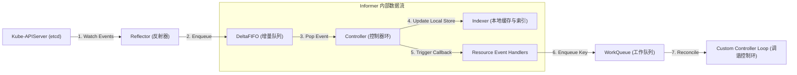
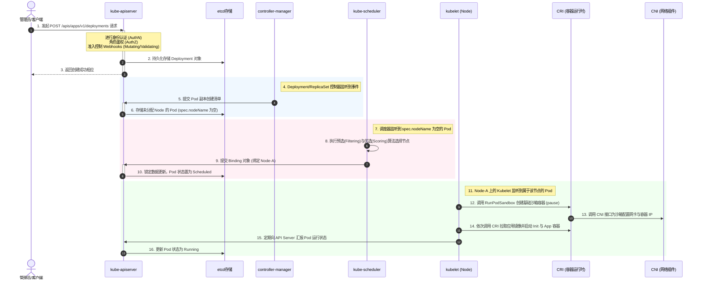
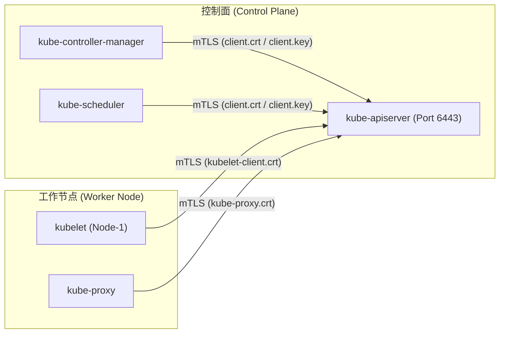
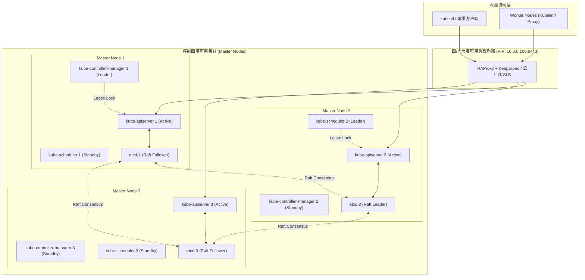
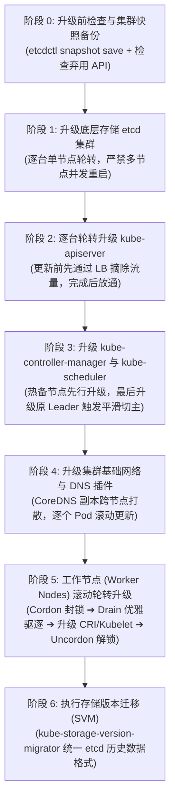
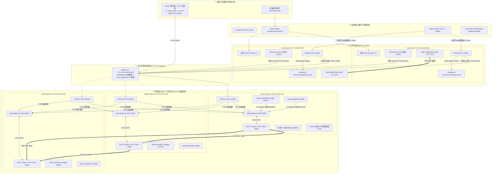
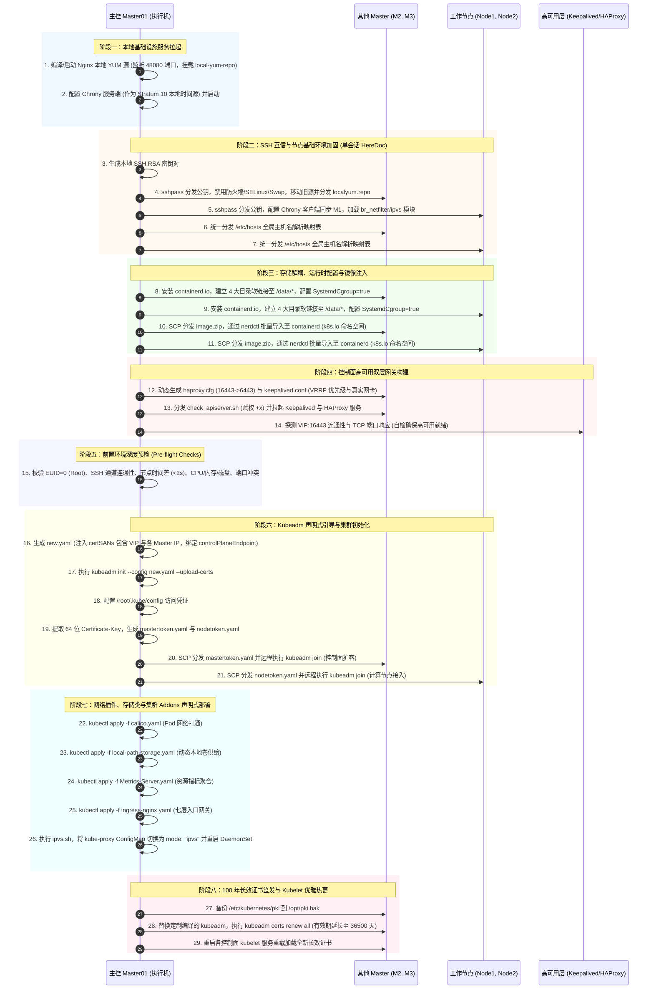
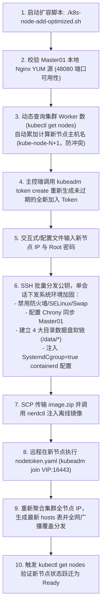

# 🔄 Kubernetes 组件通信模型与 Pod 创建生命周期

Kubernetes 作为一个高可用的分布式容器集群系统，其控制面与工作节点之间的组件通信以及工作负载的创建流程设计得极其精妙。本文深度解析各核心组件如何高效协同通信，拆解声明式请求与数据面流量的物理流转，并完整复盘离线高可用生产集群的组件互通拓扑、端口矩阵、生命周期时序与底层设计决策。

---

## 一、 🏛️ 控制面 (Master) 与工作节点 (Worker) 核心角色

集群核心组件基于“**控制循环 (Reconciliation Loop)**”进行自愈调谐：

```text
┌────────────────────────────────────────────────────────┐
│                        Master                          │
│  ┌───────────┐      ┌────────────────────┐      ┌───┐  │
│  │ Apiserver │◀────▶│ Controller Manager │◀────▶│   │  │
│  └─────┬─────┘      └────────────────────┘      │ S │  │
│        │                                        │ c │  │
│        ▼                                        │ h │  │
│    ┌──────┐                                     │ e │  │
│    │ ETCD │                                     │ d │  │
│    └──────┘                                     └───┘  │
└────────┬───────────────────────────────────────────────┘
         │
         ▼
┌────────────────────────────────────────────────────────┐
│                        Worker                          │
│             ┌─────────┐         ┌─────────────┐        │
│             │ Kubelet │         │ Kube-proxy  │        │
│             └─────────┘         └─────────────┘        │
└────────────────────────────────────────────────────────┘
```

### 1. 核心控制面 (Master)
- **`kube-apiserver`**：集群唯一的数据入口与交互纽带。所有其他组件对集群的操作都必须通过 apiserver 暴露的 REST API 接口来执行。**只有 API Server 能够直接访问底层存储 ETCD**。
- **`kube-controller-manager`**：集群的“大脑”。它由数十个微小的控制器（Node, ReplicaSet, Deployment, Endpoint 等）组成，不断将集群实际运行状态与用户定义的期望状态进行比对与调解。
- **`kube-scheduler`**：负责“承上启下”的调度器。专门监听未指定运行节点（`spec.nodeName` 为空）的 Pod，根据调度算法选择最合适的 Node 进行绑定。
- **`etcd`**：强一致、分布式键值对数据库，负责持久化存储集群的所有资源状态。

### 2. 工作节点 (Worker)
- **`kubelet`**：Node 节点上的 Pod 管家。直接运行在宿主机上，用来接收 Master 下发的指令，调用容器运行时拉起容器，并监控上报本地节点与 Pod 运行健康状况。
- **`kube-proxy`**：负责流量的转发与负载均衡规则管理。从 API Server 监听 Service 和 Endpoint 的变更，在宿主机本地生成 IPVS/iptables 路由规则，实现流量转发。

---

## 二、 ⚙️ 核心机制：Informer 内部调谐机制

Kubernetes 放弃了效率低下的定期轮询，采用 **Informer 监听机制 (Watch)**，在组件内存中维护 [etcd](./08-etcd底层架构MVCC与高可用运维.md) 数据的高速缓存，实现事件驱动型架构。

### Informer 工作流示意图



1. **Reflector (反射器)**：通过 List-Watch 接口与 API Server 建立长连接，监听特定资源（如 Pod）的事件（Add/Update/Delete）。
2. **DeltaFIFO (增量先进先出队列)**：Reflector 将捕获到的变化打包为 Delta（增量对象），写入 DeltaFIFO 中排队。
3. **Controller (控制回路)**：不断从 DeltaFIFO 中 pop 出增量对象进行处理。
4. **Indexer (本地缓存及索引)**：Controller 会把对象状态同步更新到内存缓存 Indexer 中。后续组件读操作直接读该内存缓存，彻底将高并发读压力从 etcd 转移到组件本地。
5. **Event Handlers (事件处理器)**：开发者注册的回调函数，将变化的对象的 Key（命名空间/名称）提取出来，发送入工作队列。

---

### 💡 架构关键辨析：为什么所有组件必须通过 APIServer 沟通？etcd 为什么不给其他组件直连？

> [!IMPORTANT]
> **核心结论**：`kube-apiserver` 是集群的“唯一前台柜台”，而 `etcd` 是隐藏在最深处的“底层金库”。K8s 强行禁止任何其他组件（[Kubelet](./04-Kubelet.md), Scheduler, KCM）直连 etcd。

#### 1. 现实物理比喻：银行柜台与金库
- **etcd (地下金库)**：只负责安全地存放现金（持久化 JSON 数据），不具备任何业务规则判断能力。
- **APIServer (业务柜台窗口)**：
  - 柜台人员先核验你的身份证（**认证 Authentication**）；
  - 检查你是否有权取钱（**授权 Authorization/RBAC**）；
  - 检查填写的金额格式是否合规，并强制添加默认手续费（**准入控制 Admission**）；
  - 确认无误后，柜台人员才打开小铁门去地下金库 (etcd) 存取现金。

#### 2. 3 个核心设计决策
1. **绝对数据安全与并发互斥**：
   如果允许 Kubelet 或数十个 Controller 直连 etcd 读写，任何一个组件的 Bug 或权限泄露都会导致 etcd 数据库被直接抹除或并发覆写崩溃。
2. **解耦底层存储实现**：
   将 etcd 隐藏在 APIServer 的 REST API 背后，未来即使将 etcd 替换为其他存储引擎（如轻量级 K3s 替换为 SQLite / MySQL），所有上层组件（Kubelet/Kubectl）的代码无需修改一行！
3. **Informer 读写分离防护 (保护 etcd 寿命)**：
   在 10,000+ Pod 的大规模集群中，如果每个 Kubelet 都直接轮询 etcd，etcd 会在几秒钟内被高并发读取冲垮。通过 APIServer 层的内存 Watch Cache 垫片，组件可以直接长连接监听内存事件，**将 99% 的高并发读压力阻断在内存层，etcd 压力下降两个数量级**！

---

## 三、 ⏱️ Pod 创建全生命周期深度时序流程

当用户在控制台执行 `kubectl apply -f nginx-deployment.yaml` 时，Kubernetes 内部的具体执行步骤如下：



### 时序流程物理详述

1. **用户提交请求**：用户执行 `kubectl apply`，命令行客户端将 YAML 文件解析为 JSON，并通过 HTTPS POST 请求发送给 `kube-apiserver`。
2. **API Server 准入控制**：
   - **Authentication (认证)**：确认用户身份（证书或 Token）。
   - **Authorization (鉴权)**：通过 RBAC 检查用户是否拥有创建 Deployment 的权限。
   - **Admission Control (准入控制)**：执行各种内置或自定义 Webhook（例如自动添加标签、验证资源限制等）。
3. **写入 ETCD**：通过所有校验后，apiserver 将 Deployment 资源写入 etcd 中，并向用户返回成功响应。
4. **Deployment 控制器调谐**：`kube-controller-manager` 运行中的 Deployment 控制器通过 Watch 接口监听到该 Deployment 的创建。它发现此时没有对应的 ReplicaSet，便发起创建 ReplicaSet 的请求。
5. **ReplicaSet 控制器调谐**：ReplicaSet 控制器被拉起，它发现当前运行的 Pod 副本数（0）与期望副本数（假设为 2）不符，便向 API Server 发送 2 个 Pod 的创建请求。
6. **写入未调度的 Pod**：API Server 接受 Pod 清单，将其持久化写入 etcd。此时 Pod 的状态为 **Pending**，且 `spec.nodeName` 字段为空。
7. **调度器调度决策**：`kube-scheduler` 监听到有未调度的 Pod。它将这些 Pod 放入调度队列：
   - **预选阶段 (Filtering/Predicates)**：过滤掉不符合条件的节点（如资源不足、端口冲突、节点有污点等）。
   - **优选阶段 (Scoring/Priorities)**：对剩余节点进行打分（考虑镜像本地存在性、节点亲和力、负载均衡度等），选出得分最高的 Node（如 Node-A）。
8. **绑定节点**：调度器向 API Server 发送一个 **Binding** 请求，将 Pod 的 `spec.nodeName` 设置为 Node-A。API Server 将绑定数据更新写入 etcd。
9. **Kubelet 监听执行**：Node-A 上的 `kubelet` 通过 Watch 接口发现有一个新 Pod 被绑定到了本节点上，立即接管并启动本地创建逻辑。
10. **拉起容器环境**：
    - Kubelet 调用 **CRI**（容器运行时接口，如 containerd）创建 **Pod Sandbox**（即拉起 `pause` 容器，构建共享的 Network/IPC 命名空间）。
    - Kubelet 调用 **CNI**（容器网络接口）为 Pod 分配独立 IP 地址，并与主机网络进行桥接绑定。
    - Kubelet 接着通过 CRI 依次拉取镜像、运行 Init 容器，并在 Init 容器成功退出后，启动业务应用容器。
11. **状态上报**：Kubelet 监控容器的健康状况，并通过 API Server 定期向 etcd 汇报更新 Pod 的状态（例如切换为 **Running**）。

---

## 四、 🔁 控制回路自愈：Reconciliation Loop 原理

所有控制器都运作在一个无限循环的控制回路中：

```text
    ┌──────────────────────────────────┐
    ▼                                  │
┌──────────────┐   计算差异   ┌─────────────────┐
│ 获取实际状态 ├─────────────▶│ 比对期望状态(Spec)│
└──────────────┘              └────────┬────────┘
                                       │ 有差异
                                       ▼
                              ┌─────────────────┐
                              │ 执行自愈调谐动作 │
                              └─────────────────┘
```

该模式不关心中间演进的历史步骤，只关心最终结果。这种“**以结果为导向**”的反馈回路（Feedback Loop）确保了即使在节点宕机、网络故障等严重异常下，一旦恢复，集群都能在没有人工介入的情况下以最快速度恢复用户期望的业务状态。

---

## 五、 🔐 深度扩展：组件双向 mTLS 通信与安全信道

在 Kubernetes 集群内部，所有组件（Kubelet, Controller-Manager, Scheduler, Kube-Proxy）与 `kube-apiserver` 的通信默认均基于 **HTTPS + 双向 X509 客户端证书认证 (mTLS)** 加密建立：



### 1. 证书身份映射规则
API Server 通过解析客户端证书中的字段自动识别请求身份：
- **Common Name (CN)**：映射为身份 User（例如 `CN=system:node:node-1` 映射为节点用户）。
- **Organization (O)**：映射为身份 Group（例如 `O=system:nodes` 映射为节点用户组，触发 Node 授权器）。

### 2. Pod 内部 SA Token 动态轮换 (ServiceAccount Issue)
Pod 内部访问 APIServer 采用安全的 **Bound ServiceAccount Token (JWT)**：
- Token 包含 `aud` (Audience) 限制与受限超时时间（默认 1 小时）。
- Kubelet 负责在 Token 到期前自动刷新挂载目录中的 JWT 文件，应用程序可无感平滑读取最新 Token，杜绝了硬编码静态密钥的泄露风险。

---

## 六、 🌐 控制面高可用架构、版本倾斜规则 (Version Skew Policy) 与集群平滑升级全景流程

在生产环境中，集群不仅要满足日常业务的平稳运行，还要具备承载**单节点物理宕机自愈**与**无损跨版本平滑升级 (Zero-Downtime Upgrade)** 的能力。

### 1. 控制面高可用 (HA) 架构全景拓扑

Kubernetes 控制面各组件根据其底层无状态/有状态特性，采用了完全不同的高可用模式：



#### 组件高可用模式对比矩阵

| 组件名称 | 高可用工作模式 | 仲裁 / 协调机制 | 故障转移时延 (Failover) |
| :--- | :--- | :--- | :--- |
| **`kube-apiserver`** | **多活 (Active-Active)** | 无状态服务，通过外部负载均衡（SLB / Keepalived+HAProxy）进行流量分发与健康检查剔除。 | $\le 1	ext{s}$（依赖 LB 健康检查探针间隔） |
| **`etcd`** | **分布式多数派 (Raft Quorum)** | 基于 Raft 共识协议，数据强一致复制。需部署奇数节点（3/5/7），允许最多容忍 $\lfloor (N-1)/2 
floor$ 个节点宕机。 | 	ext{ms} \sim 1	ext{s}$（心跳超时选举） |
| **`kube-controller-manager`** | **主备单活 (Active-Passive)** | 基于 `coordination.k8s.io` 的 **Lease 租约锁** 抢占选主。仅 Leader 节点运行控制器回路，Standby 节点热备监听。 | 	ext{s}$（默认 Lease 到期超时） |
| **`kube-scheduler`** | **主备单活 (Active-Passive)** | 同样基于 Lease 租约锁抢占选主。仅 Leader 节点执行调度算法与内存 Cache 更新。 | 	ext{s}$（默认 Lease 到期超时） |

---

### 2. Kubernetes 官方版本倾斜规则 (Version Skew Policy)

在执行集群滚动升级时，不可避免会处于“新旧版本组件共存”的过渡态。Kubernetes 官方定义了极其严格的**版本倾斜兼容性边界**（假设当前目标升级版本为 $）：

```text
       ┌─────────────────────────────────────────────────────────────┐
       │                kube-apiserver (基准版本: N)                 │
       └──────┬──────────────────────┬────────────────────────┬──────┘
              │                      │                        │
       [ 至多落后 1 个次版本 ]   [ 至多落后 3 个次版本 ]     [ 支持前后 1 个次版本 ]
              ▼                      ▼                        ▼
   ┌──────────────────────┐ ┌──────────────────┐    ┌──────────────────┐
   │ KCM / Scheduler (N-1)│ │ Kubelet / Proxy  │    │  Kubectl Client  │
   │                      │ │ (N-3, N-2, N-1)  │    │  (N-1, N, N+1)   │
   └──────────────────────┘ └──────────────────┘    └──────────────────┘
```

#### 核心兼容性约束表

| 被评估组件 | 相对于 `kube-apiserver` 的版本倾斜约束 | 关键规则与违规风险 |
| :--- | :--- | :--- |
| **`kube-apiserver` 间 (HA 模式)** | 允许 $ 与 -1$ 暂时共存 | 必须在 1 个次版本以内。升级时逐台轮转，严禁跨版本（如 $ 与 -2$ 同时运行）。 |
| **`kube-controller-manager`** | **不得高于** APIServer；允许 -1$ | 若 KCM 版本高于 APIServer，KCM 调谐生成的新字段 APIServer 无法识别而报错。 |
| **`kube-scheduler`** | **不得高于** APIServer；允许 -1$ | 若调度器先于 APIServer 升级，其所依赖的新调度注解/字段可能被旧 APIServer 丢弃。 |
| **`kubelet` (工作节点)** | **不得高于** APIServer；允许 -3 \sim N-1$ | Kubelet 可落后最多 3 个次版本（如 APIServer 1.30，Kubelet 可为 1.27）。但严禁 Kubelet 领先 APIServer。 |
| **`kube-proxy`** | **不得高于** APIServer；允许 -3 \sim N-1$ | 规则与 Kubelet 保持一致，需与所在工作节点或控制面网络版本兼容。 |
| **`kubectl` (客户端)** | 允许 -1 \sim N+1$ | 支持与当前 APIServer 相差 1 个小版本的客户端双向兼容。 |

---

### 3. 生产级控制面与工作节点标准滚动升级次序 (SOP)

Kubernetes 集群升级必须严格遵循**由底向上、由控制面到数据面**的标准次序进行：



#### 各阶段详细操作准则：

1. **阶段 0：前置安全检查与快照**
   - 使用 `kubent` 或 `pluto` 扫描集群内所有正在使用的废弃 API（Deprecated APIs），更新对应的 Helm/YAML 声明。
   - 执行 `etcdctl snapshot save` 保存全量物理快照，并验证快照完整性。
2. **阶段 1：etcd 逐台升级**
   - 必须严格单节点逐一升级（保持集群 Quorum 大于半数），单节点加入并健康（`endpoint health` 为 true）后再升级下一台。
3. **阶段 2：[kube-apiserver](./01-API_Server.md) 滚动升级**
   - 依托负载均衡器（LB），逐台节点执行升级。升级前临时摘除后端权重，启动完成且健康检查通过后再恢复流量。
4. **阶段 3：KCM 与 Scheduler 升级**
   - 按照版本倾斜规则，APIServer 升级完成后方可升级控制器与调度器。
5. **阶段 4：工作节点安全排空与升级**
   - 工作节点严禁直接强制重启。必须先执行 `kubectl cordon <node>` 阻止新调度，再执行 `kubectl drain <node>` 触发 Pod 优雅关机转移，最后更新 Kubelet 与容器运行时。
6. **阶段 5：存储版本迁移 (Storage Version Migration)**
   - 控制面升级完毕后，运行 `kube-storage-version-migrator` 批量重写 etcd 历史数据，完成序列化版本的落盘固化。

---

## 七、 🔌 工业级离线高可用集群全景组件通信拓扑与端口连接矩阵 (基于生产离线套件)

在全封闭无外网的企业离线机房中，Kubernetes 集群通常采用**双层控制网关（Keepalived + HAProxy）**与**堆叠式高可用控制面（Stacked Master Nodes）**架构。各组件、插件与基础设施服务之间的物理网络连接与通信拓扑如下：

### 1. 离线高可用全景物理拓扑与流量交互图



---

### 2. 生产集群全组件通信与端口映射矩阵表

下表详尽梳理了离线生产集群中各组件的监听端口、协议类型、通信方向与核心功能：

| 组件分类 | 源端 (Source) | 目标端 (Target) | 目标端口 / 协议 | 认证与安全机制 | 核心用途与物理流向说明 |
| :--- | :--- | :--- | :--- | :--- | :--- |
| **控制面网关** | Keepalived 节点间 | 组播地址 / 节点网卡 | `VRRP (IP协议112)` | 密码认证 (`auth_pass`) | Master 节点间通过心跳组播维持 VIP（如 `172.16.255.190`），主节点故障时 2s 内漂移。 |
| **四层负载均衡** | 客户端 / Worker 节点 | HAProxy (各 Master) | `16443 / TCP` | 无（透传 TLS 流） | 监听高可用 VIP:16443，将请求以 RoundRobin 算法轮询分发给后端的 `kube-apiserver:6443`。设置 3h 超时保活 `kubectl exec`。 |
| **健康检查探针** | Keepalived | HAProxy 进程 | 本地进程检测 | `check_apiserver.sh` | 脚本循环 3 次执行 `pgrep haproxy`，若挂掉则自动触发 `systemctl stop keepalived` 强制让出 VIP。 |
| **集群通信核心** | HAProxy / KCM / Kubelet | `kube-apiserver` | `6443 / TCP (HTTPS)` | 双向 mTLS (`ca.crt`, `certSANs`) | Kubernetes 核心交互中枢，统一处理认证、鉴权、准入控制并读写 etcd。 |
| **分布式数据存储** | `kube-apiserver` | `etcd` 集群 | `2379 / TCP` | mTLS (`apiserver-etcd-client.crt`) | API Server 访问本地/远端 etcd 存储实例进行键值数据增删改查。 |
| **分布式数据存储** | `etcd` 节点间 | `etcd` 对等节点 | `2380 / TCP` | mTLS (`etcd/peer.crt`) | etcd 节点间 Raft 选举、日志强一致复制与心跳探测。 |
| **控制器调谐** | `kube-controller-manager` | `kube-apiserver` | `6443 / TCP` 或 `16443` | mTLS (`controller-manager.crt`) | List-Watch 监听资源变化，执行 Deployment、Node 等 30+ 种控制器调谐，基于 Lease 抢占选主。 |
| **调度引擎** | `kube-scheduler` | `kube-apiserver` | `6443 / TCP` 或 `16443` | mTLS (`scheduler.crt`) | 监听未调度 Pod，执行预选与打分，向 APIServer 提交 Binding 对象。 |
| **节点守护进程** | `kubelet` (各节点) | `kube-apiserver` (VIP) | `16443 / TCP (HTTPS)` | mTLS (`kubelet-client.crt`) | 向 APIServer 注册节点、定期上报心跳及 Pod 状态，接收 Pod 期望清单。 |
| **节点控制入口** | `kube-apiserver` / Metrics-Server | `kubelet` (各节点) | `10250 / TCP (HTTPS)` | mTLS (`apiserver-kubelet-client.crt`) | APIServer 下发 `kubectl exec/logs` 指令或 Metrics-Server 拉取节点与容器资源指标。 |
| **容器运行时接口** | `kubelet` | `containerd` | `/var/run/containerd/containerd.sock` | 本地 UNIX Socket 权限控制 | Kubelet 基于 gRPC 协议调用 CRI 接口（`RuntimeService`、`ImageService`）管理沙箱与容器生命周期。 |
| **网络代理服务** | `kube-proxy` | `kube-apiserver` (VIP) | `16443 / TCP (HTTPS)` | mTLS (`kube-proxy.crt`) | 监听 Service 与 Endpoints 变更，自动维护内核 IPVS 规则与 `ipset` 虚拟服务映射。 |
| **代理状态与指标** | 运维巡检 / Prometheus | `kube-proxy` | `10249 / TCP (HTTP)` | 本地只读 | 暴露 [kube-proxy](./05-Kube_Proxy.md) 指标及 `/proxyMode` 接口（返回 `ipvs` 或 `iptables`）。 |
| **跨节点容器网络** | Calico Felix / BIRD | 其他节点 BIRD | `179 / TCP (BGP)` | BGP 邻居认证 | 节点间通过 BGP 路由协议分发 Pod 子网路由表（IPIP 模式下使用 IP 协议 4 封装）。 |
| **域名解析服务** | 业务 Pod | `CoreDNS` | `10.96.0.10:53 (UDP/TCP)`| 无（集群内明文） | 为 Pod 提供 `service.namespace.svc.cluster.local` 及外部 DNS 域名解析。 |
| **七层入口网关** | 外部客户端 | `Ingress-Nginx` | `80, 443 / TCP` | TLS 终止 / 证书绑定 | 以 DaemonSet (HostNetwork) 运行在 Master/Edge 节点，解析 HTTP 路由并直通转发至 Backend Pod IP。 |
| **离线依赖源仓库** | 各节点 yum | Master01 Nginx 源 | `48080 / TCP (HTTP)` | IP 白名单 / 内网直连 | 托管离线 RPM 包及编译依赖，为所有节点提供全自动的 `localyum.repo` 源。 |
| **集群时间同步** | 各节点 Chrony 客户端 | Master01 Chrony 服务端| `123 / UDP (NTP)` | Chrony 协议校验 | 保证所有节点时间偏差 $\le 2	ext{s}$，彻底杜绝 TLS 证书因时钟漂移校验失败及 Raft 选举混乱。 |

---

## 八、 🚀 离线集群全生命周期流程：安装初始化、节点扩容与 8 维自动化巡检时序

### 1. 离线集群全自动部署流水线 (Deployment Pipeline)

离线安装脚本（`k8s-offline-optimized.sh`）以**主控节点 Master01**为编排核心，实现了完全非交互式与 100% 幂等的九阶段部署流水线：



---

### 2. 节点动态扩容时序与状态流转 (`k8s-node-add-optimized.sh`)

当集群计算资源紧张时，运维人员可随时运行节点扩容脚本，其内部执行时序如下：



---

### 3. 8 维度自动化巡检与验证流水线 (`k8s-test.sh`)

为确保集群具备生产上线条件，部署套件内建了 8 项全自动巡检脚本，形成严密的健康度闭环：

```text
┌─────────────────────────────────────────────────────────────────────────────┐
│                   8 维度集群生产级自动化巡检验证流水线                       │
├────────────────────────┬────────────────────────────────────────────────────┤
│ 1. 节点 Ready 状态     │ 校验所有 Master 与 Worker 节点状态均为 Ready        │
├────────────────────────┼────────────────────────────────────────────────────┤
│ 2. 控制面静态 Pod 状态 │ 检查 kube-apiserver, etcd, kcm, scheduler 均为 Running│
├────────────────────────┼────────────────────────────────────────────────────┤
│ 3. 系统核心插件 Pod    │ 检查 kube-system 命名空间下 Calico, CoreDNS, Ingress│
├────────────────────────┼────────────────────────────────────────────────────┤
│ 4. CoreDNS 域名解析    │ 启动临时 busybox 测试 Pod，执行 nslookup 解析      │
│                        │ kubernetes.default.svc.cluster.local 校验内部路由  │
├────────────────────────┼────────────────────────────────────────────────────┤
│ 5. IPVS 模式与规则拓扑 │ 检查 ipvsadm -Ln 是否包含 10.96.0.1 规则，校验     │
│                        │ curl 127.0.0.1:10249/proxyMode 返回值为 ipvs       │
├────────────────────────┼────────────────────────────────────────────────────┤
│ 6. Local-Path 存储读写 │ 动态创建 128Mi PVC 并挂载 Pod 写入测试数据后读出校验│
├────────────────────────┼────────────────────────────────────────────────────┤
│ 7. Metrics-Server 监控 │ 探测 kubectl top nodes 接口是否能够正确返回指标    │
├────────────────────────┼────────────────────────────────────────────────────┤
│ 8. 100 年证书期限核验  │ 运行 /opt/kubeadm certs check-expiration，校验      │
│                        │ admin.conf 剩余有效天数是否 > 30000 天 (约 100 年) │
└────────────────────────┴────────────────────────────────────────────────────┘
```

---

## 九、 💡 生产级核心原理与设计决策深度解析

### 1. 存储层解耦与 4 大重型目录数据盘软链接原理

> [!WARNING]
> **生产重大痛点**：Linux 生产服务器通常将根分区（`/`）划分在较小的系统盘上（如 50GB~100GB）。在默认配置下：
> - 容器镜像与解压层存放于 `/var/lib/containerd`；
> - Pod 临时卷（`emptyDir`）、挂载卷与元数据存放于 `/var/lib/kubelet`；
> - etcd 数据库快照与 WAL 预写日志存放于 `/var/lib/etcd`；
> - 所有容器的控制台标准输出（stdout/stderr）集中写入 `/var/log/pods`。
> 
> 一旦业务容器打印海量日志或下载大镜像，系统根分区会被**瞬间擦爆（Disk Full）**，导致 Linux 内核因无法写入临时文件而将文件系统强行转为**只读（Read-Only Filesystem）**，引起全节点雪崩式宕机！

#### 架构解决方案：
在部署之初，通过脚本在独立挂载的大容量高性能数据盘（如 `/data`）上建立物理隔离，并通过系统级软链接进行无感映射：

```text
系统根分区目录 (标准路径)                  大容量高性能独立数据盘 (物理路径)
┌──────────────────────┐                 ┌────────────────────────────────┐
│ /var/lib/containerd  ├─ (符号软链接) ─►│ /data/containerd (镜像/OverlayFS)│
├──────────────────────┤                 ├────────────────────────────────┤
│ /var/lib/kubelet     ├─ (符号软链接) ─►│ /data/kubelet (Pod Volume/卷快照)│
├──────────────────────┤                 ├────────────────────────────────┤
│ /var/lib/etcd        ├─ (符号软链接) ─►│ /data/etcd (etcd WAL与DB数据)   │
├──────────────────────┤                 ├────────────────────────────────┤
│ /var/log/pods        ├─ (符号软链接) ─►│ /data/log/pods (容器标准输出日志)│
└──────────────────────┘                 └────────────────────────────────┘
```

> [!TIP]
> **架构收益**：既保持了 Kubernetes 官方代码对标准目录结构的硬编码兼容性，又彻底隔离了系统运行盘与业务存储空间。

---

### 2. 经过 3 轮精化的 Containerd 生产级调优

针对原生 RPM 默认配置的各类暗坑，对 `conf/config.toml` 进行了深度优化：

```toml
version = 2
root = "/data/containerd"
disabled_plugins = []  # 核心修复 1：彻底移除 cri 禁用项，避免报错 unknown service runtime.v1.RuntimeService

[plugins."io.containerd.grpc.v1.cri"]
  sandbox_image = "registry.cn-hangzhou.aliyuncs.com/google_containers/pause:3.7" # 核心修复 2：固化离线 Pause 镜像
  max_concurrent_downloads = 10                                                  # 性能提升：镜像并发拉取数从 3 提升到 10
  max_container_log_line_size = 16384                                            # 防护 1：单行日志限 16KB，防 Java 堆栈冲垮内存

  [plugins."io.containerd.grpc.v1.cri".containerd.runtimes.runc]
    runtime_type = "io.containerd.runc.v2"
    [plugins."io.containerd.grpc.v1.cri".containerd.runtimes.runc.options]
      SystemdCgroup = true                                                       # 核心修复 3：统一 cgroup driver 为 systemd
```

| 调优配置项 | 默认问题 / 隐患 | 优化后技术价值 |
| :--- | :--- | :--- |
| `SystemdCgroup = true` | 默认 `cgroupfs` 与 Kubelet 的 `systemd` 驱动冲突，导致两个管理器同时争抢资源句柄，OOM 统计失准并触发异常驱逐。 | 统一由 systemd 调度管理 cgroup，资源统计精准，彻底杜绝误杀。 |
| `disabled_plugins = []` | CentOS 官方源安装 containerd 默认包含 `disabled_plugins = ["cri"]`, 导致 Kubelet 启动报 `unknown service runtime.v1.RuntimeService` 致命错误。 | 100% 确保 CRI 插件正常装载提供 gRPC 服务。 |
| `max_concurrent_downloads = 10` | 默认单节点拉取镜像并发度仅为 3，大规模应用批量滚动扩容时耗时过长。 | 提升并发通道至 10，显著缩短镜像批量分发耗时。 |
| `max_container_log_line_size = 16384` | 应用程序（如 Java Spring Boot）抛出死循环超长堆栈时，单行日志可能几百 MB，直接击穿 CRI 内存缓冲区。 | 单行日志限制 16KB，超长部分安全切分，保护节点运行时稳定。 |
| `sandbox_image = "pause:3.7"` | 默认尝试从 `k8s.gcr.io` 在线拉取 Pause，断网离线环境下 Pod 永远处于 `ContainerCreating`。 | 锁定本地离线包内已载入的 Pause 镜像，离线秒级拉起沙箱。 |

---

### 3. 100 年长效证书生成与平滑热更原理

> [!CAUTION]
> **官方默认 1 年有效期陷阱**：官方 `kubeadm` 工具在初始化集群时，默认签发的控制面 TLS 客户端与服务端证书（如 `apiserver.crt`、`front-proxy-client.crt`）有效期仅为 **1 年 (365天)**。1 年后证书过期会导致 API Server 拒绝所有请求，整个集群彻底瘫痪。

#### 100 年长效续期底层机制：
1. **定制源码编译**：修改 Kubernetes 官方源码中的 `staging/src/k8s.io/client-go/util/cert/cert.go` 与 `cmd/kubeadm/app/constants/constants.go` 常量定义：
   ```go
   // 源码中将证书默认有效期从 1 年修改为 100 年
   const CertificateBlockDuration = time.Hour * 24 * 365 * 100
   ```
   编译生成专属的定制 `kubeadm` 二进制文件。
2. **安全备份**：在 Master 节点上将当前证书备份至 `/opt/pki.bak`（`cp -r /etc/kubernetes/pki /opt/pki.bak`）。
3. **全量重签**：调用定制 `kubeadm` 执行：
   ```bash
   /opt/kubeadm certs renew all
   ```
   该命令会基于集群原有的 Root CA（`ca.crt`，CA 根证书默认 10 年），为所有组件重新签发有效期长达 **36500 天 (100年)** 的叶子证书。
4. **优雅热重载**：重启控制面 `kubelet` 服务（`systemctl restart kubelet`），Kubelet 会自动触发静态 Pod（`kube-apiserver` 等）的平滑重启，加载全新长效证书生效。

---

### 4. Kube-Proxy IPVS 模式与系统内核网桥调优原理

#### IPVS 相比 Iptables 的压倒性优势：
- **算法复杂度**：Iptables 基于链式线性遍历，复杂度为 $O(N)$；当 Service 超过 5000 个时，每次数据包匹配都需要逐条遍历几万条规则，导致 CPU 负载飙升。IPVS 基于**内核哈希表（Hash Table）**查找，复杂度恒定为 $O(1)$，百万级规则下转发性能几乎无损。
- **同步开销**：Iptables 每次增删一条规则必须全量刷写整个链表；IPVS 支持增量动态修改规则，网络波动时 CPU 消耗极低。

#### 核心内核网络参数解析 (`conf/k8s.conf`)：
```ini
# 1. 允许物理网桥（Bridge）上的数据包经过 iptables/ipvs 规则链进行过滤与 NAT 转发
net.bridge.bridge-nf-call-iptables = 1
net.bridge.bridge-nf-call-ip6tables = 1

# 2. 开启 Linux 内核 IPv4 数据包跨网卡转发能力（Pod 跨节点通信必备）
net.ipv4.ip_forward = 1

# 3. 调优内存映射区域上限（满足 Elasticsearch / Kafka / MySQL 等底层 mmap 依赖，防止 OOM）
vm.max_map_count = 262144

# 4. 提升文件系统 inotify 监听实例上限（防止 Prometheus / 日志采集器监听过多文件时报 too many open files）
fs.inotify.max_user_instances = 524288
```
