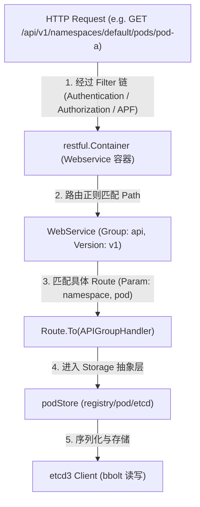
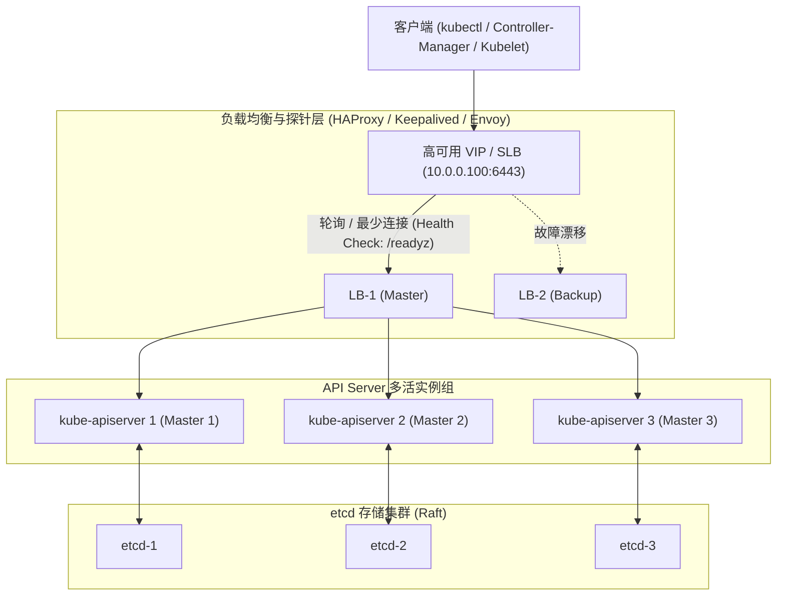
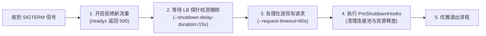
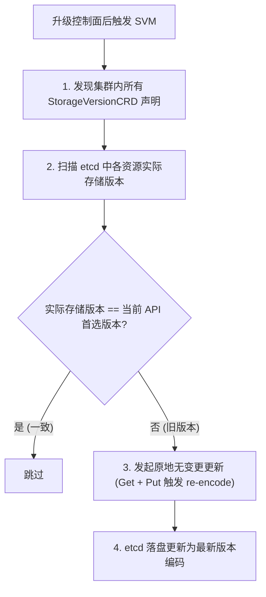

# 🚪 kube-apiserver 底层原理与高阶配置

`kube-apiserver` 是 Kubernetes 控制面的核心组件，作为整个集群的“唯一网关”，它承载了资源操作入口、集群数据状态总线、安全性屏障等多重核心角色。

---

## 一、 kube-apiserver 核心架构与 Delegation 链

kube-apiserver 的内部运作并非单一整体，而是由三个独立的子服务通过 **Delegation (委托模式)** 链式串联起来协同工作的：

```text
               ┌──────────────────────────────────────┐
               │         kube-apiserver 委托链        │
               └──────────────────┬───────────────────┘
                                  │ 拦截转发
                                  ▼
                     ┌──────────────────────────┐
                     │ 1. AggregatorServer      │ (聚合层扩展，如 metrics-server)
                     └────────────┬─────────────┘
                                  │ 未命中
                                  ▼
                     ┌──────────────────────────┐
                     │ 2. KubeAPIServer         │ (K8S 内置核心资源，如 Pod, Service)
                     └────────────┬─────────────┘
                                  │ 未命中
                                  ▼
                     ┌──────────────────────────┐
                     │ 3. APIExtensionsServer   │ (自定义 CRD 资源处理)
                     └────────────┬─────────────┘
                                  │ 未定义
                                  ▼
                                404
```

1.  **AggregatorServer (聚合服务)**：
    *   **职责**：类似于一个内部的七层负载均衡器。它接收用户请求，如果发现是外部注册的扩展 API（如 `metrics.k8s.io`，由 metrics-server 提供），就会将请求代理转发给对应的后端 Pod。
    *   **作用**：允许第三方开发者在不修改 K8S 核心代码的前提下，为集群增加定制化的 API 服务。
2.  **KubeAPIServer (核心服务)**：
    *   **职责**：负责处理 Kubernetes 原生内置的核心资源对象，如 Pod、Deployment、Service、Namespace 等。
3.  **APIExtensionsServer (CRD 服务)**：
    *   **职责**：Delegation 链的最后一环。专门用于处理用户通过 CustomResourceDefinition (CRD) 自定义的对象。如果请求的资源既不是核心资源，也未注册聚合，且不属于任何 CRD，则最终返回 404。

---

## 二、 访问控制管线 (Filter Pipeline)

任何发往 API Server 的 HTTP 请求，都必须经历一条由众多过滤器（Filters）组成的串行处理管线。只有通过全部关卡的请求，才会被写入后端存储。

```text
客户端请求 ──▶ [认证 Authentication] ──▶ [授权 Authorization] ──▶ [限流与审计] ──▶ [准入控制 Admission] ──▶ 写入 ETCD
```

### 1. 访问控制细节图解
以下是 API Server 内部请求处理的微观细节流转：

-1.png)

-2.png)

### 2. 管线关卡详述

#### 关卡 ①：认证 (Authentication)
*   **目的**：核验“你是谁”。
*   **机制**：API Server 依次使用客户端 X509 证书、Bearer Token、OIDC、Webhook 等多种认证插件检查 HTTP Header / 证书信息。
*   **结果**：认证成功后，请求会被赋予一个具体的用户名、组名及 UID；若全部插件核验失败，直接返回 HTTP 401。

#### 关卡 ②：授权 (Authorization)
*   **目的**：核验“你能不能做这件事”。
*   **机制**：根据认证出的用户身份，使用配置好的鉴权插件（通常是 RBAC 角色控制）进行检查。
*   **规则**：RBAC 检查请求的 Verb（Get, List, Create, Update, Delete）与 Resource（pod, deployment）是否被相应的 RoleBinding 允许。如果通过，进入下一阶段；否则返回 HTTP 403。

#### 关卡 ③：限流与审计 (Rate Limiting & Auditing)
*   **限流**：限制并发请求数，防止突发流量冲垮 API Server 或 etcd。
*   **审计**：记录操作日志，谁在什么时间对什么资源做了何种修改，用于安全审计与合规检查。

#### 关卡 ④：准入控制 (Admission Control)
*   **目的**：对请求的对象内容进行深度检查与强行修改。
*   **机制**：只作用于**写操作**（Create, Update, Delete），对 Read 操作无效。
*   **阶段**：
    1.  **Mutating Webhooks**：修改型准入控制器。可以主动篡改用户的请求内容（如注入 Sidecar 容器、自动填充默认的 Resource Limit）。
    2.  **Schema Validation**：基础的格式校验。
    3.  **Validating Webhooks**：校验型准入控制器。对最终的资源定义做合规性核验（如限制镜像拉取仓库来源），如果不符合规范，则予以拦截并向用户返回报错信息。

---

## 三、 API 优先级与公平性 (APF) 限流机制

在早期的 Kubernetes 版本中，限流仅靠简单的全局并发限制参数：
*   `--max-requests-inflight`：最大非只读（Mutating）请求并发数限制（默认 200）。
*   `--max-mutating-requests-inflight`：最大只读（ReadOnly）请求并发数限制（默认 400）。

**弊端**：这是一种“粗暴”的限流。当集群中某个异常控制器（如监控组件）发起海量 List Pod 请求时，会瞬间占满全局并发窗口，导致管理员的 `kubectl` 急救命令、甚至 Kubelet 的节点心跳请求被挤出队列，引发集群雪崩。

### APF (API Priority and Fairness) 细粒度流控
从 1.20 版本开始默认启用 APF。它通过引入“**多队列等待**”与“**流量分类**”实现了精细化限流：

*   **流量分类 (FlowSchema)**：
    通过 FlowSchema 对象，将请求按“发起者身份 (User, Group, ServiceAccount)”、“操作类型 (get, list, create)”、“资源类型”分门别类，映射到不同的优先级队列上。
*   **资源配额与队列 (PriorityLevelConfiguration)**：
    每个优先级（如 `system-nodes` 节点心跳、`leader-election` 选主流量、`workload-high` 业务负载、`catch-all` 兜底）被分配一定的并发额度（Concurrency Shares）和独立的排队机制。
*   **隔离防护效果**：
    即便某个未知的普通 API 发生死循环并发请求，也只能吃光分配给 `catch-all` 或对应 `workload-low` 队列的配额，而 `system-nodes` (Kubelet 心跳) 和 `system-leader-election` (选主) 的流量通道依然绝对畅通，**彻底免疫全局卡死雪崩**！

---

## 四、 深度扩展：go-restful 路由注册与 APF 算法推导 (参考源: K8s 官方 Docs & Source Code)

### 1. `go-restful` 在 APIServer 中的路由分发物理流转
`kube-apiserver` 基于开源的 `github.com/emicklei/go-restful` 框架实现 RESTful WebService 的动态注册：



* **Delegation 串联核心代码**：
  三个 Server 通过 `Config.Complete().New(...)` 实例化，每一个 Server 将后一级 Server 作为 `DelegationTarget` 传入。未命中的 HTTP 路径在最外层 Handler 被捕获并 `ServeHTTP` 丢给下一级进行二次查找。

---

### 2. APF 公平洗牌算法 (Fair Queuing & Shuffle Sharding)
APF 在分配 Concurrency Seat (并发席位) 时，采用了 **Shuffle Sharding (洗牌分片)** 算法：

* **避免 Hash 碰撞单点堵塞**：
  假定 FlowSchema 映射到某个优先级层级，该层级拥有 $N$ 个独立队列（例如 $N=64$），每个请求会取其 Hash 值，在 $N$ 个队列中随机“抽取” $HandSize$ 个队列（如 $HandSize=8$），并选择**当前排队最少**的那一个队列进入。
* **隔离保护概率公式**：
  如果有两个不同的流量大户（如两个异常 Controller），它们产生相同洗牌队列组合的概率为 $\frac{1}{\binom{N}{HandSize}}$。当 $N=64, HandSize=8$ 时，碰撞概率仅为 **$\approx \frac{1}{4.4 \times 10^9}$（44 亿分之一）**，实现了极其惊人的隔离度！

---

## 五、 生产环境 API Server 性能调优

在大型集群（100+ 节点，上万 Pod）中，API Server 容易成为系统瓶颈，建议调整以下核心参数：

```bash
# 1. 调整全局并发窗口（若未使用 APF 或做硬兜底）
--max-requests-inflight=2000
--max-mutating-requests-inflight=1000

# 2. 启用 ETCD 数据压缩，防止历史版本堆积撑爆 etcd 空间
--etcd-compaction-interval=5m

# 3. 增大 API Server 缓存大小，减少对 etcd 的直接读取读压力
--watch-cache=true
--watch-cache-sizes=pods#50000,secrets#10000,configmaps#10000

# 4. 配置合适的 APF 并发百分比，保证节点心跳与选举高优先级
# 可编辑集群中的 PriorityLevelConfiguration 资源调整其 'concurrencyShares' 值。
```

---

## 六、 API Server 高可用多活架构、平滑升级与版本存储迁移 (SVM)

### 1. 多活高可用 (Active-Active) 架构与负载均衡策略

`kube-apiserver` 是天然的**无状态组件**。所有的状态数据均持久化在底层 etcd 集群中，因此生产环境中通过在多个 Master 节点并发运行多个 API Server 实例，并配合外部负载均衡器（Load Balancer）实现多活高可用：



#### 健康检查端点辨析：`/livez` vs `/readyz`

| 端点路径 | 检查目标 | 负载均衡器 (LB) 探针行为 | 失败处理动作 |
| :--- | :--- | :--- | :--- |
| **`/livez`** | 进程级存活性（Goroutine 死锁、进程假死） | 不建议用于外部 LB 摘流 | 触发 Kubelet 重启 API Server 容器 |
| **`/readyz`** | 业务就绪性（etcd 连通性、核心 Informer 同步就绪、准入插件加载） | **生产必须作为 LB 后端健康探针** | 探针失败时立即将该实例从 LB 流量池摘除，防止转发请求 |

---

### 2. 优雅停机 (Graceful Shutdown) 与滚动升级机制

在多 Master 滚动升级 API Server 时，为了避免强杀进程导致客户端的长连接（如正在进行的 `kubectl exec`、Watch 事件流）突发中断，API Server 提供了完善的优雅关机流程：



#### 关键启动参数配置：
```bash
# 1. 延迟关机等待时间：收到退出信号后，/readyz 立即置为 unhealthy，
# 但 API Server 保持服务指定时长，给外部 LB 充足的时间感知并剔除该节点流量
--shutdown-delay-duration=15s

# 2. 优雅关机超时上限：允许在途存量长连接和写操作完成的最大等待时间
--shutdown-send-retry-after=true
```

---

### 3. 存储版本迁移机制 (Storage Version Migration)

#### 为什么需要存储版本迁移？
Kubernetes 的 API 资源存在版本演进（例如：`extensions/v1beta1` $\to$ `apps/v1beta1` $\to$ `apps/v1`）。
* **写入特性**：API Server 总是以其当前配置的**首选存储版本 (Storage Version)** 将对象序列化为 JSON/Protobuf 写入 etcd。
* **历史残留**：如果某个 Deployment 在 K8s 1.15 版本以 `extensions/v1beta1` 格式写入 etcd，之后从未被更新，那么它在 etcd 中将永远保持 `extensions/v1beta1` 的原始编码。
* **致命风险**：当集群跨版本升级到 K8s 1.22（彻底废除了 `extensions/v1beta1`）后，如果 API Server 试图反序列化该历史对象，会因找不到编解码器而直接报错崩溃！

#### 解决方案：`kube-storage-version-migrator` (SVM)



#### 生产实战操作：
```bash
# 1. 在集群中部署 Storage Version Migrator
kubectl apply -f https://github.com/kubernetes-sigs/kube-storage-version-migrator/releases/latest/download/installer.yaml

# 2. 触发全量资源的原地存储版本重写
cat <<EOF | kubectl apply -f -
apiVersion: migration.k8s.io/v1alpha1
kind: StorageVersionMigration
metadata:
  name: migrate-deployments
spec:
  resource:
    group: apps
    resource: deployments
EOF

# 3. 验证迁移状态
kubectl get storageversionmigrations
```

---

### 4. API Server 升级过程中典型故障与深度解决方案 (Troubleshooting SOP)

#### 场景 1：准入控制 Webhook 死锁导致控制面升级彻底卡死
* **故障现象**：升级某台 API Server 启动后，所有写请求（甚至组件自身的 Lease 续约）全部报 `Internal error: failed calling webhook ... connection refused`。
* **根本原因**：集群内配置了 `ValidatingWebhookConfiguration` 且 `failurePolicy: Fail`。承载该 Webhook 的业务 Pod 挂掉或因控制面正在升级而无法调度/通信，导致 API Server 的准入管线全部堵死。
* **排障与恢复 SOP**：
  ```bash
  # 1. 临时将阻碍升级的 Webhook 失败策略降级为 Ignore
  kubectl get validatingwebhookconfigurations
  kubectl patch validatingwebhookconfiguration <webhook-name> \
    --type='json' -p='[{"op": "replace", "path": "/webhooks/0/failurePolicy", "value": "Ignore"}]'
  
  # 2. 若 kubectl 无法通信，直接进入 master 节点临时重命名 webhook 准入配置文件
  # 3. 升级完成后，恢复 failurePolicy 为 Fail
  ```

#### 场景 2：升级后证书过期或 SAN 域名不匹配导致节点脱管
* **故障现象**：API Server 滚动升级后，Worker 节点日志报 `x509: certificate signed by unknown authority` 或 `certificate is valid for ..., not 10.0.0.100`。
* **根本原因**：升级过程中重新生成了证书，但未正确继承原有 CA，或新证书缺少负载均衡 VIP 的 Subject Alternative Name (SAN)。
* **排障与恢复 SOP**：
  ```bash
  # 1. 查看证书包含的 IP 与域名
  openssl x509 -in /etc/kubernetes/pki/apiserver.crt -text -noout | grep -A 2 "Subject Alternative Name"
  
  # 2. 使用 kubeadm 补充 SAN 重新生成证书
  kubeadm init phase certs apiserver --config=/etc/kubernetes/kubeadm-config.yaml
  
  # 3. 重启 API Server 静态 Pod 使新证书生效
  ```

#### 场景 3：升级期间 APF 限流误杀关键流量
* **故障现象**：控制面升级过程中，API Server 报错 `429 Too Many Requests`，Kubelet 心跳超时导致集群节点大面积变为 `NotReady`。
* **根本原因**：升级期间各组件大量重新建连与全量 List，突发流量耗尽了 APF 的并发席位，低优先级的兜底队列将心跳挤占。
* **排障与恢复 SOP**：
  ```bash
  # 检查 APF 丢弃的请求统计
  kubectl get --raw /metrics | grep apiserver_flowcontrol_rejected_requests_total
  
  # 临时提升 system-nodes 优先级队列的并发配额
  kubectl edit prioritylevelconfiguration system-nodes
  # 将 concurrencyShares 从 50 调高至 200
  ```

---

> [!TIP] 💡 关联技术与延伸阅读
>
> * [etcd 底层架构与 MVCC 机制](./08-etcd底层架构MVCC与高可用运维.md)
> * [API Server 安全认证与准入控制](../03-安全与资源/02-安全认证与准入控制.md)
> * [Admission Webhook 准入扩展实战](../03-安全与资源/03-OPA_Kyverno策略引擎与AdmissionWebhook开发实战.md)
> * [RBAC 权限控制体系](../03-安全与资源/04-RBAC权限控制实战指南.md)
