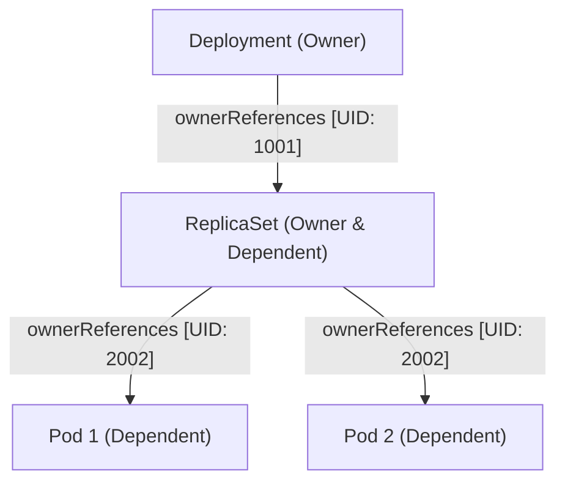

# 🧠 kube-controller-manager 底层机制与控制器详解

`kube-controller-manager`（简称 KCM）是 Kubernetes 的核心大脑，负责运行集群中所有的核心状态回路。它通过不断执行 **调谐循环 (Reconciliation Loop)**，确保集群的实际状态（Actual State）向用户定义的期望状态（Desired State）逼近。

---

## 一、 控制器的工作原理与架构

KCM 内部聚合了数十个职责单一的控制器，每个控制器都是一个独立的工作线程。

```text
       期望状态 (Spec) ──▶ [ 调谐循环 Reconcile ] ◀── 实际状态 (Status)
                                   │ 发现差异
                                   ▼
                             执行资源变更操作
```

### 1. 生产者-消费者模型
所有的控制器都紧密依赖 `Informer` 机制，其底层运作采用生产者-消费者模型：
*   **生产者**：`Reflector` 通过 Watch 机制监听 API Server 的事件变化，将变更打包进 `DeltaFIFO` 增量队列，并最终提取 Key（`Namespace/Name`）推入控制器的 `WorkQueue`。
*   **消费者**：控制器的工作线程并发地从 `WorkQueue` 中获取 Key，通过本地内存缓存 `Indexer` 检索对象最新的数据，然后调用具体的调谐函数（Reconcile）执行修复动作。

> [!TIP]
> 关于 Informer（Reflector -> DeltaFIFO -> Indexer -> WorkQueue）的详细流程图，请参阅 [00-组件通信与原理概述.md](./00-组件通信与原理概述.md)。

---

## 二、 核心控制器深度解析

KCM 内置了超过 30 个控制器，以下是其中最关键的控制器：

| 控制器名称 | 核心职责 |
| :--- | :--- |
| **Deployment Controller** | 监听 Deployment 对象，根据其定义创建/更新对应的 ReplicaSet，并执行滚动更新与回滚历史管理。 |
| **ReplicaSet Controller** | 保证 Pod 的实际副本数始终等于 ReplicaSet Spec 声明的数值。副本不足时创建，超额时删除。 |
| **Node Controller** | 监控节点健康状态。当节点在一定时间内（如 5m）持续未上报心跳时，将其标记为 `Unreachable` 并触发 Pod 的容忍性驱逐（Eviction）。 |
| **Endpoint Controller** | 监听 Service 和 Pod 的变化，将 Service 的 Selector 匹配到的所有正常运行的 Pod IP 地址与端口映射写入 `Endpoints` 对象。 |
| **Namespace Controller** | 确保在删除命名空间时，递归地删除该命名空间下的所有关联资源（如 Pod、Service、Secret）。 |
| **Garbage Collector (GC)** | 清理孤儿对象。通过 `ownerReferences` 级联删除机制，当删除 Deployment 时自动清理对应的 ReplicaSet 以及子 Pod。 |
| **ServiceAccount Controller** | 监听 Namespace 的创建，自动在该命名空间下创建名为 `default` 的 ServiceAccount。 |

---

## 三、 持久化存储控制器 (PV Controller) 与挂载机制

在 Kubernetes 存储体系中，KCM 扮演了核心的控制面角色，将存储资源接入集群。

### 1. PV/PVC 绑定逻辑
`PersistentVolumeController`（PV 控制器）在后台不断巡检 PVC（持久化存储卷声明）和 PV（物理存储卷）的状态：
*   如果发现有新的 PVC 处于 `Pending` 状态，它会遍历当前所有可用且未被绑定的 PV，根据存储容量限制、访问模式（AccessModes）、StorageClass 进行匹配。
*   一旦匹配成功，控制器会将 PV 名字填入 PVC 的 `spec.volumeName` 字段，完成**双向绑定 (Bound)**。

---

### 2. 存储卷的两个挂载阶段 (Attach vs Mount)

当一个 Pod 被调度到具体节点上时，其所需的存储卷必须经历两个完全不同的阶段才能供容器读取：

```text
[ 1. Attach 阶段 ] (控制面执行) ──▶ 将远程磁盘挂载到宿主机 VM
                                         │
                                         ▼
[ 2. Mount 阶段 ] (节点侧执行)  ──▶ 将宿主机设备格式化并挂载到 Pod 目录
```

#### 阶段 ①：Attach 阶段 (挂载设备)
*   **执行组件**：KCM 内部的 `AttachDetachController` 控制器（运行在 Master 节点上）。
*   **职责**：该控制器会持续检查每一个 Pod 对应的 PV 与 Pod 所在 Node 节点之间的关联。它通过调用云厂商接口或底层存储接口，将远程磁盘设备（如 AWS EBS、阿里云云盘、Ceph RBD）挂载（Attach）到该 Node 所在的虚拟机/物理机上。
*   **设备路径**：此时，磁盘在 Node 宿主机上表现为一个块设备（例如 `/dev/sdb`）。

#### 阶段 ②：Mount 阶段 (挂载目录)
*   **执行组件**：Node 节点上的 `kubelet` 内部的 `VolumeManager`（独立于 Kubelet 主协程的调协协程）。
*   **职责**：当磁盘设备被挂载到主机后，VolumeManager 会在宿主机本地创建一个专用挂载目录：
    `/var/lib/kubelet/pods/<pod-uid>/volumes/kubernetes.io~<volume-type>/<volume-name>`
    并将设备格式化（如果未格式化）后挂载到这个目录上。之后，容器在启动时，CRI 就可以通过 Linux Namespace Bind Mount，将这个宿主机目录挂载映射到容器内部的指定路径。

> [!IMPORTANT]
> **共享存储 (如 NFS / CephFS) 的特例**：
> 如果持久化卷类型为远程共享网络文件系统（如 NFS），则**没有控制面的 Attach 阶段**。`AttachDetachController` 会跳过该步骤，直接由 Node 节点上的 `kubelet` 进行 `Mount` 操作，将远程网络路径挂载到本地目录：
> `mount -t nfs <nfs-server-ip>:/<export-path> /var/lib/kubelet/pods/...`

---

## 四、 控制器管理器的高可用与选主机制 (Leader Election)

在生产环境中，KCM 多实例部署在多个 Master 节点上。为了避免多个实例并发向 API Server 发起调谐导致状态覆写冲突，KCM 使用了 **Lease 租约锁选主机制**：
* 启动时，多个实例在 `kube-system` 命名空间下争抢名为 `kube-controller-manager` 的 **Lease** 对象。
* 抢占锁成功的实例作为 Leader 处于激活状态，启动全部内置 Controller 的 Worker 协程消费 WorkQueue；其他 Standby 实例处于热备状态，定期轮询租约状态。
* 一旦 Leader 发生故障未能在续期时间内完成 Lease 更新，其他备份实例会立即接管锁并升为新 Leader。

> 💡 **关联链接**：Informer 机制在自定义 Controller / Operator 开发中同样作为核心依赖。详情参考：[07-Operator开发与Controller-Runtime原理.md](../07-集群扩展/07-Operator开发与Controller-Runtime原理.md)。

---

## 五、 深度扩展：GC OwnerReferences 级联删除算法与无锁调谐 (参考源: K8s 官方 Docs & Source Code)

### 1. Garbage Collector (GC) 的 OwnerReferences 级联删除树
KCM 中的 Garbage Collector (垃圾回收控制器) 通过构造 DAG (有向无环图) 维护父子资源关系：



#### 3 种删除策略 (DeletionPropagation)：
1. **Foreground (前台级联删除)**：
   - 优先将父对象（Deployment）标记为 `deletionTimestamp` 且处于 `Deleting` 状态。
   - GC 控制器递归删除所有子对象（ReplicaSet / Pod）。当且仅当所有依赖子对象销毁完毕后，父对象才会被彻底清理。
2. **Background (后台级联删除 - 默认)**：
   - 立即删除父对象。GC 控制器随后在后台异步检索所有 `ownerReferences` 匹配该 UID 的子对象并予以清除。
3. **Orphan (孤儿模式)**：
   - 仅删除父对象，自动将子对象的 `ownerReferences` 字段置为空（断开父子关系），子对象在集群中作为孤儿对象继续运行。

---

### 2. WorkQueue 延迟重试与无锁调谐 (RateLimitingQueue)
控制器工作线程（Workers）从 `workqueue.RateLimitingQueue` 提取 Key 时，通过 **指数退避限速器 (ItemExponentialFailureRateLimiter)** 实现无锁调谐：

* **重试避退算法**：
  当某个 Key 在 `Reconcile()` 处理抛出 Transient Error（如临时网络超时），控制器调用 `AddRateLimited(key)`。重试等待时间按 $BaseDelay \times 2^{failures}$ 指数增加，且不超过 $MaxDelay$。
* **无锁并发**：
  `WorkQueue` 内部维护了 `processing` Set，确保同一个资源 Key 无论触发多少次 Event，在同一时刻只能有一个 Worker 线程在处理它，**避免了线程间的竞争锁与并发冲突**！

---

## 六、 KCM 选主锁底层机制、平滑升级与控制器风暴防护

### 1. Lease 租约锁底层工作机制与核心参数推导

KCM 的选主逻辑基于 `client-go/tools/leaderelection` 库，其核心参数如下：

```text
Leader 续租周期: [---- RetryPeriod (2s) ----] ──> 更新 renewTime
租约有效时间:   [======================== LeaseDuration (15s) ========================>]
续租截止期限:   [================ RenewDeadline (10s) ================>]
```

* **`--leader-elect-lease-duration` (默认 15s)**：非 Leader 实例等待观察租约超时的时长。超过此时间未见更新，Standby 实例判定 Leader 已死并强行发起抢锁。
* **`--leader-elect-renew-deadline` (默认 10s)**：当前 Leader 尝试刷新租约的最长容忍时间。若在此时间内因网络卡顿持续续租失败，Leader 会**主动辞职并杀死自身控制循环**，防止出现脑裂。
* **`--leader-elect-retry-period` (默认 2s)**：客户端发起获取或刷新锁请求的轮询间隔。

```yaml
# 查看当前 Leader 信息
$ kubectl get lease kube-controller-manager -n kube-system -o yaml
apiVersion: coordination.k8s.io/v1
kind: Lease
metadata:
  name: kube-controller-manager
  namespace: kube-system
spec:
  acquireTime: "2026-08-15T02:00:00.000000Z"
  holderIdentity: "master-1_8d92a1c0-4312-4c28-98e3-abc12345"  # 当前持有锁的实例名称
  leaseDurationSeconds: 15
  leaseTransitions: 3                                         # 历史上发生的切主次数
  renewTime: "2026-08-15T02:15:30.123456Z"
```

---

### 2. 升级期间协同选主 (Coordinated Leader Election) 与快速释放锁

在 KCM 滚动升级过程中，若旧 Leader 实例被直接停止，Standby 实例默认需要等待最多 15 秒（`leaseDurationSeconds`）超时后才会接管，这会导致集群调谐出现 15 秒的“真空期”。

#### 优化机制：
1. **优雅释放锁 (`ControllerManagerReleaseLeaderElectionLockOnExit`)**：
   当旧 Leader 接收到优雅关机信号（SIGTERM）时，主动调用 APIServer 将 Lease 对象的 `holderIdentity` 字段清空或将 `renewTime` 置为过去时间，促使新版本的 Standby 实例**在毫秒级内直接抢锁成功**，调谐中断时间缩短为 0。
2. **升级操作次序**：
   * 先行升级处于 **Standby 状态** 的从节点 KCM；
   * 待从节点升级完毕并就绪后，最后升级处于 **Leader 状态** 的 KCM；
   * 旧 Leader 退出，新版本节点立即抢占成为新 Leader，实现平滑无缝升级。

---

### 3. KCM 升级与运行期间典型故障与深度解决方案 (Troubleshooting SOP)

#### 场景 1：NTP 时钟漂移导致双 Leader 冲突或频繁切主
* **故障现象**：Master 节点日志持续打印 `leader election lost`，KCM 频繁重启并出现两个实例同时打印调谐日志。
* **根本原因**：Master 节点之间未配置 NTP 时间同步，时钟存在微小偏差（> 2 秒），导致 Standby 节点计算的租约过期时间早于实际时间，误判 Leader 死亡并发起抢锁。
* **排障与恢复 SOP**：
  ```bash
  # 1. 检查各 Master 节点时钟同步状态
  chronyc tracking || timedatectl status
  
  # 2. 强制同步集群时钟
  systemctl restart chronyd && chronyc sources -v
  ```

#### 场景 2：切主瞬间引发 API Server 全量 List 调谐风暴 (Reconciliation Storm)
* **故障现象**：新 KCM 成为 Leader 瞬间，API Server CPU 飙升至 100%，网络 IO 打满，大量外部请求超时。
* **根本原因**：新 Leader 启动 30+ 控制器时，所有 Controller 的 Informer 同时向 API Server 发起全量资源的 List 请求。
* **排障与恢复 SOP**：
  ```bash
  # 1. 确保 API Server 开启了 Watch Cache (--watch-cache=true)，使 List 请求命中内存缓存
  # 2. 在 KCM 中配置并发度限制参数，平滑分散突发并发：
  --concurrent-deployment-syncs=5
  --concurrent-endpoint-syncs=5
  --concurrent-gc-syncs=20
  ```

#### 场景 3：CRD / 废弃资源 Finalizer 导致 Namespace 级联删除永久卡死在 Terminating
* **故障现象**：升级后删除某命名空间，状态永久停留在 `Terminating`，KCM 报 `NamespaceDeletionGroupVersionTranscoding` 错误。
* **根本原因**：命名空间下存在带有未清理 Finalizer 的废弃 CRD 对象，或关联的扩展 APIService 已下线，导致 GC 控制器无法完成级联清理。
* **排障与恢复 SOP**：
  ```bash
  # 1. 查找阻碍 Namespace 删除的具体未清理资源
  kubectl api-resources --verbs=list --namespaced -o name | \
    xargs -n 1 kubectl get --show-kind --ignore-not-found -n <stuck-namespace>
  
  # 2. 若发现孤儿对象，手动移除其 Finalizers
  kubectl patch <resource-type> <resource-name> -n <stuck-namespace> \
    --type='json' -p='[{"op": "remove", "path": "/metadata/finalizers"}]'
  ```

---

> [!TIP] 💡 关联技术与延伸阅读
>
> * [kube-apiserver 底层通信与 Informer 机制](./01-API_Server.md)
> * [Custom Controller 与 Operator 开发原理](../07-集群扩展/07-Operator开发与Controller-Runtime原理.md)
> * [Deployment 控制器与滚动更新实现](../02-集群负载/03-Deployment.md)
