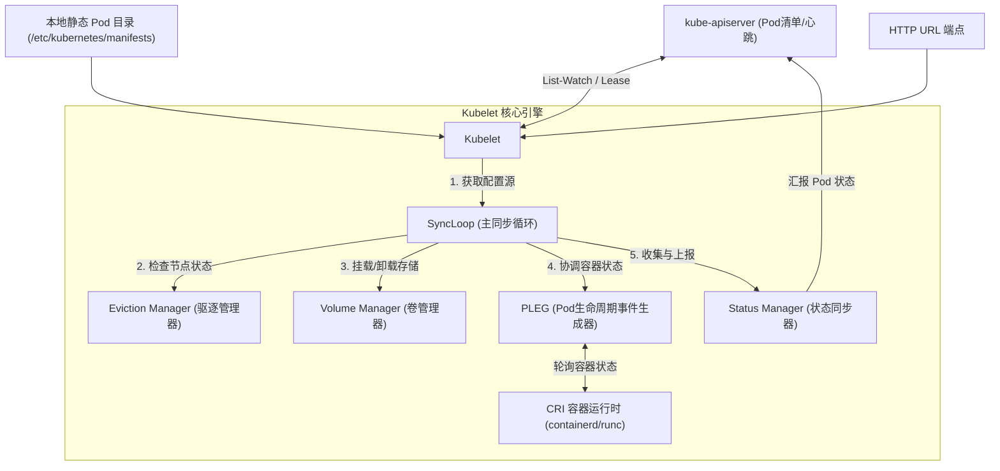
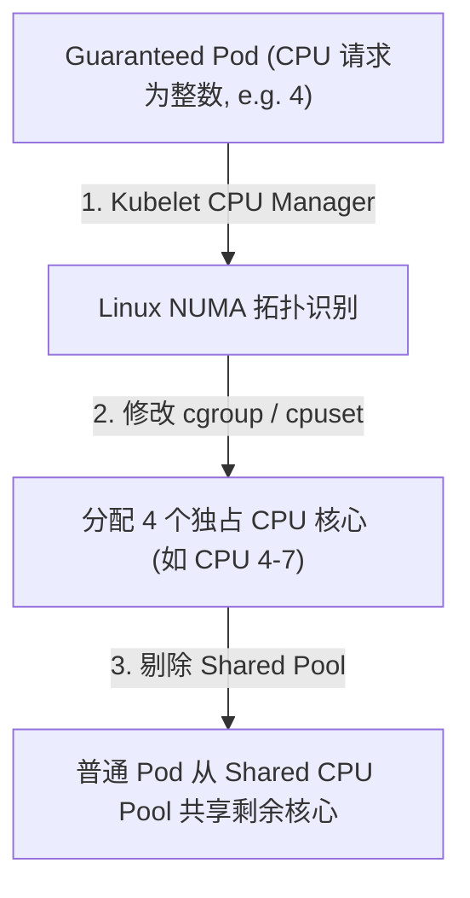
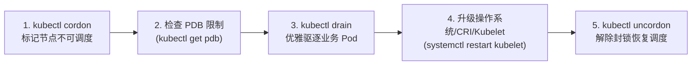

# ☸️ Kubelet 架构原理与核心组件深度解析

`kubelet` 是运行在每个 Kubernetes 工作节点（Worker Node）上的“代理/管家”。它直接与底层的容器运行时打交道，负责管理当前节点上所有 Pod 的生命周期，并向控制面汇报节点资源与健康状态。

---

## 一、 Kubelet 核心架构与工作机制

Kubelet 采用**事件驱动与声明式调协**的内部架构，核心组件包括 `SyncLoop`、`PLEG`、`Status Manager`、`Eviction Manager` 等：



### 1. 核心组件详解

| 组件名称 | 核心职责 | 工作原理 |
| :--- | :--- | :--- |
| **SyncLoop (同步循环)** | Kubelet 的主循环引擎。 | 监听来自 API Server、本地文件目录及 HTTP URL 三个源的 Pod 配置变更。一旦发生变化，立即触发 Pod 调协过程，使实际容器状态逼近期望状态。 |
| **[PLEG](./04-Kubelet/04-Kubelet_PLEG与节点死锁故障深度解析.md) (Pod Lifecycle Event Generator)** | Pod 生命周期事件生成器。 | 周期性地向底层容器运行时（CRI）查询容器的实际状态，并通过比对前后两次状态差异，生成具体的 Pod 事件（如 ContainerStarted, ContainerDied）。这些事件被投递到管道中供 SyncLoop 消费，从而降低 Kubelet 对运行时的轮询频次，提高系统响应性能。 |
| **Status Manager** | 状态管理器。 | 负责将节点上 Pod 的最新状态（如 Running, Failed）缓存并准时同步到 API Server。它保证了 etcd 中记录的 Pod 状态与节点物理状态的一致性。 |
| **Eviction Manager** | 驱逐管理器。 | 监控节点的 CPU、内存、磁盘等物理资源使用情况。当资源水位触发设定的硬/软限制阈值时，自动选择并驱逐某些 Pod，以保护节点免于由于 OOM 或磁盘耗尽而发生系统崩溃。 |
| **Volume Manager** | 存储卷管理器。 | 监听发往当前节点的 Pod 中的存储卷定义，负责调用底层存储插件执行 Volume 的 Attach（挂载到节点）、Mount（挂载进容器空间）及 Unmount 操作。 |

---

## 二、 PLEG 工作原理与排障

### 1. PLEG 是如何工作的？
Informer 机制虽然应用在控制面，但 Kubelet 内部也需要对底层的容器状态变化做出极速响应。
*   PLEG 默认每秒向容器运行时（CRI）发起一次查询（`RPC ListContainers`），获取当前节点上所有容器的状态快照。
*   如果发现容器状态发生变化，它会包装成一个 Event 发送给 Kubelet 的 SyncLoop。
*   若这一轮查询加处理的时间超过了 3 分钟，Kubelet 就会报出著名的 **`PLEG is not healthy`** 异常，并将节点标记为 `NotReady`。

### 2. "PLEG is not healthy" 典型原因与排障流程
> [!WARNING]
> 当节点出现 `PLEG is not healthy` 时，通常不是 Kubelet 自身的问题，而是底层容器运行时或系统调用受到了阻塞。

#### 常见成因：
1.  **CRI 挂起 (Hang)**：底层容器运行时（如 containerd 或 docker-shim）因为死锁、并发瓶颈或 IO 瓶颈，无法响应 Kubelet 的 gRPC 请求。
2.  **存储 I/O 极其缓慢**：如果容器挂载了网络存储卷（如 NFS/Ceph），且网络出现抖动或存储服务器过载，导致宿主机 I/O 被卡在 D 状态（不可中断睡眠），CRI 的查询接口便无法返回。
3.  **内核态死锁或 OOM**：节点物理内存耗尽触发系统频繁 OOM，或者 cgroup 发生泄露，导致 Linux 内核响应及其缓慢。

#### 排障三板斧：
```bash
# 1. 检查 kubelet 运行日志，寻找 PLEG 报错时间点
journalctl -u kubelet --no-pager | grep -i "pleg"

# 2. 检查 containerd 运行状态与响应时延
systemctl status containerd
# 使用 crictl 命令行手动测试容器运行时响应速度
crictl ps
crictl info

# 3. 检查系统负载与 I/O 状态，排查是否存在 D 状态进程
uptime
vmstat 1 5
iostat -xz 1 5
```

> 📖 **深入专题**：关于 PLEG 源码 relist 流程、cgroup kmem 内核泄漏、D 状态进程排查决策树及生产自愈 Shell 脚本，详见专题指南：[04-Kubelet_PLEG与节点死锁故障深度解析.md](./04-Kubelet/04-Kubelet_PLEG与节点死锁故障深度解析.md)。

---

## 三、 Kubelet 资源预留与驱逐策略 (Eviction)

为了防止业务 Pod 占满节点资源导致操作系统底层组件或 Kubelet 发生 OOM 卡死，必须在 Kubelet 中合理配置资源预留与驱逐阈值。

### 1. 节点资源划分
Kubelet 将工作节点的资源按照如下逻辑划分：

```text
┌────────────────────────────────────────────────────────┐
│                      Node Total Capacity               │
├───────────────┬────────────────┬───────────────────────┤
│ kube-reserved │ system-reserved│    Allocatable        │
│ (K8S系统组件)  │ (OS底层系统服务) │ (可分配给业务Pod的额度)  │
└───────────────┴────────────────┴───────────────────────┘
```
$$\text{Allocatable (可分配额度)} = \text{Capacity (总容量)} - \text{kube-reserved} - \text{system-reserved} - \text{eviction-threshold (驱逐预留)}$$

*   `kube-reserved`：预留给 Kubernetes 系统组件（Kubelet、Kube-Proxy、Containerd）的资源。
*   `system-reserved`：预留给 Linux 系统守护进程（systemd、journald、sshd 等）的资源。

### 2. 驱逐阈值参数配置 (kubelet.config)
当可用资源低于以下阈值时，Kubelet 会主动发起 Pod 的驱逐：

```yaml
apiVersion: kubelet.config.k8s.io/v1beta1
kind: KubeletConfiguration
evictionHard:
  memory.available: "100Mi"      # 物理内存可用少于 100Mi 时强行驱逐
  nodefs.available: "10%"        # 宿主机根分区可用空间少于 10%
  imagefs.available: "15%"       # 容器镜像分区可用空间少于 15%
evictionMinimumReclaim:
  memory.available: "0Mi"
  nodefs.available: "500Mi"      # 驱逐时最少回收 500Mi 磁盘空间
```

---

## 四、 三大接口抽象：CRI、CNI、CSI

Kubelet 并不直接实现具体的网络搭建、存储挂载或容器启停，而是通过定义清晰的标准接口，将这些具体实现解耦给具体的第三方插件：

```text
               ┌─────────────┐
               │   Kubelet   │
               └─┬───┬───┬───┘
                 │   │   │
        ┌────────┘   │   └────────┐
        ▼            ▼            ▼
   ┌─────────┐  ┌─────────┐  ┌─────────┐
   │   CRI   │  │   CNI   │  │   CSI   │ (接口规范)
   └────┬────┘  └────┬────┘  └────┬────┘
        ▼            ▼            ▼
   ┌─────────┐  ┌─────────┐  ┌─────────┐
   │containerd  │ Calico/ │  │ Ceph/   │ (插件实现)
   │ / runc  │  │ Flannel │  │ LocalPV │
   └─────────┘  └─────────┘  └─────────┘
```

1.  **[CRI](./04-Kubelet/CRI.md) (Container Runtime Interface)**：
    *   **职责**：容器运行时接口。定义了容器的构建、镜像的拉取、容器生命周期的管理等。
    *   *详见：[CRI 深度指南](./04-Kubelet/CRI.md)*
2.  **[CNI](./04-Kubelet/CNI.md) (Container Network Interface)**：
    *   **职责**：容器网络接口。负责在 Sandbox 容器创建完成后，为该容器的网络命名空间配置 IP 地址、网络路由与虚拟网卡。
    *   *详见：[CNI 深度指南](./04-Kubelet/CNI.md)*
3.  **CSI (Container Storage Interface)**：
    *   **职责**：容器存储接口。定义了如何将外置的分布式存储或本地物理磁盘挂载进 Pod 容器中。
    *   **挂载阶段**：
        1.  **Attach (附着)**：由控制面的 Volume Attachment Controller 发起，将外部存储卷绑定到特定的工作节点上。
        2.  **Mount (挂载)**：Kubelet 内部的 Volume Manager 在工作节点上将该物理设备格式化并挂载到指定的本地路径（`kube-in-tree` / `out-of-tree`）。
        3.  **Container Bind Mount**：在拉起容器时，CRI 将该本地路径绑定挂载进容器的文件系统中。

---

## 五、 深度扩展：静态 Pod 与 CPU 独占绑核策略 (参考源: K8s 官方 Docs & Source Code)

### 1. 静态 Pod (Static Pod) 运作机制与控制面自愈
* **定义**：直接由工作节点上的 Kubelet 进程管理，无需通过 APIServer 调度的特殊 Pod。
* **物理路径**：放置在宿主机 `/etc/kubernetes/manifests/` 目录下的 YAML 文件（如 `etcd.yaml`、`kube-apiserver.yaml`）。
* **内部 Mirror Pod**：Kubelet 启动后自动扫描该目录，并在本地直接调用 CRI 拉起容器。同时向 APIServer 上报生成一个只读的 Mirror Pod 供 `kubectl get pod -n kube-system` 观察。
* **独立容灾与升级**：即便 APIServer 或 etcd 全局瘫痪，Kubelet 依然通过本地文件独立运行并守护静态 Pod。升级控制面时，只需更新 manifests 目录下的 YAML 文件（如替换镜像 tag），Kubelet 会通过文件 Inotify/Hash 比较自动触发静态 Pod 的就地平滑重启。

---

### 2. Kubelet CPU Manager 独占绑核原理 (`cpuManagerPolicy: static`)
在超高并发或低时延应用（如 Redis、Nginx Ingress、网关）场景中，频繁的 CPU 上下文切换会导致显著的性能抖动。



#### 开启独占绑核 3 条件：
1. Kubelet 配置文件配置：`cpuManagerPolicy: static` 与 `topologyManagerPolicy: single-numa-node`。
2. Pod 处于 **Guaranteed** 服务质量等级（即 `limits.cpu == requests.cpu` 且 `limits.memory == requests.memory`）。
3. CPU 请求值必须为**正整数**（如 `cpu: "2"`，不能为 `cpu: "1.5"` 或 `250m`）。
* **效果**：Kubelet 会通过 `cgroup cpuset` 子系统将 Pod 绑死到独占的物理 CPU 核心上，隔离其他容器抢占，获得极高的计算吞吐与极低的时延抖动。

---

## 六、 Kubelet 与工作节点平滑升级、CRI 运行时热更与状态自愈

### 1. 工作节点安全下线与排空全流程 (Cordon -> Drain -> Upgrade -> Uncordon)

在对工作节点进行系统内核升级、Kubelet 升级或 CRI 容器运行时维护时，必须执行标准的**优雅排空四步法**：



#### 标准排空命令与参数解析：
```bash
# 1. 封锁节点：阻止新 Pod 调度到该节点上
kubectl cordon node-worker-1

# 2. 优雅驱逐节点上的业务 Pod
# --ignore-daemonsets: 忽略 DaemonSet 守护进程 Pod (网络/日志插件)
# --delete-emptydir-data: 允许删除挂载了 emptyDir 临时存储的 Pod
# --grace-period=60: 给予 Pod 最长 60 秒的优雅关机宽限期
kubectl drain node-worker-1 --ignore-daemonsets --delete-emptydir-data --grace-period=60

# 3. 登录节点升级 Kubelet 与 Containerd
apt-get update && apt-get install -y kubelet=1.30.0-1.1 kubeadm=1.30.0-1.1
systemctl daemon-reload && systemctl restart kubelet

# 4. 节点恢复正常后，解除调度封锁
kubectl uncordon node-worker-1
```

---

### 2. 卷卸载安全与 VolumeAttachment 孤儿锁防护机制

当 Pod 挂载了云盘（如 AWS EBS / 阿里云 ESSD / Ceph RBD）等块存储时，`kubectl drain` 会触发以下存储流转：
1. **Unmount 阶段**：节点 Kubelet 的 VolumeManager 检测到 Pod 终止，执行文件系统卸载并断开本地设备。
2. **Detach 阶段**：控制面的 `AttachDetachController` 收到 VolumeManager 的状态更新，调用云厂商 API 将磁盘从该虚拟机解绑，并删除 `VolumeAttachment` 对象。
3. **安全防线**：若直接强制重启或暴力下线节点，会导致 `VolumeAttachment` 处于悬挂锁定状态，新节点上的 Pod 将无法成功 Attach 磁盘（报错 `Volume is already attached to node X`）。

---

### 3. Kubelet 升级与运行期间典型故障与深度解决方案 (Troubleshooting SOP)

#### 场景 1：Kubelet 升级后启动失败报 cgroup 驱动冲突
* **故障现象**：升级 Kubelet 重启后 `systemctl status kubelet` 处于 `CrashLoopBackOff`，日志报：
  `misconfiguration: kubelet cgroup driver: "cgroupfs" was different from containerd "systemd"`
* **根本原因**：K8s 1.24+ 移除了 dockershim 并强行推荐使用 `systemd` cgroup 驱动。若 Kubelet 或 containerd 配置文件中有一方仍配置为 `cgroupfs`，两者的 cgroup 树不一致导致 Kubelet 拒绝启动。
* **排障与恢复 SOP**：
  ```bash
  # 1. 修改 containerd 配置文件 /etc/containerd/config.toml
  # 确保包含 SystemdCgroup = true
  [plugins."io.containerd.grpc.v1.cri".containerd.runtimes.runc.options]
    SystemdCgroup = true
  systemctl restart containerd
  
  # 2. 修改 Kubelet 配置 /var/lib/kubelet/config.yaml
  # 确保 cgroupDriver: systemd
  cgroupDriver: systemd
  systemctl restart kubelet
  ```

#### 场景 2：节点升级后报 `PLEG is not healthy` 且持续处于 NotReady
* **故障现象**：升级完成后，节点状态在 `Ready` 和 `NotReady` 之间频繁跳变，Kubelet 日志持续打印 `PLEG is not healthy: pleg was last seen active 3m0s ago`。
* **根本原因**：节点上残留了僵死的容器进程，或者挂载了超时的 NFS/网络存储导致 I/O 处于 D 状态（不可中断睡眠），CRI 的 `ListContainers` gRPC 调用超时阻塞。
* **排障与恢复 SOP**：
  ```bash
  # 1. 使用 crictl 排查运行时响应时延
  time crictl ps
  
  # 2. 检查系统是否存在处于 D 状态的进程
  ps -eo stat,pid,user,cmd | grep "^D"
  
  # 3. 检查是否有卡死的网络挂载点
  df -h
  umount -l /var/lib/kubelet/pods/<pod-uid>/volumes/...
  
  # 4. 重启 containerd 与 kubelet
  systemctl restart containerd && systemctl restart kubelet
  ```

#### 场景 3：CNI 网络插件不兼容导致 Pod Sandbox 无法创建
* **故障现象**：节点升级后，调度到该节点的新 Pod 无法启动，状态停留在 `ContainerCreating`，Describe 报：
  `Failed to create pod sandbox: plugin type="calico" failed (add): error getting ClusterInformation`
* **根本原因**：Kubelet 升级到了新版本，但节点上的 CNI 二进制文件版本过旧，无法识别新的 CRI 请求格式或缺少集群通信证书。
* **排障与恢复 SOP**：
  ```bash
  # 1. 检查 /opt/cni/bin/ 下二进制文件版本
  ls -l /opt/cni/bin/
  
  # 2. 升级集群 CNI DaemonSet（如 Calico / Cilium）到与新 K8s 版本兼容的稳定版本
  kubectl apply -f https://raw.githubusercontent.com/projectcalico/calico/v3.28.0/manifests/calico.yaml
  ```

---

> [!TIP] 💡 关联技术与延伸阅读
>
> * [CRI 容器运行时接口深度指南](./04-Kubelet/CRI.md)
> * [CNI 容器网络接口深度指南](./04-Kubelet/CNI.md)
> * [Kubelet PLEG 机制与节点死锁排障](./04-Kubelet/04-Kubelet_PLEG与节点死锁故障深度解析.md)
> * [Containerd 底层实现与 Pause 容器机制](./04-Kubelet/03-Docker与Containerd底层实现及Pause通信深度解析.md)
> * [CSI 存储插件挂载流程](../05-集群存储/01-CSI架构与存储挂载全链路机制.md)
