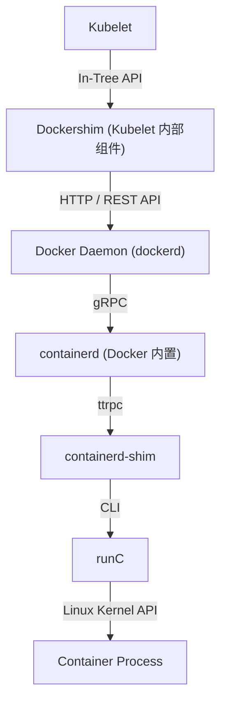
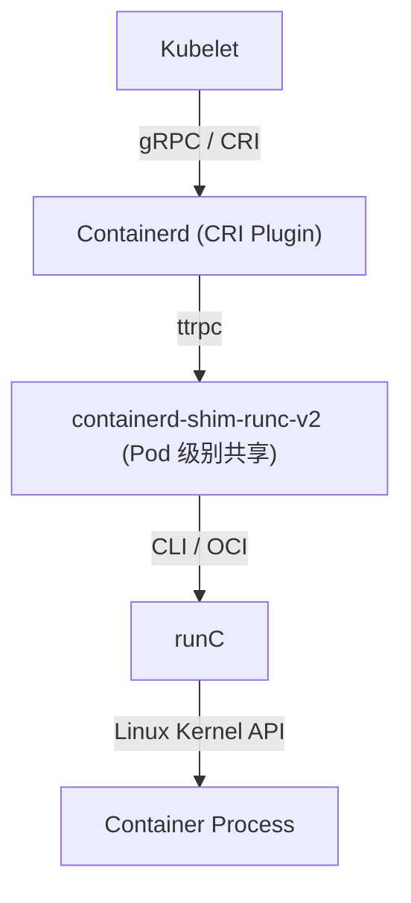
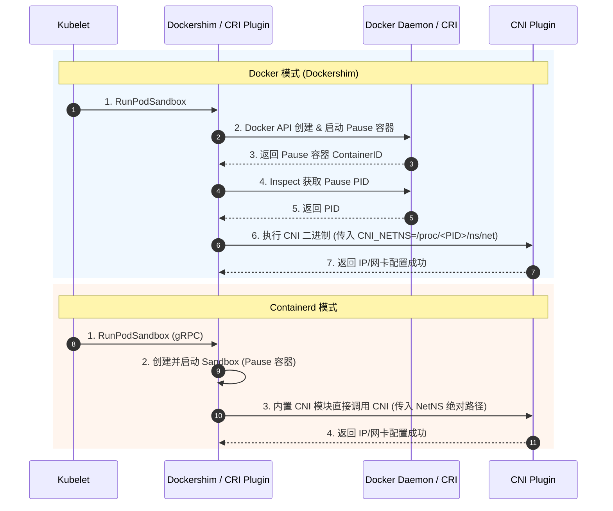

# 🐳 Docker 与 Containerd 底层实现及 Pause 通信深度解析

在 Kubernetes 架构演进中，容器运行时（Container Runtime）经历了从早期依赖 Docker（Dockershim）到全面拥抱原生 CRI（Containerd）的转变。本文深度剖析 Docker 与 Containerd 在底层实现、Pause 容器 Namespace 共享机制、CNI 接入流程、Shim 进程模型以及镜像存储架构上的核心差异。

---

## 一、 架构与组件调用链演进

### 1. 架构对比

#### (1) Docker 时代 (Kubernetes < v1.24 / Dockershim)
在早期 Kubernetes 中，Kubelet 通过内置的 **Dockershim** 组件与 Docker 通信。Docker 本身是一个为桌面和单机打造的庞大单体服务，内部再次调用自己的 `containerd` 核心逻辑。



*   **缺陷**：调用链极长（Kubelet → Dockershim → dockerd → containerd → containerd-shim → runc），中间涉及多重 HTTP REST API 及 JSON 序列化开销；同时 `dockerd` 重启或异常更新会引发容器生命周期的联动风险。

#### (2) 过渡方案 (cri-dockerd)
Kubernetes 在 v1.24 彻底废弃并移除 Dockershim。若仍需使用 Docker Engine 作为运行时，必须通过独立维护的 `cri-dockerd` 守护进程进行中转。

#### (3) Containerd 时代 (Kubernetes >= v1.24 推荐及默认)
Kubelet 直接与 Containerd 的 CRI 插件通过 UNIX Domain Socket (`/run/containerd/containerd.sock`) 进行纯 gRPC 通信。



*   **优势**：去掉了 `dockerd` 中转层，链路极其扁平，内存与 CPU 开销大幅降低，容器响应速度显著提升。

---

## 二、 Pause 容器与 Linux Namespace 共享底层机制

虽然在业务容器视角下，无论 Docker 还是 Containerd 均共享相同的 Network/IPC Namespace（可以使用 `localhost` 通信），但**两者的底层关联实现方式完全不同**。

### 1. Pause 容器的核心作用
Pause 容器（又称 Infra Container）是 Pod 的物理载体，其内部仅运行一段极简的汇编/C 程序（调用 `pause()` 系统调用挂起进程）。Pause 容器持有以下 Pod 级别的 Linux 命名空间：
*   **Network Namespace**（网络协议栈、`lo` 设备、IP 地址、端口空间）
*   **IPC Namespace**（System V IPC 和 POSIX 消息队列）
*   **UTS Namespace**（主机名与域名）

---

### 2. Docker 与 Containerd 关联 Namespace 的底层方式

```text
┌────────────────────────────────────────────────────────────────────────┐
│                        Docker 模式 (接口名指定)                         │
│  [App Container] ──── HostConfig.NetworkMode="container:<Pause_ID>" ───► [Pause Container]
│                                                                        │
│  特点: 依赖 Docker 守护进程解析 Pause_ID -> PID -> /proc/<PID>/ns/net     │
└────────────────────────────────────────────────────────────────────────┘

┌────────────────────────────────────────────────────────────────────────┐
│                      Containerd 模式 (绝对路径挂载)                     │
│  [App Container] ──── OCI Spec.namespaces=[{path: "/proc/<PID>/ns/net"}] ─► [Pause Container]
│                                                                        │
│  特点: CRI 插件直接将 PID/NetNS 绝对路径写入 OCI Spec，runc 直接 bind ns │
└────────────────────────────────────────────────────────────────────────┘
```

#### (1) Docker 的实现机制
1.  **创建 Pause 容器**：Kubelet/Dockershim 调用 Docker API 创建名为 `k8s_POD_...` 的 Pause 容器。
2.  **创建业务容器**：Dockershim 调用 Docker 创建业务容器 API 时，在 `HostConfig` 中配置：
    *   `NetworkMode: "container:<pause_container_id>"`
    *   `IpcMode: "container:<pause_container_id>"`
3.  **Docker 内部处理**：Docker Daemon 根据 `pause_container_id` 检索到 Pause 容器的真实 PID，随后读取该 PID 的内核命名空间 `/proc/<pause_pid>/ns/net` 并配置给新启动的业务容器。

#### (2) Containerd 的实现机制
1.  **创建 Sandbox (Pause)**：Containerd 的 CRI 插件收到 `RunPodSandbox` gRPC 请求，根据 `/etc/containerd/config.toml` 中配置的 `sandbox_image`（如 `registry.k8s.io/pause:3.9`）启动沙箱进程。
2.  **绝对路径挂载**：CRI 插件直接获取当前 Sandbox 的 PID 或挂载点（`/var/run/netns/...` 或 `/proc/<sandbox_pid>/ns/net`）。
3.  **构造 OCI Specification**：在创建业务容器时，CRI 插件直接在 OCI 规范文件 `config.json` 的 `linux.namespaces` 字段中显式指定：
    ```json
    {
      "namespaces": [
        {
          "type": "network",
          "path": "/proc/<sandbox_pid>/ns/net"
        },
        {
          "type": "ipc",
          "path": "/proc/<sandbox_pid>/ns/ipc"
        }
      ]
    }
    ```
4.  **runc 直接生效**：`containerd-shim-runc-v2` 调用 `runc` 时，`runc` 直接通过 `setns` 系统调用将业务容器加入到该绝对路径对应的 Namespace 中。**完全脱离了对中间守护进程查询 ID 的依赖**。

---

## 三、 CNI 接入与网络栈配置流程差异

网络插件（CNI）作用于 Pause 容器的 Network Namespace。Docker 与 Containerd 在触发 CNI 调用的时机和主体上存在差异。



*   **Dockershim**：Kubelet 内部的 Dockershim 充当 CNI 执行器。每次创建完 Pause 容器后，由 Dockershim 检索 PID，拼装环境变量 `CNI_NETNS=/proc/<PID>/ns/net` 后 fork/exec 调用 CNI 插件二进制（如 `calico`）。
*   **Containerd**：Containerd 内部的 CRI 插件直接集成 CNI 管理器。沙箱容器一旦被创建，CRI 插件使用内部 C-Library 或 Executor 线程同步加载 `/etc/cni/net.d/` 中的配置文件并完成网络注入。效率更高，且错误捕获更加精准。

---

## 四、 进程模型与生命周期管理 (Shim-v1 vs Shim-v2)

### 1. Shim 进程的作用
`containerd-shim` 是容器守护进程（Docker/Containerd）与低层级运行时（runc）之间的隔离垫片。其核心作用包括：
*   允许容器在包含 `dockerd`/`containerd` 主进程重启或崩溃时保持运行（实现无损重启）。
*   收集并维持容器的 `stdout`/`stderr` 管道流，避免 runc 保持运行占据资源。
*   等待容器退出并向高层运行时汇报 exit code。

### 2. Shim-v1 (Docker / 早期 Containerd)
在 Shim-v1 模型中，**每个容器都会独立绑定一个 `containerd-shim` 进程**。

如果一个 Pod 内有 1 个 Pause 容器和 3 个业务容器，宿主机上将产生：
*   1 个 `pause` 对应的 `containerd-shim`
*   3 个业务容器对应的 `containerd-shim`
*   **总计 4 个 Shim 垃圾进程，增加了内核 PID 资源消耗与内存开销**。

### 3. Shim-v2 (Containerd 专属 `containerd-shim-runc-v2`)
Containerd 引入了 **Shim-v2 API**，支持 **Pod 级别的 Shim 共享**（Group/Pod-level Shim）。

在同一个 Pod 内，**所有的容器（Pause + 所有业务容器）均共享同一个 `containerd-shim-runc-v2` 进程**。

```text
┌─────────────────────────────────────────────────────────────┐
│ Pod 节点 (Shim-v2 模型)                                      │
│                                                             │
│ ┌─────────────────────────────────────────────────────────┐ │
│ │              containerd-shim-runc-v2 (单 Pod 唯一)      │ │
│ └───────┬────────────────────┬────────────────────┬───────┘ │
│         │                    │                    │         │
│         ▼                    ▼                    ▼         │
│    [Pause 容器]         [App1 容器]          [App2 容器]     │
└─────────────────────────────────────────────────────────────┘
```

*   **收益**：
    1.  **极大降低系统开销**：宿主机 Shim 进程数直接缩减为原来 Pod 级别的 1/N。
    2.  **生命周期协同**：Pod 级别的事件捕获与信号转发在同一个 Shim 上下文进行，避免了多 Shim 间可能发生的死锁与竞争状态。

---

## 五、 镜像存储架构与 Snapshotter 快照机制对比

```text
┌────────────────────────────────────────────────────────────────────────┐
│                              Docker 架构                               │
│  [Docker CLI] ──► [dockerd] ──► [GraphDriver (overlay2)] ──► 镜像存储   │
│  注: 镜像存储与 Docker 绑定，外部只读，无法针对 K8s 命名空间做数据隔离     │
└────────────────────────────────────────────────────────────────────────┘

┌────────────────────────────────────────────────────────────────────────┐
│                            Containerd 架构                             │
│  [crictl / ctr] ──► [containerd] ──► [Content Store] (原始 Blob)      │
│                                    ──► [Snapshotter] (快照切片)        │
│  注: 支持多 Namespace 隔离 (如 k8s.io vs default), 扩展性极强         │
└────────────────────────────────────────────────────────────────────────┘
```

### 1. Docker (GraphDriver)
*   依赖单体架构中的 GraphDriver 模块（如 `overlay2`）。
*   镜像拉取、解压层、读写层全部在 Docker 私有目录 `/var/lib/docker/overlay2` 中维护。
*   所有镜像共享单一空间，缺乏多租户命名空间隔离。

### 2. Containerd (Content Store + Snapshotter)
*   **Content Store**：专门存储只读的镜像 Blob 数据（按 SHA256 哈希索引）。
*   **Snapshotter (快照器)**：将镜像层挂载为读写层，支持 `overlayfs`、`native`、`btrfs`、`zfs` 等多种后端。
*   **Namespace 隔离**：支持隔离不同的使用场景：
    *   `k8s.io` Namespace：Kubernetes 专用，由 Kubelet/CRI 插件管理。
    *   `default` Namespace：开发人员手动使用 `ctr` 命令行调试时使用。
    *   两者镜像与容器完全隔离，避免手动调试污染集群镜像。

---

## 六、 运维诊断与命令行工具链对比

随着运行时从 Docker 切换到 Containerd，常用的运维调试工具发生了重大改变：

### 1. 命令行工具映射

| 运维需求 | Docker 时代 | Containerd 时代 (Kubernetes 标准) | Containerd 时代 (底层调试) |
| :--- | :--- | :--- | :--- |
| **查看容器列表** | `docker ps` | `crictl ps` | `ctr -n k8s.io containers list` |
| **查看镜像列表** | `docker images` | `crictl images` | `ctr -n k8s.io images list` |
| **进入容器 Exec** | `docker exec -it <id> sh` | `crictl exec -it <id> sh` | `ctr -n k8s.io tasks exec --exec-id 1 <id> sh` |
| **查看容器日志** | `docker logs -f <id>` | `crictl logs -f <id>` | *(直接查看 `/var/log/pods/...` 日志文件)* |
| **查看 Pod 沙箱** | *(无直接概念，仅看到 pause)*| `crictl pods` | *(无直接 Pod 概念，呈现为 Sandbox 容器)* |
| **配置文件位置** | `/etc/docker/daemon.json` | *(CRI 配置文件无)* | `/etc/containerd/config.toml` |

> 💡 **最佳实践提示**：在 Kubernetes 节点上进行日常运维时，**强烈推荐使用 `crictl`**（它直接与 CRI gRPC 接口交互，能正确识别 Pod 和容器元数据）；而 `ctr` 是 Containerd 的原生 CLI，命令较为繁琐，仅建议在底层故障诊断时使用。

---

## 七、 总结对比表

| 对比维度 | Docker (Dockershim / cri-dockerd) | Containerd (CRI Native) |
| :--- | :--- | :--- |
| **Kubernetes 原生支持** | v1.24 已彻底移除 Dockershim，需安装 `cri-dockerd` | 官方原生推荐，零额外适配代理 |
| **架构调用链** | 长（Kubelet → dockershim → dockerd → containerd → shim → runc） | 短（Kubelet → containerd-cri → shim-v2 → runc） |
| **Pause 容器关联方式** | Docker API 参数指定 `container:<id>` 依靠守护进程解析 | OCI Spec 显式写入绝对路径 `/proc/<pid>/ns/net` |
| **Shim 进程模型** | **Shim-v1**（每个容器独立占用 1 个 Shim 进程） | **Shim-v2**（每个 Pod 共享 1 个 `containerd-shim-runc-v2`） |
| **内存与 CPU 资源开销** | 较高（包含 `dockerd` 守护进程与多余 Shim 进程开销） | 极低（资源占用减少约 30%~50%） |
| **镜像存储与隔离** | 单一存储库（`/var/lib/docker`），无 Namespace 隔离 | 拥有 `content store` + `snapshotter`，支持 `k8s.io` Namespace 隔离 |
| **调试工具** | `docker` CLI | `crictl` (推荐) / `ctr` |

---

> [!TIP] 💡 关联技术与延伸阅读
>
> * [Kubelet 架构原理](../04-Kubelet.md)
> * [Docker 容器网络底层原理](../../04-集群网络/01-Docker容器网络.md)
