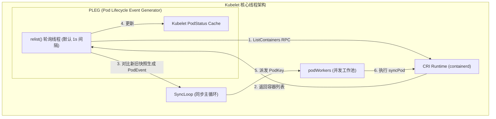
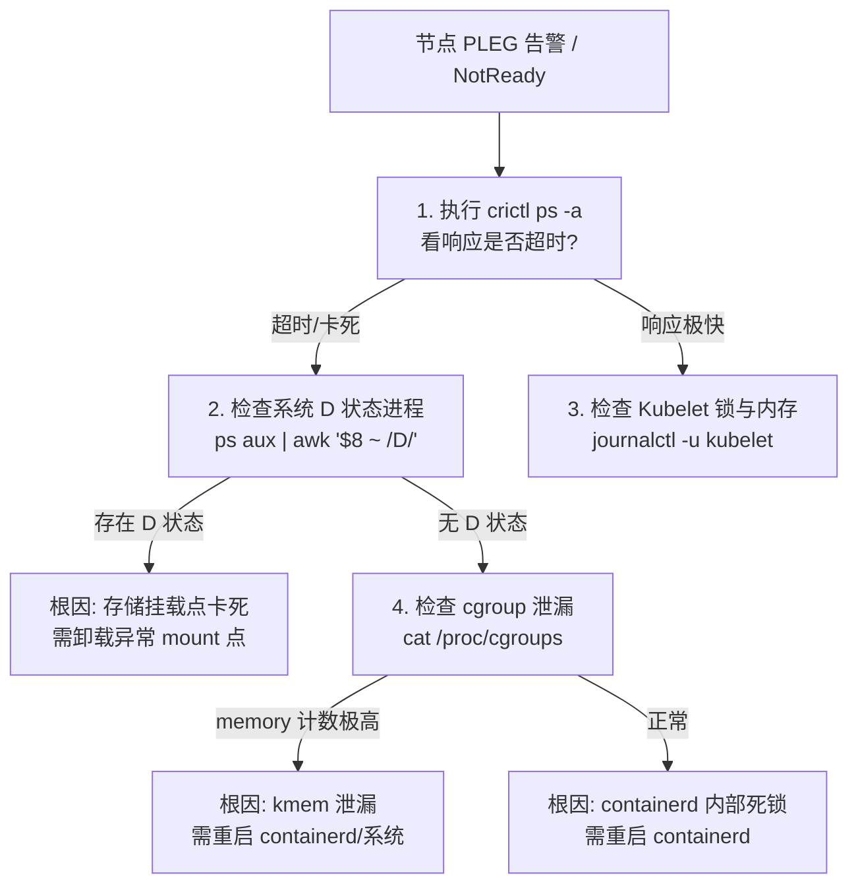

# 🩺 Kubelet PLEG 机制与节点死锁故障深度解析

> 🔗 **所属模块**：[← 返回 Kubelet 架构原理与核心组件深度解析](../04-Kubelet.md)  
> 本文档面向高级 Kubernetes 工程师与云原生架构师，深入剖析 Kubelet 内部 PLEG (Pod Lifecycle Event Generator) 架构设计、PLEG 检查机制、导致 PLEG 不健康的底层根因（cgroup 泄漏、D 状态进程、CRI 死锁），以及生产级监控与自动恢复脚本。

---

## 目录
- [一、 PLEG 架构设计与 SyncLoop 协作机制](#一-pleg-架构设计与-syncloop-协作机制)
- [二、 PLEG 的核心工作机制与检测逻辑](#二-pleg-的核心工作机制与检测逻辑)
- [三、 导致 "PLEG is not healthy" 的三大致命底层根因](#三-导致-pleg-is-not-healthy-的三大致命底层根因)
- [四、 生产级诊断排查流程与工具链](#四-生产级诊断排查流程与工具链)
- [五、 PLEG 自动监控自愈与自愈脚本 SOP](#五-pleg-自动监控自愈与自愈脚本-sop)

---

## 一、 PLEG 架构设计与 SyncLoop 协作机制

Kubelet 是工作节点上的核心代理，其主体工作逻辑基于一个名为 **SyncLoop** 的同步主循环驱动。



### PLEG 的核心角色：
Kubelet **拒绝轮询** 每一个 Pod 来检查状态。PLEG 作为一个独立的事件产生器（Generator），通过批量比对节点上全量容器的快照，高效产生状态变更事件（如 `ContainerStarted`、`ContainerDied`），驱动 SyncLoop。

---

## 二、 PLEG 的核心工作机制与检测逻辑

### 2.1 relist() 核心工作流

PLEG 内部有一个死循环函数 `relist()`：

```text
relist() 周期开始 (默认每秒一次)
   │
   ▼
1. 记录开始时间 t1
   │
   ▼
2. 通过 gRPC 调用 CRI 接口: RuntimeService.ListContainers() 获取节点全量容器
   │
   ▼
3. 通过 gRPC 调用 CRI 接口: RuntimeService.ListSandboxes() 获取全量 Pod 沙箱
   │
   ▼
4. 比对本次快照与旧快照 (Old PodStatus vs New PodStatus)
   │
   ▼
5. 若状态改变 (如容器退出)，生成 PodLifecycleEvent 发送到 eventChannel
   │
   ▼
6. 更新 Kubelet 本地 PodStatus 缓存
   │
   ▼
7. 记录结束时间 t2，更新 timestamp 为当前时间
```

### 2.2 PLEG 健康检查机制 (PLEG is not healthy)

Kubelet 内部有一个专门的健康检查线程 `healthy()`：
- **阈值公式**：`PLEG 健康阈值 = 3 * relistPeriod`（默认 $3 \times 1\text{s} = 3\text{s}$；对于 NodeStatus 判定，若超过 **3 分钟**未完成一次成功的 relist，会正式宣告 PLEG 不健康）。
- **影响**：PLEG 一旦被标记为 Unhealthy：
  1. Kubelet 暂停向 API Server 报 Ready 状态。
  2. 节点 Condition 被改为 `NodeStatusUnknown` 或 `NotReady`。
  3. Kubelet 日志抛出：`PLEG is not healthy: pleg was last seen active 3m5s ago; threshold is 3m0s`。

---

## 三、 导致 "PLEG is not healthy" 的三大致命底层根因

### 根因 1：Linux cgroup v1 kmem 内存泄漏

在 Linux 内核 < 4.17（如 CentOS 7 默认 3.10 内核）中，针对 cgroup 的 `kmem`（内核内存统计）存在严重 Bug：
- 每当容器创建和销毁时，内核分配的 `slab` 内存句柄无法回收。
- 当 `cat /proc/cgroups` 中的 `memory` 节点数达到上限（通常 > 65535）时，内核对 cgroup 目录遍历极其缓慢。
- **结果**：CRI 在执行 `ListContainers` 时卡在内核 cgroup 锁上，单次 `relist()` 耗时从 10ms 暴增至数十分钟。

### 根因 2：不可中断休眠（D 状态进程）与存储卡死

当 Pod 挂载了 NFS、Ceph、EBS 等远程存储，且网络中断或存储服务端宕机时：
- 容器内的 I/O 进程陷入 Linux **D 状态**（Uninterruptible Sleep）。
- 当 CRI (containerd/runc) 尝试 `stat` 或 `inspect` 容器挂载目录时，进程同样被卡死在 D 状态系统调用中（无法被 `kill -9` 杀掉）。
- **结果**：PLEG 的 `ListContainers` gRPC 请求永远无法返回，直到超时。

### 根因 3：containerd / shim 内部死锁

在密集创建/删除容器高并发场景下：
- `containerd-shim` 进程与 `containerd` 主进程之间的 tty 日志管道堵塞，或者 FIFO 管道未关闭。
- containerd 内部的 Task 锁触发死锁，导致 gRPC 接口挂起。

---

## 四、 生产级诊断排查流程与工具链

当发现节点 PLEG 告警时，按以下流程快速定位：



### 诊断命令速查表：

```bash
# 1. 测试 CRI 响应耗时 (正常应当 < 100ms)
time crictl --runtime-endpoint unix:///run/containerd/containerd.sock ps -a

# 2. 检查系统中不可中断休眠 (D 状态) 进程及堆栈
ps -eo pid,user,stat,time,comm,wchan | grep " D"

# 3. 统计内存 cgroup 数量
cat /proc/cgroups | grep memory

# 4. 跟踪 containerd 系统调用阻塞点
strace -f -T -tt -p $(pgrep containerd) -e trace=futex,read,write,stat
```

---

## 五、 PLEG 自动监控自愈与自愈脚本 SOP

### 生产级健康检查与自动重启脚本

编写 Daemon 守护脚本 `/usr/local/bin/pleg-checker.sh`：

```bash
#!/bin/bash
# PLEG 自动监控与异常自愈脚本

LOG_FILE="/var/log/pleg-checker.log"
THRESHOLD=180 # 3分钟超时

# 测试 crictl 是否卡死 (超时时间 10 秒)
timeout 10 crictl ps > /dev/null 2>&1
CRI_STATUS=$?

if [ $CRI_STATUS -ne 0 ]; then
    echo "$(date '+%Y-%m-%d %H:%M:%S') [ERROR] CRI response timeout, containerd might be unresponsive!" >> $LOG_FILE
    
    # 检查是否存在严重的 D 状态进程
    D_PROCESSES=$(ps aux | awk '$8 ~ /D/ {print $2}')
    if [ -n "$D_PROCESSES" ]; then
        echo "$(date '+%Y-%m-%d %H:%M:%S') [WARNING] Found D-state processes: $D_PROCESSES. Storage I/O issue suspected." >> $LOG_FILE
    fi

    # 尝试重启 containerd 与 kubelet
    echo "$(date '+%Y-%m-%d %H:%M:%S') [RECOVER] Restarting containerd and kubelet..." >> $LOG_FILE
    systemctl restart containerd
    sleep 5
    systemctl restart kubelet
else
    # CRI 正常，检查 kubelet 日志是否有 PLEG 报错
    PLEG_ERR=$(journalctl -u kubelet --since "3 minutes ago" | grep "PLEG is not healthy")
    if [ -n "$PLEG_ERR" ]; then
        echo "$(date '+%Y-%m-%d %H:%M:%S') [WARNING] Kubelet reported PLEG unhealthy, restarting kubelet..." >> $LOG_FILE
        systemctl restart kubelet
    fi
fi
```

---

> [!TIP] 💡 关联技术与延伸阅读
>
> * [Kubelet 架构原理与核心组件](../04-Kubelet.md)
> * [生产级高难故障排查实战方案](../../06-集群运维/06-生产级高难故障排查与实战方案.md)
