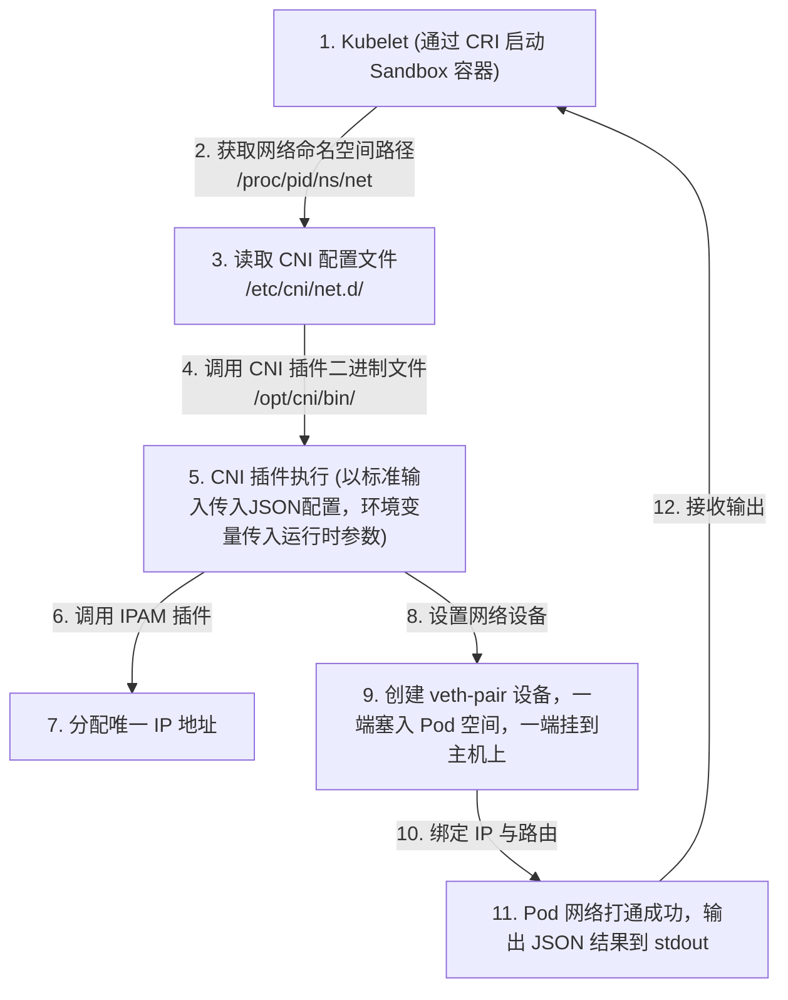

# 🌐 CNI (Container Network Interface) 容器网络接口深度指南

`CNI` 是 CNCF 旗下的一个项目，旨在为容器化应用定义统一的网络连接标准。Kubernetes 通过调用 CNI 插件，在容器创建时为其创建虚拟网卡、分配唯一 IP 地址，并打通容器与宿主机、容器与容器之间的多维度网络路由。

---

## 一、 CNI 的核心设计原则与工作流

Kubernetes 遵循以下极其严格的扁平网络原则：
1.  **所有的 Pod 能够不通过 NAT 就能相互访问**。
2.  **所有的节点能够不通过 NAT 就能相互访问**。
3.  **容器内看见的 IP 地址和外部组件看到的容器 IP 是一样的**。

### 1. Kubelet 触发 CNI 的工作流

在 Kubelet 创建 Pod 的生命周期中，CNI 被调用的具体阶段如下：



*   **CNI 二进制文件目录**：默认位于 `/opt/cni/bin/`。
*   **CNI 配置文件目录**：默认位于 `/etc/cni/net.d/`。Kubelet 会默认读取该目录下字典序排在最前面的文件（通常是 JSON 格式）。
*   **输入方式**：Kubelet 不通过 gRPC 而是通过**命令行调用二进制程序**来执行 CNI 插件。Kubelet 将网络配置以标准输入（stdin）的形式传入，将容器运行时参数（如 ContainerID、NetNS 路径、Pod 名字等）以环境变量的形式传给 CNI 二进制程序。

---

## 二、 CNI 插件的三大网络模式

CNI 网络插件在物理实现上主要分为三大阵营：**Overlay 隧道**、**路由模式**以及 **Underlay 扁平网络**。

```mermaid
graph TD
    subgraph Overlay_Mode ["1. Overlay 模式 (隧道封装)"]
        PodA1["Pod A (10.244.1.2)"] -- "veth" --> HostA1["Host A"]
        HostA1 -- "VXLAN/IPIP 封装" --> PhysicalNet1["物理网络 (仅感知主机IP)"]
        PhysicalNet1 -- "解封装" --> HostB1["Host B"]
        HostB1 -- "veth" --> PodB1["Pod B (10.244.2.3)"]
    end

    subgraph Route_Mode ["2. 路由模式 (非封装路由)"]
        PodA2["Pod A (10.244.1.2)"] -- "veth" --> HostA2["Host A (BGP Daemon发布路由)"]
        HostA2 -- "三层路由转发" --> Router["交换机/路由器"]
        Router -- "直达" --> HostB2["Host B"]
        HostB2 -- "veth" --> PodB2["Pod B (10.244.2.3)"]
    end

    subgraph Underlay_Mode ["3. Underlay 模式 (直接打通)"]
        PodA3["Pod A (192.168.1.100)"] -- "Macvlan/SR-IOV" --> PhysicalNet3["物理网络 (直接感知Pod IP)"]
        PhysicalNet3 --> PodB3["Pod B (192.168.1.101)"]
    end
```



### 1. Overlay 模式
*   **实现原理**：容器独立于主机的 IP 段。容器之间的跨主机通信通过在主机之间建立虚拟隧道（如 VXLAN、IP-in-IP）进行。源端宿主机会将整个容器的网络包封包为宿主机之间的 UDP 包，到目的端宿主机后再进行解封。
*   **优缺点**：
    *   **优点**：对底层物理网络没有任何依赖，可以在任何云厂商、任何虚拟化环境下直接部署，极其通用。
    *   **缺点**：封包和解包会增加额外的 CPU 开销，并且由于包头开销会导致网络 MTU 变小，传输性能有 10%~20% 的损耗。
*   **常见实现**：Flannel (VXLAN 模式)、Calico (IPIP 模式)、Weave Net。

### 2. 路由模式
*   **实现原理**：主机和容器分属不同网段，但不封包。它将每个工作节点都视作一个路由器，并通过动态路由协议（如 BGP）或静态路由表，将各节点的 Pod 网段路由信息发布到整个网络中。
*   **优缺点**：
    *   **优点**：不需要封包，性能极高，接近宿主机物理网络性能。
    *   **缺点**：底层网络必须是三层可达的，或者是二层连通的。很多虚拟化或公有云环境出于安全策略，会过滤未知 IP 的 MAC 地址或禁止发布自定义路由，从而无法使用此模式。
*   **常见实现**：Calico (BGP 模式)、Flannel (host-gw 模式)。

### 3. Underlay 模式
*   **实现原理**：容器和宿主机处于同一层网络中，直接共享物理网段。容器直接被赋予物理局域网的 IP 地址，由物理交换机直接进行 IP 寻址和流量转发。
*   **优缺点**：
    *   **优点**：性能最高，没有中间层虚拟化，且容器 IP 可以直接与集群外的传统虚拟机/物理机进行打通。
    *   **缺点**：极度依赖物理网络架构（需要交换机支持，或云厂商专有 CNI API 支持）；且会消耗大量物理局域网的 IP 资源。
*   **常见实现**：SR-IOV CNI、Aliyun Terway (云原生网卡弹性化对接)、Macvlan。

---

## 三、 CNI 核心插件分类

一个完整的容器网络配置，通常由多个职责单一的 CNI 二进制插件链式组合完成。CNI 社区将其划分为以下三大类：

| 插件类别 | 典型插件名称 | 职责 |
| :--- | :--- | :--- |
| **Main 插件 (网卡与设备创建)** | `bridge` | 创建一个 Linux 网桥，并把主机对端和容器网卡绑到该网桥上（如 Flannel 的底层实现）。 |
| | `ipvlan` / `macvlan` | 基于内核虚拟化技术，直接在物理网卡上虚拟出多个 IP 不同的网卡给容器使用。 |
| | `loopback` | 为容器配置本地回环接口（127.0.0.1 / lo）。 |
| | `ptp` | 创建 Veth-pair 对，实现点对点的直接连接。 |
| **IPAM 插件 (IP 地址分配管理)** | `host-local` | 最常用的 IPAM。在每个 Node 上使用预先分配的子网段，通过文件锁记录已分配的 IP。 |
| | `dhcp` | 容器启动后，向局域网的 DHCP 服务器发起 IP 租约请求。 |
| **Meta 插件 (附加网络策略)** | `portmap` | 基于 iptables 为容器配置端口映射（类似于 Docker -p 参数）。 |
| | `bandwidth` | 利用 Linux Traffic Control (TC) 限制容器的最大上下行带宽。 |
| | `firewall` | 通过 iptables 规则为容器设置防火墙策略。 |

---

## 四、 实战：以 Calico 为例的 CNI 网络打通

```text
    Pod A (10.244.1.2)                          Pod B (10.244.2.3)
      └─ veth0                                    └─ veth0
          │                                           │
    ┌─────▼─────────────────────────┐           ┌─────▼─────────────────────────┐
    │  Host A (Node 1)              │           │  Host B (Node 2)              │
    │  - veth123 (对端)             │           │  - veth456 (对端)             │
    │  - 路由表: 10.244.2.0/24      │           │  - 路由表: 10.244.1.0/24      │
    │    via Node 2 IP (BGP 建立)   │           │    via Node 1 IP (BGP 建立)   │
    │  - Felix (Daemon 管理路由表)   │           │  - Felix (Daemon 管理路由表)   │
    └─────────────┬─────────────────┘           └─────────────┬─────────────────┘
                  │                                           │
                  └─────────────────物理交换机(三层路由)────────┘
```

1.  **给 Pod 插上网线**：
    *   Kubelet 调用 CNI 插件，首先在宿主机创建一个 `veth-pair` 虚拟网卡对。
    *   将其中一端（如 `veth0`）移入 Pod 的 Network Namespace，改名为 `eth0`；另一端（如 `veth123`）留在宿主机上，状态设为 Up。
2.  **分配与配置 IP**：
    *   CNI 插件调用 `host-local` 插件从当前 Node 的 CIDR 中分配一个唯一的 IP。
    *   将该 IP 配置给 Pod 内的 `eth0`。
    *   在 Pod 内部写入默认路由，下一跳直接指向宿主机端。
3.  **跨主机路由打通 (BGP 协同)**：
    *   Calico 插件的 Daemon 进程（Felix）会监听到新 Pod 的 IP 诞生，并写入宿主机的内核路由表中：
        `ip route add 10.244.1.2 dev veth123`（在 Node 1 上，发往 10.244.1.2 的流量强行扔进虚拟网卡）。
    *   Node 1 上的 BGP 守护进程（BIRD）将自己的 Pod 网段信息发布给 Node 2。
    *   Node 2 的 BIRD 接收后，在 Node 2 路由表上添加一条：
        `ip route add 10.244.1.0/24 via Node-1-IP dev eth0`。
    *   跨主机网络由此打通，全程无需封包，转发效率极高。

> 💡 **深度专题延伸**：关于 Calico 架构细节、`calico-node`（Felix/BIRD/confd）与 `calico-kube-controllers` 控制器深度原理，请参阅：[02-1-Calico架构与calico-node及kube-controllers深度剖析.md](../../04-集群网络/02-1-Calico架构与calico-node及kube-controllers深度剖析.md)。

---

> [!TIP] 💡 关联技术与延伸阅读
>
> * [Calico 架构与底层路由深度剖析](../../04-集群网络/02-1-Calico架构与calico-node及kube-controllers深度剖析.md)
> * [Flannel 网络模式深度解析与对比](../../04-集群网络/07-Flannel网络模式深度解析与对比.md)
> * [eBPF 与 Cilium 下一代网络架构](../../04-集群网络/04-eBPF与Cilium下一代网络架构原理.md)
