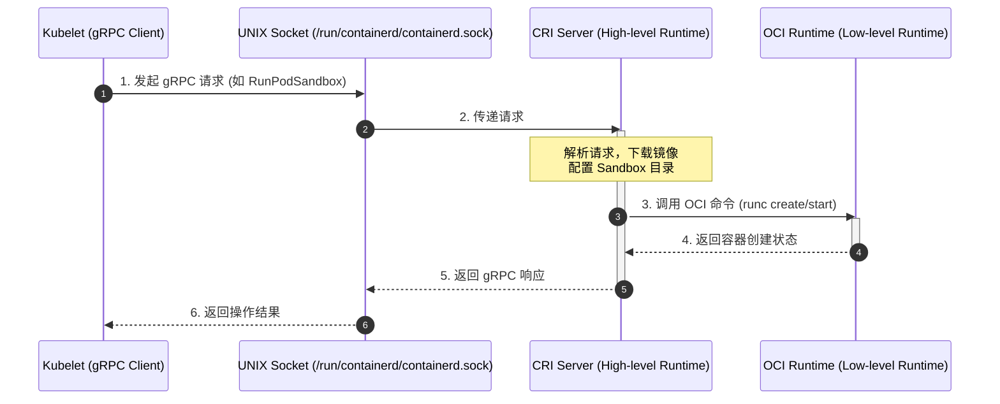
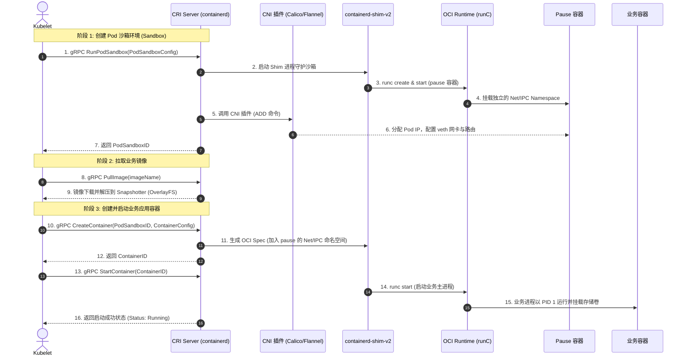

# 🐳 CRI (Container Runtime Interface) 容器运行时接口深度指南

`CRI` 是 Kubernetes 定义的用于对接容器运行时的标准 gRPC 接口规范。通过引入 CRI，Kubernetes 实现了底层容器技术（Docker、Containerd、CRI-O等）与控制面 Kubelet 的解耦，使得集群可以灵活替换不同的容器引擎。

---

## 一、 CRI 的演进与设计初衷

### 1. 从 "Dockershim" 到纯粹的 CRI
在 Kubernetes 早期版本中，底层容器技术基本只有 Docker。因此，Kubelet 内部直接硬编码了对接 Docker API 的适配代码（称为 **Dockershim**）。
*   **弊端**：随着 CoreOS 推出 rkt、以及各种新型沙箱技术的出现，每次引入新的运行时，都需要修改 Kubelet 核心代码，导致控制面臃肿。
*   **CRI 引入 (v1.5)**：定义了一组标准的 gRPC API，任何容器运行时只要实现这套 gRPC 服务，就可以直接与 Kubelet 对接。
*   **Dockershim 移除 (v1.24)**：Kubernetes 官方正式移除了 Dockershim，彻底转向了纯粹的 CRI 接口。现在，即使使用 Docker，也必须通过 `cri-dockerd` 代理进行对接。

---

## 二、 CRI 核心架构与 gRPC 服务定义

CRI 底层基于 **gRPC over UNIX Domain Sockets** 进行通信。Kubelet 作为 gRPC 客户端，容器运行时作为 gRPC 服务端。



CRI 接口规范主要定义了两个核心的 gRPC 服务：

### 1. RuntimeService (运行时服务)
用于管理 Pod Sandbox 的生命周期以及 Sandbox 内部容器的生命周期：
*   **Sandbox 管理**：`RunPodSandbox` (创建并配置沙箱)、`StopPodSandbox`、`RemovePodSandbox`、`PodSandboxStatus`。
*   **Container 管理**：`CreateContainer`、`StartContainer`、`StopContainer`、`RemoveContainer`、`ListContainers`、`ContainerStatus`。
*   **交互式调用**：`Exec` (执行命令)、`Attach` (附加控制台)、`PortForward` (端口转发)。这些调用会通过流式通道（Streaming API）将用户的 TTY 输入输出与容器进行双向绑定。

### 2. ImageService (镜像服务)
用于拉取、查询、删除容器镜像：
*   **操作接口**：`ListImages`、`ImageStatus`、`PullImage` (下载镜像)、`RemoveImage`、`ImageFsInfo` (获取镜像存储文件系统状态)。

---

## 三、 高层级与低层级运行时 (High-level vs Low-level)

在生产环境中，我们将容器运行时分为两个层次：

```text
┌─────────────────────────────────────────────────────────────┐
│                          Kubelet                            │
└─────────────────────────────┬───────────────────────────────┘
                              │ gRPC (CRI)
                              ▼
┌─────────────────────────────────────────────────────────────┐
│ 1. 高层级运行时 (CRI Server)                                 │
│    - 职责：镜像拉取、元数据缓存、网络沙箱配置                 │
│    - 典型代表：Containerd, CRI-O, cri-dockerd              │
└─────────────────────────────┬───────────────────────────────┘
                              │ OCI Specification (bundle)
                              ▼
┌─────────────────────────────────────────────────────────────┐
│ 2. 低层级运行时 (OCI Runtime)                                │
│    - 职责：直接调用内核 namespace/cgroup 跑容器               │
│    - 典型代表：runC (标准), Kata (微型虚拟机), gVisor (内核隔离)│
└─────────────────────────────────────────────────────────────┘
```

### 1. 高层级运行时 (High-level Runtime / CRI Server)
*   **工作内容**：接收 Kubelet 发来的 gRPC 请求，负责管理本地镜像存储、控制并发、管理容器的配置与参数，并把镜像解压成符合 OCI 规范的文件系统包 (filesystem bundle)。
*   **典型实现**：
    *   **Containerd**：源自 Docker 核心，目前最流行、最成熟稳定的高层运行时。
    *   **CRI-O**：RedHat 主导的、专门为 Kubernetes 裁剪的轻量级高层运行时。

### 2. 低层级运行时 (Low-level Runtime / OCI Runtime)
*   **工作内容**：只专注于一步——根据高层运行时传来的文件系统包和配置文件，真正调用 Linux 内核 API（如 `clone`, `unshare`, `cgroups` 等）来创建并启动容器进程。
*   **典型实现**：
    *   **runC**：OCI 标准参考实现，创建普通的宿主机隔离进程，共享宿主机内核，速度极快，是默认的选择。
    *   **Kata Containers**：基于极简 QEMU 虚拟化的低层运行时。每个 Pod 都是一个独立的微型虚拟机（VM），具有独立的内核，隔离性极高，适用于多租户安全场景。
    *   **gVisor**：Google 开源的安全沙箱。通过在用户态实现一个哨兵进程（Sentry）拦截并模拟容器内所有的系统调用，从而提供强隔离。

---

## 四、 CRI 视角下的 Pod 容器创建时序

当 Kubelet 监听到一个 Pod 被调度到本地节点，其通过 gRPC 协议调用 CRI 与底层容器运行时执行的核心时序流转如下：



### 1. 核心创建流程 5 大阶段详述

1. **创建 Pod 基础沙箱 (RunPodSandbox)**：
   * Kubelet 向 CRI Server 发起 `RunPodSandbox` 请求。
   * containerd 为该 Pod 派生一个专用的 `containerd-shim-v2` 守护进程，并调用 `runC` 拉起 `pause` 容器。
   * `pause` 容器通过 Linux `clone(CLONE_NEWNET | CLONE_NEWIPC | CLONE_NEWUTS)` 系统调用，锁定并维持一组空的内核命名空间。
2. **配置容器网络 (CNI Network Setup)**：
   * CRI Server（或早期 Kubelet）调用 CNI 插件（如 Calico / Cilium）。
   * CNI 插件通过 IPAM 分配 Pod IP，创建一对 `veth-pair` 虚拟网卡，将一端打入 `pause` 容器的 Network Namespace，另一端接入宿主机网桥或路由表，完成路由打通。
3. **拉取应用镜像 (PullImage)**：
   * Kubelet 调用 CRI 的 `ImageService.PullImage` 接口。
   * containerd 检查本地 Content Store。若未命中缓存，从远端镜像仓库拉取各 Layer，并通过 Snapshotter（通常为 OverlayFS）将多层镜像解压挂载为容器的只读 RootFS。
4. **组装容器配置与元数据 (CreateContainer)**：
   * Kubelet 调用 `RuntimeService.CreateContainer`，传入容器环境变量、挂载卷（Volume Mounts）、资源配额限制（cgroups v1/v2）。
   * containerd 生成标准的 OCI `config.json` 配置文件，并在其中将 `namespaces` 路径指向 `pause` 容器的 `/proc/<pause-pid>/ns/net` 与 `ipc`。
5. **启动业务应用容器 (StartContainer)**：
   * Kubelet 发起 `StartContainer` 指令。
   * `containerd-shim-v2` 调用 `runC` 执行真正的业务二进制（如 `java -jar` 或 `nginx -g`）。业务容器进程启动后直接复用 `pause` 的 IP 和网络栈。
   * Kubelet 的 PLEG（Pod Lifecycle Event Generator）捕获到容器启动事件，将 Pod 状态标记并上报为 `Running`。

---

## 五、 延伸阅读：Docker 与 Containerd 深度对比

关于后端容器运行时的底层对比（包括 Pause 容器 Namespace 绝对路径挂载与 Docker API 模式区别、Shim-v1/v2 进程模型演进、CNI 触发机制及运维工具映射），请参阅专题文档：
👉 [03-Docker与Containerd底层实现及Pause通信深度解析.md](./03-Docker与Containerd底层实现及Pause通信深度解析.md)

---

> [!TIP] 💡 关联技术与延伸阅读
>
> * [Kubelet 核心架构与 Pod 驱动机制](../04-Kubelet.md)
> * [Docker 与 Containerd 容器运行时底层底座](../../07-集群扩展/02-Docker与Containerd容器运行时底座.md)
