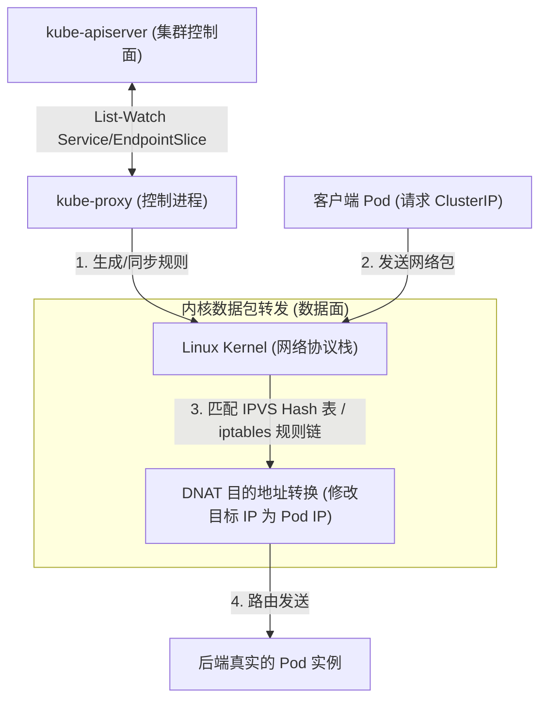
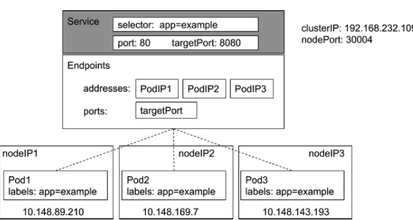
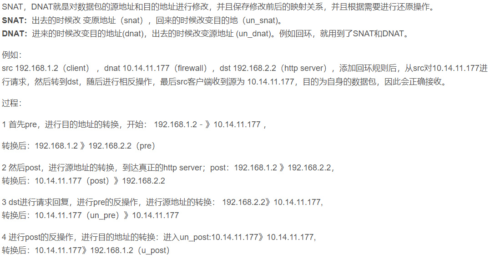
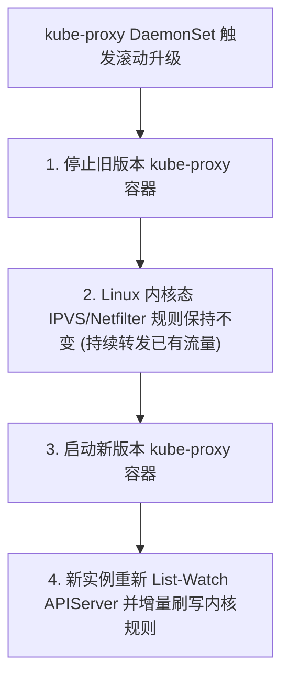
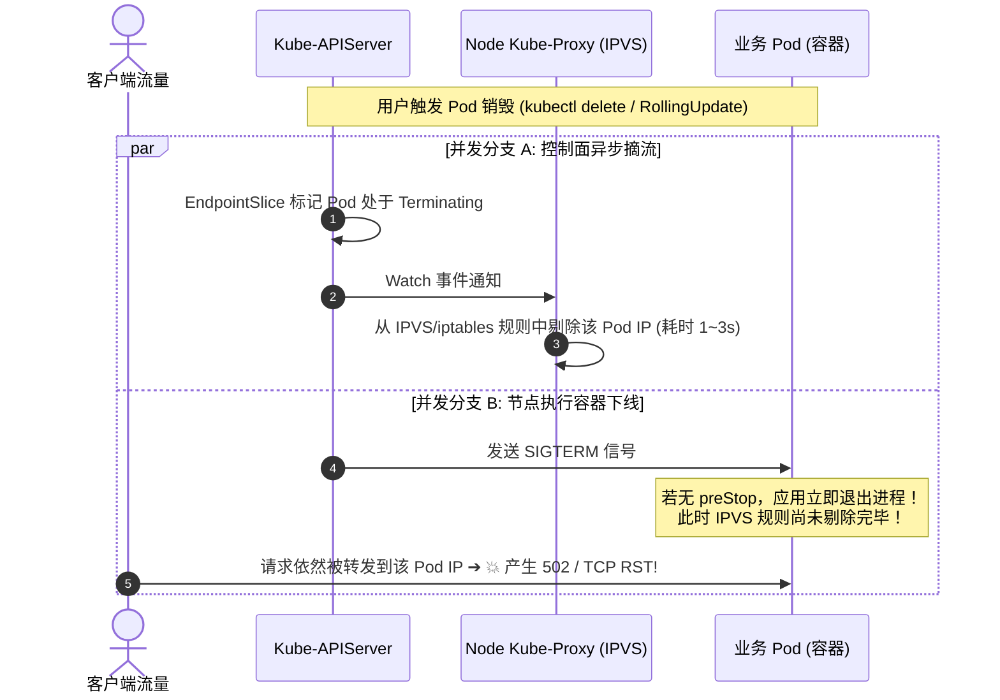
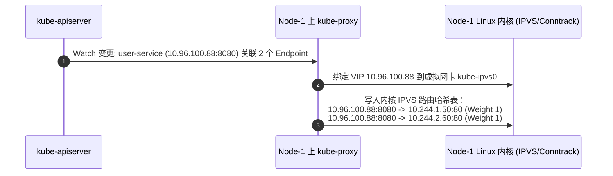
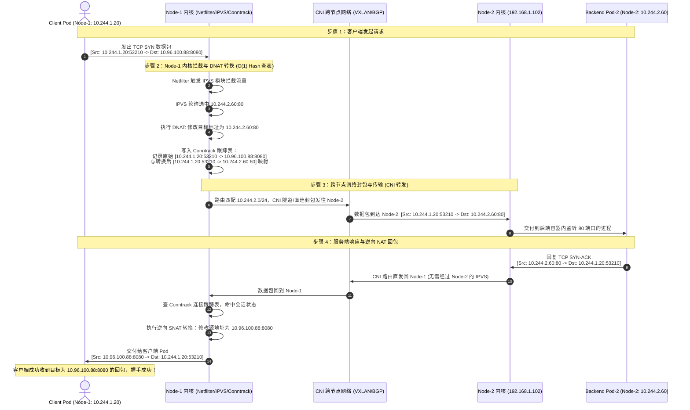
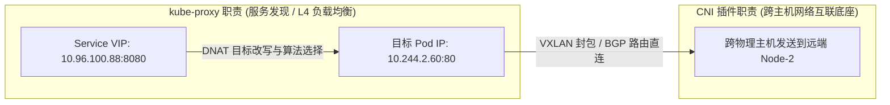

# 🔌 kube-proxy 底层转发与负载均衡机制深度解析

`kube-proxy` 是 Kubernetes 工作节点上的网络代理，负责维护节点上的网络规则。它监听 API Server 中 Service 和 EndpointSlice 的变化，在本地配置相应的转发机制，将发往 Service 的 ClusterIP 流量智能路由并负载均衡至后端真实的 Pod 实例上。

---

## 一、 kube-proxy 工作流与架构

kube-proxy 运行在每个 Node 节点上，采用声明式与事件驱动模式。**它本身并不直接处理任何网络数据包，而是作为本地网络规则的“配置大脑”**：



1.  **监听变更**：kube-proxy 通过 API Server 的 List-Watch 接口，实时获取 Service 和 Endpoint/EndpointSlice 的增删改。
2.  **更新规则**：根据获取的变更，kube-proxy 调用系统内核接口，在宿主机网络协议栈中生成或修改 DNAT（目的网络地址转换）与负载均衡规则。
3.  **流量转发**：当有客户端 Pod 访问 Service 的虚拟 IP (ClusterIP) 时，流量经过宿主机内核，内核直接命中本地路由规则，修改目标 IP 为某个具体的 Backend Pod IP，并发送出去。

> [!NOTE]
> 由于流量转发完全由 Linux 内核态执行，即使 `kube-proxy` 进程挂掉，已写入内核的转发规则依然有效，原有的 Service 通信不会立刻中断。

---

## 二、 kube-proxy 三种工作模式对比

kube-proxy 支持三种不同的实现模式。在生产实践中，基本在使用 **iptables** 和 **IPVS** 模式。

### 1. Userspace 模式 (历史陈旧模式)
*   **工作机制**：kube-proxy 在用户空间监听端口。流量到达内核后，经由 iptables 转发到 kube-proxy 的监听端口，再由 kube-proxy 在用户空间建立 TCP 链接并分发给后端 Pod。
*   **劣势**：每个包都需要在 Linux 内核态和用户态之间进行多次上下文切换（Context Switch）和数据拷贝，CPU 开销极大，延迟高。在 v1.2 版本后已被弃用。

### 2. iptables 模式 (默认模式)
*   **工作机制**：完全依靠 Linux Netfilter/iptables 规则链来实现 DNAT 和负载均衡。
*   **路由分发**：利用 iptables 的 `statistic` 模块，通过设定随机概率来模拟随机/轮询负载均衡：
    ```bash
    # 示例：通过随机数实现 50% 概率转发到第一个 Pod，剩余流量到第二个 Pod
    -A KUBE-SVC-XXX -m statistic --mode random --probability 0.50000000000 -j KUBE-SEP-POD1
    -A KUBE-SVC-XXX -j KUBE-SEP-POD2
    ```
*   **瓶颈（关键缺陷）**：
    *   **$O(N)$ 复杂度**：iptables 规则链是**顺序匹配**的线性链表结构。如果集群内有 5000 个 Service（每个 Service 对应 3 个 Pod），节点上就会产生几万条 iptables 规则。每个网络包都需要挨个遍历，这会导致网络延迟大幅上升，CPU 负载暴增。
    *   **全量刷新慢**：更新或插入一条规则时，iptables 必须先锁住整个表，把所有的规则拉下来修改，然后再全量刷新回内核，无法实现局部增量更新。

### 3. IPVS 模式 (高性能推荐)
*   **工作机制**：基于 Linux 内核的 IPVS（IP Virtual Server）模块实现。IPVS 是专门为了高并发负载均衡设计的内核组件。
*   **优势（完美的水平伸缩）**：
    *   **$O(1)$ 复杂度**：IPVS 底层使用高效的**哈希表 (Hash Table)** 存储路由规则。无论集群中有 10 个 Service 还是 10 万个 Service，流量匹配的时延基本恒定，性能极佳。
    *   **增量更新**：支持增量修改路由规则，刷新速度快，更新期间不锁表，网络连接无感知。
    *   **丰富的负载算法**：除随机外，还支持 `rr` (轮询)、`lc` (最少连接)、`dh` (目的哈希)、`sh` (源哈希) 等多种负载均衡算法。
    *   **ARP 欺骗屏蔽**：IPVS 模式下，kube-proxy 会创建一个名为 `kube-ipvs0` 的虚拟网卡，并将所有 Service IP 绑定在该网卡上，用以应对内核对虚拟 IP 的路由查询。

---

## 三、 iptables 与 IPVS 性能指标对比表

| 特征维度 | iptables 模式 | IPVS 模式 |
| :--- | :--- | :--- |
| **底层数据结构** | 线性链表 (Chain List) | 哈希表 (Hash Table) |
| **匹配时间复杂度** | $O(N)$，随服务数量暴增而性能衰退 | $O(1)$，服务数量增加对性能几乎无影响 |
| **规则更新机制** | 锁表、全量刷新 | 增量更新，无锁，非阻塞 |
| **支持的负载均衡算法** | 仅随机/概率分配 | 轮询、最少连接、源/目的 IP 哈希等 |
| **资源开销 (CPU/Memory)** | 大规模集群下 CPU 损耗极大 | 内存开销小，CPU 消耗低 |
| **宿主机配置依赖** | 仅需标准 Netfilter 模块 | 需要加载 `ip_vs`, `ip_vs_rr` 等内核模块 |

---

## 四、 核心机制图解

### 1. 流量代理示意图
以下是 kube-proxy 进行服务网络发现与拦截的逻辑结构：



---

### 2. userspace 与 iptables 模式流量对比图
数据包在用户态与内核态之间的流向路线：



---

## 五、 IPVS 模式下的网络调试与排障

> [!TIP]
> 在生产环境中，若发现 IPVS 模式下某些 Service 无法连通，可使用 `ipvsadm` 命令直接进入内核空间查看底层的负载条目。

### 1. 查看 IPVS 虚拟路由表
在工作节点上执行以下命令（需事先安装 `ipvsadm`）：

```bash
# 列出节点上当前所有的 IPVS 转发规则 (-l 列出, -n 数字化输出)
ipvsadm -ln
```
**输出示例：**
```text
IP Virtual Server version 1.2.1 (size=4096)
Prot LocalAddress:Port Scheduler Flags
  -> RemoteAddress:Port           Forward Weight ActiveConn InActConn
TCP  10.96.0.10:53 rr                                         # 53 端口 (CoreDNS Service IP)
  -> 10.244.0.5:53                Masq    1      0          0 # 真实的 CoreDNS Pod A
  -> 10.244.0.6:53                Masq    1      0          0 # 真实的 CoreDNS Pod B
TCP  10.105.22.88:80 rr                                       # 业务 Nginx Service IP
  -> 10.244.1.15:80               Masq    1      0          0 # Nginx Pod A
```

### 2. 检查节点加载的 IPVS 内核模块
若 kube-proxy 启动失败并降级为 iptables 模式，可能是因为节点未加载 IPVS 模块：

```bash
# 检查内核中是否加载了 ip_vs 模块
lsmod | grep -i ip_vs
```
若未加载，需在节点初始化时手动加载：
```bash
modprobe -- ip_vs
modprobe -- ip_vs_rr
modprobe -- ip_vs_wrr
modprobe -- ip_vs_sh
modprobe -- nf_conntrack
```

---

## 六、 kube-proxy 高可用保障、DaemonSet 滚动升级与流量零中断实战

### 1. DaemonSet 滚动升级与内核态规则保活机制

`kube-proxy` 通常以 **DaemonSet** 形式部署在集群的每一个工作节点上。在进行跨版本升级时，其高可用与平滑升级机制具有得天独厚的优势：



#### 为什么升级 kube-proxy 容器不会导致业务流量中断？
* **控制面与数据面彻底分离**：`kube-proxy` 只是**规则的搬运工与下发者**（Control Plane on Node）。真正执行数据包拦截、DNAT 转换和哈希路由的是 **Linux Kernel（Netfilter / IPVS 内核模块）**（Data Plane）。
* **规则持久常驻内核**：在 `kube-proxy` 容器被杀掉并拉起新版本的几秒钟内，内核中的 IPVS 虚拟服务器表项和 iptables 规则链**完全不受影响**，现存的业务 TCP 连接和新发起的 Service 请求依然能被内核正常转发。

---

### 2. Pod 滚动升级期间流量零丢包 (Zero-Downtime) 核心保障体系

在集群日常升级或应用发布过程中，最常见的网络故障是：**旧 Pod 正在下线，但外部请求依然被打向旧 Pod，导致客户端收到 502 Bad Gateway 或 Connection Refused**。



#### 消除 502 报错的黄金标准配置：

```yaml
apiVersion: apps/v1
kind: Deployment
metadata:
  name: production-web
spec:
  replicas: 3
  template:
    spec:
      containers:
      - name: nginx
        image: nginx:1.26
        # 1. 配置就绪探针：确保新 Pod 完全就绪前不接入流量
        readinessProbe:
          httpGet:
            path: /healthz
            port: 80
          initialDelaySeconds: 5
          periodSeconds: 3
        # 2. 核心：preStop 优雅停机延时睡眠
        lifecycle:
          preStop:
            exec:
              command: ["/bin/sh", "-c", "sleep 10"]  # 等待 10s，确保全集群 kube-proxy 规则剔除完成
      # 3. 优雅终止宽限期 (必须大于 preStop 耗时 + 应用自身清理耗时)
      terminationGracePeriodSeconds: 45
```

---

### 3. kube-proxy 升级与运行期间典型故障与深度解决方案 (Troubleshooting SOP)

#### 场景 1：kube-proxy 升级后静默降级为 iptables 模式导致性能雪崩
* **故障现象**：在大规模集群中升级 `kube-proxy` 后，节点 CPU 负载急剧飙升，网络延迟大幅增加。
* **根本原因**：`kube-proxy` 启动时检测不到宿主机的 IPVS 内核模块（如因宿主机重启未自动加载），且未配置严格模式，自动 fallback 静默降级为低效的 iptables 线性匹配模式。
* **排障与恢复 SOP**：
  ```bash
  # 1. 查看 kube-proxy 日志确认当前工作模式
  kubectl logs -n kube-system -l k8s-app=kube-proxy | grep -i "Using ipvs Proxier"
  
  # 若出现 "Can't use ipvs proxier, fallback to iptables"，说明模块缺失
  # 2. 检查宿主机模块并重新加载
  modprobe -- ip_vs && modprobe -- ip_vs_rr && modprobe -- ip_vs_wrr && modprobe -- ip_vs_sh && modprobe -- nf_conntrack
  
  # 3. 强制重启该节点上的 kube-proxy Pod
  kubectl delete pod <kube-proxy-pod-name> -n kube-system
  ```

#### 场景 2：连接跟踪表满导致大规模丢包 (`nf_conntrack: table full`)
* **故障现象**：升级或大促期间，工作节点报 `kernel: nf_conntrack: table full, dropping packet`，节点内所有 Pod 网络随机性大面积超时。
* **根本原因**：Linux 内核参数 `net.netfilter.nf_conntrack_max` 默认值较小，随着短连接并发激增，Conntrack 跟踪表被占满。
* **排障与恢复 SOP**：
  ```bash
  # 1. 查看当前 conntrack 已用条目与最大容量
  cat /proc/sys/net/netfilter/nf_conntrack_count
  cat /proc/sys/net/netfilter/nf_conntrack_max
  
  # 2. 动态调大最大跟踪连接数与缩短 TIME_WAIT 超时
  sysctl -w net.netfilter.nf_conntrack_max=1048576
  sysctl -w net.netfilter.nf_conntrack_tcp_timeout_established=1200
  sysctl -w net.netfilter.nf_conntrack_tcp_timeout_time_wait=30
  
  # 3. 持久化写入 /etc/sysctl.conf 并生效
  echo "net.netfilter.nf_conntrack_max = 1048576" >> /etc/sysctl.conf
  sysctl -p
  ```

#### 场景 3：[CoreDNS](../04-集群网络/08-CoreDNS底层架构与服务发现技术深度指南.md) 升级抖动导致全集群 Service 域名解析超时
* **故障现象**：升级控制面 [CoreDNS](../04-集群网络/08-CoreDNS底层架构与服务发现技术深度指南.md) 插件时，集群内业务 Pod 频繁出现 `dial tcp: lookup xxx on 10.96.0.10:53: i/o timeout`。
* **根本原因**：CoreDNS 仅部署了 1 个副本，或多个副本被调度在同一台正在升级的工作节点上，升级重启期间出现 DNS 服务真空。
* **排障与恢复 SOP**：
  ```bash
  # 1. 确保 CoreDNS 副本数充足 (至少 2~3 个副本)
  kubectl scale deployment coredns -n kube-system --replicas=3
  
  # 2. 为 CoreDNS 配置反亲和性 (PodAntiAffinity)，强制打散在不同节点
  kubectl patch deployment coredns -n kube-system --patch '
  spec:
    template:
      spec:
        affinity:
          podAntiAffinity:
            preferredDuringSchedulingIgnoredDuringExecution:
            - weight: 100
              podAffinityTerm:
                labelSelector:
                  matchExpressions:
                  - key: k8s-app
                    operator: In
                    values: ["kube-dns"]
  '
  ```

---

## 七、 生产实战场景：Service 访问全链路内核数据流剖析

为了清晰展示客户端 Pod 访问 Service 时，`kube-proxy` 与 Linux 内核各模块（IPVS、Netfilter、Conntrack、CNI）的真实协作过程，以下还原一个真实的微服务跨节点调用场景。

### 1. 场景设定与网络拓扑

* **客户端服务 (Order Service)**：
  * Pod 名字：`order-client-pod`
  * 所在节点：`Node-1`（宿主机 IP: `192.168.1.101`）
  * Pod IP: `10.244.1.20`
* **后端目标服务 (User Service)**：
  * Service 名字：`user-service`
  * Service IP (ClusterIP): `10.96.100.88:8080`
  * 2 个后端副本 Pod：
    * `user-pod-1`：位于 `Node-1`，IP 为 `10.244.1.50:80`
    * `user-pod-2`：位于 `Node-2`（宿主机 IP: `192.168.1.102`），IP 为 `10.244.2.60:80`
* **kube-proxy 工作模式**：`IPVS` 模式（配置轮询 `rr` 算法）

---

### 2. 控制面预置阶段（kube-proxy 的动作）

在客户端发起请求前，`kube-proxy` 已经完成了规则的监听与内核下发：



此时在 `Node-1` 节点执行 `ipvsadm -ln` 可见真实内核表项：
```text
Prot LocalAddress:Port Scheduler Flags
  -> RemoteAddress:Port           Forward Weight ActiveConn InActConn
TCP  10.96.100.88:8080 rr
  -> 10.244.1.50:80               Masq    1      0          0
  -> 10.244.2.60:80               Masq    1      0          0
```

---

### 3. 数据面端到端请求与响应数据流（跨节点路由示例）

假设本次请求被 IPVS 调度选中跨节点的 **`user-pod-2` (`10.244.2.60:80`)**：



#### 📌 全链路 4 步核心流程简述：

1. **第 1 步 · 客户端发包**：
   * 客户端 Pod 将请求发往虚拟的 `ClusterIP:Port`（`10.96.100.88:8080`），报文经 `veth-pair` 虚拟网卡进入本节点的 Linux 内核协议栈。
2. **第 2 步 · 本地内核拦截与 DNAT 转换**：
   * 本地宿主机内核的 Netfilter 钩子捕获该报文，触发 **IPVS/iptables** 规则匹配，通过负载均衡算法（如轮询 `rr`）选出后端真实实例 `10.244.2.60:80`。
   * 内核执行 **DNAT（目的地址转换）**，将数据包的目标 IP 替换为后端 Pod IP，并在内核 **Conntrack（连接跟踪表）** 中记录该会话映射。
3. **第 3 步 · CNI 跨节点隧道传输**：
   * 本地路由发现目标 IP `10.244.2.60` 属于远端的 `Node-2`，交由 CNI 网络插件（如 [Calico](../04-集群网络/02-1-Calico架构与calico-node及kube-controllers深度剖析.md) BGP 直连或 [Flannel](../04-集群网络/07-Flannel网络模式深度解析与对比.md) VXLAN 封包）跨宿主机物理网络发送至 `Node-2`，最终投递给后端的业务容器。
4. **第 4 步 · 服务端响应与逆向 NAT 回包**：
   * 后端 Pod 收到请求后发出响应报文（目标 IP 为客户端 Pod `10.244.1.20`），直接通过 CNI 路由返回 `Node-1`。
   * `Node-1` 内核收到回包后，**查询 Conntrack 连接跟踪表**，自动执行**逆向 SNAT**，将报文的源 IP 从 `10.244.2.60:80` 还原为客户端期待的 `10.96.100.88:8080`，最后投递给客户端 Pod，完成透明通信。

#### 📊 端到端数据包地址变换对照表：

| 阶段 / 链路节点 | 数据包源地址 (Src IP:Port) | 数据包目的地址 (Dst IP:Port) | 核心动作说明 |
| :--- | :--- | :--- | :--- |
| **① 客户端 Pod 发出** | `10.244.1.20:53210` | `10.96.100.88:8080` | 客户端向虚拟 Service IP 发起连接 |
| **② Node-1 内核处理后** | `10.244.1.20:53210` | **`10.244.2.60:80`** | **DNAT 转换**：修改目的 IP，记录 Conntrack |
| **③ 经过 CNI 到达 Pod-2** | `10.244.1.20:53210` | `10.244.2.60:80` | 跨节点传输，保留客户端真实源 IP |
| **④ Pod-2 响应发出** | `10.244.2.60:80` | `10.244.1.20:53210` | 服务端生成响应，直发客户端 IP |
| **⑤ Node-1 内核逆向还原** | **`10.96.100.88:8080`** | `10.244.1.20:53210` | **逆向 NAT 转换**：查 Conntrack 还原源 IP |
| **⑥ 客户端 Pod 接收** | `10.96.100.88:8080` | `10.244.1.20:53210` | 客户端收到合法回包，完成 TCP 握手 |


---

### 4. 关键底层认知总结

1. **同集群 Pod 间通信保留真实源 IP**：
   * 在普通 ClusterIP 跨节点访问中，不会发生 SNAT 源地址伪装，源 IP 始终保持为客户端 Pod IP（`10.244.1.20`），后端 Pod 可以直接获取调用方真实地址。
2. **Conntrack 连接跟踪表的决定性作用**：
   * 客户端只认可向 `10.96.100.88:8080` 发送的请求并等待其回复。若 `Node-1` 回包时未经过 Conntrack 逆向转换（直接返回源 IP 为 `10.244.2.60` 的包），客户端协议栈会判定为非法未知包并直接响应 `TCP RST` 中断连接。
3. **控制面与数据面分离本质**：
   * `kube-proxy` 仅在控制面维护路由规则，实际数据链路上的查表、DNAT 改包、连接跟踪及回包逆向转换全部由 **Linux 内核协议栈** 无锁高性能完成。

---

## 八、 核心认知串联：kube-proxy 本质角色与 CNI 分工边界

### 1. kube-proxy 的核心使命与适用场景
**`kube-proxy` 的核心本质是实现 Kubernetes Service（虚拟 VIP）到后端真实 Pod 实例之间的服务发现与四层负载均衡。**

只要是通过 **Service** 访问后端 Pod 的流量，均由 `kube-proxy` 负责维护其转发规则，覆盖以下三大典型场景：
1. **Pod $\to$ Service $\to$ 后端 Pod** *(最核心场景)*：
   * 集群内微服务互相调用（如订单服务访问用户服务的 `ClusterIP`），内核自动负载均衡分发到健康的 Pod 副本。
2. **Node 宿主机进程 $\to$ Service $\to$ 后端 Pod**：
   * 运行在宿主机操作系统上的守护进程或脚本，直接访问 `ClusterIP` 时同样触发内核规则完成代理转发。
3. **集群外部流量 $\to$ NodePort / LoadBalancer $\to$ 后端 Pod**：
   * 外部客户端请求命中节点的 `NodePort` 时，该节点也是通过 `kube-proxy` 下发的规则将流量 DNAT 到具体的后端 Pod。

---

### 2. 关键设计哲学：“规则下发者”而非“数据搬运工”
* **控制面（kube-proxy）**：`kube-proxy` 进程常驻在每个节点，只负责监听 APIServer 中的 Service 和 EndpointSlice 变更，然后**向宿主机 Linux 内核写入/维护 IPVS 或 iptables 规则**。
* **数据面（Linux Kernel）**：在现代架构下，业务数据包**完全不经过 `kube-proxy` 用户态进程**，而是由 Linux 内核网络栈根据规则在底层纳秒级无锁完成 DNAT 改包、连接跟踪（Conntrack）与高速转发。

---

### 3. 一句话厘清：`kube-proxy` 与 `CNI` 网络插件的分工协同



| 维度 | `kube-proxy` (iptables / IPVS) | `CNI` 网络插件 (Calico / Flannel / Cilium) |
| :--- | :--- | :--- |
| **核心职责** | **服务发现与负载均衡 (L4 NAT)**：将虚拟的 `Service IP:Port` 映射改写为具体的 `Pod IP:Port` (DNAT)。 | **跨主机网络互联 (Pod IPAM & 路由)**：构建跨节点 Pod-to-Pod 之间的底层数据通路。 |
| **解决的问题** | “客户端访问的这个虚拟服务 IP，到底该转给哪一台具体 Pod 实例？” | “知道了目标 Pod IP 之后，这个数据包怎么跨物理机/跨网段安全送达？” |
| **通俗类比** | **导航调度中心**（负责告诉你这趟车具体该开往哪个真实站台） | **高速公路修路队**（负责确保城市之间的物理道路通畅） |

---

> [!TIP] 💡 关联技术与延伸阅读
>
> * [Kubernetes 集群网络访问全链路流程](../04-集群网络/03-集群网络访问详细流程.md)
> * [Calico 架构与路由转发机制](../04-集群网络/02-1-Calico架构与calico-node及kube-controllers深度剖析.md)
> * [CoreDNS 服务发现与 DNS 域名解析](../04-集群网络/08-CoreDNS底层架构与服务发现技术深度指南.md)
> * [eBPF/Cilium 绕过 kube-proxy 的高性能转发](../04-集群网络/04-eBPF与Cilium下一代网络架构原理.md)
