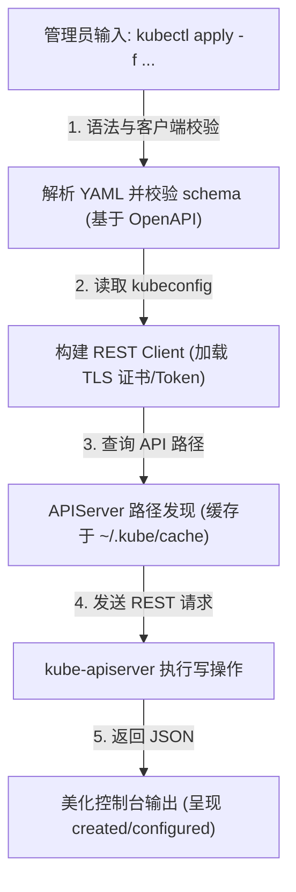
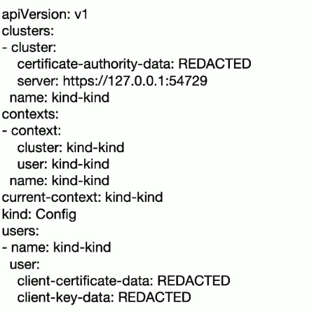

# ⌨️ Kubectl 命令行客户端工作原理与配置指南

`kubectl` 是 Kubernetes 官方提供的命令行工具。它作为一个 REST 客户端，负责解析用户的命令行指令或 YAML 配置文件，构建标准的 HTTP 请求发送给 `kube-apiserver`，并将返回的 JSON 响应进行美化排版展示。

---

## 一、 Kubeconfig 配置文件深度解密

kubectl 默认读取宿主机上的 `~/.kube/config` 配置文件（被称为 **kubeconfig**）。该配置文件包含了连接一个或多个集群的凭证和网络地址，主要由三大部分组成：

```yaml
apiVersion: v1
kind: Config
preferences: {}

# 1. 集群列表：定义目标 API Server 的网络端点和 CA 根证书
clusters:
- name: my-kubernetes-cluster
  cluster:
    certificate-authority-data: LS0tLS1CRUdJTiBDRVJUSUZJQ0FURS0t... # Base64 编码的 CA 证书
    server: https://192.168.10.100:6443                          # API Server 物理地址

# 2. 用户列表：定义用于登录集群的身份凭证 (证书、Token 等)
users:
- name: admin-user
  user:
    client-certificate-data: LS0tLS1CRUdJTiBDRVJUSUZJQ0FURS0t... # 客户端证书
    client-key-data: LS0tLS1CRUdJTiBQUklWQVRFIEtFWS0t...         # 客户端私钥

# 3. 上下文列表：将特定用户与特定集群及默认 Namespace 进行绑定
contexts:
- name: prod-context
  context:
    cluster: my-kubernetes-cluster
    user: admin-user
    namespace: production                                       # 默认操作的命名空间

# 当前激活并生效的上下文
current-context: prod-context
```

### 常用上下文切换命令：
```bash
# 1. 查看所有的上下文
kubectl config get-contexts

# 2. 切换当前的工作上下文到生产环境
kubectl config use-context prod-context

# 3. 设置当前上下文的默认 Namespace
kubectl config set-context --current --namespace=kube-system
```

---

## 二、 Kubectl 执行命令的内部流转

当你在终端输入 `kubectl apply -f deployment.yaml` 时，kubectl 客户端内部会经历以下五个步骤：



1.  **解析与客户端校验**：
    *   读取 `-f` 指定的 YAML 文件，验证其格式是否符合基本的 JSON/YAML 规范。
    *   使用本地缓存的 **OpenAPI Schema** 校验资源字段是否合法（防止拼写错误）。
2.  **构建 REST 客户端**：
    *   读取 `~/.kube/config` 文件中的 `current-context`。
    *   提取对应的 `cluster` 地址及 `user` 凭证，构建带有双向 TLS 认证（mTLS）的 HTTP 客户端。
3.  **API 路径发现 (Discovery API)**：
    *   Kubernetes API 是分层分组的（如 `/api/v1` 或 `/apis/apps/v1`）。
    *   为了确定具体的 REST API 请求路径，kubectl 会查询 API Server 的 Discovery 接口。
    *   *优化*：为避免每次命令都发请求查询路径，kubectl 会将 API 目录缓存到本地目录 `~/.kube/cache/discovery/` 下。
4.  **发送 REST 请求**：
    *   将 YAML 数据序列化为 JSON，构建 HTTP POST/PUT/PATCH 请求（例如：`POST /apis/apps/v1/namespaces/production/deployments`）。
5.  **结果输出**：
    *   接收 API Server 返回的 JSON 格式资源状态，根据命令参数（`-o yaml`、`-o json`、`-o wide`）转换格式，或直接打印标准状态（如 `deployment.apps/nginx-deployment configured`）。

---

## 三、 Kubectl 架构逻辑

以下是 Kubectl 客户端作为一个控制器与控制面进行 REST 交互的宏观结构：



---

## 四、 命令行高阶调试与排障技巧

### 1. 打印 raw 接口请求日志 (`-v` 参数)
> [!TIP]
> 如果你想知道 kubectl 背后到底向 API Server 发送了什么 HTTP 请求，或者想自己写脚本调用 API Server，可以通过 `-v` 级别参数查看底层细节。

```bash
# 级别 8：打印所有 HTTP 请求的 Method, URL 以及 Response Header
kubectl get pods -v=8

# 级别 9：打印最详细的请求，包括 Curl 等效命令、HTTP Request Body 和 Response Body
kubectl get pods -v=9
```

### 2. 客户端与服务端双向 Dry-Run (干跑校验)
在不真正修改集群状态的前提下，对 YAML 或指令进行语法及合规性核验：

```bash
# 客户端干跑：仅在本地校验 YAML 字段拼写，不发往 API Server
kubectl apply -f nginx-dep.yaml --dry-run=client

# 服务端干跑：将请求发往 API Server，API Server 会执行完整的 Auth, Admission 校验，
# 但不会写入 etcd 存储，用于验证准入控制 Webhook 是否会拦截该 YAML
kubectl apply -f nginx-dep.yaml --dry-run=server
```

### 3. 使用 JSONPath 提取高价值字段
利用 JSONPath 语法，不需要经过第三方 jq 过滤，直接抓取 API Server 返回的结构化数据：

```bash
# 1. 提取所有 Pod 的名字和对应的 Node IP 列表
kubectl get pods -o jsonpath='{range .items[*]}{.metadata.name}{"\t"}{.status.podIP}{"\n"}{end}'

# 2. 提取处于 Running 状态的 Pod 容器镜像名称
kubectl get pods -o jsonpath='{.items[*].spec.containers[*].image}'
```

---

> [!TIP] 💡 关联技术与延伸阅读
>
> * [Kubectl 效率调优与 K9s 实战指南](../08-应用与实战/04-Kubectl效率调优与K9s实战.md)
> * [kube-apiserver 底层原理](./01-API_Server.md)
