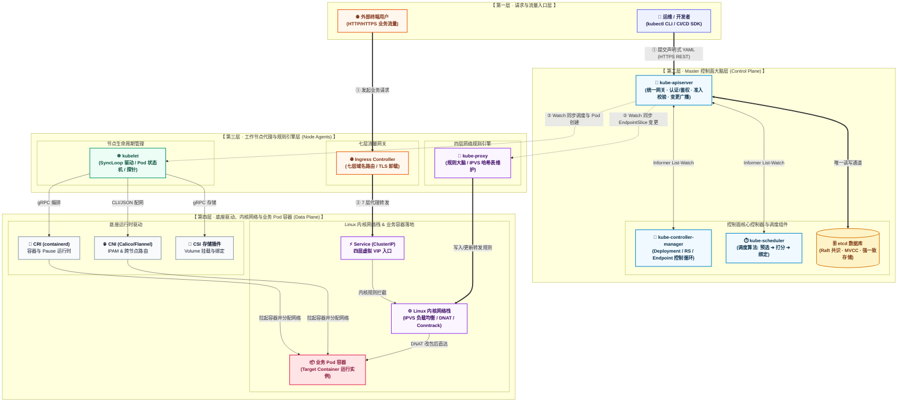
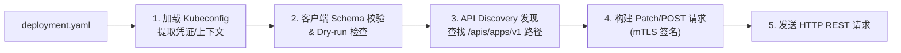
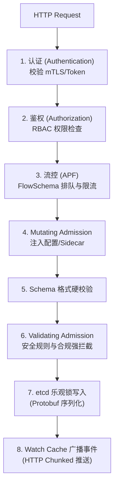
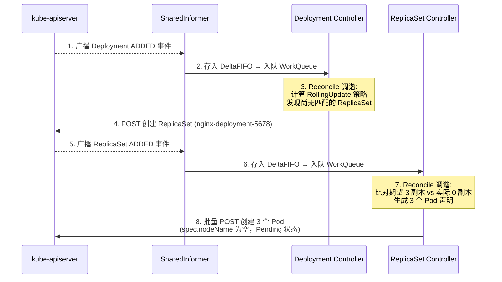
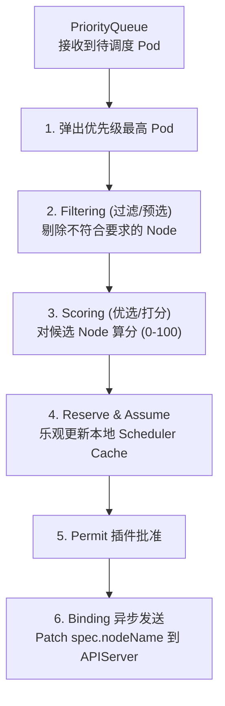
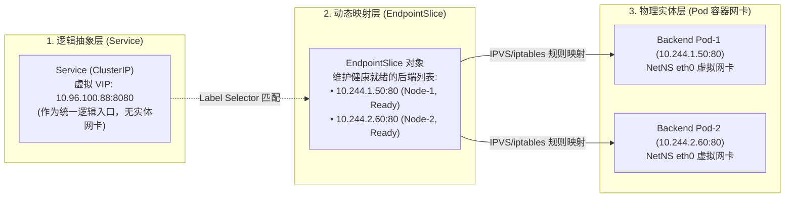
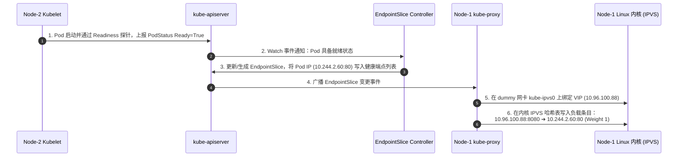
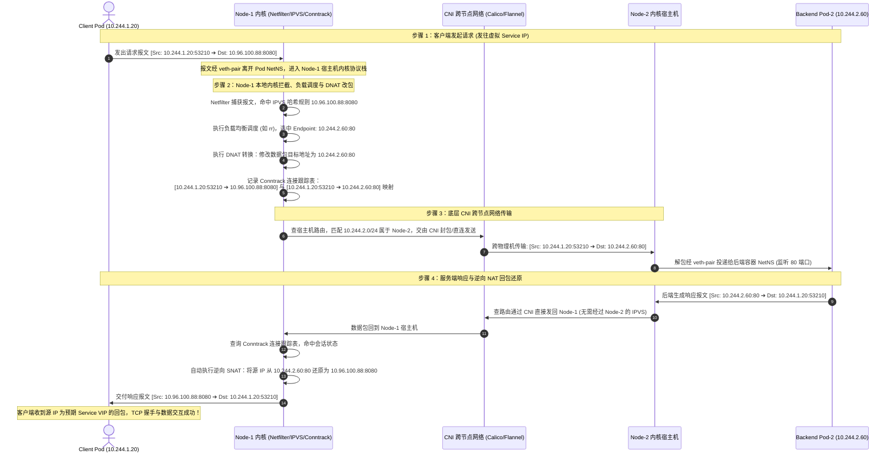
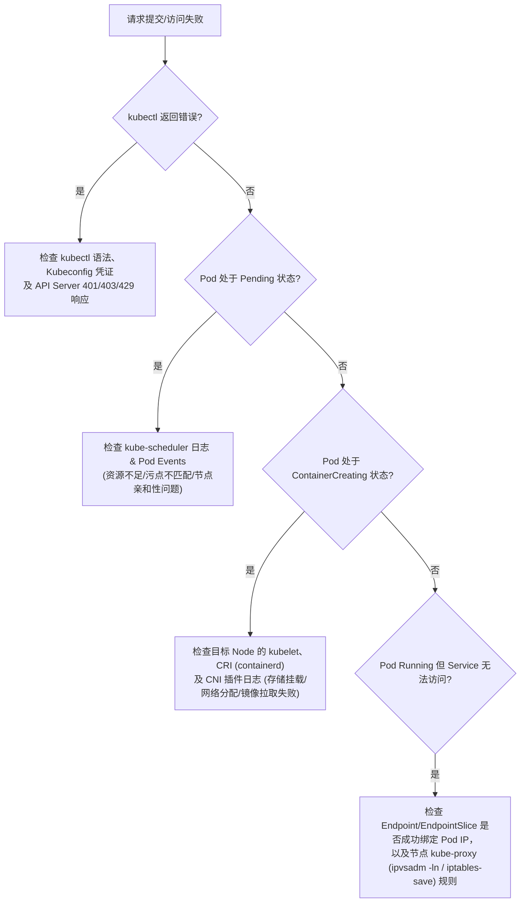

# 🔄 Kubernetes 请求在各组件间流转的详细流程

> 本文档深入拆解 Kubernetes 集群中**声明式控制面请求**与**数据面流量请求**的全生命周期流转过程，详细描述请求在每个组件中所经历的阶段、内部处理逻辑，以及对集群状态与后续组件产生的作用与影响。

---

## 一、 全景视角：请求流转的双重维度

在 Kubernetes 中，“请求”分为两个完全不同的维度：

1. **控制面请求流转（Control Plane Flow）**：指用户或自动化工具提交声明式 YAML（如 `kubectl apply -f deployment.yaml`）到集群，从 API 校验、持久化、层层控制调谐、调度到最终在工作节点拉起容器的完整闭环。
2. **数据面/流量面请求流转（Data Plane Flow）**：指业务流量（如公网 HTTP 请求或集群内部 Pod 间 RPC 调用）在 DNS、Ingress、Service、kube-proxy 和 CNI 网络设备之间的转发过程。



---

## 二、 控制面请求流转：从 YAML 到容器落地

以用户执行 `kubectl apply -f deployment.yaml` 创建 3 副本 Nginx 为例，整个请求在各组件间经历 **5 大阶段、20 余个子步骤** 的精确流转。

---

### 阶段一：客户端处理 (kubectl)



#### 组件内部经历与作用影响：
1. **加载 Kubeconfig**：读取 `~/.kube/config`，解析集群地址（`cluster.server`）、用户凭证（客户端 mTLS 证书/Token）及上下文信息。
2. **本地 Schema 校验**：解析 YAML 文件，校验字段语法与结构是否符合 OpenAPI 规范（如检查 `replicas` 是否为整数）。
3. **API Path 发现 (Discovery)**：查询本地缓存（`~/.kube/cache/discovery/`）或向 API Server 发起 discovery 请求，确认 `Deployment` 资源属于 `apps/v1` API 组，确定目标 URL 路径为 `/apis/apps/v1/namespaces/default/deployments`。
4. **服务端应用 (Server-Side Apply / Patch)**：构造带有 `application/apply-patch+yaml` Header 的 PATCH 请求，附带客户端身份签名。
5. **作用与影响**：将用户易读的声明式 YAML 转换为合规的 HTTP REST 报文，并建立安全的 mTLS 连接发往 `kube-apiserver`。

---

### 阶段二：API Server 安全管线与持久化 (kube-apiserver)

HTTP 请求到达 `kube-apiserver` 后，依次通过 **8 大拦截关卡**：



#### 各关卡的经历与作用影响：

| 序号 | 步骤/关卡 | 内部逻辑与经历 | 作用与影响 |
| :--- | :--- | :--- | :--- |
| 1 | **Authentication (认证)** | 提取客户端证书/Token，通过 CA 根证书验证合法性，解析得到 `user.Info`（包含 Username, Groups）。 | 确认“请求者是谁”，非法身份直接抛出 `401 Unauthorized`。 |
| 2 | **Authorization (鉴权)** | RBAC 模块对比 Subject、Verb (`patch`/`create`) 和 Resource (`deployments`)，检查 Role/ClusterRole 授权。 | 确认“是否有权限操作”，无权抛出 `403 Forbidden`。 |
| 3 | **APF 流控与排队** | 根据请求者身份匹配 `FlowSchema`，归入对应的 `PriorityLevelConfiguration` 并发队列。 | 防止大流量突发拖垮 API Server，保障心跳与控制面高优流量。 |
| 4 | **Mutating Webhook** | 触发修改型准入控制器（如 Istio 注入器、默认配置填充）。 | **可修改对象内容**：自动补充默认 `strategy`、`selector` 或注入 Sidecar。 |
| 5 | **Schema 硬校验** | 校验字段是否缺失、类型是否合法、标签选择器与 Pod 模板 Label 是否匹配。 | 确保对象的结构符合 K8S 规范。 |
| 6 | **Validating Webhook** | 触发校验型准入控制器（如 OPA/Gatekeeper，校验镜像是否来自私有仓库）。 | **仅校验不修改**：若违背安全规则，拒绝请求并抛出错误。 |
| 7 | **etcd 乐观并发控制与写入** | 校验对象的 `resourceVersion`，防止并发冲突；以 Protobuf 格式序列化，写入 etcd 的 `/registry/deployments/default/nginx-deployment` 键下。 | **数据正式落盘**，生成全新的 `resourceVersion`。 |
| 8 | **Watch 机制广播** | 写入成功后，API Server 的 Watch Cache 捕捉变更，向所有订阅了该资源的组件（如 KCM）通过 HTTP 长连接广播 `ADDED` 事件。 | 驱动整个分布式系统的事件响应链条。 |

---

### 阶段三：控制面控制器调谐 (kube-controller-manager)

`kube-controller-manager` 内部运行着数十个独立控制器。Deployment 的创建会触发 **Deployment Controller** 与 **ReplicaSet Controller** 的级联调谐。



#### 各控制器的经历与作用影响：
1. **Deployment Controller**：
   - 从 WorkQueue 中出队该 Deployment 的 Key (`default/nginx-deployment`)。
   - 提取对象最新状态，计算 Hash 值（如 `5678`）。
   - 检查是否存在对应的 ReplicaSet；若无，构建一个 `ReplicaSet` 对象（`nginx-deployment-5678`），设置其 `spec.replicas = 3`，并在 OwnerReferences 中指向该 Deployment。
   - 向 API Server 发送 `POST /apis/apps/v1/namespaces/default/replicasets` 请求。
2. **ReplicaSet Controller**：
   - 监听到新 ReplicaSet 创建后入队处理。
   - 通过 Label Selector 检索当前集群中属于该 RS 的 Pod 数量（当前为 0）。
   - 比对期望副本数 3 与实际副本数 0，发现差额为 +3。
   - 循环 3 次，构造 3 个 Pod 对象声明：
     - 生成 Pod 名（如 `nginx-deployment-5678-abc1`）。
     - `spec.nodeName` 留空。
     - 状态设置为 `Pending`。
     - OwnerReferences 指向该 ReplicaSet。
   - 批量向 API Server 发送 `POST /api/v1/namespaces/default/pods` 请求。
3. **作用与影响**：将高层级的 Deployment 抽象一步步拆解降维，转化为具体的 Pod 资源声明落地 etcd，等待调度。

---

### 阶段四：调度器决策与绑定 (kube-scheduler)

`kube-scheduler` 专门负责监听 `spec.nodeName` 为空的 Pod，并决定将其安放在哪台工作节点上。



#### 组件内部经历与作用影响：

```text
Pod (nginx-deployment-5678-abc1) 进入 Scheduler 调度主循环

  ┌────────────────────────────────────────────────────────────────────────┐
  │ 步骤 1: Filtering (过滤 / 预选阶段)                                   │
  │   并发运行全量预选插件:                                               │
  │   - NodeResourcesFit: 检查 Node CPU/Memory requests 是否足够          │
  │   - NodeName / NodeSelector: 匹配节点标签                             │
  │   - PodToleratesNodeTaints: 检查 Node 污点与 Pod 容忍度               │
  │   - VolumeBinding: 检查存储 PV 是否可在该 Node 绑定                   │
  │   结果: 4 台 Node 中过滤掉 1 台 (资源不足)，剩余 Node-1, Node-2, Node-3  │
  └────────────────────────────────────────────────────────────────────────┘
                                      │
                                      ▼
  ┌────────────────────────────────────────────────────────────────────────┐
  │ 步骤 2: Scoring (打分 / 优选阶段)                                     │
  │   并发运行优选插件进行 0~100 分打分并按权重加权求和:                     │
  │   - LeastRequestedPriority: 资源剩余最多的 Node 得分高 (打散原则)    │
  │   - BalancedResourceAllocation: CPU/内存利用率平衡的得分高            │
  │   - ImageLocalityPriority: 已存在所需镜像的 Node 得分高               │
  │   结果: Node-1 (85分), Node-2 (92分), Node-3 (78分) → 选中 Node-2      │
  └────────────────────────────────────────────────────────────────────────┘
                                      │
                                      ▼
  ┌────────────────────────────────────────────────────────────────────────┐
  │ 步骤 3: Reserve & Assume (乐观绑定)                                    │
  │   为了极大提升调度吞吐量，Scheduler 不等 Bind 结果返回，直接在内存      │
  │   Scheduler Cache 中将该 Pod 预扣到 Node-2 上。                       │
  └────────────────────────────────────────────────────────────────────────┘
                                      │
                                      ▼
  ┌────────────────────────────────────────────────────────────────────────┐
  │ 步骤 4: Binding (正式绑定)                                            │
  │   启动 Goroutine 异步向 API Server 发起 Binding 请求:                   │
  │   POST /api/v1/namespaces/default/pods/nginx-.../binding              │
  │   Body: { target: { name: "Node-2" } }                                │
  │                                                                        │
  │   API Server 接收后，更新 etcd 中该 Pod 的 spec.nodeName = "Node-2"   │
  │   并通过 Watch 广播该 MODIFIED 事件。                                  │
  └────────────────────────────────────────────────────────────────────────┘
```

> [!IMPORTANT]
> **作用与影响**：调度器完成了 Pod 与物理/虚拟节点的映射决策。一旦 `spec.nodeName` 被填入，主控制面的工作基本完成，接力棒交给目标节点上的 `kubelet`。

---

### 阶段五：工作节点物理拉起与容器落地 (kubelet & Runtimes)

目标工作节点 Node-2 上的 `kubelet` 通过 Watch 监听到归属于自己的 Pod 调度事件，开启**物理落地过程**。

```mermaid
sequenceDiagram
    participant APIServer as kube-apiserver
    participant Kubelet as kubelet (Node-2)
    participant CSI as CSI Driver / Storage
    participant CRI as CRI (containerd)
    participant CNI as CNI Plugin (Calico)

    APIServer-->>Kubelet: 1. Watch 广播 Pod 调度至 Node-2
    Note over Kubelet: 2. PLEG & SyncLoop 触发 syncPod
    Kubelet->>CSI: 3. VolumeManager 执行 Mount 存储卷
    Kubelet->>CRI: 4. RunPodSandbox() 创建 Sandbox
    Note over CRI: 启动 pause 容器<br/>创建物理 Network Namespace
    CRI->>CNI: 5. CmdADD 配置 Pod 网络
    Note over CNI: 分配 Pod IP (10.244.2.5)<br/>创建 Veth-Pair 移入 NetNS<br/>配置宿主机路由/网桥
    Kubelet->>CRI: 6. PullImage() 拉取业务镜像
    Kubelet->>CRI: 7. CreateContainer() & StartContainer()
    Note over CRI: 依次运行 Init 容器<br/>并行拉起 Nginx 应用容器
    Kubelet->>APIServer: 8. 上报 Pod 状态为 Running & Ready
```



#### 组件内部经历与作用影响：

1. **Informer & SyncLoop 接收**：Node-2 的 `kubelet` 监听到 Pod 的 `spec.nodeName == "Node-2"`，将事件压入 `podWorkers` 队列，针对该 Pod 启动 `syncPod` 调谐协程。
2. **Volume Manager 挂载**：
   - 检查 Pod 声明的 Volume。
   - 若涉及远程块存储，确认 Master 端的 `AttachDetachController` 已完成 Attach 阶段（将云盘挂载至宿主机 `/dev/sdb`）。
   - `kubelet` 在本地执行格式化并挂载至 `/var/lib/kubelet/pods/<pod-uid>/volumes/...`。
3. **CRI: 创建 Pod Sandbox (Pause 容器)**：
   - `kubelet` 通过 gRPC UNIX Socket 调用 containerd 的 `RunPodSandbox`。
   - containerd 调用 runC 拉起一个 `pause` 容器。
   - `pause` 容器启动并挂起，为 Pod 创建并持有独立的 **Linux Network Namespace** 和 IPC/UTS Namespace。
4. **CNI: 配置容器网络网络栈**：
   - containerd 调用 CNI 插件（如 Calico/Flannel），传入 `CmdADD` 指令及 NetNS 路径。
   - CNI 依赖 IPAM 分配一个可用 Pod IP（如 `10.244.2.5`）。
   - 创建一对 **Veth-Pair**，一端塞入 `pause` 容器的 NetNS 并重命名为 `eth0`，另一端留在宿主机并挂载到网桥或配置三层路由。
5. **CRI: 启动容器链**：
   - **拉取镜像**：调用 `ImageService.PullImage` 下载镜像。
   - **启动 Init 容器**：如果有 Init 容器，按顺序**串行**调用 `CreateContainer` 和 `StartContainer`，直到全部以 exit code 0 退出。
   - **启动应用容器**：调用 `CreateContainer`，将应用容器的 Namespace 共享关联到 `pause` 容器的网络栈，最后调用 `StartContainer` 启动 Nginx 主进程。
6. **健康检查与状态上报**：
   - `kubelet` 的 Probe Manager 启动 Startup、Liveness 和 Readiness 探针。
   - 当 Readiness 探针通过后，`kubelet` 构造 PodStatus，向 API Server 发起 `status` 更新请求，将 Pod 状态修改为 `Running`，`Conditions: Ready=True`。

---

## 三、 数据面/流量面请求流转：Service IP ➔ Endpoint IP ➔ Pod 全链路网络流转

当 Pod 物理落地并变为 `Ready` 状态后，客户端对 Service 的请求是如何一步步精准找到并送达后端具体 Pod 的？这一过程涉及 **“控制面映射预置”** 与 **“数据面内核转发与反向 NAT”** 的精密配合。

---

### 1. 核心概念三位一体：Service VIP、Endpoint 与 Pod IP 的定位与关系



| 实体名称 | 本质属性 | 所在空间 | 核心作用 |
| :--- | :--- | :--- | :--- |
| **Service IP (ClusterIP)** | 虚拟 IP (VIP) | 逻辑概念（IPVS 模式下绑在 `kube-ipvs0` 虚拟 Dummy 网卡，iptables 模式下甚至无网卡） | 作为微服务的稳定访问端点，屏蔽后端 Pod 频繁销毁重建造成的 IP 漂移。 |
| **Endpoint / EndpointSlice** | Kubernetes 核心资源对象 | 控制面 APIServer / etcd | 动态维护与 Service Selector 匹配的所有**健康且就绪（Ready）**的后端 Pod IP 列表，是控制面与数据面的桥梁。 |
| **Pod IP** | 真实容器 IP | Linux 容器 NetNS (`eth0`) | 业务容器真正绑定的网络实体地址，通过 `veth-pair` 接入宿主机网络或 CNI 网桥。 |

---

### 2. 第一阶段：控制面映射准备（Service VIP ➔ Endpoints 绑定与内核规则下发）

在任何业务数据包发出之前，控制面早已完成流量通道的预置：



---

### 3. 第二阶段：数据面端到端网络数据包流转（4 步完整时序）

当客户端 Pod（位于 `Node-1`，IP: `10.244.1.20`）向 `user-service`（ClusterIP: `10.96.100.88:8080`）发起请求，且被内核负载均衡选中远端 `Node-2` 上的 `user-pod-2`（`10.244.2.60:80`）时，其全链路数据流转如下：



---

### 4. 数据包端到端地址变换对照表

| 阶段 / 链路节点 | 数据包源地址 (Src IP:Port) | 数据包目的地址 (Dst IP:Port) | 核心动作说明 | 关键模块 |
| :--- | :--- | :--- | :--- | :--- |
| **① 客户端 Pod 发出** | `10.244.1.20:53210` | `10.96.100.88:8080` | 客户端向虚拟 Service IP 发起连接 | Client NetNS (`veth`) |
| **② Node-1 内核处理后** | `10.244.1.20:53210` | **`10.244.2.60:80`** | **DNAT 目标地址转换**：改写目的 IP 为选中的 Endpoint IP，并登记 Conntrack | Linux Netfilter / IPVS |
| **③ CNI 跨节点传输** | `10.244.1.20:53210` | `10.244.2.60:80` | 跨宿主机路由/隧道传输，保留客户端真实源 IP | CNI (Calico/Flannel) |
| **④ 服务端 Pod 接收并响应** | `10.244.2.60:80` | `10.244.1.20:53210` | 服务端容器处理请求，将响应发往客户端 Pod IP | Backend Pod NetNS |
| **⑤ Node-1 内核逆向还原** | **`10.96.100.88:8080`** | `10.244.1.20:53210` | **逆向 NAT 转换**：查 Conntrack 记录将源 IP 还原为 Service VIP | Linux Netfilter / Conntrack |
| **⑥ 客户端 Pod 接收** | `10.96.100.88:8080` | `10.244.1.20:53210` | 客户端收到源地址合法的回包，正常完成通信 | Client NetNS |

---

### 5. 核心底层认知与避坑深度总结

1. **为什么 ClusterIP 无法直接 `ping` 通？**
   * Service ClusterIP 是一个仅存在于 Linux 内核 Netfilter / IPVS 规则表中的**逻辑 VIP**，默认不会响应 ICMP Echo 请求（除非部署了特定 CNI 拦截 ICMP），它只在四层协议（TCP/UDP/SCTP）的数据包经过 Netfilter PREROUTING/OUTPUT 链时才触发 DNAT 改包转发。
2. **Conntrack 连接跟踪表的决定性作用（为什么必须逆向 NAT？）**
   * 客户端在向 `10.96.100.88:8080` 发起 TCP 连接时，客户端协议栈**只等待来自 `10.96.100.88:8080` 的回包**。
   * 如果 Node-1 在回包时没有经过 Conntrack 将源 IP 从 `10.244.2.60:80` 还原为 `10.96.100.88:8080`，客户端协议栈会判定这是一个未知的非法报文，直接发送 `TCP RST` 中断连接。
3. **EndpointSlice 相较于 Endpoints 的架构演进**：
   * 旧版 `Endpoints` 对象将某个 Service 的所有后端 Pod IP 塞入同一个资源对象中。当后端 Pod 达到数百上千个时，单个 Pod 状态变更就会导致整个巨大对象的全量序列化与集群广播（$O(N^2)$ 复杂度），极易冲垮 APIServer 与 etcd。
   * 新版 `EndpointSlice`（默认开启）将一个 Service 的端点按每 100 个拆分为一个 Slice 分片，增删 Pod 时仅需局部增量更新单个 Slice，大幅降低了控制面与 kube-proxy 的网络与 CPU 开销。

---

## 四、 各组件在请求流转中的对比矩阵

| 组件名称 | 接收的输入 (Input) | 组件内部核心经历与算法 | 产生的输出 (Output) / 作用与影响 | 通信协议与方式 |
| :--- | :--- | :--- | :--- | :--- |
| **kubectl** | 用户 YAML / CLI 指令 | 语法解析、 Schema 校验、API Discovery 发现 | 发送合规的 HTTP REST 报文 | HTTPS REST (mTLS) |
| **kube-apiserver** | 客户端 HTTP 报文 | AuthN → AuthZ → APF → Mutating → Validating → etcd 写入 | 序列化存入 etcd，并向全集群 Watcher 广播事件 | HTTPS / gRPC (etcd) |
| **etcd** | API Server 的 Protobuf 数据 | Raft 共识日志复制、B+ 树磁盘写入 | 持久化集群状态，提供强一致视图 | gRPC |
| **kube-controller-manager** | API Server 广播的事件 | Informer (DeltaFIFO -> WorkQueue) 调谐循环，比对期望 vs 实际状态 | 向 API Server 提交下一级资源声明（如 RS、Pod） | HTTP List-Watch & REST |
| **kube-scheduler** | 未调度的 Pod 声明 | 过滤 (Filtering) 剔除不合格 Node，打分 (Scoring) 算最高分 Node | 发送 Binding 请求，将 `spec.nodeName` 写入 Pod | HTTP List-Watch & REST |
| **kubelet** | 调度到本节点的 Pod 事件 | VolumeManager 挂载、PLEG 状态检测、调用 CRI/CNI 编排 | 驱动本地容器运行，向 API Server 汇报 PodStatus | HTTP List-Watch & gRPC (CRI) |
| **CRI (containerd)** | `kubelet` 的 gRPC 请求 | 调用 runC 创建底层 Namespace/cgroups，拉取镜像管理容器 | 运行 `pause` 及业务应用容器 | UNIX Domain Socket (gRPC) |
| **CNI (Calico/Flannel)** | CRI 传入的 NetNS 及配置 | IPAM 分配 IP，创建 Veth-Pair，配置网桥与路由表 | 赋予 Pod 网络通信能力 (Pod IP) | CLI / JSON (stdin) |
| **kube-proxy** | Service/Endpoint 变更事件 | 维护节点内核网络规则表 (iptables / IPVS 哈希表) | 驱动 Linux 内核实现 Service 的 DNAT 与负载均衡 | HTTP List-Watch & Netlink/IPVS |

---

## 五、 全流程排障与断点定位指南

当请求流转阻塞时，可通过下表快速定位故障发生在哪个组件：



1. **阻塞在 API Server**：查看 `kube-apiserver` 日志与审计日志，重点排查 Webhook 超时拒绝或 RBAC 权限不足。
2. **Pod 停留在 Pending**：执行 `kubectl describe pod <pod-name>` 查看 `Events`。若显示 `0/N nodes are available`，说明卡在 **kube-scheduler** 阶段（预选失败）。
3. **Pod 停留在 ContainerCreating**：检查目标节点 `journalctl -u kubelet` 或 containerd 日志，通常卡在 **CSI 存储挂载**、**CNI 分配 IP** 或 **CRI 镜像拉取**。
4. **Pod 处于 CrashLoopBackOff**：说明 Pod 已成功调度落地，但业务容器启动后异常退出，查看 `kubectl logs <pod-name>` 诊断业务问题。
5. **服务能连通 Pod IP 但无法连通 Service ClusterIP**：说明控制面落地正常，卡在数据面。重点检查 `kube-proxy` 状态及节点 `ipvsadm -ln` 规则。

---

> [!TIP] 💡 关联技术与延伸阅读
>
> * [Kubernetes 组件通信模型与架构概览](./00-组件通信与原理概述.md)
> * [kube-apiserver 认证与准入流程](./01-API_Server.md)
> * [kube-scheduler 调度决策过程](./03-Scheduler.md)
> * [Kubelet Pod 实际创建与 CRI/CNI/CSI 驱动](./04-Kubelet.md)
