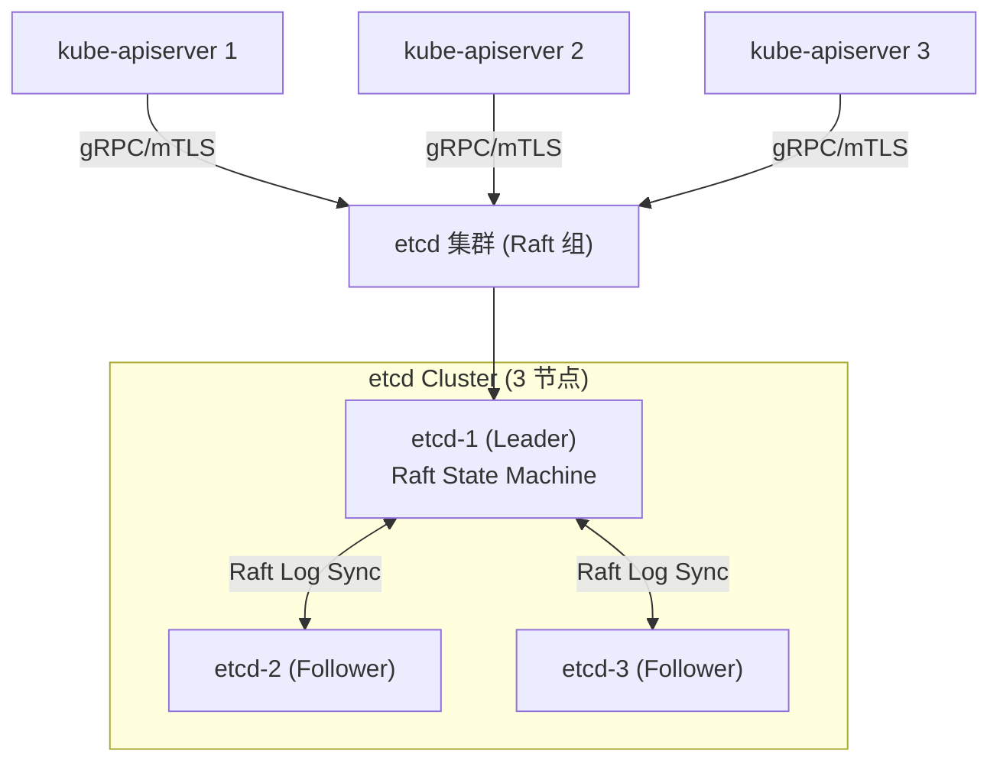
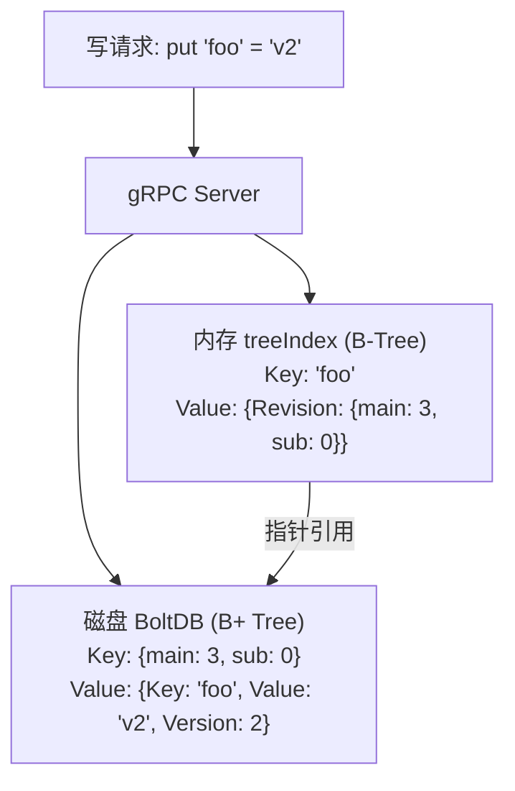
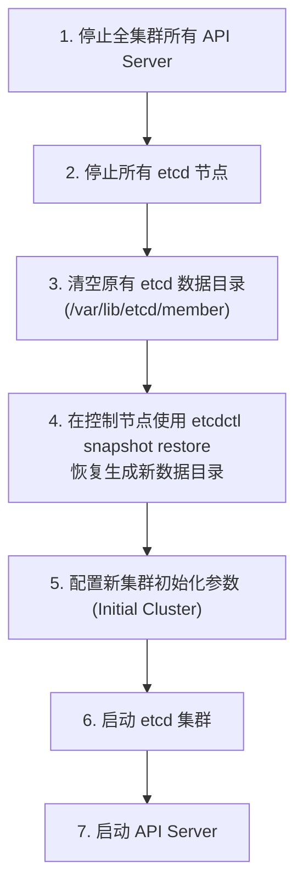
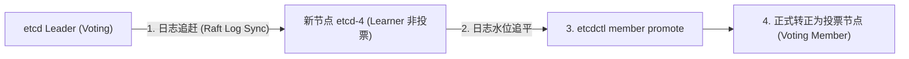
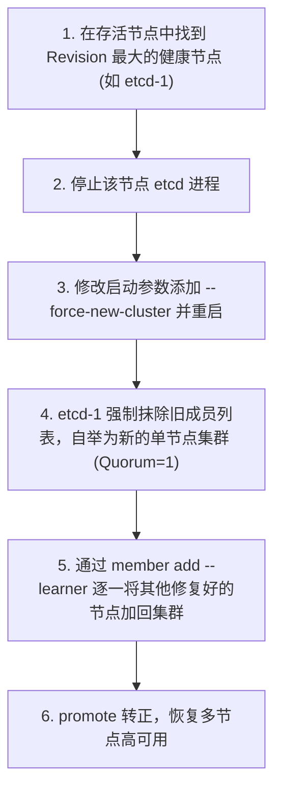

# 🗄️ etcd 底层架构、MVCC 机制与高可用运维实战指南

> 本文档面向高级 Kubernetes 工程师与云原生架构师，深入剖析 etcd 的 Raft 共识算法、MVCC 存储引擎、B+ 树底层实现，以及生产级高可用运维与脑裂救援 SOP。

---

## 目录
- [一、 etcd 在 Kubernetes 中的角色与全局架构](#一-etcd-在-kubernetes-中的角色与全局架构)
- [二、 Raft 共识算法原理与异常处理](#二-raft-共识算法原理与异常处理)
- [三、 底层存储引擎：MVCC 与 Boltdb 双层结构](#三-底层存储引擎mvcc-与-boltdb-双层结构)
- [四、 读写请求的高性能流转路径](#四-读写请求的高性能流转路径)
- [五、 生产级高可用运维与灾难救援 SOP](#五-生产级高可用运维与灾难救援-sop)
- [六、 etcd 集群零宕机滚动升级、Learner 机制与 Quorum 丢失救援](#六-etcd-集群零宕机滚动升级learner-机制与-quorum-丢失救援)

---

## 一、 etcd 在 Kubernetes 中的角色与全局架构

etcd 是 Kubernetes 集群中**唯一的强一致性分布式 KV 存储**，持久化保存集群所有的状态数据（Pod、Service、CRD 等）。



> [!IMPORTANT]
> **设计原则**：
> - **API Server 独占**：整个 Kubernetes 集群中，**只有 `kube-apiserver` 拥有读写 etcd 的权限**，其他所有组件（kubelet、scheduler、controller-manager）必须通过 API Server 进行代理访问。
> - **奇数节点部署**：为了满足 Raft 容错机制（可容忍 $(N-1)/2$ 个节点故障），生产环境必须部署奇数个节点（3、5 或 7）。

---

## 二、 Raft 共识算法原理与异常处理

Raft 协议保证了 etcd 的强一致性（Linearizable Consistency）。

### 2.1 三大核心机制

1. **Leader 选举 (Leader Election)**：
   - 节点有三种状态：`Follower`、`Candidate`、`Leader`。
   - 若 Follower 在随机心跳超时时间（Election Timeout，通常 150ms~300ms）内未收到 Leader 心跳，转为 Candidate 发起选举，获得超过半数 ($\lfloor N/2 \rfloor + 1$) 选票后升级为 Leader。
2. **日志复制 (Log Replication)**：
   - 所有的写请求统一由 Leader 处理。Leader 将请求追加为本地 `uncommitted` 日志，并并发广播给 Followers。
   - 当超过半数节点响应 ACK 后，Leader 提交（Commit）该日志，应用到状态机（State Machine），并回复客户端。
3. **安全性 (Safety)**：
   - 只有拥有全量最新已提交日志的节点，才有资格被选为 Leader。

### 2.2 网络分区与脑裂防护

当发生网络分区（如 5 节点集群划分为 3 节点与 2 节点两个子网）：

```text
[节点 A, 节点 B, 节点 C] (多数派, 3节点)   <--- 网络断开 --->   [节点 D (原Leader), 节点 E] (少数派, 2节点)
       │                                                                  │
  获得 3/5 选票                                                     无法获得 > 2.5 选票
  重新选出新 Leader                                                所有写请求挂起/失败
  正常提供读写服务                                                  彻底拒绝写入 (防脑裂)
```

- **少数派区域（2 节点）**：由于无法凑够半数选票（需要 3 票），写请求无法 Commit，直接拒绝服务，**防止数据脑裂 (Split-Brain)**。
- **分区恢复**：网络恢复后，少数派节点以新 Leader 的 Term 和 Log 为准，覆盖冲突日志，实现数据恢复。

---

## 三、 底层存储引擎：MVCC 与 Boltdb 双层结构

etcd 底层由**内存树状索引 (treeIndex)** 与 **磁盘 KV 存储 (boltdb)** 双层结构组成：



### 3.1 内存索引 (treeIndex)
- 基于内存中的 B-Tree 数据结构。
- 维护用户用户定义的 Key（如 `/registry/pods/default/pod-a`）到 **Revision（版本号）** 的映射。
- **好处**：极速的范围查询与前缀匹配；检索不需要扫描全表磁盘。

### 3.2 磁盘存储 (boltdb)
- boltdb 是基于 **B+ 树** 和 **mmap (内存映射)** 的内嵌 KV 数据库。
- 磁盘存储中保存的 Key 不是用户的原始 Key，而是 **Revision 数据包**（格式如 `main_revision.sub_revision`）。
- **MVCC 特性**：每次修改操作，`main_revision` 递增。旧版本数据**不会被覆盖**，而是作为新条目顺序追加写入。删除操作也是追加一条带 `tombstone` 标记的写记录。

> [!NOTE]
> **MVCC 的优势**：
> 1. **实现乐观并发控制**：API Server 的 `resourceVersion` 对应 etcd 的 Revision。写操作如果 Revision 冲突则拒绝，避免加锁消耗。
> 2. **高效的 Watch 机制**：客户端可以从指定 Revision 开始追溯历史变更事件。

---

## 四、 读写请求的高性能流转路径

### 4.1 写请求流转路径 (Write Path)
```text
客户端 (API Server) 发起 put 请求
   │
   ▼
1. Leader 节点 gRPC 接口接收请求
   │
   ▼
2. 生成新的 Revision (main + 1)
   │
   ▼
3. 写入 WAL (Write-Ahead Log) 预写日志并 sync 到磁盘 (持久化防护)
   │
   ▼
4. 通过 Raft 协议并发广播 Entry 到 Followers
   │
   ▼
5. 超过半数 Follower 响应 ACK 成功
   │
   ▼
6. Leader Commit 提交该日志
   │
   ▼
7. 写入内存 treeIndex 并批量异步 Flush 到 BoltDB
   │
   ▼
8. 向 API Server 返回成功响应
```

### 4.2 读请求优化：ReadIndex & LeaseRead

传统的分布式数据库读请求如果经过 Raft，每次都需要走一次日志复制，性能极低。etcd 实现了两种极速线性读优化：

1. **ReadIndex**：
   - 读请求到达后，Leader 纪录当前的 `CommitIndex` (称为 `ReadIndex`)。
   - 向集群 Followers 发送一轮心跳确认自己仍是合法 Leader（无需复制日志）。
   - 确认身份后，等待本地状态机 apply 到 `ReadIndex`，直接读取本地 boltdb 返回。
2. **LeaseRead**：
   - 基于时间租约。Leader 获得选举后在租约时间内（如 500ms）确信不会有新 Leader 产生，直接从本地读取返回，**零网络 RPC 开销**。

---

## 五、 生产级高可用运维与灾难救援 SOP

### 5.1 生产级备份策略 (etcdctl Snapshot)

必须建立定时 CronJob 任务，每小时进行物理快照备份：

```bash
#!/bin/bash
# etcd 自动快照备份脚本
BACKUP_DIR="/data/etcd_backup"
DATE=$(date +%Y%m%d_%H%M%S)
export ETCDCTL_API=3

mkdir -p $BACKUP_DIR

etcdctl --cacert=/etc/kubernetes/pki/etcd/ca.crt \
        --cert=/etc/kubernetes/pki/etcd/server.crt \
        --key=/etc/kubernetes/pki/etcd/server.key \
        --endpoints=https://127.0.0.1:2379 \
        snapshot save ${BACKUP_DIR}/etcd-snapshot-${DATE}.db

# 检查备份完整性
etcdctl --write-out=table snapshot status ${BACKUP_DIR}/etcd-snapshot-${DATE}.db

# 保留最近 7 天的备份
find $BACKUP_DIR -name "etcd-snapshot-*.db" -mtime +7 -delete
```

---

### 5.2 etcd 碎片整理 (Defrag) 与压缩 (Compaction)

由于 MVCC 机制，即使删除了对象，boltdb 占用的磁盘文件空间也不会自动释放（产生空闲页/碎片）。

```bash
export ETCDCTL_API=3
CERTS="--cacert=/etc/kubernetes/pki/etcd/ca.crt --cert=/etc/kubernetes/pki/etcd/server.crt --key=/etc/kubernetes/pki/etcd/server.key"

# 1. 查询当前 Revision 历史版本
REV=$(etcdctl $CERTS --endpoints=https://127.0.0.1:2379 endpoint status --write-out="json" | grep -o '"revision":[^,]*' | awk -F':' '{print $2}')

# 2. 压缩历史版本 (释放逻辑旧版本数据)
etcdctl $CERTS --endpoints=https://127.0.0.1:2379 compact $REV

# 3. 整理磁盘碎片 (回收物理磁盘空间，逐台节点执行)
etcdctl $CERTS --endpoints=https://127.0.0.1:2379 defrag
```

---

### 5.3 灾难救援 SOP：从快照恢复全崩溃集群

若 etcd 多数派节点物理损坏或数据彻底损坏，按以下步骤恢复集群：



#### 恢复具体指令

在控制节点执行快照恢复命令，重建初始单节点/多节点：

```bash
export ETCDCTL_API=3

# 在 master-1 上恢复
etcdctl snapshot restore /data/etcd_backup/etcd-snapshot-latest.db \
  --name=master-1 \
  --initial-cluster=master-1=https://192.168.1.10:2380 \
  --initial-cluster-token=etcd-cluster-token \
  --initial-advertise-peer-urls=https://192.168.1.10:2380 \
  --data-dir=/var/lib/etcd

# 将生成的 /var/lib/etcd 覆盖对应目录，启动 etcd 容器，最后恢复 API Server。
```

---

## 六、 etcd 集群零宕机滚动升级、Learner 机制与 Quorum 丢失救援

### 1. etcd 跨版本逐级平滑升级规范

etcd 跨版本升级存在严格的协议与数据格式演进（如 WAL 格式与 Raft RPC 编解码），必须遵循以下生产红线：

```text
3.4.x ────────▶ 3.5.x ────────▶ 3.6.x (允许)
3.4.x ────────────────────────▶ 3.6.x (💥 严禁跨次级版本直接升级)
```

#### 单节点轮转升级 SOP：
1. **升级前物理快照备份**：在当前 Leader 节点执行 `etcdctl snapshot save`。
2. **逐台单节点轮转 (One by One)**：
   * 停止节点 1 的 etcd 进程；
   * 替换 etcd 二进制文件或更新 Static Pod 镜像 tag；
   * 启动节点 1 并通过 `etcdctl endpoint health` 确认其状态为 `healthy` 且日志同步追平；
   * **严禁同时升级两台节点**，必须确保集群在整个升级期间始终满足 Quorum 法定多数（$\lfloor N/2 \rfloor + 1$）。
3. **版本锁定与升级不可逆性**：一旦集群所有节点升级至新版本并完成数据格式更新（如 3.5 启用了新的事务特性），数据文件通常不可逆降级，回滚只能依赖升级前快照。

---

### 2. 非投票 Learner 节点机制与安全无损扩容

在 etcd 3.4 之前，直接通过 `etcdctl member add` 添加新节点时，新节点立即被计入 Quorum 计算分母中。若新节点网络不通或同步大量历史 WAL 耗时过长，集群会因为 Quorum 阈值提高而极易触发仲裁丢失。

#### Learner 角色机制：
* **只读同步，不参与投票**：Learner 节点接收 Leader 同步的日志与快照，但不计入 Raft 选票和 Commit Quorum 中。
* **零风险追赶**：即使 Learner 挂掉或同步缓慢，绝对不会影响现有集群的可用性。



#### 生产标准扩容命令：
```bash
export ETCDCTL_API=3
CERTS="--cacert=/etc/kubernetes/pki/etcd/ca.crt --cert=/etc/kubernetes/pki/etcd/server.crt --key=/etc/kubernetes/pki/etcd/server.key"

# 1. 以 Learner 身份安全添加新成员
etcdctl $CERTS member add etcd-node-4 --peer-urls=https://192.168.1.13:2380 --learner

# 2. 启动 etcd-node-4 节点服务，等待日志同步

# 3. 检查同步状态，确认 Learner 已追平
etcdctl $CERTS endpoint status --write-out=table

# 4. 将 Learner 提升为正式投票节点
etcdctl $CERTS member promote <member-id-of-etcd-4>
```

---

### 3. Quorum 仲裁丢失（过半宕机）紧急救援 SOP

当 3 节点集群挂掉 2 台，或 5 节点集群挂掉 3 台时，etcd 集群陷入**仲裁丢失 (Quorum Loss)** 状态，所有写请求挂起拒绝服务。

#### 救援方案 A：`--force-new-cluster` 单节点自举重构（无需全量停机还原）
适用于：尚存 1 台拥有最新数据的节点，希望以最快速度恢复写入并在线扩容。



#### 救援方案 B：从快照重建全新集群
适用于：所有节点数据均损坏或逻辑数据被恶意篡改。
* 停止所有 API Server。
* 在每台 Master 节点上使用 `etcdctl snapshot restore` 生成新的独立数据目录并指定相同的 `initial-cluster-token`。
* 同时拉起所有 etcd 节点重新组网。

---

### 4. etcd 升级与运维典型故障与排障速查表

| 故障现象 | 根本原因分析 | 生产级排障与解决方案 |
| :--- | :--- | :--- |
| **`raft: cannot step, dropped message`** | 节点间网络延迟过高或磁盘 fsync 写入耗时超标（$>100\text{ms}$）导致心跳超时 | 1. 将 etcd 数据目录挂载在独立高速 NVMe SSD；<br/>2. 调整磁盘 IO 优先级：`ionice -c2 -n0 -p $(pgrep etcd)`；<br/>3. 调大心跳超时参数 `--heartbeat-interval=250` 与 `--election-timeout=1250`。 |
| **`database space exceeded` (报警 429)** | MVCC 历史版本未定期压缩，或未配置自动碎片整理，达到配额上限（默认 2GB） | 1. 获取当前最新 Revision：`etcdctl compact <rev>`；<br/>2. 逐台整理磁盘碎片：`etcdctl defrag`；<br/>3. 解除告警锁：`etcdctl alarm disarm`；<br/>4. 将存储配额调大至 8GB：`--quota-backend-bytes=8589934592`。 |
| **`member mismatch` 启动报错** | 节点启动时使用了旧的 member 目录或数据目录被污染 | 1. 清空故障节点的 `/var/lib/etcd/member` 目录；<br/>2. 在集群现有 Leader 节点先将其 `member remove`，再重新 `member add`。 |

---

> [!TIP] 💡 关联技术与延伸阅读
>
> * [kube-apiserver 存储层交互与 etcd 调优](./01-API_Server.md)
> * [etcd 快照备份与高可用灾难恢复实战](../06-集群运维/11-etcd备份与恢复实战指南.md)
