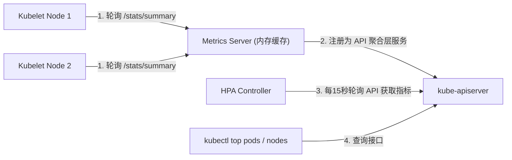

# 📊 Metrics Server 资源监控组件深度解析

`metrics-server` 是 Kubernetes 官方提供的核心集群资源监控指标聚合器。它通过收集各节点 Kubelet 的 CPU 和内存占用数据，并通过 Metrics API 暴露给控制面，用以驱动 HPA (水平自动扩缩)、VPA (垂直自动扩缩) 已经供 `kubectl top` 命令行查询。

---

## 一、 监控架构设计：两条监控管线

Kubernetes 将集群监控指标的处理分为两条完全隔离的管线：

```text
┌────────────────────────────────────────────────────────────────────────┐
│                              Kube-APIServer                            │
└───────▲────────────────────────────────────────────────────────▲───────┘
        │                                                        │
        │ /apis/metrics.k8s.io                                   │ /apis/custom.metrics.k8s.io
        │                                                        │
┌───────┴──────────────┐                               ┌─────────┴────────────┐
│ 1. 资源监控管线      │                               │ 2. 完整/自定义监控管线│
│    (Metrics Server)  │                               │    (Prometheus Stack)│
├──────────────────────┤                               ├──────────────────────┤
│ - 仅内存缓冲，无落盘  │                               │ - 磁盘持久化，时序库  │
│ - CPU / 内存指标     │                               │ - 自定义指标/业务指标 │
│ - 驱动 HPA/VPA       │                               │ - 告警与高级看板      │
└───────▲──────────────┘                               └──────────────────────┘
        │ 采集 (/stats/summary)
┌───────┴──────────────┐
│ Kubelet (Summary API)│
└──────────────────────┘
```

1.  **资源监控管线 (Resource Metrics Pipeline)**：
    *   **核心组件**：Metrics Server。
    *   **职责**：只提供最基础的 **CPU 和内存** 资源使用度量。
    *   **特征**：指标只保存在内存中，不做任何持久化存储；设计极其轻量，专门为了驱动 HPA 弹性扩缩容以及提供基础运维命令查询。
2.  **完整监控管线 (Full Metrics Pipeline)**：
    *   **核心组件**：Prometheus、Grafana 监控技术栈。
    *   **职责**：提供丰富的多维度时序指标（如磁盘 IOPS、网络吞吐量、业务自定义 HTTP QPS 等）。
    *   **特征**：支持历史数据落盘、支持配置告警规则（Alertmanager），功能极其庞大。

---

## 二、 Metrics Server 内部工作流程



1.  **节点数据收集**：Metrics Server 周期性地（默认每 15 秒）并发调用每个节点 Kubelet 的只读 Summary API 接口（`https://<node-ip>:10250/stats/summary`），获取节点和容器的资源占用信息。
2.  **API 注册与聚合**：Metrics Server 将自己注册到 API Server 的 **API 聚合服务 (API Aggregation Layer)**，注册的 API 路径为 `/apis/metrics.k8s.io/v1beta1`。
3.  **消费指标**：
    *   HPA 控制器通过访问该 API 判定 Pod 平均 CPU 利用率是否超标，从而计算是否扩容。
    *   管理员执行 `kubectl top node` 或 `kubectl top pod` 时，底层也是向该 API 检索当前数值。

---

## 三、 生产环境配置注意事项

在部署 Metrics Server 时，如果遇到无法采集数据或证书报错，通常需要调整以下几个核心启动参数：

```yaml
# Metrics Server 部署清单 (Deployment Spec args 示例)
spec:
  containers:
  - name: metrics-server
    image: registry.k8s.io/metrics-server/metrics-server:v0.6.2
    args:
    - --cert-dir=/tmp
    - --secure-port=4443
    # 核心调优参数 1：跳过 Kubelet 证书校验 (开发/自建集群常用)
    # 默认 Metrics Server 会验证 Kubelet 证书的 CA 是否受信任，若是自签证书会报错
    - --kubelet-insecure-tls
    # 核心调优参数 2：指定连接 Kubelet 时使用的 IP 优先顺序
    # 默认是用 Hostname 通信，如果集群内部 DNS 解析不顺畅，会通信超时。
    # 改为优先使用 Node 的内部 IP 进行直接连接
    - --kubelet-preferred-address-types=InternalIP,ExternalIP,Hostname
```

---

> 📖 **生产实战**：关于 Metrics Server 的生产部署安装清单、x509 自签证书故障诊断及常见报错 SOP，详见实战文档：[02-MetricsServer安装与x509证书排障.md](../06-集群运维/02-MetricsServer安装与x509证书排障.md)。

---

> [!TIP] 💡 关联技术与延伸阅读
>
> * [HPA 与 VPA 弹性扩缩容指标管道](../02-集群负载/07-HPA与VPA弹性扩缩容底层算法与指标管道.md)
> * [Metrics Server 安装与 x509 证书排障](../06-集群运维/02-MetricsServer安装与x509证书排障.md)
> * [kube-state-metrics 监控架构](../06-集群运维/03-kube-state-metrics配置与监控架构.md)
