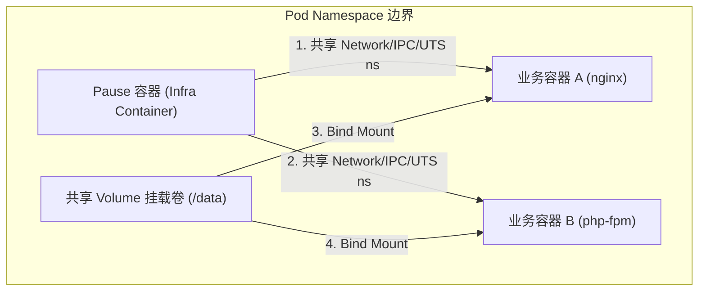
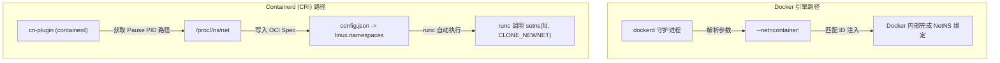
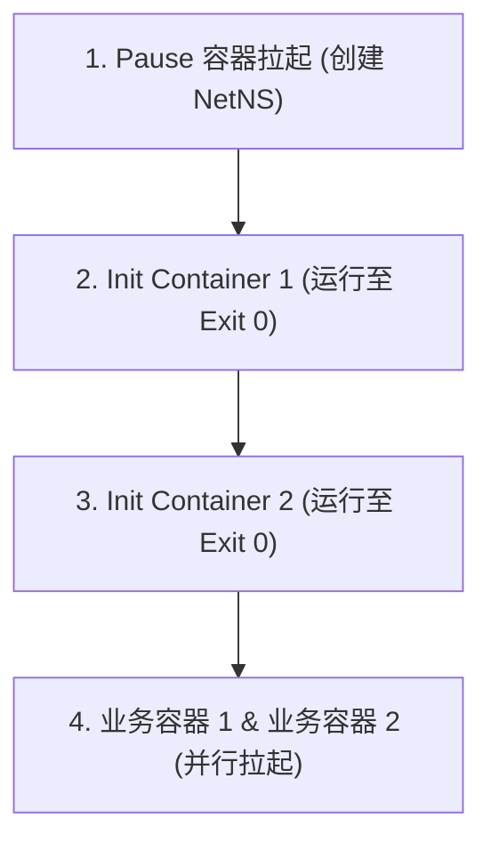
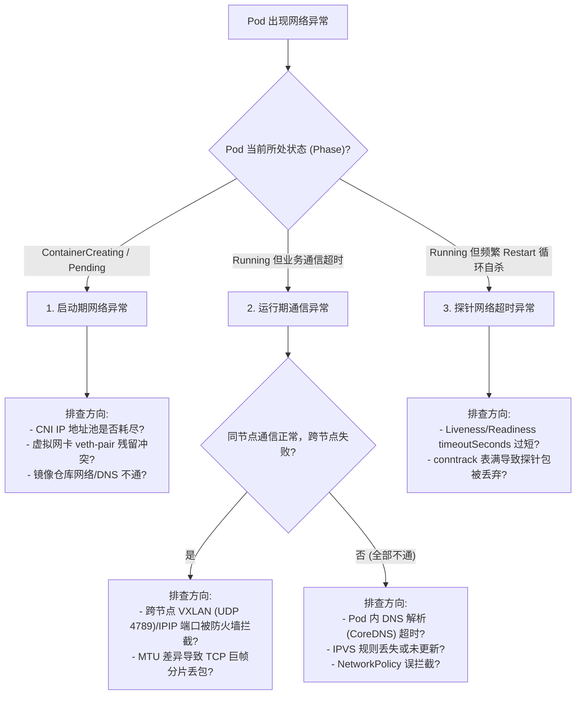

# 📦 Kubernetes Pods 核心原理与设计机制

在 Kubernetes 中，`Pod` 是最小的 API 对象，也是集群的**原子调度单位**。所有的工作负载（Deployment、StatefulSet 等）最终都会被解析并拆分为底层的 Pod 实例进行管理。

---

## 一、 Pod 的本质与设计初衷

### 1. 为什么不直接调度容器？
Docker 容器的本质是一个被 `Namespace` 隔离、`Cgroups` 限制且带有 `Rootfs` 的**单一进程**。
但在真实的分布式系统里，应用之间往往存在“超亲密关系”。例如：业务进程与日志收集（Filebeat）进程，或者 Web 进程与本地缓存（Redis）进程。它们必须运行在同一台机器上，共享相同的网络栈和存储卷，才能实现高效的协作。

如果直接调度容器：
*   调度器必须感知这种亲密关系，并将它们绑定调度到同一个节点。
*   如果其中一个容器意外死亡，整体应用的生命周期协调会变得异常复杂。

因此，Kubernetes 引入了 Pod 这个抽象层。**Pod 的本质是一组共享了某些底层资源的容器组（进程组）**。

### 2. Pod vs 容器 vs 节点 vs 服务

*   **Pod vs 容器**：一个 Pod 可以包含一个或多个紧密相关的业务容器。Pod 中的所有容器共享同一个底层网络命名空间和存储卷。
*   **Pod vs 节点**：同一个 Pod 中的所有容器一定会被调度到相同的物理/虚拟工作节点（Node）上，它们无法跨节点运行。
*   **Pod vs 服务 (Service)**：Service 是 Pod 的七层/四层流量代理网关。Service 通过 Label Selector 动态匹配并路由流量至运行中的后端 Pod。

---

## 二、 Pause 容器 (Infra 容器) 共享机制

Pod 的资源共享是通过一个特殊的“根容器”——**Pause 容器（又称 Infra 容器）**来实现的。

### 1. 共享机制示意图



在 Kubelet 创建 Pod 时，永远是 **Pause 容器最先被创建并拉起**。随后，Kubelet 创建业务容器，并通过 CRI 接口指定新建的业务容器加入 Pause 容器的 `Network`、`IPC`、`UTS` 等命名空间。
*   **网络共享**：同一个 Pod 内的多个容器可以直接通过 `localhost` 加上对应的端口进行高速通信，它们的外部 IP 完全一致。
*   **存储共享**：Pod 级别声明的 Volume 挂载卷会以 Bind Mount 的形式挂载进各个子容器的指定路径下。

### 2. 经典 Pause 源码解析 (`pause.c`)
以下是 Kubernetes 官方实现的 `pause.c` 核心精简代码：

```c
#include <signal.h>
#include <stdio.h>
#include <stdlib.h>
#include <sys/types.h>
#include <sys/wait.h>
#include <unistd.h>

// 信号量处理函数：收割孤儿进程/僵尸进程
static void sigreap(int signo) {
  while (waitpid(-1, NULL, WNOHANG) > 0)
    ;
}

int main(int argc, char **argv) {
  // 1. 确认自己作为 PID = 1 的初始化进程运行
  if (getpid() != 1)
    fprintf(stderr, "Warning: pause should be the first process\n");

  // 2. 注册信号处理，回收子进程状态，防僵尸进程堆积
  if (sigaction(SIGCHLD, &(struct sigaction){.sa_handler = sigreap,
                                             .sa_flags = SA_NOCLDSTOP}, NULL) < 0)
    return 3;

  // 3. 进入死循环，使进程处于休眠状态，挂起不消耗 CPU
  for (;;)
    pause();

  return 0;
}
```
*   **核心逻辑**：Pause 进程本身不执行任何业务逻辑，只执行 `for (;;)` 死循环，使得其挂起并占用极低的资源。
*   **收割僵尸进程**：在容器中，如果 PID=1 的主进程不具备收割僵尸进程的能力，子进程退出后其状态信息不会被回收，进而导致进程号泄露。Pause 进程通过监听 `SIGCHLD` 信号并执行 `waitpid`，完美承担了容器内 `init` 守护进程的自愈职责。

---

## 三、 Pod 资源配额与 QoS 服务质量分类

每个容器都可以对其可使用的 CPU 和内存设置限额：
*   **Requests**：该容器的**最小申请量**。调度器（Scheduler）根据各节点剩余的 Requests 总和来决定 Pod 是否能调度上去。
*   **Limits**：该容器的**最高硬限制**。一旦容器内存使用超过 Limits，会被系统强行发送 OOM-Killed 杀死；若 CPU 超过 Limits，则会被进行 CPU 限流（CPU Throttling）。

### QoS (Quality of Service) 级别划分
Kubernetes 根据 Pod 容器中 Requests 与 Limits 的配置关系，自动划分三种 QoS 服务质量级别，用以在节点资源紧张时决定杀掉 Pod 的优先级：

```text
       【 OOM 资源回收时被杀的优先级 】
BestEffort (最先被杀) ──▶ Burstable ──▶ Guaranteed (最后被杀)
```

1.  **Guaranteed (完全保证)**：
    *   **条件**：Pod 中所有容器的所有 CPU 和 Memory 均配置了 Requests 和 Limits，且 **Requests 必须等于 Limits**。
    *   **特征**：享有最高优先级，只有在宿主机内核崩溃等极端资源枯竭情况下才会被驱逐。
2.  **Burstable (弹性波峰)**：
    *   **条件**：不满足 Guaranteed 条件，但至少有一个容器配置了 Requests 或 Limits。
    *   **特征**：中等优先级，适合绝大多数普通业务。
3.  **BestEffort (尽力而为)**：
    *   **条件**：Pod 中所有容器均**未配置**任何 Requests 和 Limits。
    *   **特征**：优先级最低。一旦节点资源告急，Kubelet 会最先杀掉 BestEffort 级别的 Pod 回收资源。

---

## 四、 Pod 生命周期状态与重启策略

### 1. 五种标准 Phase 状态
| 状态值 (Phase) | 详细技术含义 |
| :--- | :--- |
| **Pending** | API Server 已经创建并持久化了 Pod 对象，但调度尚未完成，或者底层镜像正在下载。 |
| **Running** | Pod 已经绑定到 Node，且内部所有容器均已创建。至少有一个容器处于 Running、启动中或重启中状态。 |
| **Succeeded** | Pod 内所有容器均正常执行完毕（退出状态码为 0）并退出，且该 Pod 不会再重启。常见于 Job 任务。 |
| **Failed** | Pod 内所有容器均已终止，但至少有一个容器是以非 0 状态码异常退出。 |
| **Unknown** | 由于网络抖动或节点宕机，API Server 无法与工作节点的 Kubelet 通信，无法获取 Pod 的状态。 |

### 2. 重启策略 (RestartPolicy)
重启策略由节点上的 Kubelet 本地执行，支持以下三种：
*   **Always** (默认)：只要容器退出（不论退出码是 0 还是非 0），Kubelet 立即将其重启。
*   **OnFailure**：只有当容器以非 0 状态码异常退出时，Kubelet 才会执行重启。
*   **Never**：无论容器如何退出，Kubelet 均不执行重启。

---

## 五、 本章子导览目录

为了深入理解 Pod 的各项机制，请阅读以下细分文档：
*   📖 [Pod 生命周期、Init 容器与生命周期钩子](./01-Pod/Lifecycle.md)
*   📖 [Pod 三种健康检查探针与就绪性深度配置](./01-Pod/健康检查与可用性检查.md)
*   📖 [Pod 节点亲和性、污点、容忍度与调度属性](./01-Pod/Pod调度.md)

---

## 六、 深度扩展：Docker 与 Containerd 底层 Pause 通信差异 (孟凡杰课程精髓)

在 Pod 内部容器共享 Network Namespace 时，Docker 运行时与 Containerd 运行时在 OCI 底层实现上存在本质的技术区别：



### 1. Docker 运行时方式
* **命令关联**：通过 `dockerd` 自身的容器间关联参数 `--net=container:<pause_container_id>`。
* **机制**：依赖 `dockerd` 守护进程在内存中维护容器间依赖关系图，并手动拉入目标的 NetNS。

### 2. Containerd 运行时方式 (OCI 标准直通)
* **路径获取**：CRI 插件拉起 Pause 容器后，直接读取该 Pause 容器主进程在宿主机的 `/proc/<pause_pid>/ns/net` 符号链接文件。
* **OCI Spec 写入**：在随后生成的业务容器 OCI 配置文件 `config.json` 中，将该 `/proc/<pause_pid>/ns/net` 绝对路径直接填入 `linux.namespaces` 数组节点。
* **runc setns**：底层 `runc` 在初始化业务容器时，直接对该文件句柄执行 Linux 系统调用 `setns(fd, CLONE_NEWNET)`，**完全脱离对外部守护进程的依赖，更加符合 OCI 原生规范**。

> 💡 **关联深入解析**：关于 Docker 与 Containerd 的架构演进与底层对比，详见：[03-Docker与Containerd底层实现及Pause通信深度解析.md](../01-组件原理/04-Kubelet/03-Docker与Containerd底层实现及Pause通信深度解析.md)。

---

## 七、 深度扩展：Init Container 生命周期与多容器设计模式 (参考源: K8s 官方 Docs & Source Code)

### 1. Init Container 严格顺序启动流
在主业务容器（App Container）拉起之前，可以配置任意数量的初始化容器（Init Container）：



* **严格串行与阻塞**：Init 容器必须按 YAML 声明顺序**严格串行执行**。只有前一个 Init 容器成功退出（Exit 0），下一个 Init 容器才会启动。如果任何一个 Init 容器抛出错误或崩溃，Kubelet 会根据 `restartPolicy` 重新拉起它，**主业务容器绝不会在 Init 容器完成前启动**！

---

### 2. 三大 Pod 经典多容器设计模式 (Sidecar / Ambassador / Adapter)
1. **Sidecar 模式 (边车模式)**：
   辅助主容器工作（如日志采集器 Filebeat 监听主应用日志目录、Envoy 代理治理流量）。
2. **Ambassador 模式 (大使模式)**：
   作为反向代理，掩盖外部复杂性（如本地 Pod 访问 `localhost:6379`，大使容器透明路由至外部高可用 Redis 集群）。
3. **Adapter 模式 (适配器模式)**：
   统一标准化输出（如将主容器非标的日志或 Metrics 转换格式，吐给统一的 Prometheus/Grafana）。

---

## 八、 网络原因导致 Pod 异常全景排查指南与排障 SOP

在生产环境中，由底层网络链路、CNI 插件、DNS 解析或内核网络栈引起的 Pod 异常占比极高（如 Pod 卡在 `ContainerCreating`、业务请求随机 502/504、Liveness 探针误报超时频繁重启等）。

### 1. Pod 网络异常分类与诊断决策树



---

### 2. 生产级“五步阶梯”排查诊断 SOP

当定位到某个 Pod 存在网络异常时，应按以下标准步骤逐层向下排查：

#### 步骤 1：检查 Pod 事件与 IP 分配状态
```bash
# 查看 Pod 状态及最近的底层事件 (Events)
kubectl describe pod <pod-name> -n <namespace>
```
* **关注关键报错**：
  * `FailedCreatePodSandBox: plugin type="calico" failed (add): no IP available in pool`：说明 CNI 的 IP 地址池已被耗尽。
  * `Failed to set up sandbox interface: file exists`：说明宿主机残留了未清理的旧 `veth` 虚拟网卡设备。

---

#### 步骤 2：容器网络连通性多维分层探测
使用 `kubectl exec`（或通过 `kubectl debug` 挂载含有网络工具箱的临时容器）按层次进行 Ping/Curl 连通性测试：

```bash
# 临时注入带有 curl, dig, ping, traceroute 的 debug 容器
kubectl debug -it <pod-name> -n <namespace> --image=nicolaka/netshoot -- /bin/bash

# 1. 探测 Pod 自身环回网络 (确认进程在正常监听)
curl -v http://127.0.0.1:<port>

# 2. 探测同节点其他 Pod IP
ping <same-node-pod-ip>

# 3. 探测跨节点 Pod IP (测试 CNI 跨节点 Overlay 隧道)
ping <cross-node-pod-ip>

# 4. 探测 Service ClusterIP (测试 kube-proxy 规则与 IPVS 转发)
curl -v http://<service-cluster-ip>:<port>

# 5. 探测 CoreDNS 集群域名解析
dig <service-name>.<namespace>.svc.cluster.local @10.96.0.10

# 6. 探测外部公网或外部数据库
curl -v https://www.aliyun.com
```

---

#### 步骤 3：工作节点网络协议栈与 CNI 路由检查
登录到该 Pod 所在的宿主机工作节点，检查宿主机层面的网络路由与防火墙规则：

```bash
# 1. 检查节点路由表是否包含发往 Pod 网段的下一跳
ip route

# 2. 检查节点 IPVS 转发规则池中是否包含当前 Pod IP 作为 Real Server
ipvsadm -ln | grep <pod-ip>

# 3. 检查宿主机防火墙是否放行了 CNI 跨节点封装协议端口
# Calico BGP: TCP 179 / IPIP: IP 协议号 4
# Flannel / VXLAN: UDP 4789 / 8472
iptables -L -n -v | grep -E "4789|179"
```

---

#### 步骤 4：DNS 解析链路与 `ndots:5` 优化诊断
Pod 内解析域名超时最常见的原因是 Kubernetes 默认的 DNS 搜索域机制：
* 查看 Pod 内 `/etc/resolv.conf`：
  ```text
  nameserver 10.96.0.10
  search <namespace>.svc.cluster.local svc.cluster.local cluster.local
  options ndots:5
  ```
* **`ndots:5` 放大效应**：若请求外部域名（如 `api.github.com`，点号数量 $< 5$），系统会优先在集群内部搜索域（如 `api.github.com.<namespace>.svc.cluster.local`）依次尝试 3 次 DNS 查询，全部 NXDOMAIN 报错后才查询公网，导致并发量剧增并引起 CoreDNS 5 秒丢包超时。
* **优化策略**：使用绝对域名（末尾加点 `api.github.com.`）或在 Pod 中配置 `dnsConfig` 将 `ndots` 降低为 2。

---

#### 步骤 5：双向抓包与内核丢包精准定位
若上述步骤均正常但网络偶发超时，需在宿主机与 Pod 内同步抓包定位：

```bash
# 在宿主机对 Pod 绑定的虚拟网卡 (如 caliXXX 或 vethXXX) 抓包
tcpdump -i any host <pod-ip> and port <service-port> -nn -vv -w /tmp/pod-traffic.pcap

# 检查 Linux 内核丢包计数器
netstat -s | grep -i "drop\|retransmit\|overflow"

# 检查内核连接跟踪表是否被撑满
dmesg -T | grep -i "conntrack.*full"
```

---

### 3. 典型网络故障场景与快速救援速查表

| 故障现象 | 根本原因分析 | 生产级排障与救援方案 |
| :--- | :--- | :--- |
| **Pod 卡在 `ContainerCreating` 报 `no IP available in pool`** | CNI 分配给该节点的 IP 网段已耗尽，或存在死锁孤儿 IP 未释放 | 1. 检查 Calico/Flannel IPAM 使用情况：`calicoctl ipam show`；<br/>2. 释放失效节点的孤儿 IP 块：`calicoctl ipam release <ip>`；<br/>3. 调大 CNI 的 IPPool CIDR 掩码。 |
| **跨节点 Pod Ping 通，但大报文 HTTP/gRPC 超时挂起** | 物理网卡与 CNI Overlay 隧道（VXLAN/Geneve）**MTU 不匹配**。封装包超过宿主机 MTU（1500）导致被静默丢弃 | 1. 检查物理网卡 MTU：`ip link show eth0`（通常 1500）；<br/>2. 确保 CNI 网卡 MTU 比宿主机**至少小 50 字节**（如 Calico VXLAN 配置 `mtu: 1450`）；<br/>3. 修改 CNI ConfigMap 中的 MTU 配置并重启 CNI DaemonSet。 |
| **Pod 内 DNS 解析报 `i/o timeout` (时延 5 秒)** | Linux glibc 的 A/AAAA 记录并发查询与 Netfilter conntrack 竞态导致丢包 | 1. 在 Pod YAML 中添加 `dnsConfig`: `options: [{name: single-request-reopen}]`；<br/>2. 为高并发集群部署 NodeLocal DNSCache 本地缓存插件。 |
| **Pod 处于 Running 但不断 Restart (探针超时)** | 业务瞬时高负载导致 CPU 争抢，Liveness 探针响应超过设定的 `timeoutSeconds: 1s` | 1. 调大探针宽限期：`timeoutSeconds: 5`，`failureThreshold: 3`；<br/>2. 区分 `startupProbe`（给启动留充足时间）与 `livenessProbe`。 |
| **集群随机报错 `Connection reset by peer`** | 节点 `nf_conntrack` 连接跟踪表满，Linux 内核直接丢弃 SYN 握手包 | 1. 检查已用条目：`cat /proc/sys/net/netfilter/nf_conntrack_count`；<br/>2. 动态调大容量：`sysctl -w net.netfilter.nf_conntrack_max=1048576` 并持久化到 `/etc/sysctl.conf`。 |

---

> [!TIP] 💡 关联技术与延伸阅读
>
> * [Pod 生命周期与状态流转](./01-Pod/Lifecycle.md)
> * [Pod 健康检查探针配置](./01-Pod/健康检查与可用性检查.md)
> * [Pod 调度与亲和力约束](./01-Pod/Pod调度.md)
