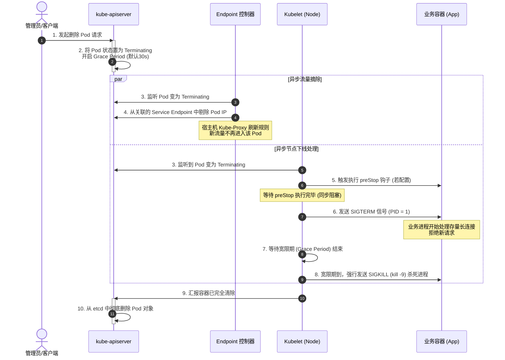

# 🔄 Pod 生命周期、Init 容器与生命周期钩子

在 Kubernetes 中，管理应用生命周期的精细化控制（如初始化就绪、无损平滑下线）是保证业务高可用的关键技术。本章将深度剖析 Init 容器、生命周期钩子（PostStart/PreStop）以及 Pod 优雅退出的底层时序机制。

---

## 一、 Init 容器 (初始化容器)

在 Pod 声明中，`initContainers` 是先于主业务容器（`containers`）启动的特殊容器。它们主要用于执行主容器启动前必须完成的准备工作（如拉取配置、等待依赖服务就绪、初始化数据库表结构等）。

### 1. Init 容器核心特质
*   **串行执行**：如果有多个 Init 容器，它们会严格按照 YAML 定义的先后顺序**一个接一个地串行启动并运行**。
*   **必须成功退出**：每个 Init 容器必须顺利运行完毕并且以退出码 `0` 成功退出。只有当前一个成功退出后，下一个才会被拉起。如果其中一个失败，且 Pod 的重启策略不是 `Never`，Kubelet 会不断重启该 Pod 并重新从第一个 Init 容器跑起。
*   **不具备探针**：Init 容器不支持 Liveness 探针和 Readiness 探针。因为它们必须在 Pod 进入就绪（Ready）状态之前完全退出。
*   **共享存储**：利用共享卷，Init 容器写入的数据（如拉取的配置文件）可以被主业务容器无缝读取。

---

## 二、 容器生命周期钩子 (Lifecycle Hooks)

Kubernetes 支持在主业务容器生命周期的两个关键节点触发自定义回调钩子：

### 1. postStart (启动后钩子)
*   **触发时机**：在容器被创建并成功拉起后，**立刻异步执行**。
*   **注意点**：它与容器的 `ENTRYPOINT` 主命令是**并行/异步**执行的，无法保证钩子函数一定在主程序启动前执行完毕。
*   **失败处理**：如果 postStart 钩子执行失败（例如退出码非 0，或命令超时），Kubelet 会杀掉该容器，并依据重启策略进行重启。

### 2. preStop (停止前钩子)
*   **触发时机**：在容器被终止（即被移出 Endpoint、接收到删除信号）之前**同步触发**。
*   **工作机制**：Kubelet 会调用并等待 preStop 钩子执行完毕，**在此期间，不会向容器发送 `SIGTERM` 信号**。如果钩子执行超时（受 `terminationGracePeriodSeconds` 限制），Kubelet 会强行终止容器。
*   **典型应用**：服务注册中心反注册（Eureka/Consul 节点下线）、处理完正在执行的事务/SQL 请求、关闭网络长连接等。

---

## 三、 Pod 优雅终止时序 (Graceful Shutdown)

当用户执行 `kubectl delete pod` 时，Kubernetes 控制面与节点 Kubelet 会严格按照以下步骤进行无损下线：



> [!IMPORTANT]
> 如果不配置 `preStop` 且业务进程对 `SIGTERM` 信号未做优雅处理，在高并发场景下进行滚动更新会瞬间导致已建立的连接断开，从而对客户端暴露 `502 Bad Gateway` 报错。

---

## 四、 优雅退出与初始化 YAML 实战配置

以下是一个集成了 Init 容器、优雅退出 preStop 钩子和宽限期的完整生产级 YAML 配置示例：

```yaml
apiVersion: apps/v1
kind: Deployment
metadata:
  name: graceful-app
  namespace: production
spec:
  replicas: 3
  selector:
    matchLabels:
      app: graceful-app
  template:
    metadata:
      labels:
        app: graceful-app
    spec:
      # 1. 延长默认的优雅退出宽限期（默认 30 秒，调大到 60 秒）
      terminationGracePeriodSeconds: 60
      
      # 2. 初始化容器：等待依赖的数据库服务就绪后再启动主容器
      initContainers:
      - name: wait-for-db
        image: busybox:1.36
        command: ['sh', '-c', 'until nc -z -w 2 mysql-service 3306; do echo waiting for mysql; sleep 2; done']
        
      # 3. 业务主容器
      containers:
      - name: app
        image: my-company/business-app:v1.0.0
        ports:
        - containerPort: 8080
        
        # 4. 配置生命周期钩子
        lifecycle:
          postStart:
            exec:
              command: ["/bin/sh", "-c", "echo Container started at $(date) >> /var/log/app.log"]
          preStop:
            exec:
              # 优雅下线：通知 SpringBoot 开启优雅关机，或通过 Nginx 执行 nginx -s quit 
              # 在这里我们使用 curl 触发 Consul 节点下线，并强制 sleep 15 秒确保 upstream 刷新同步完成
              command: 
              - /bin/sh
              - -c
              - |
                curl -X PUT http://consul:8500/v1/agent/service/deregister/graceful-app-pod
                sleep 15
```

---

> [!TIP] 💡 关联技术与延伸阅读
>
> * [优雅停机与服务平滑退出实战](../06-资源更新/优雅关闭服务.md)
> * [云原生应用无损上下线实践](../../08-应用与实战/02-云原生应用无损上下线实践.md)
