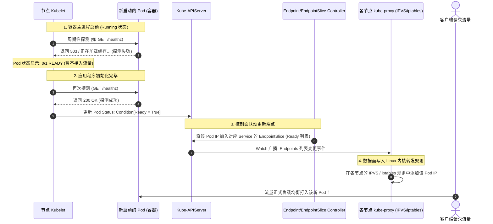

# 🩺 Pod 健康检查、就绪探针与就绪性深度配置

在 Kubernetes 中，仅仅依靠容器进程的存在（Process Running）来判定业务健康是极不安全的。应用进程可能已经卡死（如 JVM OOM、死锁），或者仍处于冷启动初始化阶段，无法对外提供服务。为此，Kubernetes 提供了三种健康检查探针（Probes）与四种探测方式。

---

## 一、 三大健康检查探针概念与协同关系

Kubernetes 提供了三种定位与职责完全不同的探针：

```text
容器被拉起 ────▶ [ 1. Startup Probe ] (启动探针，为慢启动应用提供保护机制)
                         │ 成功后激活
                         ▼
                 [ 2. Liveness Probe ] (存活探针，判断是否需要重启容器以恢复可用性)
                 [ 3. Readiness Probe ] (就绪探针，判断是否能够接受流量，控制 Service Endpoint 挂载)
```

### 详细对比表：

| 探针名称 | 核心目的 | 探测失败后的处理动作 | 流量/容器影响 | 生产典型应用场景 |
| :--- | :--- | :--- | :--- | :--- |
| **Startup Probe**<br/>(启动探针) | 验证容器内的应用程序是否**已初始化完成**。 | **杀死容器**，并根据重启策略进行重建。在启动探针成功前，其他探针（Liveness/Readiness）会被完全禁用。 | 保护期内不接入流量，失败则容器重启 | 适用于老旧应用或冷启动时间极长（如 SpringBoot 冷启动需 1-2 分钟）的 Java 应用。 |
| **Liveness Probe**<br/>(存活探针) | 验证容器在运行过程中是否**仍然存活**。 | **杀死容器**，执行重启。 | 失败触发容器销毁重启 | 适用于检测容器死锁、JVM 内存溢出、死循环等进程存在但无法响应的僵死状态。 |
| **Readiness Probe**<br/>(就绪探针) | 验证容器在运行中是否**准备好接收网络流量**。 | **不重启容器**。Endpoints 控制器会将该 Pod 的 IP 从所有关联的 Service 后端负载列表中剔除，拒绝分配新请求。 | **纯流量层控制**（容器不重启，仅在 Endpoint/IPVS/iptables 摘流） | 适用于检测服务是否已经加载完业务缓存、建立好数据库连接池。在滚动更新期间起关键作用。 |

---

### 二、 就绪探针 (Readiness) 监管 Pod 接入流量的完整链路

新 Pod 从创建到正式接收外部业务流量，完全由 **Readiness Probe** 与控制面、数据面协同把关：




---

## 二、 四种探测执行方式 (Handler Types)

Kubernetes 提供了四种执行检查的协议：

1.  **HTTPGetAction (HTTP 接口检查)**：
    *   Kubelet 向容器 IP 的指定端口和路径发送 HTTP GET 请求。如果返回状态码在 `200` 到 `399` 之间，则视为成功。最常用。
2.  **TCPSocketAction (TCP 端口检查)**：
    *   Kubelet 对容器 IP 的指定端口进行 TCP 连接尝试。如果能成功建立三次握手，则视为成功。适用于数据库、消息队列等非 HTTP 服务。
3.  **ExecAction (执行命令检查)**：
    *   Kubelet 在容器内执行一个命令。如果该命令返回的退出码是 `0`，则视为成功。适用于无网络服务的守护程序。
4.  **GRPCAction (gRPC 协议检查)**：
    *   *K8S 1.24+ 引入，1.27 成为 Stable 特性*。Kubelet 针对配置了 gRPC 健康检查标准协议的服务，通过 gRPC 发起健康检查。对于不支持 HTTP 的微服务极其友好。

---

## 三、 生产避坑指南与最佳实践

### 1. 为什么只配置 Liveness 会在滚动更新时引发 502 Bad Gateway？
> [!WARNING]
> 这是最常见的微服务生产事故。

在滚动更新（RollingUpdate）中，新 Pod 被拉起。如果只配置了 `livenessProbe` 而没有配置 `readinessProbe`：
1.  Kubelet 检测到容器主进程已运行（Liveness 默认成功），即判定该 Pod 状态为 `Ready`。
2.  API Server 立即修改 Endpoint，将公网/集群流量分发给新 Pod。
3.  但此时，新 Pod 内部的 JVM 或 Node.js 应用程序正处于类加载、数据库连接建立阶段，根本无法建立 socket 连接。
4.  **结果**：客户端发来的流量被强行转发到此 Pod，直接产生大量 `502 Bad Gateway` 或 `Connection Refused`。
*   **最佳实践**：任何在线业务，**必须配置 Readiness 探针**，以确保业务完全初始化后，才被接入网络流量。

### 2. 存活探针 (Liveness) 千万不要绑定外部依赖
> [!CAUTION]
> 绝对不要让 Liveness 探针去请求数据库（如 `SELECT 1`）、Redis 或第三方外部 API。

*   **逻辑漏洞**：如果后端数据库因为网络分区或负载过高发生短暂故障：
    1.  当前集群中所有的业务 Pod 的 Liveness 探针都会失败。
    2.  Kubelet 会同时杀死并重启整个集群中所有的业务 Pod。
    3.  整个控制面和节点在重启风暴中崩溃，引发全系统雪崩。
*   **最佳实践**：Liveness 探针应该只做本地轻量级检查（如应用在内存中设置的健康标记、本地轻量 HTTP 端口响应）。Readiness 探针可以配置较重的外部依赖检查。

---

## 四、 探针 YAML 配置最佳模板

以下展示了一个完美结合了 **Startup、Liveness 和 Readiness** 探针的 Spring Boot 微服务配置示例，充分应对了“冷启动时间长，且需要平滑无损发布”的需求：

```yaml
apiVersion: v1
kind: Pod
metadata:
  name: spring-boot-microservice
  namespace: production
spec:
  containers:
  - name: java-app
    image: my-registry/java-app:v1.2.0
    ports:
    - containerPort: 8080
    
    # 1. 启动探针：先给应用最大 2 分钟的初始化启动窗口（30 * 4 = 120s）
    startupProbe:
      httpGet:
        path: /actuator/health/liveness
        port: 8080
      # 容器启动后等待 10 秒开始第一次探测
      initialDelaySeconds: 10
      # 每 4 秒探测一次
      periodSeconds: 4
      # 探测失败的最大次数。如果 30 次都失败，意味着应用彻底卡死在启动期，触发杀死并重启
      failureThreshold: 30
      # 探测超时时间，默认 1 秒
      timeoutSeconds: 2

    # 2. 存活探针：当启动探针成功后，该探针正式激活
    # 仅检测应用在内存中是否仍然健康
    livenessProbe:
      httpGet:
        path: /actuator/health/liveness
        port: 8080
      # 启动探针接管了启动阶段，所以这里无需 initialDelaySeconds，直接按周期探测即可
      periodSeconds: 10
      # 连续 3 次失败触发杀死重启
      failureThreshold: 3
      timeoutSeconds: 1

    # 3. 就绪探针：当启动探针成功后激活，判定是否向 Pod 导入外部网络流量
    readinessProbe:
      httpGet:
        # 可以请求包含 DB/Redis 依赖连接的端点，确保真正可达
        path: /actuator/health/readiness
        port: 8080
      # 每 5 秒探测一次，以便快速上下线
      periodSeconds: 5
      # 连续探测成功 1 次即可接入流量
      successThreshold: 1
      # 连续 3 次失败从 Service Endpoint 摘除，不接收新请求
      failureThreshold: 3
      timeoutSeconds: 2
```

---

> [!TIP] 💡 关联技术与延伸阅读
>
> * [Pod 生命周期阶段与 Hook 协作](./Lifecycle.md)
> * [云原生应用无损上下线实践](../../08-应用与实战/02-云原生应用无损上下线实践.md)
