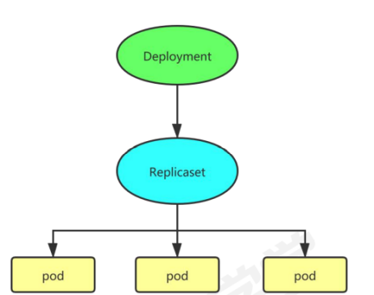
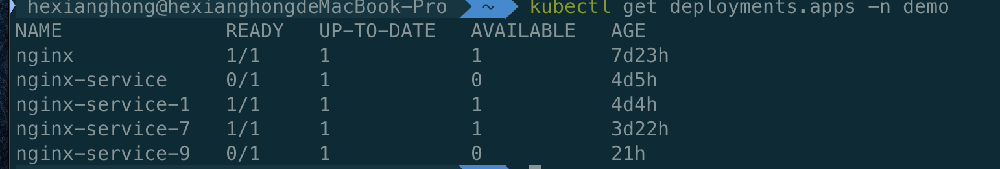

# 🚀 Deployment (无状态部署) 编排原理与发布策略

`Deployment` 是 Kubernetes 中最常用、最核心的无状态工作负载控制器。它在 `ReplicaSet` 之上提供了高阶的声明式升级、回滚、版本历史管理以及动态扩缩容等高级生命周期功能。

---

## 一、 Deployment 核心架构与“两层控制”关系

Deployment 本质上是一个**双层控制回路**管理器：
1.  **第一层：控制版本 ([ReplicaSet](./02-ReplicaSet.md))**：每一个不同的应用配置/镜像版本，都对应一个专属的 [ReplicaSet](./02-ReplicaSet.md)。
2.  **第二层：控制副本 (Pod)**：由活跃的 ReplicaSet 负责维护具体 Pod 的实例个数。

```text
┌──────────────────────────────────────┐
│             Deployment               │
└──────────────────┬───────────────────┘
                   │
         ┌─────────┴─────────┐
         ▼ 历史版本           ▼ 当前活跃版本
   ┌───────────┐       ┌───────────┐
   │ReplicaSet │       │ReplicaSet │ (myapp-v2)
   │(myapp-v1) │       └─────┬─────┘
   └───────────┘             │
                       ┌─────┼─────┐
                       ▼     ▼     ▼
                     ┌───┐ ┌───┐ ┌───┐
                     │Pod│ │Pod│ │Pod│ (运行 v2 镜像)
                     └───┘ └───┘ └───┘
```

以下是 Deployment 在集群内部进行版本控制的拓扑结构：



---

## 二、 部署与更新策略 (spec.strategy)

Deployment 支持两种不同的升级策略：

### 1. Recreate (重建更新)
*   **动作**：先将所有现存的旧 Pod 副本数一次性降到 0，释放全部资源，然后再拉起全新版本的 Pod。
*   **优缺点**：
    *   **优点**：简单粗暴，能确保在任何时间，集群里绝对不会同时存在新旧两个版本的 Pod（防多版本并发数据写入冲突）。
    *   **缺点**：在旧 Pod 死亡到新 Pod 启动并就绪的这段时间内，**服务会完全中断**，产生严重的系统停机时间。

---

### 2. RollingUpdate (滚动更新 - 默认)
*   **动作**：以“渐进式”的方式，一边创建新版本的 Pod，一边销毁老版本的 Pod，直到全部替换完成。
*   **优势**：升级过程中**服务不中断**，实现无缝平滑发布。
*   **核心配置参数**：

```yaml
spec:
  strategy:
    type: RollingUpdate
    rollingUpdate:
      maxSurge: 25%          # 升级过程中最多能“多跑”几个 Pod
      maxUnavailable: 25%    # 升级过程中最多能“挂掉”几个 Pod
```

> [!TIP]
> #### 滚动更新算法与百分比计算 (以 Replicas = 4 为例)：
> *   **`maxSurge` (最大溢出数)**：默认 25%。表示升级期间，允许运行的 Pod 最大总数为：$4 + 4 \times 25\% = 5$ 个。
> *   **`maxUnavailable` (最大不可用数)**：默认 25%。表示升级期间，必须保证正常运行的 Pod 最少为：$4 - 4 \times 25\% = 3$ 个。
> *   **启动过程**：第一步，新版本 RS 会先启动 1 个新 Pod（此时总数 5 个，满足 maxSurge），一旦这个新 Pod 经过就绪探测通过，旧版本 RS 就会杀死 1 个旧 Pod。如此交替往复，直到全部更新完毕。

---

## 三、 Deployment 参数精细配置

*   **`revisionHistoryLimit` (版本历史保留上限)**：默认值为 `10`。规定了集群中为当前 Deployment 保留多少个历史 ReplicaSet 对象（即可用于回滚的历史版本）。若设为 `0`，则无法执行 `kubectl rollout undo` 回滚。
*   **`minReadySeconds` (最小就绪等待时间)**：默认 0 秒。Kubelet 在容器就绪后，需要额外等待多少秒，确认无异常后，才将该 Pod 判定为可用的（Available），进而推进滚动更新。这能有效阻断“启动后 5 秒内崩溃”的闪退故障。
*   **`progressDeadlineSeconds` (升级超时时限)**：默认 600 秒（10分钟）。如果在规定时间内，滚动更新因为镜像下载失败或探针不通过而卡住，Deployment 会将状态置为 `Failed`。

---

## 四、 声明式与命令式生命周期管理

### 1. 基础状态解读 (kubectl get deployments)



| 状态列 | 详细技术含义 |
| :--- | :--- |
| **READY** | 格式为 `已就绪数/期望数`。例如 `3/3` 表示 3 个副本全部正常就绪。 |
| **UP-TO-DATE** | 符合当前最新 Pod 模板（Template）定义的 Pod 数量。 |
| **AVAILABLE** | 对外真正可用的 Pod 数量（即就绪且过了 `minReadySeconds` 检查的 Pod）。 |

---

### 2. 常用版本管理命令行一览表

| 运维动作 | 命令行指令 |
| :--- | :--- |
| **部署应用 (声明式)** | `kubectl apply -f nginx.yaml --record` *(注：--record 能够记录触发更新的命令原因)* |
| **查看滚动更新进度** | `kubectl rollout status deployment/nginx-deployment` |
| **更改镜像触发更新** | `kubectl set image deployment/nginx-deployment nginx=nginx:1.25.1 --record` |
| **查看版本历史列表** | `kubectl rollout history deployment/nginx-deployment` |
| **查看特定版本的 YAML** | `kubectl rollout history deployment/nginx-deployment --revision=2` |
| **快速回退到上个版本** | `kubectl rollout undo deployment/nginx-deployment` |
| **回退到指定历史版本** | `kubectl rollout undo deployment/nginx-deployment --to-revision=2` |
| **暂停滚动更新 (蓝绿/灰度)** | `kubectl rollout pause deployment/nginx-deployment` *(可在暂停期间进行镜像、环境修改，不会触发频繁更新)* |
| **恢复滚动更新** | `kubectl rollout resume deployment/nginx-deployment` |

---

## 五、 本章子导览目录

*   📖 [Deployment 动态演示与高级用法](./03-Deployment/高级用法.md)
*   📖 [Deployment YAML 挂载 PVC NFS 注解实例](./03-Deployment/yaml注解.md)

---

> [!TIP] 💡 关联技术与延伸阅读
>
> * [ReplicaSet 副本控制器原理](./02-ReplicaSet.md)
> * [Argo Rollouts 进阶渐进式发布](../07-集群扩展/01-Argo概述与Rollouts金丝雀发布.md)
> * [优雅停机与无损发布](./06-资源更新/优雅关闭服务.md)
