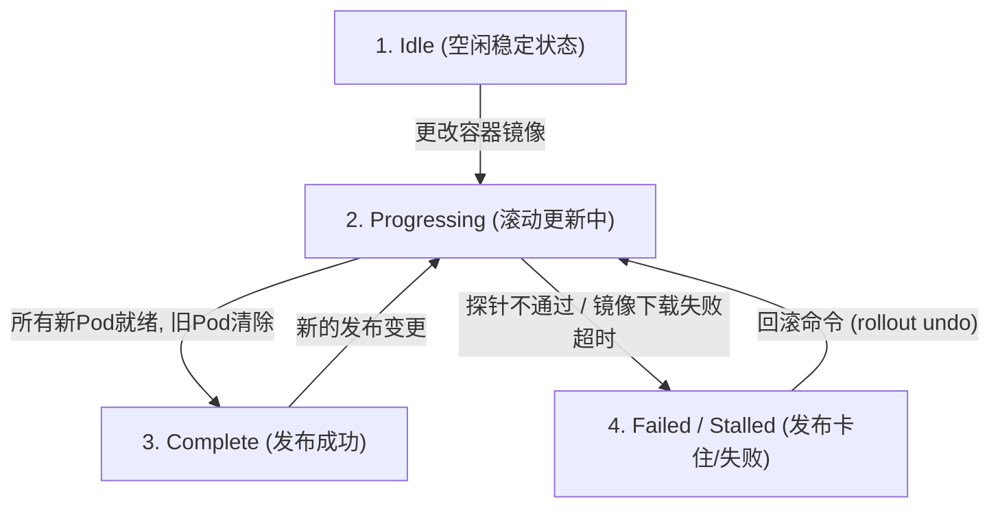

# 🛠️ Deployment 滚动更新控制与高级运维实战

在生产环境中，平滑发布、灰度放量以及故障快速回退是 CI/CD 流程的重中之重。本章将深入讲解 Deployment 的高级生命周期控制机制、滚动更新状态机变化，以及如何通过 `maxSurge` 和 `maxUnavailable` 控制发布节奏。

---

## 一、 滚动更新状态机与状态迁移

当运行中的 Deployment 发生配置变更（如修改镜像或环境变量）时，其内部控制器会经历三种主要状态：



### 1. Progressing (正在进行中)
*   **状态触发**：当 Deployment 正在执行 Pod 副本替换、拉取新镜像或因为扩缩容在调整副本数时，处于此状态。
*   **调试监控**：
    ```bash
    kubectl rollout status deployment/myapp-v1
    # 典型输出：
    # Waiting for deployment "myapp-v1" rollout to finish: 1 out of 3 new replicas have been updated...
    ```

### 2. Complete (已完成)
*   **状态标志**：新版本的 ReplicaSet 的副本数已达到期望值，所有 Pod 均进入 `Ready` 状态，并且所有老版本的 Pod 都被完全回收。
*   **调试监控**：
    ```bash
    kubectl rollout status deployment/myapp-v1
    # 典型输出：
    # deployment "myapp-v1" successfully rolled back/rolled out
    ```

### 3. Failed / Stalled (失败/停滞)
*   **状态触发**：由于某些故障（如 `ImagePullBackOff`、`CrashLoopBackOff` 或就绪性探针一直失败），导致新 Pod 无法转为 Ready。当卡住的时间超过了 `progressDeadlineSeconds`（默认 600 秒）时，控制器会放弃尝试并报告 Failed。
*   **排查命令**：
    ```bash
    kubectl get deployment myapp-v1 -o yaml
    # 在 status.conditions 中会看到：
    # type: Progressing, status: "False", reason: ProgressDeadlineExceeded
    ```

---

## 二、 滚动更新算法：`maxSurge` 与 `maxUnavailable` 实战

这两个参数决定了滚动发布时，“资源的额外开销”与“服务的冗余度”。它们可以配置为绝对数字（如 `1`）或占 `replicas` 的百分比（如 `20%`）。

```text
               【 滚动发布算式关系 】
【最高允许运行的 Pod 数】 = replicas + maxSurge
【最低必须保证可用的 Pod 数】 = replicas - maxUnavailable
```

### 生产环境两类典型配置场景：

#### 场景 A：零冗余、低开销（省钱模式）
*   **配置**：`maxSurge: 0`, `maxUnavailable: 25%`（以 4 副本为例，即最多超 0 个，最多挂 1 个）。
*   **执行逻辑**：
    1.  由于不允许超出副本数，必须先杀死 1 个旧 Pod（运行数降为 3，满足最低可用数）。
    2.  启动 1 个新 Pod。等新 Pod 就绪后，再杀死第 2 个旧 Pod，拉起第 2 个新 Pod。
*   **适用场景**：测试环境，或者物理资源紧张、没有额外空闲内存拉起新 Pod 的集群。

#### 场景 B：服务零降级、高冗余（安全模式 - 推荐）
*   **配置**：`maxSurge: 25%`, `maxUnavailable: 0`（以 4 副本为例，即最多超 1 个，最多挂 0 个）。
*   **执行逻辑**：
    1.  由于不允许任何旧 Pod 不可用，必须先拉起 1 个新 Pod（运行数升为 5，满足 maxSurge）。
    2.  等到这个新 Pod 经过探针就绪后，再删除 1 个旧 Pod（数量回到 4）。
    3.  重复此步骤，直到全部替换。
*   **适用场景**：核心生产环境，能确保在整个滚动更新阶段，系统对外服务处理能力（吞吐量）绝不下降。

---

## 三、 Canary (金丝雀/灰度) 发布手动实战

利用 `rollout pause` 和 `rollout resume`，我们可以手工控制新版本的发布进度，执行灰度验证：

```text
【更改镜像】 ──▶ 【立即暂停】(只更新 1 个 Pod 供灰度测试) ──▶ 【验证OK】 ──▶ 【恢复滚动，全量放量】
```

### 详细步骤：

```bash
# 1. 更改镜像版本，触发版本升级
kubectl set image deployment/myapp-v1 myapp=janakiramm/myapp:v2

# 2. 紧接着执行暂停命令 (使滚动更新在创建完第一批新 Pod 后立刻卡住)
kubectl rollout pause deployment/myapp-v1

# 3. 检查 Pod 状态，会发现有 1 个新版本的 Pod 正在跑，其余依然是旧版本
kubectl get pods -l app=myapp -o wide

# 4. 【测试阶段】
# 可以通过单独的测试 Service 或 curl 直接请求这个新 Pod，验证功能是否正常

# 5. 【放量阶段】验证无误后，恢复滚动更新，让新版本全量替换旧版本
kubectl rollout resume deployment/myapp-v1
```

---

## 四、 升级与回滚操作深度流转

### 1. 更新镜像并查看历史版本
```bash
# 执行 apply 触发更新
kubectl apply -f deploy-demo.yaml

# 查看升级历史版本列表
kubectl rollout history deployment/myapp-v1
# 输出：
# REVISION  CHANGE-CAUSE
# 1         <none>
# 2         <none>
```

### 2. 执行回滚操作
如果发现版本 2 出现重大线上 Bug，需要立刻回退：

```bash
# 1. 回滚到上一个版本 (即版本 1)
kubectl rollout undo deployment/myapp-v1

# 2. 如果想回滚到指定的历史版本 (如版本 1)
kubectl rollout undo deployment/myapp-v1 --to-revision=1
```
> [!NOTE]
> 回滚操作的本质是：Deployment 控制器将版本 1 对应的旧 ReplicaSet 的 `replicas` 重新调大，并将当前崩溃的旧版本 ReplicaSet 的 `replicas` 调小。
