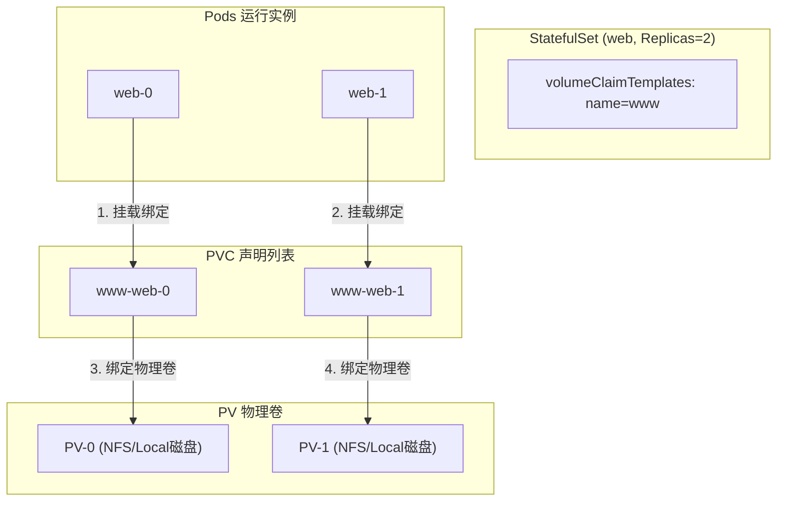
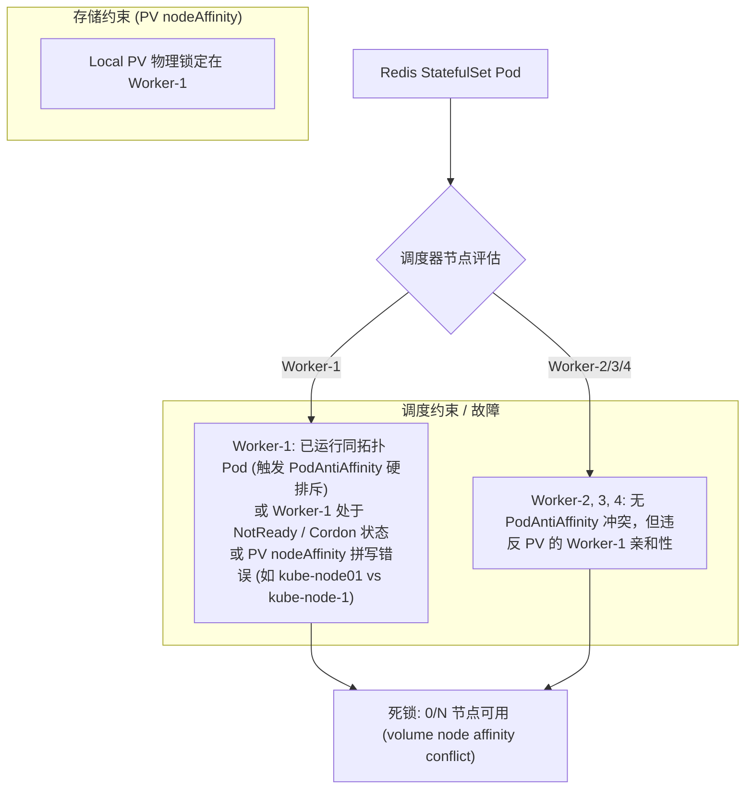
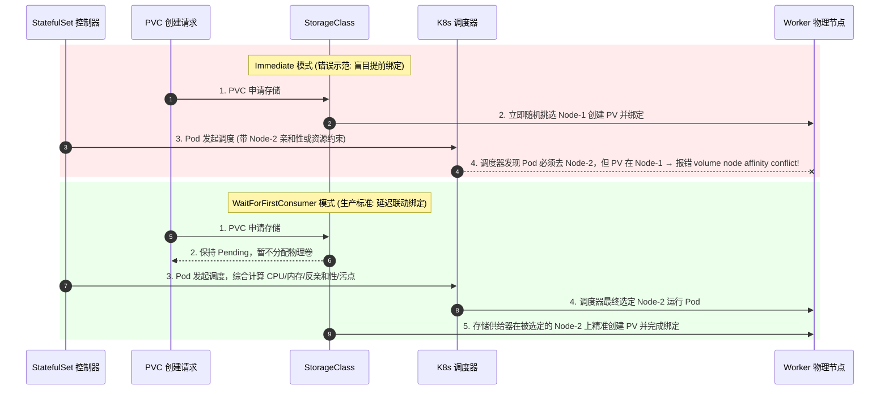

# 🧱 StatefulSet 拓扑状态与存储状态维护

在分布式系统中，有状态应用（如 Redis 主从、MySQL 集群、ZooKeeper 等）的编排难点主要在于两点：**稳定的网络拓扑（Topology State）**与**稳定的存储挂载（Storage State）**。本章将详细剖析 StatefulSet 如何完美保障这两个关键维度。

---

## 一、 稳定的拓扑状态：Headless Service 与 DNS 域名映射

对于有状态的实例，实例之间的访问不能通过随机的 Pod IP，也不能通过普通的 Service（因为普通 Service 会将请求随机分发给后端的任意实例，无法区分 Master 和 Slave）。

### 1. 什么是 Headless Service (无头服务)？
Headless Service 没有分配虚拟 IP（`clusterIP: None`）。当客户端向 DNS 服务器查询该 Service 的域名时，DNS 服务器不会返回 ClusterIP，而是**直接返回该 Service 关联的每一个 Pod 的真实 IP 列表**。

### 2. 稳定的域名解析规范
在 StatefulSet 配置中指定 `serviceName: "nginx"` 关联 Headless Service 后，DNS 会为每个 Pod 自动建立唯一的 A 记录：

$$\text{DNS 格式}: \quad \langle\text{PodName}\rangle . \langle\text{ServiceName}\rangle . \langle\text{Namespace}\rangle . \text{svc.cluster.local}$$

```text
    web-0.nginx.default.svc.cluster.local  ──▶ 解析为 10.244.1.10 (web-0 真实 IP)
    web-1.nginx.default.svc.cluster.local  ──▶ 解析为 10.244.2.11 (web-1 真实 IP)
```
*   **网络稳定性**：当 `web-0` 崩溃漂移到别的节点重建后，它的 IP 可能会变为 `10.244.1.88`。但由于 Pod 名字依然叫 `web-0`，DNS 记录中的 `web-0.nginx...` 会自动更新映射到新 IP 上。对于其他节点，访问 `web-0.nginx...` 的域名绝不中断。

---

## 二、 稳定的存储状态：`volumeClaimTemplates` 与独立卷绑定

在 Deployment 中如果配置了 PVC 卷挂载，拉起的所有 Pod 副本都会共享挂载**同一个** PVC。对于分布式数据库，如果所有实例读写同一个数据目录，会导致严重的数据错乱。

### 1. 独立的 PVC 自动创建机制
StatefulSet 引入了 `volumeClaimTemplates` 字段，控制器会为每个创建出的 Pod 副本自动生成一个专属的 PVC，命名规范为：

$$\text{PVC 命名格式}: \quad \langle\text{Volume名称}\rangle - \langle\text{StatefulSet名称}\rangle - \langle\text{序号}\rangle$$



### 2. 关键自愈行为：存储卷保留策略
> [!WARNING]
> 为了防止数据意外丢失，**当 StatefulSet 被缩容（Scale Down）或者删除时，自动生成的 PVC 和 PV 绝对不会被自动删除！**
*   **保留设计**：当缩容从 2 降为 1 时，`web-1` 容器被杀掉，但 `www-web-1` 依然保留在 etcd 和集群中。
*   **自愈绑定**：一旦再次扩容，新建的 `web-1` Pod 会自动寻找并重新绑定同名同序号的 `www-web-1` PVC，无缝继承原先磁盘上的历史数据。

---

## 三、 有序启动与终止流程 (Ordering)

在默认情况下（`podManagementPolicy: OrderedReady`），StatefulSet 的调谐完全是有序的：

1.  **有序启动**：
    *   依次创建 Pod（先 `web-0`，再 `web-1`，最后 `web-2`）。
    *   **强约束**：只有前一个序号的 Pod 进入 `Running` 且 `Ready` 状态后，控制器才会开始创建下一个序号的 Pod。
2.  **有序下线**：
    *   依次删除 Pod（先 `web-2`，再 `web-1`，最后 `web-0`）。
    *   **强约束**：只有高序号的 Pod 被完全清除（Terminated）后，控制器才会开始删除前一个。

### 并行调度配置：`Parallel`
如果不关心启动顺序（例如分布式系统的节点自注册发现，可以并行跑起来再集群组建），可以将管理策略改为并行：
```yaml
spec:
  podManagementPolicy: Parallel # 并行拉起与删除所有 Pod，类似于 Deployment
```

---

## 四、 完整的 Headless Service 与 StatefulSet 生产 YAML 模板

以下是一个完整的生产级 MySQL 主从配置雏形所需的 YAML 清单：

```yaml
# 1. 声明 Headless Service 保证稳定的域名标识
apiVersion: v1
kind: Service
metadata:
  name: mysql-service
  namespace: default
  labels:
    app: mysql
spec:
  ports:
  - port: 3306
    name: mysql-port
  clusterIP: None                            # 核心：无头服务，必须设为 None
  selector:
    app: mysql
---
# 2. 声明 StatefulSet 有状态集群
apiVersion: apps/v1
kind: StatefulSet
metadata:
  name: mysql
  namespace: default
spec:
  serviceName: "mysql-service"               # 必须指定关联的 Headless Service 名称
  replicas: 2
  podManagementPolicy: OrderedReady          # 默认有序启动策略
  selector:
    matchLabels:
      app: mysql
  template:
    metadata:
      labels:
        app: mysql
    spec:
      containers:
      - name: mysql-node
        image: mysql:5.7
        ports:
        - containerPort: 3306
          name: mysql-port
        volumeMounts:
        - name: mysql-data-volume
          mountPath: /var/lib/mysql          # 挂载到容器内的数据库目录
  # 3. 声明存储模板，动态为 mysql-0, mysql-1 创建 www-mysql-data-0, www-mysql-data-1 的 PVC
  volumeClaimTemplates:
  - metadata:
      name: mysql-data-volume
    spec:
      accessModes: [ "ReadWriteOnce" ]       # 仅单节点读写
      resources:
        requests:
          storage: 10Gi                      # 申请 10Gi 磁盘空间
```

---

## 五、 生产级双 Service 架构设计：Headless 专线 vs ClusterIP 业务总机

在实际企业级生产环境中（如部署 Redis、MySQL、ZooKeeper、Kafka 等有状态负载），**仅仅配置 Headless Service 是不够的，必须同时搭配常规 Service（ClusterIP / NodePort）形成“双 Service 架构”**。

```text
┌─────────────────────────────────────────────────────────────────────────────┐
│                            Kubernetes 业务集群                               │
│                                                                             │
│  ┌────────────────────────┐                   ┌──────────────────────────┐  │
│  │ 业务微服务 (如 pf-pms)  │                   │ 运维/外部开发客户端 (本地) │  │
│  └───────────┬────────────┘                   └────────────┬─────────────┘  │
│              │ 访问: redis-master:6379                     │ 访问: NodeIP:30379
│              ▼                                             ▼                │
│  ┌────────────────────────┐                   ┌──────────────────────────┐  │
│  │ ClusterIP Service      │                   │ NodePort Service         │  │
│  │ (name: redis-master)   │                   │ (name: redis-nodeport)   │  │
│  │ 提供统一 VIP 负载均衡   │                   │ 暴露外部主机端口 30379   │  │
│  └───────────┬────────────┘                   └────────────┬─────────────┘  │
│              └──────────────────────┬──────────────────────┘                │
│                                     │ 转发业务读写请求 (VIP)                 │
│                                     ▼                                       │
│                         ┌───────────────────────┐                           │
│                         │  Redis 主库 Pod       │                           │
│                         │  (redis-master-0)     │                           │
│                         └───────────▲───────────┘                           │
│                                     │                                       │
│               ┌─────────────────────┴─────────────────────┐                 │
│               │ 专线直连: redis-master-0.redis-headless   │ (主从同步/心跳)  │
│               │                                           │                 │
│   ┌───────────┴───────────┐                   ┌───────────┴───────────┐     │
│   │ Redis 从库 Pod 1      │                   │ Redis 从库 Pod 2      │     │
│   │ (redis-slave-0)       │                   │ (redis-slave-1)       │     │
│   └───────────────────────┘                   └───────────────────────┘     │
│                               ▲                           ▲                 │
│                               └─────────────┬─────────────┘                 │
│                                             │ 专属 Pod 域名解析             │
│                               ┌─────────────┴─────────────┐                 │
│                               │ Headless Service          │                 │
│                               │ (name: redis-headless)    │                 │
│                               │ clusterIP: None (直出 IP) │                 │
│                               └───────────────────────────┘                 │
└─────────────────────────────────────────────────────────────────────────────┘
```

### 1. 为什么必须同时需要两种 Service？

| Service 类型 | 核心作用 | 适用对象 | 缺少时的故障表现 |
| :--- | :--- | :--- | :--- |
| **Headless Service**<br/>(`clusterIP: None`) | **节点专属专线**：赋予每个 Pod 永久不变的 FQDN 域名（如 `redis-master-0.redis-headless`）。 | **集群内部节点**（主从复制、数据分片寻址、Raft/Paxos 选举等）。 | StatefulSet 启动报错或 Pod 无法建立稳定的拓扑识别；Pod 漂移后其他副本无法通过旧 IP 重新连上。 |
| **ClusterIP Service**<br/>(分配 VIP) | **业务统一总机**：提供一个稳定的虚拟 IP 和短域名（如 `redis-master:6379`），对就绪 Pod 做负载均衡/单一路由。 | **上游业务微服务**（如 Java Spring Boot、Go Web 等）。 | 业务 Pod 启动时报 `UnknownHostException: failed to resolve 'redis-master'` 无法解析服务名而崩溃（CrashLoopBackOff）。 |
| **NodePort Service**<br/>(暴露物理端口) | **集群外通道**：在所有物理节点上开辟端口（如 `30379`），允许外部直接访问。 | **本地 IDE 调试 / 运维管理工具**。 | 集群外的开发人员无法直连 Redis 进行排障或查看数据。 |

---

## 六、 StatefulSet 存储调度与死锁避坑深度实战

在使用 StatefulSet 配合本地存储（Local PV / HostPath）或存储类（StorageClass）时，极易踩入以下生产级“暗坑”。

### 1. `volume node affinity conflict` 调度死锁原理

#### 现象
StatefulSet Pod 处于 `Pending` 状态，执行 `kubectl describe pod` 显示：
```text
0/7 nodes are available: 
  - 3 node(s) had untolerated taint {node-role.kubernetes.io/master: }, 
  - 4 node(s) had volume node affinity conflict.
```

#### 根因剖析
该冲突表示：**Pod 绑定的 PV 锁定了特定的物理节点（通过 `spec.nodeAffinity` 限制），但调度器无法把 Pod 调度到该 PV 所在的节点上**。



#### 常见触发根因矩阵
1. **主机名拼写差异（命名不一致）**：PV 的 `nodeAffinity` 填写的节点名与 K8s 实际节点名存在连字符或前缀差异（如 `kube-node01` vs `kube-node-1`），导致 0 台节点匹配。
2. **硬反亲和性（Hard Anti-Affinity）与 Local PV 冲突**：StatefulSet 配置了 `requiredDuringSchedulingIgnoredDuringExecution`，而 Local PV 所在的节点已被同类 Pod 占用。
3. **StorageClass 绑定模式为 `Immediate`**：在 Pod 调度前就随意给 PVC 绑定了 PV，导致 PV 所在节点与后续 Pod 调度规则冲突。

---

### 2. StorageClass 绑定模式：`Immediate` vs `WaitForFirstConsumer`

在本地存储与有状态服务中，StorageClass 的 `volumeBindingMode` 必须配置为 **`WaitForFirstConsumer`（延迟绑定）**！



---

### 3. Local PV `nodeAffinity` 不可变（Immutable）设计与强制重建 SOP

在 Kubernetes 中，出于数据安全性与底层文件系统保护考虑，**PV 创建后其 `spec.nodeAffinity` 属于不可变字段（Immutable Field）**。如果通过 `kubectl edit pv` 修改，会直接拦截报错：
```text
persistentvolumes "xxx" was not valid:
* nodeAffinity: Invalid value: ... field is immutable
```

#### 生产无损强制替换 SOP
由于 PV 的默认回收策略为 `persistentVolumeReclaimPolicy: Retain`，底层物理数据不会丢失，可以通过 `--force` 实现无损重构：

```bash
# 1. 导出当前 PV 的完整定义
kubectl get pv <pv-name> -o yaml > fix-pv.yaml

# 2. 修正其中的节点名称 (例如将 kube-node01 替换为 kube-node-1)
sed -i 's/kube-node01/kube-node-1/g' fix-pv.yaml

# 3. 强制替换重建 (K8s 会自动安全删除旧 PV 逻辑对象并立即以新配置重建，保留 claimRef 绑定)
kubectl replace --force -f fix-pv.yaml
```

---

### 4. PVC 丢失与 StatefulSet 控制器调谐行为

当手动误删了 StatefulSet 的 PVC 时，Pod 重建会报错：
```text
0/7 nodes are available: 7 persistentvolumeclaim "redis-data-redis-master-0" not found.
```

#### 为什么 StatefulSet 不会自动重新生成 PVC？
* **保护机制**：StatefulSet 的设计哲学是“**存储生命周期独立于 Pod 生命周期**”。为了防止 Pod 重启或漂移时由于网络抖动引发 PVC 被重复申请覆盖，StatefulSet 控制器只会在**首次创建 Pod 或扩容副本时**触发 `volumeClaimTemplates` 创建 PVC。
* **快速恢复方法**：
  * **方法 A（手动补建）**：直接编写与模板同名的 PVC YAML 并 `kubectl apply`，Pod 会立刻识别并自动绑定。
  * **方法 B（副本数震荡触发）**：通过 `kubectl scale sts <name> --replicas=0` 缩容到 0，再扩容为目标副本数，强制触发 StatefulSet 的全量初始化创建流程。
