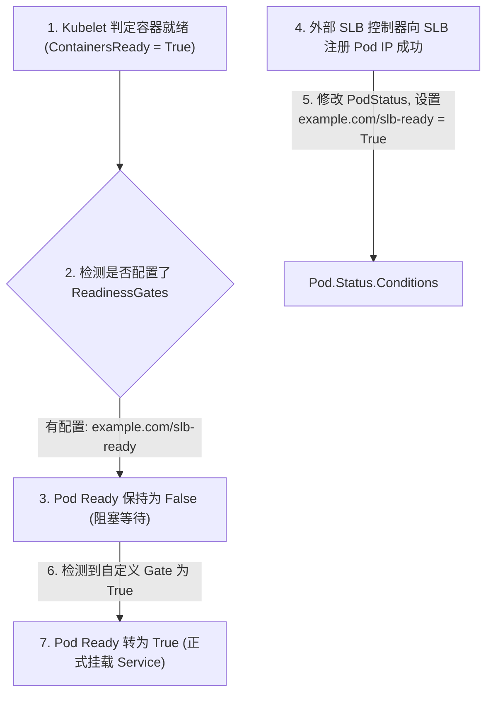

# 🏷️ Kubernetes 资源 Conditions 状态与就绪控制门 (ReadinessGates)

在 Kubernetes 中，了解一个 API 资源对象（如 Pod, Deployment, Node）当前所处的状态，不能仅通过一个简单的单值状态字段（如 Status: Running）。为此，Kubernetes 设计了通用的 `status.conditions` 数据结构，用来表示资源对象各维度的健康状况和转换历史。

---

## 一、 status.conditions 设计初衷与规范

### 1. status 字段 vs status.conditions
*   **`status` (状态值)**：包含针对特定资源类型的定制化字段。例如：Deployment 的 `status.replicas`（当前副本数）或 Pod 的 `status.podIP`。
*   **`status.conditions` (状况列表)**：是一个标准的结构体数组。**它代表了对该资源的一系列“布尔值断言”**（如：已调度？容器就绪？）。它提供了一种标准化的方式，允许外部监控程序或控制器无需理解该资源的内部结构，就能读取和判定其健康状况。

### 2. 标准的 Condition 结构体定义 (v1.19+)
从 Kubernetes v1.19 开始，社区规范化了标准的 `Condition` 结构：

```go
type Condition struct {
    // 状况类别名称 (使用 UpperCamelCase)，如 "Ready", "Available"
    Type string `json:"type"`
    
    // 状况的值，只能是以下三个枚举值之一:
    // "True" (符合预期), "False" (不符合预期), "Unknown" (状态无法确定)
    Status ConditionStatus `json:"status"`
    
    // 该状况最后一次发生状态转换的时间戳
    LastTransitionTime metav1.Time `json:"lastTransitionTime"`
    
    // 机器可读的、UpperCamelCase 风格的简短原因描述，如 "NewReplicaSetAvailable"
    Reason string `json:"reason"`
    
    // 人类可读的详细日志/错误描述信息
    Message string `json:"message"`
    
    // 观察到的 Generation。若它小于 metadata.generation，说明当前状况不是基于最新配置计算的
    ObservedGeneration int64 `json:"observedGeneration,omitempty"`
}
```

### 3. Conditions 的设计约定
*   **不要定义成状态机**：`type` 应使用形容词（如 `Ready`）或过去动词（如 `Succeeded`），代表某个维度的断言，而不要使用进行时动词（如 `Deploying`）。
*   **避免双重否定**：状况的名称应代表正常状态。例如：用 `Ready: False` 表示未就绪，而不是用 `Failed: True`，以提高可读性。

---

## 二、 Pod 四大内置 Conditions 状况

对于 Pod 而言，只有其 `status.conditions` 中以下四个核心状况的状态全部达到预期，Pod 才能正常对外服务：

| 状况类型 (Type) | 成功标志 (Status = True) | 详细技术含义 |
| :--- | :--- | :--- |
| **PodScheduled** | 已成功调度 | 表示 `kube-scheduler` 已经为该 Pod 选定了目标工作节点（Node）并写入 etcd。 |
| **Initialized** | 初始化完成 | 表示 Pod 中所有的 `initContainers`（初始化容器）都已经成功启动并正常退出完毕。 |
| **ContainersReady** | 容器全部就绪 | 表示 Pod 内所有的业务容器都已经通过了自身的启动和就绪探针检查。 |
| **Ready** | Pod 整体就绪 | 表示 Pod 已经完全具备接收网络流量的资格，Endpoint 控制器会将其 IP 加入 Service 负载均衡池中。 |

---

## 三、 自定义就绪态门控 (Readiness Gates)

### 1. 为什么需要 Readiness Gates？
在某些复杂的云原生场景中，仅仅容器内的应用程序就绪是不够的。
*   *场景*：Pod 重建后需要将 IP 注册到云厂商的外部负载均衡器（SLB）。如果 Kubelet 把容器标记为 Ready，流量立刻开始下发，但此时外部 SLB 的同步还没完成，就会导致网络闪断。
*   *解决办法*：引入 **Readiness Gates（就绪门控）**。它允许外部第三方控制器（如云厂商的 SLB Controller）向 Pod 注入一个自定义的 Condition，**只有当这个自定义的 Condition 被第三方控制器更新为 "True" 时，Pod 才能被判定为整体就绪（Ready = True）**。

### 2. Readiness Gates 工作流示意图



### 3. Readiness Gates YAML 配置示例

要启用就绪门控，需要在 Pod 的 `spec` 中配置 `readinessGates` 列表，指定自定义状况的名称：

```yaml
apiVersion: v1
kind: Pod
metadata:
  name: cloud-service-pod
  namespace: production
  labels:
    app: business
spec:
  # 声明自定义就绪门控，Kubelet 会等待这个状态也为 True 后才将 Pod 设为 Ready
  readinessGates:
    - conditionType: "cloudprovider.com/slb-registered"
    
  containers:
  - name: app
    image: my-company/app:v1
    ports:
    - containerPort: 8080
    readinessProbe:
      httpGet:
        path: /ready
        port: 8080
```

一旦部署，你可以通过 `kubectl get pod cloud-service-pod -o yaml` 观察到，尽管容器已经 `Ready`，但由于 `"cloudprovider.com/slb-registered"` 状况未就绪，Pod 的整体就绪依然被锁在 `False`。第三方云网关注册程序会在绑定成功后，通过 API 修改此字段将其置为 `True`，完美规避了网络波动。
