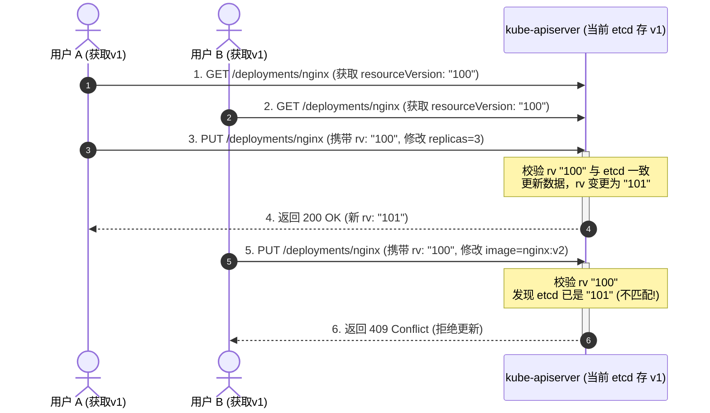

# 🔄 Kubernetes API 资源更新机制 (Update vs Patch)

在 Kubernetes 中，对集群资源（如 Deployment, Service）的修改实质上是通过 HTTP 接口请求 `kube-apiserver` 进行对象状态的变更。为了确保多客户端并发修改时的数据一致性，Kubernetes 实现了精细的版本控制与多种更新机制。

---

## 一、 Update 机制与乐观锁版本控制

`Update` 请求属于**全量覆盖更新**。它依赖于**乐观并发控制 (OCC / Optimistic Concurrency Control)** 机制：



### 乐观锁核心特性：
*   **`resourceVersion` 字段**：存在于所有 K8S 对象的 `metadata.resourceVersion` 中。这是一个递增的值，每次对象被修改时，其值都会变更。
*   **冲突处理 (409 Conflict)**：如上图所示，用户 B 发起更新时携带的历史版本号 `"100"` 已落后于最新的 `"101"`，API Server 予以拒绝并返回 409 错误。
*   **客户端处理**：客户端收到 409 冲突后，必须重新获取（Get）最新对象，将本地修改合并到最新对象上，再次发起 Update 请求（重试机制）。

---

## 二、 Patch 机制：四种 Patch 策略对比

与全量覆盖的 Update 不同，`Patch` 请求只提交需要修改的**增量字段**。API Server 接收到 Patch 请求后在服务端进行合并。目前 Kubernetes 支持以下四种 Patch 策略：

### 1. JSON Patch (RFC 6902)
*   **语法形式**：明确的操作指令数组（`add`、`remove`、`replace`）和对应的 JSON 路径。
*   **缺点**：**极为脆弱**。如果修改数组（如 `containers` 列表），必须指定索引位置（如 `/spec/template/spec/containers/0/image`）。如果在并发期间有其他客户端插入了新容器，序号发生偏移，本请求就会改错容器，产生严重安全后果。
*   **示例**：
    ```bash
    kubectl patch deployment/foo --type='json' -p \
      '[{"op":"replace","path":"/spec/template/spec/containers/0/image","value":"nginx:alpine"}]'
    ```

### 2. Merge Patch (RFC 7386)
*   **语法形式**：直接提供一个增量的 JSON 结构，与原对象进行合并。
*   **缺点**：对于 Map（如 labels）可以实现局部 key 的修改。但对于数组（如 `containers` 列表），Merge Patch 无法对列表中的单个元素进行修改，**只能提供整个新列表进行全量覆盖**。
*   **示例**：
    ```bash
    # 必须提交完整的 containers 列表，否则会导致其他容器被全部清除
    kubectl patch deployment/foo --type='merge' -p \
      '{"spec":{"template":{"spec":{"containers":[{"name":"app","image":"app:v2"},{"name":"nginx","image":"nginx:alpine"}]}}}}'
    ```

### 3. Strategic Merge Patch (K8S 独有 - 默认)
*   **工作机制**：结合了 K8S 数据结构定义中内置的**策略注解**（如 `patchMergeKey`）。
*   **优势**：在合并数组时，它知道利用特定的键（通常是 `name` 字段）作为唯一主键进行合并。
    *   例如：在修改 `containers` 时，只需要指定 `name: nginx` 和要修改的 `image`，K8S 会自动匹配列表中名字叫 nginx 的容器进行局部修改，如果不存在则自动追加。
*   **注意**：此策略**仅适用于 K8S 原生内置资源**，自定义 CRD 资源无法使用（CRD 默认降级为 Merge Patch 策略）。
*   **示例**：
    ```bash
    kubectl patch deployment/foo --type='strategic' -p \
      '{"spec":{"template":{"spec":{"containers":[{"name":"nginx","image":"nginx:alpine"}]}}}}'
    ```

### 4. Server-Side Apply (服务端应用 - SSA)
*   **FEATURE STATE**：`K8S 1.22 [Stable]`
*   **工作机制**：将 Diff 计算和冲突检测全部上移到 API Server 服务端。引入**“字段所有权 (Field Ownership)”**概念。
*   **价值**：如果 HPA 控制器修改了 `replicas` 字段，而管理员通过 YAML 修改了 `image` 字段，SSA 能够记录谁拥有哪个字段的所有权。当两者发生冲突时，API Server 能在服务端精确判定并返回冲突，支持声明式强制覆盖（Force-Apply）。

---

## 三、 Kubectl 客户端封装逻辑

我们在命令行常用的 `kubectl apply` 与 `kubectl edit` 并不是对应简单的 API 接口：

### 1. `kubectl apply` (Client-Side Apply)
1.  解析本地 YAML，向 API Server 发起 GET 获取集群中当前对象。
2.  若不存在，在对象 Annotation 中注入上一次的配置（`kubectl.kubernetes.io/last-applied-configuration`），发起 POST 创建。
3.  若存在，取出集群中旧对象的 `last-applied-configuration`。
4.  在本地计算 **三方 Diff**（上一次的配置、当前本地 YAML、集群中实时对象），计算出具体的 strategic patch 增量包，最后通过 PATCH 请求发送给 API Server。

### 2. `kubectl edit`
1.  从集群中拉取最新的对象，并在本地打开编辑器提供用户编辑。
2.  当用户保存退出时，kubectl **并不是执行 Update**（防止编辑期间他人修改导致 Conflict 失败），而是将修改后的对象与初始拉取到的对象计算出 Diff，以 **Patch 请求**发送给 API Server，从而避免乐观锁版本冲突。

---

> [!TIP] 💡 关联技术与延伸阅读
>
> * [优雅关闭服务实战方案](./06-资源更新/优雅关闭服务.md)
> * [云原生应用无损上下线实践](../08-应用与实战/02-云原生应用无损上下线实践.md)
