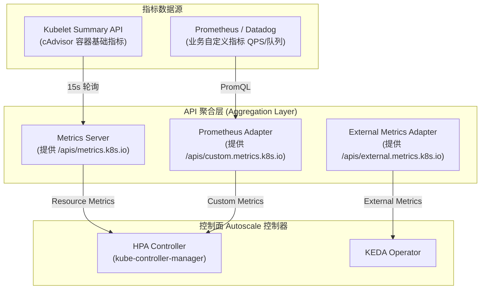
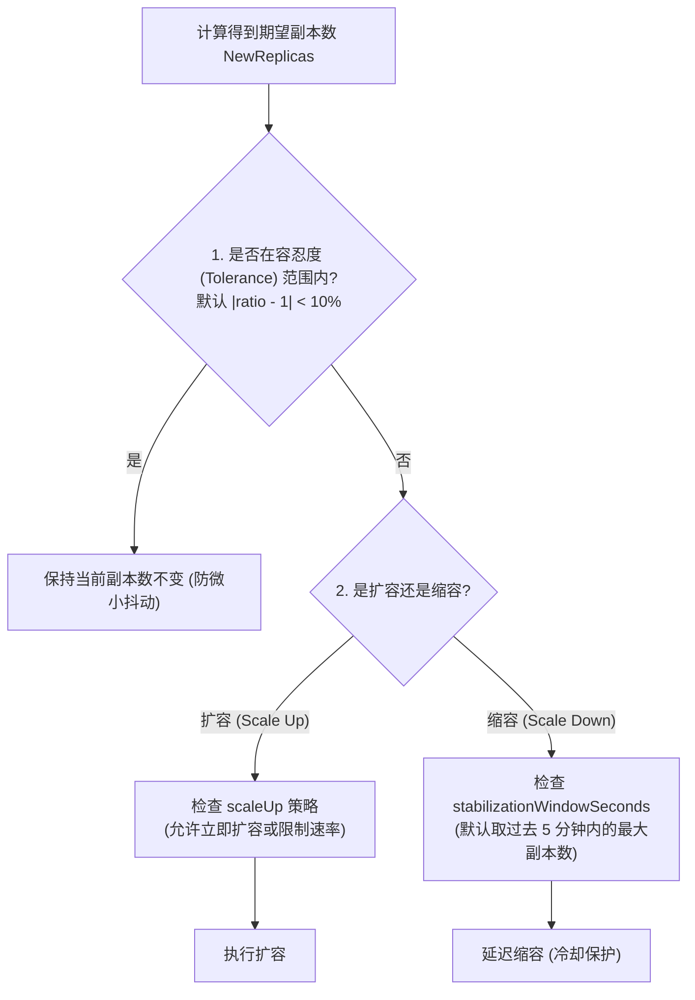
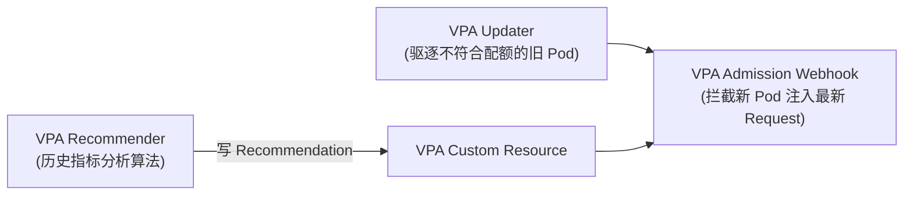
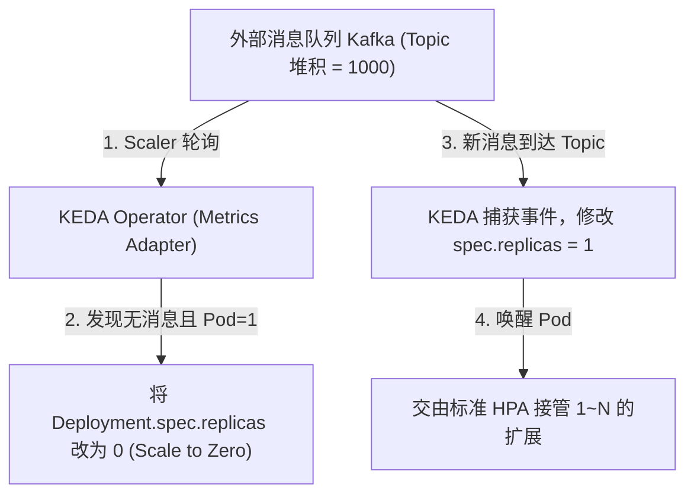

# 📈 HPA 与 VPA 弹性扩缩容底层算法与指标管道深度解析

> 本文档面向高级 Kubernetes 工程师与云原生架构师，深入剖析 Kubernetes 弹性扩缩容机制，包含 HPA (Horizontal Pod Autoscaler) 扩缩容算法、Metrics Server 与 Custom Metrics API 指标管道、VPA (Vertical Pod Autoscaler) 内存 CPU 推荐算法，以及基于 KEDA 的事件驱动弹性扩缩容。

---

## 目录
- [一、 弹性扩缩容整体架构与指标管道 (Metrics Pipeline)](#一-弹性扩缩容整体架构与指标管道-metrics-pipeline)
- [二、 HPA (水平扩缩容) 底层核心算法](#二-hpa-水平扩缩容-底层核心算法)
- [三、 HPA 防抖动、冷却时间与 Flapping 抑制](#三-hpa-防抖动冷却时间与-flapping-抑制)
- [四、 VPA (垂直扩缩容) 工作原理与 Recommendation 算法](#四-vpa-垂直扩缩容-工作原理与-recommendation-算法)
- [五、 基于 KEDA (Kubernetes Event-driven Autoscaling) 的高级弹性实战](#五-基于-keda-kubernetes-event-driven-autoscaling-的高级弹性实战)

---

## 一、 弹性扩缩容整体架构与指标管道 (Metrics Pipeline)

Kubernetes 中的 HPA/VPA 并不直接采集指标，而是依赖三层指标 API 架构：



---

## 二、 HPA (水平扩缩容) 底层核心算法

HPA 控制器默认每 **15 秒**（由 `--horizontal-pod-autoscaler-sync-period` 控制）进行一次调谐循环。

### 2.1 核心扩缩容计算公式

$$\text{DesiredReplicas} = \left\lceil \text{CurrentReplicas} \times \left( \frac{\text{CurrentMetricValue}}{\text{TargetMetricValue}} \right) \right\rceil$$

#### 示例演练：
- 当前副本数 $\text{CurrentReplicas} = 3$。
- 当前平均 CPU 利用率为 $80\%$（`CurrentMetricValue = 80`）。
- 期望目标 CPU 利用率为 $50\%$（`TargetMetricValue = 50`）。
- 计算结果：
  $$\text{DesiredReplicas} = \left\lceil 3 \times \frac{80}{50} \right\rceil = \lceil 4.8 \rceil = 5$$
- HPA 控制器将更新 Deployment 的 `spec.replicas = 5`。

---

## 三、 HPA 防抖动、冷却时间与 Flapping 抑制

在业务流量频繁波动时，频繁扩容和缩容会导致容器反复重启（Flapping 现象）。HPA 引入了多重防抖动算法：



### 生产级 HPA 行为 (Behavior) 细粒度控制：

```yaml
apiVersion: autoscaling/v2
kind: HorizontalPodAutoscaler
metadata:
  name: nginx-hpa
spec:
  scaleTargetRef:
    apiVersion: apps/v1
    kind: Deployment
    name: nginx-deployment
  minReplicas: 2
  maxReplicas: 50
  metrics:
  - type: Resource
    resource:
      name: cpu
      target:
        type: Utilization
        averageUtilization: 60
  behavior:
    scaleUp:
      stabilizationWindowSeconds: 0  # 扩容无需等待，瞬间冲顶
      policies:
      - type: Percent
        value: 100                   # 每次最多翻倍扩容
        periodSeconds: 15
    scaleDown:
      stabilizationWindowSeconds: 300 # 缩容需观察过去 5 分钟，确认无流量突发再缩容
      policies:
      - type: Percent
        value: 10                    # 每次最多缩容 10%，平滑退场
        periodSeconds: 60
```

---

## 四、 VPA (垂直扩缩容) 工作原理与 Recommendation 算法

HPA 改变的是 Pod 的**副本数量**，而 VPA (Vertical Pod Autoscaler) 改变的是单个 Pod 的 **CPU 和 Memory Request/Limit 资源配额**。



### VPA 推荐算法 (Percentile Estimator)：
- 分析 Pod 历史 8 天的 CPU/内存消耗曲线。
- **Memory 推荐**：基于历史内存使用峰值（Peak Memory）加上安全缓冲（Safety Margin），防止 OOM。
- **CPU 推荐**：取历史 CPU 利用率的第 **95 百分位数 (95th Percentile)**，避免为偶发的高 CPU 尖峰过量分配资源。

---

## 五、 基于 KEDA (Kubernetes Event-driven Autoscaling) 的高级弹性实战

原生 HPA 只能基于 CPU/内存等滞后指标。**KEDA** 允许根据 RabbitMQ 队列积压数、Kafka 延迟、Prometheus 实时 QPS 等**零延迟事件**进行弹性扩缩容，甚至支持**从 0 到 1 (Scale to Zero)**。

```yaml
# KEDA ScaledObject 示例: 根据 Kafka 消费延迟自动扩缩容
apiVersion: keda.sh/v1alpha1
kind: ScaledObject
metadata:
  name: kafka-consumer-scaler
spec:
  scaleTargetRef:
    name: kafka-consumer-deployment
  minReplicaCount: 0                  # 支持自动缩容到 0 节约成本!
  maxReplicaCount: 30
  cooldownPeriod: 300
  triggers:
  - type: kafka
    metadata:
      bootstrapServers: kafka:9092
      consumerGroup: my-group
      topic: order-events
      lagThreshold: "50"             # 当 Kafka 积压超过 50 条/Pod 时触发扩容
```

---

## 六、 深度扩展：HPA Behavior 精细化控制与 KEDA 零副本缩容 (参考源: K8s 官方 Docs & Datadog Engineering)

### 1. HPA Behavior `scaleUp` / `scaleDown` 算法防震荡
通过 `behavior` 声明式定义控制速率：
* `Percent` 策略：按当前 Pod 总数的百分比按比例扩缩容（如 `value: 100` 即翻倍）。
* `Pods` 策略：按绝对 Pod 个数限制（如 `value: 4` 即每次最多增减 4 个 Pod）。
* `selectPolicy: Max / Min`：当配置多个策略时，选择变更幅度最大或最小的计算结果。

---

### 2. KEDA (Kubernetes Event-driven Autoscaling) 缩容至 0 机制
传统 HPA `minReplicas` 最少只能设为 1（因为当 Pod 为 0 时，Metrics Server 无法采集到 CPU/Memory 数据，引发死锁）。



* **实现原理**：KEDA 作为一个 External Metrics Adapter，绕过了 cAdvisor 的依赖。当检测到外部 Kafka 队列消息为空时，直接绕过 HPA 修改 Deployment 的 `replicas: 0`；当新消息到来时，抢先唤醒 1 个 Pod，再将管理权无缝移交给标准 HPA，**实现极致的 Serverless 成本节约**！

---

> [!TIP] 💡 关联技术与延伸阅读
>
> * [Metrics Server 与 API 聚合层原理](../01-组件原理/09-Metrics_Server与API聚合层原理.md)
> * [Prometheus 自定义指标监控管道 (Custom Metrics)](../06-集群运维/08-云原生可观测性架构Prometheus_Thanos_Tempo与eBPF链路追踪.md)
